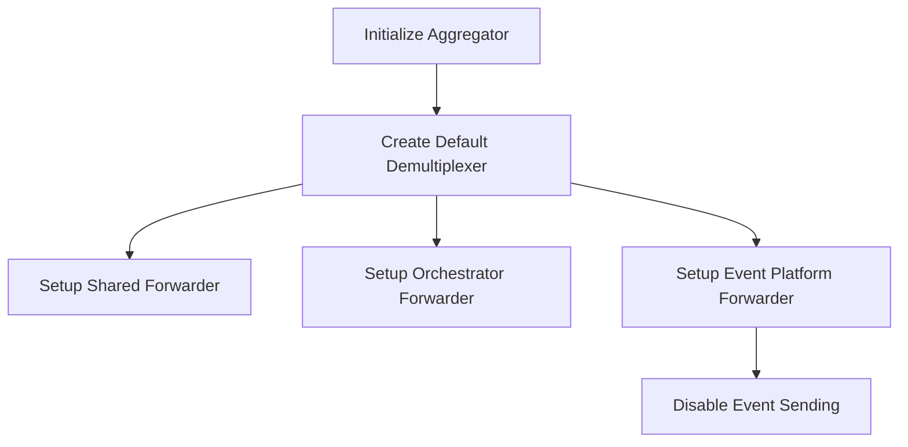

This document will cover the process of creating a Mock Sender, which includes:

1. Initializing the aggregator
2. Creating a default demultiplexer
3. Setting up various forwarders.

Technical document: <SwmLink doc-title="Creating a Mock Sender">[Creating a Mock Sender](/.swm/creating-a-mock-sender.kwu7ke83.sw.md)</SwmLink>

# [Initializing the Aggregator](https://app.swimm.io/repos/Z2l0aHViJTNBJTNBZGF0YWRvZy1hZ2VudCUzQSUzQVN3aW1tLURlbW8=/docs/kwu7ke83#newmocksender)

The process begins by initializing the aggregator. The aggregator is responsible for collecting and processing data. This step ensures that the Mock Sender has a functional aggregator to work with during testing. The aggregator collects data from various sources and processes it for further use.

# [Creating a Default Demultiplexer](https://app.swimm.io/repos/Z2l0aHViJTNBJTNBZGF0YWRvZy1hZ2VudCUzQSUzQVN3aW1tLURlbW8=/docs/kwu7ke83#createdefaultdemultiplexer)

Next, a default demultiplexer is created. The demultiplexer helps in managing different data streams by separating and organizing them. This step is crucial for ensuring that the data collected by the aggregator is properly managed and routed to the appropriate forwarders. The default demultiplexer is configured with specific options such as a flush interval and disabling the start of forwarders to suit the testing environment.

# [Setting Up Various Forwarders](https://app.swimm.io/repos/Z2l0aHViJTNBJTNBZGF0YWRvZy1hZ2VudCUzQSUzQVN3aW1tLURlbW8=/docs/kwu7ke83#createdefaultdemultiplexer)

In this step, various forwarders are set up to handle different types of data. These include:

1. **Shared Forwarder**: This forwarder is responsible for handling general data forwarding tasks.
2. **Orchestrator Forwarder**: This forwarder manages data related to orchestration tasks.
3. **Event Platform Forwarder**: This forwarder handles event data. For testing purposes, the event platform forwarder is created with sending disabled. This means that events will build up in each pipeline channel without being forwarded, ensuring that no actual data is sent out during testing.

# [Disabling Event Sending](https://app.swimm.io/repos/Z2l0aHViJTNBJTNBZGF0YWRvZy1hZ2VudCUzQSUzQVN3aW1tLURlbW8=/docs/kwu7ke83#newnoopeventplatformforwarder)

The event platform forwarder is created with sending disabled. This is done by removing the senders from its pipelines, effectively disabling event forwarding. This step ensures that during testing, events are not forwarded to the intake, preventing any unintended data transmission.

&nbsp;

*This is an auto-generated document by Swimm AI 🌊 and has not yet been verified by a human*

<SwmMeta version="3.0.0" repo-id="Z2l0aHViJTNBJTNBZGF0YWRvZy1hZ2VudCUzQSUzQVN3aW1tLURlbW8=" repo-name="datadog-agent">Powered by [Swimm](/)</SwmMeta>
