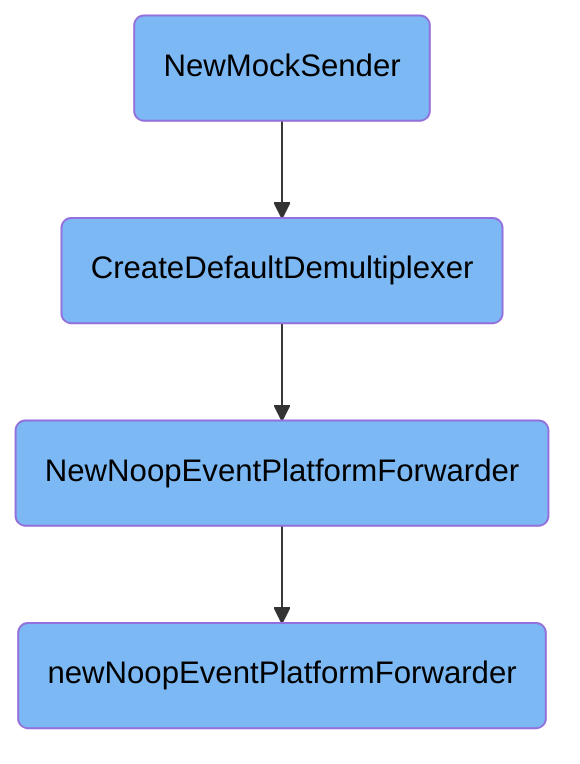

In this document, we will explain the process of creating a mock sender. The process involves initializing the aggregator, creating a default demultiplexer, and setting up various forwarders.

The flow starts by initializing the aggregator, which is responsible for collecting and processing data. Next, a default demultiplexer is created, which helps in managing different data streams. Various forwarders are then set up, including a shared forwarder, an orchestrator forwarder, and an event platform forwarder. The event platform forwarder is created with sending disabled to ensure that events are not forwarded during testing.

# Flow drill down



<SwmSnippet path="/pkg/aggregator/mocksender/mocksender.go" line="31">

---

## <SwmToken path="pkg/aggregator/mocksender/mocksender.go" pos="31:2:2" line-data="// NewMockSender initiates the aggregator and returns a">`NewMockSender`</SwmToken>

The function <SwmToken path="pkg/aggregator/mocksender/mocksender.go" pos="31:2:2" line-data="// NewMockSender initiates the aggregator and returns a">`NewMockSender`</SwmToken> initiates the aggregator and returns a functional mocked Sender for testing. It calls <SwmToken path="pkg/aggregator/mocksender/mocksender.go" pos="34:3:3" line-data="	return NewMockSenderWithSenderManager(id, CreateDefaultDemultiplexer())">`NewMockSenderWithSenderManager`</SwmToken> with an ID and a default demultiplexer created by <SwmToken path="pkg/aggregator/mocksender/mocksender.go" pos="34:8:8" line-data="	return NewMockSenderWithSenderManager(id, CreateDefaultDemultiplexer())">`CreateDefaultDemultiplexer`</SwmToken>.

```go
// NewMockSender initiates the aggregator and returns a
// functional mocked Sender for testing
func NewMockSender(id checkid.ID) *MockSender {
	return NewMockSenderWithSenderManager(id, CreateDefaultDemultiplexer())
}
```

---

</SwmSnippet>

<SwmSnippet path="/pkg/aggregator/mocksender/mocksender.go" line="37">

---

## <SwmToken path="pkg/aggregator/mocksender/mocksender.go" pos="37:2:2" line-data="// CreateDefaultDemultiplexer creates a default demultiplexer for testing">`CreateDefaultDemultiplexer`</SwmToken>

The function <SwmToken path="pkg/aggregator/mocksender/mocksender.go" pos="37:2:2" line-data="// CreateDefaultDemultiplexer creates a default demultiplexer for testing">`CreateDefaultDemultiplexer`</SwmToken> creates a default demultiplexer for testing. It sets up various forwarders, including a shared forwarder, an orchestrator forwarder, and an event platform forwarder. The event platform forwarder is created using <SwmToken path="pkg/aggregator/mocksender/mocksender.go" pos="45:16:16" line-data="	eventPlatformForwarder := optional.NewOptionPtr[eventplatform.Forwarder](eventplatformimpl.NewNoopEventPlatformForwarder(hostnameimpl.NewHostnameService()))">`NewNoopEventPlatformForwarder`</SwmToken>.

```go
// CreateDefaultDemultiplexer creates a default demultiplexer for testing
func CreateDefaultDemultiplexer() *aggregator.AgentDemultiplexer {
	opts := aggregator.DefaultAgentDemultiplexerOptions()
	opts.FlushInterval = 1 * time.Hour
	opts.DontStartForwarders = true
	log := logimpl.NewTemporaryLoggerWithoutInit()
	sharedForwarder := forwarder.NewDefaultForwarder(config.Datadog(), log, forwarder.NewOptions(config.Datadog(), log, nil))
	orchestratorForwarder := optional.NewOption[defaultforwarder.Forwarder](defaultforwarder.NoopForwarder{})
	eventPlatformForwarder := optional.NewOptionPtr[eventplatform.Forwarder](eventplatformimpl.NewNoopEventPlatformForwarder(hostnameimpl.NewHostnameService()))
	return aggregator.InitAndStartAgentDemultiplexer(log, sharedForwarder, &orchestratorForwarder, opts, eventPlatformForwarder, compressionimpl.NewMockCompressor(), "")
```

---

</SwmSnippet>

<SwmSnippet path="/comp/forwarder/eventplatform/eventplatformimpl/epforwarder.go" line="519">

---

## <SwmToken path="comp/forwarder/eventplatform/eventplatformimpl/epforwarder.go" pos="519:2:2" line-data="// NewNoopEventPlatformForwarder returns the standard event platform forwarder with sending disabled, meaning events">`NewNoopEventPlatformForwarder`</SwmToken>

The function <SwmToken path="comp/forwarder/eventplatform/eventplatformimpl/epforwarder.go" pos="519:2:2" line-data="// NewNoopEventPlatformForwarder returns the standard event platform forwarder with sending disabled, meaning events">`NewNoopEventPlatformForwarder`</SwmToken> returns an event platform forwarder with sending disabled. It calls <SwmToken path="comp/forwarder/eventplatform/eventplatformimpl/epforwarder.go" pos="519:2:2" line-data="// NewNoopEventPlatformForwarder returns the standard event platform forwarder with sending disabled, meaning events">`NewNoopEventPlatformForwarder`</SwmToken> to create the forwarder.

```go
// NewNoopEventPlatformForwarder returns the standard event platform forwarder with sending disabled, meaning events
// will build up in each pipeline channel without being forwarded to the intake
func NewNoopEventPlatformForwarder(hostname hostnameinterface.Component) eventplatform.Forwarder {
	return newNoopEventPlatformForwarder(hostname)
}
```

---

</SwmSnippet>

<SwmSnippet path="/comp/forwarder/eventplatform/eventplatformimpl/epforwarder.go" line="525">

---

## <SwmToken path="comp/forwarder/eventplatform/eventplatformimpl/epforwarder.go" pos="525:2:2" line-data="func newNoopEventPlatformForwarder(hostname hostnameinterface.Component) *defaultEventPlatformForwarder {">`newNoopEventPlatformForwarder`</SwmToken>

The function <SwmToken path="comp/forwarder/eventplatform/eventplatformimpl/epforwarder.go" pos="525:2:2" line-data="func newNoopEventPlatformForwarder(hostname hostnameinterface.Component) *defaultEventPlatformForwarder {">`newNoopEventPlatformForwarder`</SwmToken> creates a default event platform forwarder and removes the senders from its pipelines, effectively disabling event forwarding.

```go
func newNoopEventPlatformForwarder(hostname hostnameinterface.Component) *defaultEventPlatformForwarder {
	f := newDefaultEventPlatformForwarder(pkgconfig.Datadog(), eventplatformreceiverimpl.NewReceiver(hostname).Comp)
	// remove the senders
	for _, p := range f.pipelines {
		p.strategy = nil
	}
	return f
```

---

</SwmSnippet>

&nbsp;

*This is an auto-generated document by Swimm AI 🌊 and has not yet been verified by a human*

<SwmMeta version="3.0.0" repo-id="Z2l0aHViJTNBJTNBZGF0YWRvZy1hZ2VudCUzQSUzQVN3aW1tLURlbW8=" repo-name="datadog-agent"><sup>Powered by [Swimm](/)</sup></SwmMeta>
