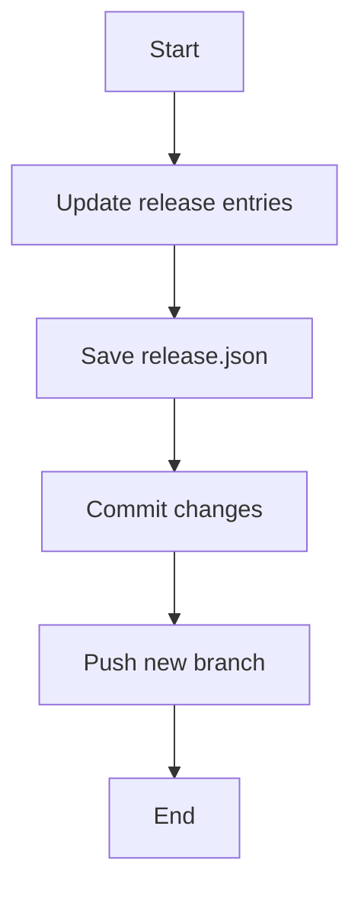

This document will cover the process of creating a Release Candidate (RC) for the Datadog Agent. We'll cover:

1. Updating release entries
2. Saving the updated <SwmPath>[release.json](release.json)</SwmPath>
3. Committing changes
4. Pushing the new branch to the upstream repository.

Technical document: <SwmLink doc-title="Creating a Release Candidate">[Creating a Release Candidate](/.swm/creating-a-release-candidate.ugwxf0hx.sw.md)</SwmLink>

# [Updating release entries](https://app.swimm.io/repos/Z2l0aHViJTNBJTNBZGF0YWRvZy1hZ2VudCUzQSUzQVN3aW1tLURlbW8=/docs/ugwxf0hx#updating-release-entries)

The first step in creating a Release Candidate is updating the release entries. This involves preparing the <SwmPath>[release.json](release.json)</SwmPath> file for the new RC build. The <SwmPath>[release.json](release.json)</SwmPath> file contains information about the versions of the software. By updating this file, we ensure that the new RC build is properly documented and versioned. This step is crucial for maintaining accurate version history and ensuring that all changes are tracked.

# [Saving release.json](https://app.swimm.io/repos/Z2l0aHViJTNBJTNBZGF0YWRvZy1hZ2VudCUzQSUzQVN3aW1tLURlbW8=/docs/ugwxf0hx#saving-releasejson)

After updating the release entries, the next step is to save the updated <SwmPath>[release.json](release.json)</SwmPath> file to disk. This ensures that the changes made to the release entries are preserved and can be accessed later. Saving the file is a straightforward process but is essential for maintaining the integrity of the release information.

# [Committing changes](https://app.swimm.io/repos/Z2l0aHViJTNBJTNBZGF0YWRvZy1hZ2VudCUzQSUzQVN3aW1tLURlbW8=/docs/ugwxf0hx#committing-changes)

Once the <SwmPath>[release.json](release.json)</SwmPath> file is updated and saved, the next step is to commit these changes. Committing changes involves creating a new branch, adding the updated files to this branch, and then creating a commit. This step is important because it ensures that the changes are properly versioned and can be reviewed. It also allows for tracking who made the changes and when they were made.

# [Pushing the new branch](https://app.swimm.io/repos/Z2l0aHViJTNBJTNBZGF0YWRvZy1hZ2VudCUzQSUzQVN3aW1tLURlbW8=/docs/ugwxf0hx#pushing-the-new-branch)

The final step in creating a Release Candidate is pushing the new branch to the upstream repository. This makes the changes available for review by other team members. Pushing the branch ensures that the new RC build is accessible to everyone involved in the project and can be tested and validated before the final release.

&nbsp;

*This is an auto-generated document by Swimm AI 🌊 and has not yet been verified by a human*

<SwmMeta version="3.0.0" repo-id="Z2l0aHViJTNBJTNBZGF0YWRvZy1hZ2VudCUzQSUzQVN3aW1tLURlbW8=" repo-name="datadog-agent">Powered by [Swimm](/)</SwmMeta>
