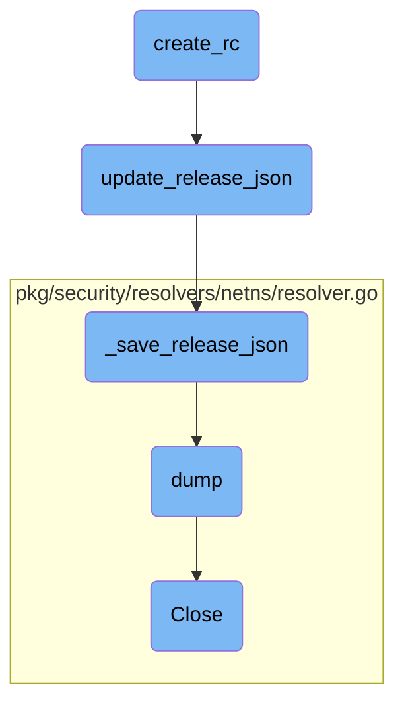

In this document, we will explain the process of creating a release candidate (RC). The process involves updating release entries, committing changes, and pushing the new branch to the upstream repository.

The flow starts with updating the release entries for the next RC build by calling a function to update the <SwmPath>[release.json](release.json)</SwmPath> file. This file is then saved to disk. After updating the release entries and internal module dependencies, a new branch is created, the changes are committed, and the new branch is pushed to the upstream repository. This ensures that the changes are properly versioned and available for review.

# Flow drill down



<SwmSnippet path="/tasks/release.py" line="377">

---

## Updating release entries

The function <SwmToken path="tasks/release.py" pos="306:2:2" line-data="def create_rc(ctx, major_versions=&quot;6,7&quot;, patch_version=False, upstream=&quot;origin&quot;, slack_webhook=None):">`create_rc`</SwmToken> updates the release entries for the next RC build by calling <SwmToken path="tasks/release.py" pos="381:1:1" line-data="        update_release_json(new_version, new_final_version)">`update_release_json`</SwmToken> for each major version. This ensures that the <SwmPath>[release.json](release.json)</SwmPath> file is prepared for the new release candidate.

```python

    print(color_message("Updating release entries", "bold"))
    for major_version in list_major_versions:
        new_version = next_rc_version(ctx, major_version, patch_version)
        update_release_json(new_version, new_final_version)

```

---

</SwmSnippet>

<SwmSnippet path="/tasks/libs/releasing/json.py" line="291">

---

### Updating <SwmPath>[release.json](release.json)</SwmPath>

The function <SwmToken path="tasks/libs/releasing/json.py" pos="291:2:2" line-data="def update_release_json(new_version: Version, max_version: Version):">`update_release_json`</SwmToken> loads the current <SwmPath>[release.json](release.json)</SwmPath>, updates it with the new version information, and then saves it. This is a crucial step in preparing the release entries for the next RC or final build.

```python
def update_release_json(new_version: Version, max_version: Version):
    """
    Updates the release entries in release.json to prepare the next RC or final build.
    """
    release_json = _load_release_json()

    release_entry = release_entry_for(new_version.major)
    print(f"Updating {release_entry} for {new_version}")

    # Update release.json object with the entry for the new version
    release_json = _update_release_json(release_json, release_entry, new_version, max_version)

    _save_release_json(release_json)
```

---

</SwmSnippet>

<SwmSnippet path="/tasks/release.py" line="390">

---

## Committing changes

After updating the release entries and internal module dependencies, <SwmToken path="tasks/release.py" pos="306:2:2" line-data="def create_rc(ctx, major_versions=&quot;6,7&quot;, patch_version=False, upstream=&quot;origin&quot;, slack_webhook=None):">`create_rc`</SwmToken> branches out, commits the changes, and pushes the new branch to the upstream repository. This ensures that the changes are properly versioned and available for review.

```python
    print(color_message(f"Branching out to {update_branch}", "bold"))
    ctx.run(f"git checkout -b {update_branch}")

    print(color_message("Committing release.json and Go modules updates", "bold"))
    print(
        color_message(
            "If commit signing is enabled, you will have to make sure the commit gets properly signed.", "bold"
        )
    )
    ctx.run("git add release.json")
    ctx.run("git ls-files . | grep 'go.mod$' | xargs git add")

    ok = try_git_command(ctx, f"git commit -m 'Update release.json and Go modules for {new_highest_version}'")
    if not ok:
        raise Exit(
            color_message(
                f"Could not create commit. Please commit manually, push the {update_branch} branch and then open a PR against {current_branch}.",
                "red",
            ),
            code=1,
        )
```

---

</SwmSnippet>

<SwmSnippet path="/tasks/libs/releasing/json.py" line="51">

---

### Saving <SwmPath>[release.json](release.json)</SwmPath>

The function <SwmToken path="tasks/libs/releasing/json.py" pos="51:2:2" line-data="def _save_release_json(release_json):">`_save_release_json`</SwmToken> writes the updated <SwmPath>[release.json](release.json)</SwmPath> to disk. This is the final step in updating the release entries before committing the changes.

```python
def _save_release_json(release_json):
    with open("release.json", "w") as release_json_stream:
        # Note, no space after the comma
        json.dump(release_json, release_json_stream, indent=4, sort_keys=False, separators=(',', ': '))
        release_json_stream.write('\n')
```

---

</SwmSnippet>

&nbsp;

*This is an auto-generated document by Swimm AI 🌊 and has not yet been verified by a human*

<SwmMeta version="3.0.0" repo-id="Z2l0aHViJTNBJTNBZGF0YWRvZy1hZ2VudCUzQSUzQVN3aW1tLURlbW8=" repo-name="datadog-agent"><sup>Powered by [Swimm](/)</sup></SwmMeta>
