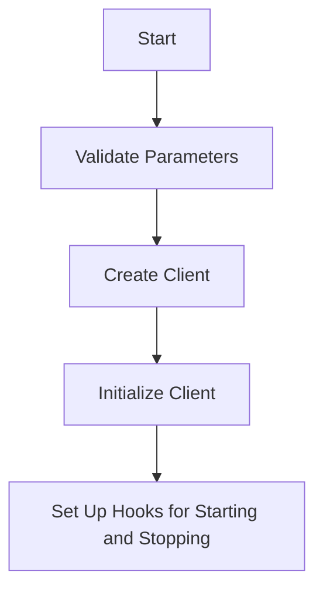

This document will cover the process of creating a Remote Configuration Client, which includes:

1. Validating Parameters
2. Creating the Client
3. Initializing the Client
4. Setting Up Hooks for Starting and Stopping

Technical document: <SwmLink doc-title="Creating a Remote Configuration Client">[Creating a Remote Configuration Client](/.swm/creating-a-remote-configuration-client.gns9780e.sw.md)</SwmLink>

# [Validating Parameters](https://app.swimm.io/repos/Z2l0aHViJTNBJTNBZGF0YWRvZy1hZ2VudCUzQSUzQVN3aW1tLURlbW8=/docs/gns9780e#validating-parameters)

The first step in creating a Remote Configuration Client is to validate the necessary parameters. This ensures that all required information, such as the agent name and version, is present. If any of these parameters are missing, the process cannot proceed. This step is crucial for ensuring that the client is configured correctly and can communicate effectively with the remote server.

# [Creating the Client](https://app.swimm.io/repos/Z2l0aHViJTNBJTNBZGF0YWRvZy1hZ2VudCUzQSUzQVN3aW1tLURlbW8=/docs/gns9780e#creating-the-client)

Once the parameters are validated, the next step is to create the client. Depending on whether multi-region failover is enabled, the client is created using different functions. If multi-region failover is not enabled, the client is created using the `NewUnverifiedGRPCClient` function. If multi-region failover is enabled, the `NewUnverifiedMRFGRPCClient` function is used. These functions initialize the gRPC client and append options to skip TUF (The Update Framework) verification before finalizing the client creation.

# [Initializing the Client](https://app.swimm.io/repos/Z2l0aHViJTNBJTNBZGF0YWRvZy1hZ2VudCUzQSUzQVN3aW1tLURlbW8=/docs/gns9780e#initializing-the-client)

After the client is created, it needs to be initialized with various options. This includes setting up the state repository and configuring the backoff policy for retries. The state repository is responsible for managing the client's state, and the backoff policy determines how the client handles retries in case of failures. This step ensures that the client is ready to handle remote configurations and can recover from errors effectively.

# [Setting Up Hooks for Starting and Stopping](https://app.swimm.io/repos/Z2l0aHViJTNBJTNBZGF0YWRvZy1hZ2VudCUzQSUzQVN3aW1tLURlbW8=/docs/gns9780e#setting-up-hooks-for-starting-and-stopping)

The final step in creating a Remote Configuration Client is to set up hooks for starting and stopping the client. This involves subscribing to AGENT_CONFIG configurations and starting the client. Additionally, every product is registered for every listener, and the client is started for each listener. If multi-region failover is enabled, the client also subscribes to AGENT_FAILOVER configurations and starts the failover client. This step ensures that the client can start and stop as needed, and can handle configuration updates dynamically.

&nbsp;

*This is an auto-generated document by Swimm AI 🌊 and has not yet been verified by a human*

<SwmMeta version="3.0.0" repo-id="Z2l0aHViJTNBJTNBZGF0YWRvZy1hZ2VudCUzQSUzQVN3aW1tLURlbW8=" repo-name="datadog-agent">Powered by [Swimm](/)</SwmMeta>
