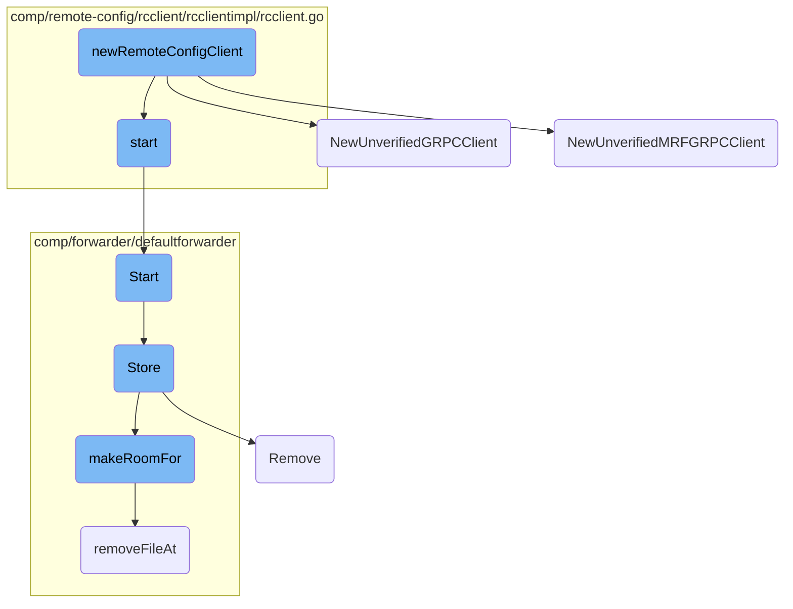
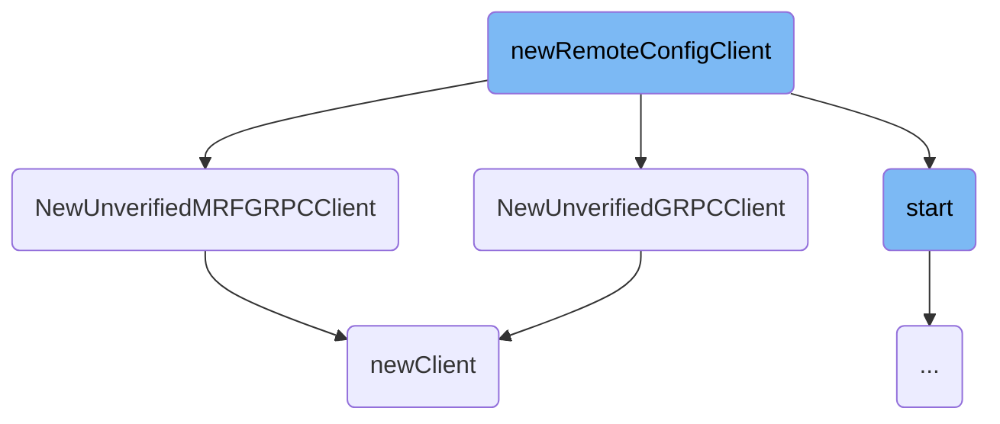
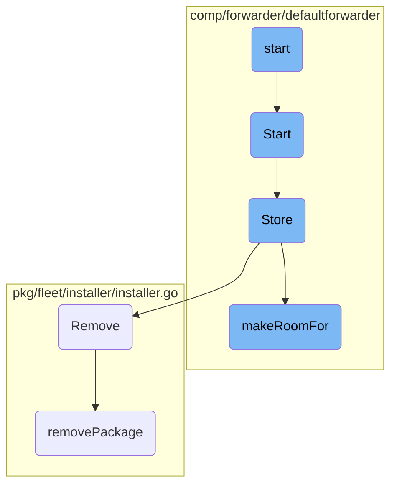

This document explains the process of creating a new remote configuration client. The process involves validating parameters, creating the client, initializing it with various options, and setting up hooks for starting and stopping.

The flow starts by validating the necessary parameters to ensure everything required is present. Then, it creates the client using specific functions depending on whether <SwmToken path="comp/remote-config/rcclient/rcclientimpl/rcclient.go" pos="184:6:8" line-data="			pkglog.Errorf(&quot;Multi-Region Failover update unmarshal failed: %s&quot;, err)">`Multi-Region`</SwmToken> failover is enabled. After the client is created, it is initialized with various options and hooks that allow it to start and stop as needed.

Here is a high level diagram of the flow, showing only the most important functions:



# Flow drill down

First, we'll zoom into this section of the flow:



<SwmSnippet path="/comp/remote-config/rcclient/rcclientimpl/rcclient.go" line="73">

---

## Creating the Remote Configuration Client

The function <SwmToken path="comp/remote-config/rcclient/rcclientimpl/rcclient.go" pos="73:2:2" line-data="func newRemoteConfigClient(deps dependencies) (rcclient.Component, error) {">`newRemoteConfigClient`</SwmToken> is responsible for creating a new remote configuration client. It first validates the necessary parameters and then creates the client using <SwmToken path="comp/remote-config/rcclient/rcclientimpl/rcclient.go" pos="90:10:10" line-data="	c, err := client.NewUnverifiedGRPCClient(">`NewUnverifiedGRPCClient`</SwmToken> and optionally <SwmToken path="pkg/config/remote/client/client.go" pos="181:2:2" line-data="// NewUnverifiedMRFGRPCClient creates a new client that does not perform any TUF verification and gets failover configs via gRPC">`NewUnverifiedMRFGRPCClient`</SwmToken> if <SwmToken path="comp/remote-config/rcclient/rcclientimpl/rcclient.go" pos="184:6:8" line-data="			pkglog.Errorf(&quot;Multi-Region Failover update unmarshal failed: %s&quot;, err)">`Multi-Region`</SwmToken> failover is enabled. The client is then initialized with various options and hooks for starting and stopping.

```go
func newRemoteConfigClient(deps dependencies) (rcclient.Component, error) {
	ipcAddress, err := config.GetIPCAddress()
	if err != nil {
		return nil, err
	}

	if deps.Params.AgentName == "" || deps.Params.AgentVersion == "" {
		return nil, fmt.Errorf("Remote config client is missing agent name or version parameter")
	}

	// Append client options
	optsWithDefault := []func(*client.Options){
		client.WithPollInterval(5 * time.Second),
		client.WithAgent(deps.Params.AgentName, deps.Params.AgentVersion),
	}

	// We have to create the client in the constructor and set its name later
	c, err := client.NewUnverifiedGRPCClient(
		ipcAddress,
		config.GetIPCPort(),
		func() (string, error) { return security.FetchAuthToken(config.Datadog()) },
```

---

</SwmSnippet>

<SwmSnippet path="/pkg/config/remote/client/client.go" line="192">

---

## Creating a <SwmToken path="pkg/config/remote/client/client.go" pos="181:36:36" line-data="// NewUnverifiedMRFGRPCClient creates a new client that does not perform any TUF verification and gets failover configs via gRPC">`gRPC`</SwmToken> Client Without TUF Verification

The function <SwmToken path="pkg/config/remote/client/client.go" pos="192:2:2" line-data="// NewUnverifiedGRPCClient creates a new client that does not perform any TUF verification">`NewUnverifiedGRPCClient`</SwmToken> creates a new <SwmToken path="pkg/config/remote/client/client.go" pos="181:36:36" line-data="// NewUnverifiedMRFGRPCClient creates a new client that does not perform any TUF verification and gets failover configs via gRPC">`gRPC`</SwmToken> client that does not perform TUF (The Update Framework) verification. It initializes the <SwmToken path="pkg/config/remote/client/client.go" pos="181:36:36" line-data="// NewUnverifiedMRFGRPCClient creates a new client that does not perform any TUF verification and gets failover configs via gRPC">`gRPC`</SwmToken> client and appends an option to skip TUF verification before calling <SwmToken path="pkg/config/remote/client/client.go" pos="200:3:3" line-data="	return newClient(grpcClient, opts...)">`newClient`</SwmToken> to finalize the client creation.

```go
// NewUnverifiedGRPCClient creates a new client that does not perform any TUF verification
func NewUnverifiedGRPCClient(ipcAddress string, cmdPort string, authTokenFetcher TokenFetcher, opts ...func(o *Options)) (*Client, error) {
	grpcClient, err := NewAgentGRPCConfigFetcher(ipcAddress, cmdPort, authTokenFetcher)
	if err != nil {
		return nil, err
	}

	opts = append(opts, WithoutTufVerification())
	return newClient(grpcClient, opts...)
}
```

---

</SwmSnippet>

<SwmSnippet path="/pkg/config/remote/client/client.go" line="181">

---

## Creating a <SwmToken path="comp/remote-config/rcclient/rcclientimpl/rcclient.go" pos="184:6:8" line-data="			pkglog.Errorf(&quot;Multi-Region Failover update unmarshal failed: %s&quot;, err)">`Multi-Region`</SwmToken> Failover <SwmToken path="pkg/config/remote/client/client.go" pos="181:36:36" line-data="// NewUnverifiedMRFGRPCClient creates a new client that does not perform any TUF verification and gets failover configs via gRPC">`gRPC`</SwmToken> Client

The function <SwmToken path="pkg/config/remote/client/client.go" pos="181:2:2" line-data="// NewUnverifiedMRFGRPCClient creates a new client that does not perform any TUF verification and gets failover configs via gRPC">`NewUnverifiedMRFGRPCClient`</SwmToken> is similar to <SwmToken path="comp/remote-config/rcclient/rcclientimpl/rcclient.go" pos="90:10:10" line-data="	c, err := client.NewUnverifiedGRPCClient(">`NewUnverifiedGRPCClient`</SwmToken> but is specifically for creating a <SwmToken path="pkg/config/remote/client/client.go" pos="181:36:36" line-data="// NewUnverifiedMRFGRPCClient creates a new client that does not perform any TUF verification and gets failover configs via gRPC">`gRPC`</SwmToken> client that supports <SwmToken path="comp/remote-config/rcclient/rcclientimpl/rcclient.go" pos="184:6:8" line-data="			pkglog.Errorf(&quot;Multi-Region Failover update unmarshal failed: %s&quot;, err)">`Multi-Region`</SwmToken> failover. It also skips TUF verification and calls <SwmToken path="pkg/config/remote/client/client.go" pos="189:3:3" line-data="	return newClient(grpcClient, opts...)">`newClient`</SwmToken> to complete the client setup.

```go
// NewUnverifiedMRFGRPCClient creates a new client that does not perform any TUF verification and gets failover configs via gRPC
func NewUnverifiedMRFGRPCClient(ipcAddress string, cmdPort string, authTokenFetcher TokenFetcher, opts ...func(o *Options)) (*Client, error) {
	grpcClient, err := NewMRFAgentGRPCConfigFetcher(ipcAddress, cmdPort, authTokenFetcher)
	if err != nil {
		return nil, err
	}

	opts = append(opts, WithoutTufVerification())
	return newClient(grpcClient, opts...)
}
```

---

</SwmSnippet>

<SwmSnippet path="/pkg/config/remote/client/client.go" line="246">

---

## Finalizing the Client Creation

The function <SwmToken path="pkg/config/remote/client/client.go" pos="246:2:2" line-data="func newClient(cf ConfigFetcher, opts ...func(opts *Options)) (*Client, error) {">`newClient`</SwmToken> finalizes the creation of the client by setting up various options, initializing the state repository, and configuring the backoff policy for retries. It also sets up the context and listeners for the client.

```go
func newClient(cf ConfigFetcher, opts ...func(opts *Options)) (*Client, error) {
	var options = defaultOptions
	for _, opt := range opts {
		opt(&options)
	}

	var repository *state.Repository
	var err error

	if !options.skipTufVerification {
		repository, err = state.NewRepository(meta.RootsDirector(options.site, options.directorRootOverride).Last())
	} else {
		repository, err = state.NewUnverifiedRepository()
	}
	if err != nil {
		return nil, err
	}

	// A backoff is calculated as a range from which a random value will be selected. The formula is as follows.
	//
	// min = pollInterval * 2^<NumErrors> / minBackoffFactor
```

---

</SwmSnippet>

Now, lets zoom into this section of the flow:



<SwmSnippet path="/comp/remote-config/rcclient/rcclientimpl/rcclient.go" line="141">

---

## Initializing Remote Config Client

The <SwmToken path="comp/remote-config/rcclient/rcclientimpl/rcclient.go" pos="141:2:2" line-data="// Start subscribes to AGENT_CONFIG configurations and start the remote config client">`Start`</SwmToken> function initializes the remote config client by subscribing to <SwmToken path="comp/remote-config/rcclient/rcclientimpl/rcclient.go" pos="141:8:8" line-data="// Start subscribes to AGENT_CONFIG configurations and start the remote config client">`AGENT_CONFIG`</SwmToken> configurations and starting the client. It also registers every product for every listener and starts the client for each listener.

```go
// Start subscribes to AGENT_CONFIG configurations and start the remote config client
func (rc rcClient) start() {
	rc.client.Subscribe(state.ProductAgentConfig, rc.agentConfigUpdateCallback)

	// Register every product for every listener
	for _, l := range rc.listeners {
		for product, callback := range l {
			rc.client.Subscribe(string(product), callback)
		}
	}

	rc.client.Start()

	if rc.clientMRF != nil {
		rc.clientMRF.Subscribe(state.ProductAgentFailover, rc.mrfUpdateCallback)
		rc.clientMRF.Start()
	}
}
```

---

</SwmSnippet>

<SwmSnippet path="/comp/forwarder/defaultforwarder/default_forwarder.go" line="374">

---

## Starting the Forwarder

The <SwmToken path="comp/forwarder/defaultforwarder/default_forwarder.go" pos="374:2:2" line-data="// Start initialize and runs the forwarder.">`Start`</SwmToken> function initializes and runs the forwarder. It locks the forwarder to prevent stopping while starting, checks if the forwarder is already started, and starts each domain forwarder. It also logs the endpoints configuration and starts the health checker.

```go
// Start initialize and runs the forwarder.
func (f *DefaultForwarder) Start() error {
	// Lock so we can't stop a Forwarder while is starting
	f.m.Lock()
	defer f.m.Unlock()

	if f.internalState.Load() == Started {
		return fmt.Errorf("the forwarder is already started")
	}

	for _, df := range f.domainForwarders {
		_ = df.Start()
	}

	// log endpoints configuration
	endpointLogs := make([]string, 0, len(f.domainResolvers))
	for domain, dr := range f.domainResolvers {
		endpointLogs = append(endpointLogs, fmt.Sprintf("\"%s\" (%v api key(s))",
			domain, len(dr.GetAPIKeys())))
	}
	f.log.Infof("Forwarder started, sending to %v endpoint(s) with %v worker(s) each: %s",
```

---

</SwmSnippet>

<SwmSnippet path="/comp/forwarder/defaultforwarder/internal/retry/on_disk_retry_queue.go" line="67">

---

## Storing Transactions

The <SwmToken path="comp/forwarder/defaultforwarder/internal/retry/on_disk_retry_queue.go" pos="67:2:2" line-data="// Store stores transactions to the file system.">`Store`</SwmToken> function stores transactions to the file system. It serializes the transactions, makes room for the new data, writes the serialized data to a temporary file, and updates the telemetry with the new file size and disk space used.

```go
// Store stores transactions to the file system.
func (s *onDiskRetryQueue) Store(transactions []transaction.Transaction) error {
	s.telemetry.addSerializeCount()

	// Reset the serializer in case some transactions were serialized
	// but `GetBytesAndReset` was not called because of an error.
	_, _ = s.serializer.GetBytesAndReset()

	for _, t := range transactions {
		if err := t.SerializeTo(s.log, s.serializer); err != nil {
			return err
		}
	}

	bytes, err := s.serializer.GetBytesAndReset()
	if err != nil {
		return err
	}
	bufferSize := int64(len(bytes))

	if err := s.makeRoomFor(bufferSize); err != nil {
```

---

</SwmSnippet>

<SwmSnippet path="/pkg/fleet/installer/installer.go" line="297">

---

## Removing Packages

The <SwmToken path="pkg/fleet/installer/installer.go" pos="297:2:2" line-data="// Remove uninstalls a package.">`Remove`</SwmToken> function uninstalls a package by locking the installer, calling the <SwmToken path="pkg/fleet/installer/installer.go" pos="301:7:7" line-data="	err := i.removePackage(ctx, pkg)">`removePackage`</SwmToken> function, and deleting the package from the repositories and database.

```go
// Remove uninstalls a package.
func (i *installerImpl) Remove(ctx context.Context, pkg string) error {
	i.m.Lock()
	defer i.m.Unlock()
	err := i.removePackage(ctx, pkg)
	if err != nil {
		return fmt.Errorf("could not remove package: %w", err)
	}
	err = i.repositories.Delete(ctx, pkg)
	if err != nil {
		return fmt.Errorf("could not delete repository: %w", err)
	}
	err = i.db.DeletePackage(pkg)
	if err != nil {
		return fmt.Errorf("could not remove package installation in db: %w", err)
	}
	return nil
}
```

---

</SwmSnippet>

<SwmSnippet path="/comp/forwarder/defaultforwarder/internal/retry/on_disk_retry_queue.go" line="154">

---

### Making Room for New Data

The <SwmToken path="comp/forwarder/defaultforwarder/internal/retry/on_disk_retry_queue.go" pos="154:9:9" line-data="func (s *onDiskRetryQueue) makeRoomFor(bufferSize int64) error {">`makeRoomFor`</SwmToken> function ensures there is enough disk space for new data by checking the current disk usage and removing old files if necessary.

```go
func (s *onDiskRetryQueue) makeRoomFor(bufferSize int64) error {
	maxSizeInBytes := s.diskUsageLimit.getMaxSizeInBytes()
	if bufferSize > maxSizeInBytes {
		return fmt.Errorf("The payload is too big. Current:%v Maximum:%v", bufferSize, maxSizeInBytes)
	}

	maxStorageInBytes, err := s.diskUsageLimit.computeAvailableSpace(s.currentSizeInBytes)
	if err != nil {
		return err
	}
	for len(s.filenames) > 0 && s.currentSizeInBytes+bufferSize > maxStorageInBytes {
		index := 0
		filename := s.filenames[index]
		s.log.Errorf("Maximum disk space for retry transactions is reached. Removing %s", filename)

		bytes, err := os.ReadFile(filename)
		if err != nil {
			s.log.Errorf("Cannot read the file %v: %v", filename, err)
		} else if transactions, _, errDeserialize := s.serializer.Deserialize(bytes); errDeserialize == nil {
			pointDroppedCount := 0
			for _, tr := range transactions {
```

---

</SwmSnippet>

<SwmSnippet path="/pkg/fleet/installer/installer.go" line="410">

---

### Removing Specific Packages

The <SwmToken path="pkg/fleet/installer/installer.go" pos="410:9:9" line-data="func (i *installerImpl) removePackage(ctx context.Context, pkg string) error {">`removePackage`</SwmToken> function removes specific packages based on the package name by calling the appropriate service removal function.

```go
func (i *installerImpl) removePackage(ctx context.Context, pkg string) error {
	switch pkg {
	case packageDatadogAgent:
		return service.RemoveAgent(ctx)
	case packageAPMInjector:
		return service.RemoveAPMInjector(ctx)
	case packageDatadogInstaller:
		return service.RemoveInstaller(ctx)
	default:
		return nil
	}
}
```

---

</SwmSnippet>

&nbsp;

*This is an auto-generated document by Swimm AI 🌊 and has not yet been verified by a human*

<SwmMeta version="3.0.0" repo-id="Z2l0aHViJTNBJTNBZGF0YWRvZy1hZ2VudCUzQSUzQVN3aW1tLURlbW8=" repo-name="datadog-agent"><sup>Powered by [Swimm](/)</sup></SwmMeta>
