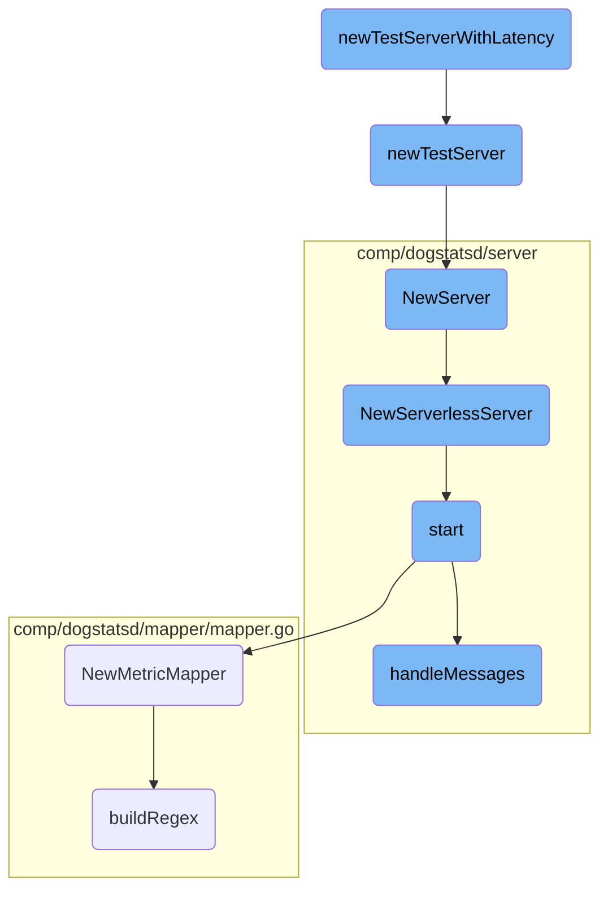

This document explains the purpose and flow of creating a test server with latency. It covers the initialization of the server, setting up latency, and the components involved in handling metrics and requests.

The flow starts by creating a basic test server. This server is then configured to introduce a delay for each request, simulating network latency. The server is set up to handle metrics and requests efficiently, ensuring it can process multiple packets concurrently. Various components like logging, telemetry, and packet handling are initialized to support the server's operations.

# Flow drill down



<SwmSnippet path="/pkg/trace/writer/testserver.go" line="48">

---

## <SwmToken path="pkg/trace/writer/testserver.go" pos="48:2:2" line-data="// newTestServerWithLatency returns a test server that takes duration d">`newTestServerWithLatency`</SwmToken>

The function <SwmToken path="pkg/trace/writer/testserver.go" pos="48:2:2" line-data="// newTestServerWithLatency returns a test server that takes duration d">`newTestServerWithLatency`</SwmToken> creates a test server that introduces a specified latency for each request. This is useful for simulating network delays in a controlled test environment. It calls <SwmToken path="pkg/trace/writer/testserver.go" pos="51:5:5" line-data="	ts := newTestServer()">`newTestServer`</SwmToken> to create the server and then sets the latency.

```go
// newTestServerWithLatency returns a test server that takes duration d
// to respond to each request.
func newTestServerWithLatency(d time.Duration) *testServer {
	ts := newTestServer()
	ts.latency = d
	return ts
}
```

---

</SwmSnippet>

<SwmSnippet path="/pkg/trace/writer/testserver.go" line="56">

---

## <SwmToken path="pkg/trace/writer/testserver.go" pos="56:2:2" line-data="// newTestServer returns a new, started HTTP test server. Its URL is available">`newTestServer`</SwmToken>

The function <SwmToken path="pkg/trace/writer/testserver.go" pos="56:2:2" line-data="// newTestServer returns a new, started HTTP test server. Its URL is available">`newTestServer`</SwmToken> initializes and starts a new HTTP test server. It sets up various counters and maps to track request statuses and responses. The server is configured to always return an HTTP 200 OK status by default, and its URL is made available for testing purposes.

```go
// newTestServer returns a new, started HTTP test server. Its URL is available
// as a field. To control its responses, send it payloads created by expectResponses.
// By default, the testServer always returns http.StatusOK.
func newTestServer() *testServer {
	srv := &testServer{
		seen:     make(map[string]*requestStatus),
		total:    atomic.NewUint64(0),
		accepted: atomic.NewUint64(0),
		retried:  atomic.NewUint64(0),
		failed:   atomic.NewUint64(0),
		peak:     atomic.NewInt64(0),
		active:   atomic.NewInt64(0),
	}
	srv.server = httptest.NewServer(srv)
	srv.URL = srv.server.URL
	return srv
}
```

---

</SwmSnippet>

<SwmSnippet path="/pkg/serverless/metrics/metric.go" line="58">

---

## <SwmToken path="pkg/serverless/metrics/metric.go" pos="58:2:2" line-data="// NewServer returns a running DogStatsD server">`NewServer`</SwmToken>

The method <SwmToken path="pkg/serverless/metrics/metric.go" pos="58:2:2" line-data="// NewServer returns a running DogStatsD server">`NewServer`</SwmToken> returns a running <SwmToken path="pkg/serverless/metrics/metric.go" pos="58:10:10" line-data="// NewServer returns a running DogStatsD server">`DogStatsD`</SwmToken> server by calling <SwmToken path="pkg/serverless/metrics/metric.go" pos="60:5:5" line-data="	return dogstatsdServer.NewServerlessServer(demux)">`NewServerlessServer`</SwmToken>. This sets up the server to handle <SwmToken path="pkg/serverless/metrics/metric.go" pos="58:10:10" line-data="// NewServer returns a running DogStatsD server">`DogStatsD`</SwmToken> metrics in a serverless environment.

```go
// NewServer returns a running DogStatsD server
func (m *MetricDogStatsD) NewServer(demux aggregator.Demultiplexer) (dogstatsdServer.ServerlessDogstatsd, error) {
	return dogstatsdServer.NewServerlessServer(demux)
}
```

---

</SwmSnippet>

<SwmSnippet path="/comp/dogstatsd/server/serverless.go" line="31">

---

## <SwmToken path="comp/dogstatsd/server/serverless.go" pos="32:2:2" line-data="func NewServerlessServer(demux aggregator.Demultiplexer) (ServerlessDogstatsd, error) {">`NewServerlessServer`</SwmToken>

The function <SwmToken path="comp/dogstatsd/server/serverless.go" pos="32:2:2" line-data="func NewServerlessServer(demux aggregator.Demultiplexer) (ServerlessDogstatsd, error) {">`NewServerlessServer`</SwmToken> initializes a serverless <SwmToken path="pkg/serverless/metrics/metric.go" pos="58:10:10" line-data="// NewServer returns a running DogStatsD server">`DogStatsD`</SwmToken> server. It sets up various components like logging, telemetry, and packet handling. The server is then started, and any errors during startup are returned.

```go
//nolint:revive // TODO(AML) Fix revive linter
func NewServerlessServer(demux aggregator.Demultiplexer) (ServerlessDogstatsd, error) {
	wmeta := optional.NewNoneOption[workloadmeta.Component]()
	s := newServerCompat(config.Datadog(), logComponentImpl.NewTemporaryLoggerWithoutInit(), replay.NewNoopTrafficCapture(), serverdebugimpl.NewServerlessServerDebug(), true, demux, wmeta, pidmapimpl.NewServerlessPidMap(), telemetry.GetCompatComponent())

	err := s.start(context.TODO())
	if err != nil {
		return nil, err
	}

	return s, nil
}
```

---

</SwmSnippet>

<SwmSnippet path="/comp/dogstatsd/server/server.go" line="339">

---

## start

The method <SwmToken path="comp/dogstatsd/server/server.go" pos="339:9:9" line-data="func (s *server) start(context.Context) error {">`start`</SwmToken> initializes various listeners (UDP, UDS, named pipes) and sets up packet handling for the <SwmToken path="pkg/serverless/metrics/metric.go" pos="58:10:10" line-data="// NewServer returns a running DogStatsD server">`DogStatsD`</SwmToken> server. It also configures packet forwarding, health checks, and debug loops. Finally, it starts the message handling process and marks the server as started.

```go
func (s *server) start(context.Context) error {
	packetsChannel := make(chan packets.Packets, s.config.GetInt("dogstatsd_queue_size"))
	tmpListeners := make([]listeners.StatsdListener, 0, 2)

	if err := s.tCapture.GetStartUpError(); err != nil {
		return err
	}

	// sharedPacketPool is used by the packet assembler to retrieve already allocated
	// buffer in order to avoid allocation. The packets are pushed back by the server.
	sharedPacketPool := packets.NewPool(s.config.GetInt("dogstatsd_buffer_size"), s.packetsTelemetry)
	sharedPacketPoolManager := packets.NewPoolManager[packets.Packet](sharedPacketPool)

	udsListenerRunning := false

	socketPath := s.config.GetString("dogstatsd_socket")
	socketStreamPath := s.config.GetString("dogstatsd_stream_socket")
	originDetection := s.config.GetBool("dogstatsd_origin_detection")
	var sharedUDSOobPoolManager *packets.PoolManager[[]byte]
	if originDetection {
		sharedUDSOobPoolManager = listeners.NewUDSOobPoolManager()
```

---

</SwmSnippet>

<SwmSnippet path="/comp/dogstatsd/mapper/mapper.go" line="55">

---

## <SwmToken path="comp/dogstatsd/mapper/mapper.go" pos="55:2:2" line-data="// NewMetricMapper creates, validates, prepares a new MetricMapper">`NewMetricMapper`</SwmToken>

The function <SwmToken path="comp/dogstatsd/mapper/mapper.go" pos="55:2:2" line-data="// NewMetricMapper creates, validates, prepares a new MetricMapper">`NewMetricMapper`</SwmToken> creates and validates a new <SwmToken path="comp/dogstatsd/mapper/mapper.go" pos="55:16:16" line-data="// NewMetricMapper creates, validates, prepares a new MetricMapper">`MetricMapper`</SwmToken> based on provided configuration profiles. It sets up mappings and a cache for efficient metric name resolution.

```go
// NewMetricMapper creates, validates, prepares a new MetricMapper
func NewMetricMapper(configProfiles []config.MappingProfile, cacheSize int) (*MetricMapper, error) {
	profiles := make([]MappingProfile, 0, len(configProfiles))
	for profileIndex, configProfile := range configProfiles {
		if configProfile.Name == "" {
			return nil, fmt.Errorf("missing profile name %d", profileIndex)
		}
		if configProfile.Prefix == "" {
			return nil, fmt.Errorf("missing prefix for profile: %s", configProfile.Name)
		}
		profile := MappingProfile{
			Name:     configProfile.Name,
			Prefix:   configProfile.Prefix,
			Mappings: make([]*MetricMapping, 0, len(configProfile.Mappings)),
		}
		for i, currentMapping := range configProfile.Mappings {
			matchType := currentMapping.MatchType
			if matchType == "" {
				matchType = matchTypeWildcard
			}
			if matchType != matchTypeWildcard && matchType != matchTypeRegex {
```

---

</SwmSnippet>

<SwmSnippet path="/comp/dogstatsd/server/server.go" line="504">

---

## <SwmToken path="comp/dogstatsd/server/server.go" pos="504:9:9" line-data="func (s *server) handleMessages() {">`handleMessages`</SwmToken>

The method <SwmToken path="comp/dogstatsd/server/server.go" pos="504:9:9" line-data="func (s *server) handleMessages() {">`handleMessages`</SwmToken> starts the processing of incoming packets by initializing workers and listeners. It ensures that the server can handle multiple packets concurrently and efficiently.

```go
func (s *server) handleMessages() {
	if s.Statistics != nil {
		go s.Statistics.Process()
		go s.Statistics.Update(&dogstatsdPacketsLastSec)
	}

	for _, l := range s.listeners {
		l.Listen()
	}

	workersCount, _ := aggregator.GetDogStatsDWorkerAndPipelineCount()

	// undocumented configuration field to force the amount of dogstatsd workers
	// mainly used for benchmarks or some very specific use-case.
	if configWC := s.config.GetInt("dogstatsd_workers_count"); configWC != 0 {
		s.log.Debug("Forcing the amount of DogStatsD workers to:", configWC)
		workersCount = configWC
	}

	s.log.Debug("DogStatsD will run", workersCount, "workers")

```

---

</SwmSnippet>

<SwmSnippet path="/comp/dogstatsd/mapper/mapper.go" line="99">

---

## <SwmToken path="comp/dogstatsd/mapper/mapper.go" pos="99:2:2" line-data="func buildRegex(matchRe string, matchType string) (*regexp.Regexp, error) {">`buildRegex`</SwmToken>

The function <SwmToken path="comp/dogstatsd/mapper/mapper.go" pos="99:2:2" line-data="func buildRegex(matchRe string, matchType string) (*regexp.Regexp, error) {">`buildRegex`</SwmToken> compiles a regex pattern based on the provided match type (wildcard or regex). It ensures that the pattern is valid and can be used for metric name matching.

```go
func buildRegex(matchRe string, matchType string) (*regexp.Regexp, error) {
	if matchType == matchTypeWildcard {
		if !allowedWildcardMatchPattern.MatchString(matchRe) {
			return nil, fmt.Errorf("invalid wildcard match pattern `%s`, it does not match allowed match regex `%s`", matchRe, allowedWildcardMatchPattern)
		}
		if strings.Contains(matchRe, "**") {
			return nil, fmt.Errorf("invalid wildcard match pattern `%s`, it should not contain consecutive `*`", matchRe)
		}
		matchRe = strings.Replace(matchRe, ".", "\\.", -1)
		matchRe = strings.Replace(matchRe, "*", "([^.]*)", -1)
	}
	regex, err := regexp.Compile("^" + matchRe + "$")
	if err != nil {
		return nil, fmt.Errorf("invalid match `%s`. cannot compile regex: %v", matchRe, err)
	}
	return regex, nil
}
```

---

</SwmSnippet>

&nbsp;

*This is an auto-generated document by Swimm AI 🌊 and has not yet been verified by a human*

<SwmMeta version="3.0.0" repo-id="Z2l0aHViJTNBJTNBZGF0YWRvZy1hZ2VudCUzQSUzQVN3aW1tLURlbW8=" repo-name="datadog-agent"><sup>Powered by [Swimm](/)</sup></SwmMeta>
