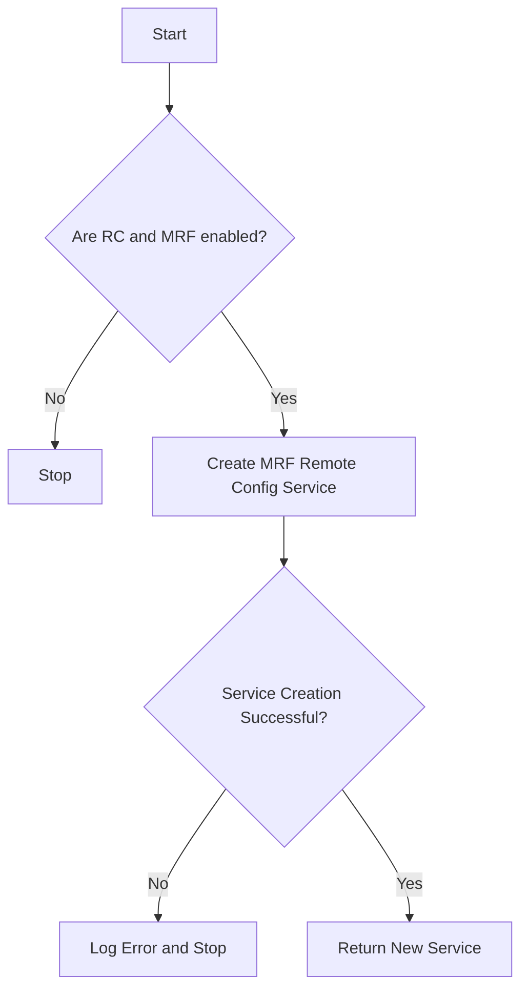

This document will cover the process of creating and configuring the MRF Remote Config Service, which includes:

1. Checking configuration settings
2. Attempting to create the service
3. Handling potential errors.

Technical document: <SwmLink doc-title="Creating and Configuring MRF Remote Config Service">[Creating and Configuring MRF Remote Config Service](/.swm/creating-and-configuring-mrf-remote-config-service.ikskew5v.sw.md)</SwmLink>

# [Checking Configuration Settings](https://app.swimm.io/repos/Z2l0aHViJTNBJTNBZGF0YWRvZy1hZ2VudCUzQSUzQVN3aW1tLURlbW8=/docs/ikskew5v#newmrfremoteconfigserviceoptional)

The process begins by verifying if both Remote Configuration (RC) and Multi-Region Failover (MRF) are enabled. This is crucial because the MRF Remote Config Service can only be created if both these features are active. If either of these settings is disabled, the process stops immediately, ensuring that resources are not wasted on unnecessary operations.

# [Attempting to Create the Service](https://app.swimm.io/repos/Z2l0aHViJTNBJTNBZGF0YWRvZy1hZ2VudCUzQSUzQVN3aW1tLURlbW8=/docs/ikskew5v#newmrfremoteconfigservice)

If both RC and MRF are enabled, the next step is to attempt to create the MRF Remote Config Service. This involves several sub-steps:

1. **Sanitizing the API Key**: Ensuring the API key is in the correct format.
2. **Retrieving the MRF Endpoint**: Getting the endpoint URL for the MRF service.
3. **Setting Options**: Configuring various options such as the trace agent environment, configured tags, and refresh intervals. These options ensure that the service operates correctly and efficiently.

# [Handling Potential Errors](https://app.swimm.io/repos/Z2l0aHViJTNBJTNBZGF0YWRvZy1hZ2VudCUzQSUzQVN3aW1tLURlbW8=/docs/ikskew5v#newmrfremoteconfigserviceoptional)

If the service creation fails at any point, an error is logged, and the process stops. This ensures that any issues are recorded for troubleshooting, and no partially configured services are left running. If the service is successfully created, it is returned for use.

&nbsp;

*This is an auto-generated document by Swimm AI 🌊 and has not yet been verified by a human*

<SwmMeta version="3.0.0" repo-id="Z2l0aHViJTNBJTNBZGF0YWRvZy1hZ2VudCUzQSUzQVN3aW1tLURlbW8=" repo-name="datadog-agent">Powered by [Swimm](/)</SwmMeta>
