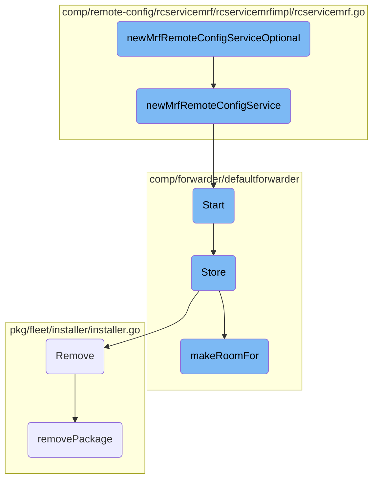

This document explains the process of conditionally creating and configuring a new MRF remote config service. It involves checking configuration settings, attempting to create the service, and handling potential errors.

The process starts by checking if remote configuration (RC) and multi-region failover are enabled. If either is disabled, it stops there. If both are enabled, it tries to create a new MRF remote config service. If the creation fails, it logs an error and stops. If successful, it returns the newly created service.

# Flow drill down



<SwmSnippet path="/comp/remote-config/rcservicemrf/rcservicemrfimpl/rcservicemrf.go" line="47">

---

## <SwmToken path="comp/remote-config/rcservicemrf/rcservicemrfimpl/rcservicemrf.go" pos="47:2:2" line-data="// newMrfRemoteConfigServiceOptional conditionally creates and configures a new MRF remote config service, based on whether RC is enabled.">`newMrfRemoteConfigServiceOptional`</SwmToken>

The function <SwmToken path="comp/remote-config/rcservicemrf/rcservicemrfimpl/rcservicemrf.go" pos="47:2:2" line-data="// newMrfRemoteConfigServiceOptional conditionally creates and configures a new MRF remote config service, based on whether RC is enabled.">`newMrfRemoteConfigServiceOptional`</SwmToken> conditionally creates and configures a new MRF remote config service based on whether remote configuration (RC) is enabled. It first checks if RC and multi-region failover are enabled in the configuration. If either is disabled, it returns an empty option. If both are enabled, it attempts to create a new MRF remote config service using <SwmToken path="comp/remote-config/rcservicemrf/rcservicemrfimpl/rcservicemrf.go" pos="54:8:8" line-data="	mrfConfigService, err := newMrfRemoteConfigService(deps)">`newMrfRemoteConfigService`</SwmToken>. If the service creation fails, it logs an error and returns an empty option; otherwise, it returns the newly created service.

```go
// newMrfRemoteConfigServiceOptional conditionally creates and configures a new MRF remote config service, based on whether RC is enabled.
func newMrfRemoteConfigServiceOptional(deps dependencies) optional.Option[rcservicemrf.Component] {
	none := optional.NewNoneOption[rcservicemrf.Component]()
	if !config.IsRemoteConfigEnabled(deps.Cfg) || !deps.Cfg.GetBool("multi_region_failover.enabled") {
		return none
	}

	mrfConfigService, err := newMrfRemoteConfigService(deps)
	if err != nil {
		deps.Logger.Errorf("remote config MRF service not initialized or started: %s", err)
		return none
	}

	return optional.NewOption[rcservicemrf.Component](mrfConfigService)
}
```

---

</SwmSnippet>

<SwmSnippet path="/comp/remote-config/rcservicemrf/rcservicemrfimpl/rcservicemrf.go" line="63">

---

## <SwmToken path="comp/remote-config/rcservicemrf/rcservicemrfimpl/rcservicemrf.go" pos="64:2:2" line-data="func newMrfRemoteConfigService(deps dependencies) (rcservicemrf.Component, error) {">`newMrfRemoteConfigService`</SwmToken>

The function <SwmToken path="comp/remote-config/rcservicemrf/rcservicemrfimpl/rcservicemrf.go" pos="64:2:2" line-data="func newMrfRemoteConfigService(deps dependencies) (rcservicemrf.Component, error) {">`newMrfRemoteConfigService`</SwmToken> is responsible for creating and configuring a new service that receives remote config updates from the configured Datadog failover data center. It sanitizes the API key, retrieves the MRF endpoint, and sets various options for the remote config service. It then creates the service and sets up lifecycle hooks to start and stop the service. If any step fails, it returns an error; otherwise, it returns the configured service.

```go
// newMrfRemoteConfigServiceOptional creates and configures a new service that receives remote config updates from the configured DD failover DC
func newMrfRemoteConfigService(deps dependencies) (rcservicemrf.Component, error) {
	apiKey := configUtils.SanitizeAPIKey(deps.Cfg.GetString("multi_region_failover.api_key"))
	baseRawURL, err := configUtils.GetMRFEndpoint(deps.Cfg, "https://config.", "multi_region_failover.remote_configuration.rc_dd_url")
	if err != nil {
		return nil, fmt.Errorf("unable to get MRF remote config endpoint: %s", err)
	}
	traceAgentEnv := configUtils.GetTraceAgentDefaultEnv(deps.Cfg)
	configuredTags := configUtils.GetConfiguredTags(deps.Cfg, false)
	options := []remoteconfig.Option{
		remoteconfig.WithAPIKey(apiKey),
		remoteconfig.WithTraceAgentEnv(traceAgentEnv),
		remoteconfig.WithDatabaseFileName("remote-config-ha.db"),
		remoteconfig.WithConfigRootOverride(deps.Cfg.GetString("multi_region_failover.site"), deps.Cfg.GetString("multi_region_failover.remote_configuration.config_root")),
		remoteconfig.WithDirectorRootOverride(deps.Cfg.GetString("multi_region_failover.site"), deps.Cfg.GetString("multi_region_failover.remote_configuration.director_root")),
		remoteconfig.WithRcKey(deps.Cfg.GetString("multi_region_failover.remote_configuration.key")),
	}
	if deps.Cfg.IsSet("multi_region_failover.remote_configuration.refresh_interval") {
		options = append(options, remoteconfig.WithRefreshInterval(deps.Cfg.GetDuration("multi_region_failover.remote_configuration.refresh_interval"), "multi_region_failover.remote_configuration.refresh_interval"))
	}
	if deps.Cfg.IsSet("multi_region_failover.remote_configuration.max_backoff_interval") {
```

---

</SwmSnippet>

<SwmSnippet path="/comp/forwarder/defaultforwarder/default_forwarder.go" line="374">

---

## Start

The <SwmToken path="comp/forwarder/defaultforwarder/default_forwarder.go" pos="374:2:2" line-data="// Start initialize and runs the forwarder.">`Start`</SwmToken> method initializes and runs the forwarder. It locks the forwarder to prevent stopping it while starting, checks if the forwarder is already started, and starts each domain forwarder. It logs the endpoints configuration, starts the health checker, and updates the internal state to indicate that the forwarder has started.

```go
// Start initialize and runs the forwarder.
func (f *DefaultForwarder) Start() error {
	// Lock so we can't stop a Forwarder while is starting
	f.m.Lock()
	defer f.m.Unlock()

	if f.internalState.Load() == Started {
		return fmt.Errorf("the forwarder is already started")
	}

	for _, df := range f.domainForwarders {
		_ = df.Start()
	}

	// log endpoints configuration
	endpointLogs := make([]string, 0, len(f.domainResolvers))
	for domain, dr := range f.domainResolvers {
		endpointLogs = append(endpointLogs, fmt.Sprintf("\"%s\" (%v api key(s))",
			domain, len(dr.GetAPIKeys())))
	}
	f.log.Infof("Forwarder started, sending to %v endpoint(s) with %v worker(s) each: %s",
```

---

</SwmSnippet>

<SwmSnippet path="/comp/forwarder/defaultforwarder/internal/retry/on_disk_retry_queue.go" line="67">

---

## Store

The <SwmToken path="comp/forwarder/defaultforwarder/internal/retry/on_disk_retry_queue.go" pos="67:2:2" line-data="// Store stores transactions to the file system.">`Store`</SwmToken> method stores transactions to the file system. It serializes the transactions, ensures there is enough disk space by calling <SwmToken path="comp/forwarder/defaultforwarder/internal/retry/on_disk_retry_queue.go" pos="87:9:9" line-data="	if err := s.makeRoomFor(bufferSize); err != nil {">`makeRoomFor`</SwmToken>, and writes the serialized data to a temporary file. It updates the current disk usage and telemetry data.

```go
// Store stores transactions to the file system.
func (s *onDiskRetryQueue) Store(transactions []transaction.Transaction) error {
	s.telemetry.addSerializeCount()

	// Reset the serializer in case some transactions were serialized
	// but `GetBytesAndReset` was not called because of an error.
	_, _ = s.serializer.GetBytesAndReset()

	for _, t := range transactions {
		if err := t.SerializeTo(s.log, s.serializer); err != nil {
			return err
		}
	}

	bytes, err := s.serializer.GetBytesAndReset()
	if err != nil {
		return err
	}
	bufferSize := int64(len(bytes))

	if err := s.makeRoomFor(bufferSize); err != nil {
```

---

</SwmSnippet>

<SwmSnippet path="/pkg/fleet/installer/installer.go" line="297">

---

## Remove

The <SwmToken path="pkg/fleet/installer/installer.go" pos="297:2:2" line-data="// Remove uninstalls a package.">`Remove`</SwmToken> method uninstalls a package. It locks the installer, calls <SwmToken path="pkg/fleet/installer/installer.go" pos="301:7:7" line-data="	err := i.removePackage(ctx, pkg)">`removePackage`</SwmToken> to remove the package, deletes the package repository, and removes the package installation from the database. If any step fails, it returns an error.

```go
// Remove uninstalls a package.
func (i *installerImpl) Remove(ctx context.Context, pkg string) error {
	i.m.Lock()
	defer i.m.Unlock()
	err := i.removePackage(ctx, pkg)
	if err != nil {
		return fmt.Errorf("could not remove package: %w", err)
	}
	err = i.repositories.Delete(ctx, pkg)
	if err != nil {
		return fmt.Errorf("could not delete repository: %w", err)
	}
	err = i.db.DeletePackage(pkg)
	if err != nil {
		return fmt.Errorf("could not remove package installation in db: %w", err)
	}
	return nil
}
```

---

</SwmSnippet>

<SwmSnippet path="/comp/forwarder/defaultforwarder/internal/retry/on_disk_retry_queue.go" line="154">

---

## <SwmToken path="comp/forwarder/defaultforwarder/internal/retry/on_disk_retry_queue.go" pos="154:9:9" line-data="func (s *onDiskRetryQueue) makeRoomFor(bufferSize int64) error {">`makeRoomFor`</SwmToken>

The <SwmToken path="comp/forwarder/defaultforwarder/internal/retry/on_disk_retry_queue.go" pos="154:9:9" line-data="func (s *onDiskRetryQueue) makeRoomFor(bufferSize int64) error {">`makeRoomFor`</SwmToken> method ensures there is enough disk space for a new payload by removing old files if necessary. It checks if the payload size exceeds the maximum allowed size and computes the available disk space. If the current disk usage plus the new payload size exceeds the available space, it removes old files until there is enough space.

```go
func (s *onDiskRetryQueue) makeRoomFor(bufferSize int64) error {
	maxSizeInBytes := s.diskUsageLimit.getMaxSizeInBytes()
	if bufferSize > maxSizeInBytes {
		return fmt.Errorf("The payload is too big. Current:%v Maximum:%v", bufferSize, maxSizeInBytes)
	}

	maxStorageInBytes, err := s.diskUsageLimit.computeAvailableSpace(s.currentSizeInBytes)
	if err != nil {
		return err
	}
	for len(s.filenames) > 0 && s.currentSizeInBytes+bufferSize > maxStorageInBytes {
		index := 0
		filename := s.filenames[index]
		s.log.Errorf("Maximum disk space for retry transactions is reached. Removing %s", filename)

		bytes, err := os.ReadFile(filename)
		if err != nil {
			s.log.Errorf("Cannot read the file %v: %v", filename, err)
		} else if transactions, _, errDeserialize := s.serializer.Deserialize(bytes); errDeserialize == nil {
			pointDroppedCount := 0
			for _, tr := range transactions {
```

---

</SwmSnippet>

<SwmSnippet path="/pkg/fleet/installer/installer.go" line="410">

---

## <SwmToken path="pkg/fleet/installer/installer.go" pos="410:9:9" line-data="func (i *installerImpl) removePackage(ctx context.Context, pkg string) error {">`removePackage`</SwmToken>

The <SwmToken path="pkg/fleet/installer/installer.go" pos="410:9:9" line-data="func (i *installerImpl) removePackage(ctx context.Context, pkg string) error {">`removePackage`</SwmToken> method removes a specific package based on its type. It calls the appropriate service removal function for each package type. If the package type is not recognized, it does nothing.

```go
func (i *installerImpl) removePackage(ctx context.Context, pkg string) error {
	switch pkg {
	case packageDatadogAgent:
		return service.RemoveAgent(ctx)
	case packageAPMInjector:
		return service.RemoveAPMInjector(ctx)
	case packageDatadogInstaller:
		return service.RemoveInstaller(ctx)
	default:
		return nil
	}
}
```

---

</SwmSnippet>

&nbsp;

*This is an auto-generated document by Swimm AI 🌊 and has not yet been verified by a human*

<SwmMeta version="3.0.0" repo-id="Z2l0aHViJTNBJTNBZGF0YWRvZy1hZ2VudCUzQSUzQVN3aW1tLURlbW8=" repo-name="datadog-agent"><sup>Powered by [Swimm](/)</sup></SwmMeta>
