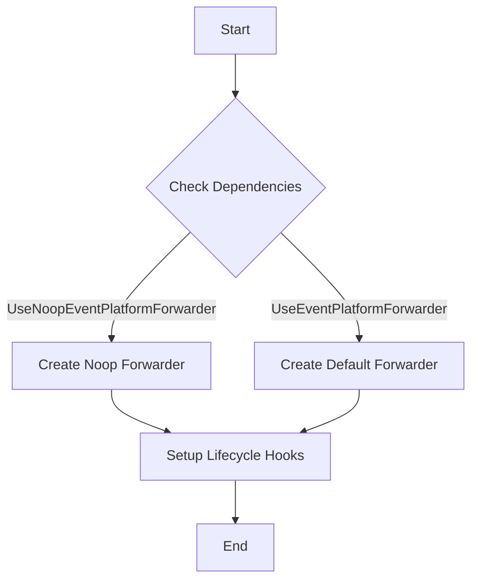

This document will cover the process of creating and initializing the Event Platform Forwarder, which includes:

1. Determining the type of forwarder to use
2. Setting up the forwarder's lifecycle hooks for starting and stopping.

Technical document: <SwmLink doc-title="Creating and Initializing the Event Platform Forwarder">[Creating and Initializing the Event Platform Forwarder](/.swm/creating-and-initializing-the-event-platform-forwarder.7fn62jcn.sw.md)</SwmLink>

# [Determining the Type of Forwarder to Use](https://app.swimm.io/repos/Z2l0aHViJTNBJTNBZGF0YWRvZy1hZ2VudCUzQSUzQVN3aW1tLURlbW8=/docs/7fn62jcn#creating-the-event-platform-forwarder)

The first step in creating and initializing the Event Platform Forwarder is to determine which type of forwarder to use. This decision is based on the provided dependencies. If the `UseNoopEventPlatformForwarder` parameter is set, a noop forwarder is created. This type of forwarder disables the forwarding functionality but keeps the structure intact. If the `UseEventPlatformForwarder` parameter is set, a default forwarder is created, which enables the forwarding functionality.

# [Setting Up the Forwarder's Lifecycle Hooks](https://app.swimm.io/repos/Z2l0aHViJTNBJTNBZGF0YWRvZy1hZ2VudCUzQSUzQVN3aW1tLURlbW8=/docs/7fn62jcn#creating-the-event-platform-forwarder)

Once the type of forwarder is determined, the next step is to set up the forwarder's lifecycle hooks. These hooks are responsible for starting and stopping the forwarder as needed. The lifecycle hooks ensure that the forwarder is properly initialized when the system starts and is gracefully shut down when the system stops. This is crucial for maintaining the stability and reliability of the event forwarding process.

# [Creating the Noop Event Platform Forwarder](https://app.swimm.io/repos/Z2l0aHViJTNBJTNBZGF0YWRvZy1hZ2VudCUzQSUzQVN3aW1tLURlbW8=/docs/7fn62jcn#creating-the-noop-event-platform-forwarder)

If the noop forwarder is chosen, it is created by initializing a default forwarder but removing the senders from its pipelines. This is done by setting the strategy to nil, which effectively disables the forwarding functionality while keeping the structure intact. This approach allows the system to maintain its architecture without actually forwarding any events.

&nbsp;

*This is an auto-generated document by Swimm AI 🌊 and has not yet been verified by a human*

<SwmMeta version="3.0.0" repo-id="Z2l0aHViJTNBJTNBZGF0YWRvZy1hZ2VudCUzQSUzQVN3aW1tLURlbW8=" repo-name="datadog-agent">Powered by [Swimm](/)</SwmMeta>
