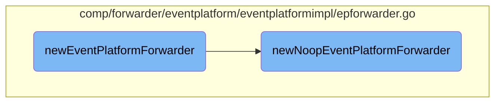

In this document, we will explain the process of creating and initializing the Event Platform Forwarder. This involves determining the type of forwarder to use based on the provided dependencies and setting up the forwarder's lifecycle hooks for starting and stopping.

The flow starts by checking the dependencies to decide whether to use a noop forwarder or a default forwarder. If the <SwmToken path="comp/forwarder/eventplatform/eventplatformimpl/epforwarder.go" pos="498:7:7" line-data="	if deps.Params.UseNoopEventPlatformForwarder {">`UseNoopEventPlatformForwarder`</SwmToken> parameter is set, a noop forwarder is created, which disables the forwarding functionality but keeps the structure intact. Otherwise, a default forwarder is created. Once the forwarder is determined, lifecycle hooks are appended to start and stop the forwarder as needed.

# Flow drill down



<SwmSnippet path="/comp/forwarder/eventplatform/eventplatformimpl/epforwarder.go" line="494">

---

## Creating the Event Platform Forwarder

The function <SwmToken path="comp/forwarder/eventplatform/eventplatformimpl/epforwarder.go" pos="494:2:2" line-data="// newEventPlatformForwarder creates a new EventPlatformForwarder">`newEventPlatformForwarder`</SwmToken> is responsible for creating a new Event Platform Forwarder. It checks the dependencies to determine whether to use a noop forwarder or a default forwarder. If the <SwmToken path="comp/forwarder/eventplatform/eventplatformimpl/epforwarder.go" pos="498:7:7" line-data="	if deps.Params.UseNoopEventPlatformForwarder {">`UseNoopEventPlatformForwarder`</SwmToken> parameter is set, it calls <SwmToken path="comp/forwarder/eventplatform/eventplatformimpl/epforwarder.go" pos="499:5:5" line-data="		forwarder = newNoopEventPlatformForwarder(deps.Hostname)">`newNoopEventPlatformForwarder`</SwmToken>. Otherwise, it calls <SwmToken path="comp/forwarder/eventplatform/eventplatformimpl/epforwarder.go" pos="501:5:5" line-data="		forwarder = newDefaultEventPlatformForwarder(deps.Config, deps.EventPlatformReceiver)">`newDefaultEventPlatformForwarder`</SwmToken>. The forwarder is then started and stopped using lifecycle hooks.

```go
// newEventPlatformForwarder creates a new EventPlatformForwarder
func newEventPlatformForwarder(deps dependencies) eventplatform.Component {
	var forwarder *defaultEventPlatformForwarder

	if deps.Params.UseNoopEventPlatformForwarder {
		forwarder = newNoopEventPlatformForwarder(deps.Hostname)
	} else if deps.Params.UseEventPlatformForwarder {
		forwarder = newDefaultEventPlatformForwarder(deps.Config, deps.EventPlatformReceiver)
	}
	if forwarder == nil {
		return optional.NewNoneOptionPtr[eventplatform.Forwarder]()
	}
	deps.Lc.Append(fx.Hook{
		OnStart: func(context.Context) error {
			forwarder.Start()
			return nil
		},
		OnStop: func(context.Context) error {
			forwarder.Stop()
			return nil
		},
```

---

</SwmSnippet>

<SwmSnippet path="/comp/forwarder/eventplatform/eventplatformimpl/epforwarder.go" line="525">

---

## Creating the Noop Event Platform Forwarder

The function <SwmToken path="comp/forwarder/eventplatform/eventplatformimpl/epforwarder.go" pos="525:2:2" line-data="func newNoopEventPlatformForwarder(hostname hostnameinterface.Component) *defaultEventPlatformForwarder {">`newNoopEventPlatformForwarder`</SwmToken> creates a noop version of the Event Platform Forwarder. It initializes a default forwarder but removes the senders from its pipelines by setting the strategy to nil. This effectively disables the forwarding functionality while keeping the structure intact.

```go
func newNoopEventPlatformForwarder(hostname hostnameinterface.Component) *defaultEventPlatformForwarder {
	f := newDefaultEventPlatformForwarder(pkgconfig.Datadog(), eventplatformreceiverimpl.NewReceiver(hostname).Comp)
	// remove the senders
	for _, p := range f.pipelines {
		p.strategy = nil
	}
	return f
}
```

---

</SwmSnippet>

&nbsp;

*This is an auto-generated document by Swimm AI 🌊 and has not yet been verified by a human*

<SwmMeta version="3.0.0" repo-id="Z2l0aHViJTNBJTNBZGF0YWRvZy1hZ2VudCUzQSUzQVN3aW1tLURlbW8=" repo-name="datadog-agent"><sup>Powered by [Swimm](/)</sup></SwmMeta>
