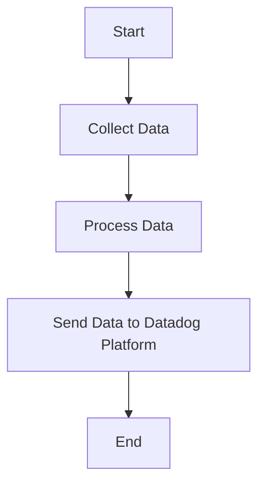

This document will cover the process of collecting and sending metrics, logs, and traces using the Datadog Agent. We'll cover:

1. Collecting Data
2. Processing Data
3. Sending Data to Datadog Platform

Technical document: <SwmLink doc-title="" repo-id="Z2l0aHViJTNBJTNBZGF0YWRvZy1hZ2VudCUzQSUzQVN3aW1tLURlbW8=" path="/.swm/.4kiah886.sw.md"></SwmLink>

# [Collecting Data](https://app.swimm.io/repos/Z2l0aHViJTNBJTNBZGF0YWRvZy1hZ2VudCUzQSUzQVN3aW1tLURlbW8=/docs/4kiah886#collecting-data)

The Datadog Agent collects metrics, logs, and traces from various sources. This involves gathering data from different systems, applications, and services that are being monitored. The goal is to have a comprehensive view of the system's performance and health. For example, metrics might include CPU usage, memory consumption, and network activity. Logs can provide detailed records of events and errors, while traces can help track the flow of requests through the system.

# [Processing Data](https://app.swimm.io/repos/Z2l0aHViJTNBJTNBZGF0YWRvZy1hZ2VudCUzQSUzQVN3aW1tLURlbW8=/docs/4kiah886#processing-data)

Once the data is collected, it needs to be processed to ensure it is in a format that can be easily analyzed. This step involves filtering, aggregating, and enriching the data. Filtering might involve removing irrelevant data, while aggregation can help summarize the data to provide a high-level overview. Enrichment can add additional context to the data, such as adding tags or metadata that can help with analysis.

# [Sending Data to Datadog Platform](https://app.swimm.io/repos/Z2l0aHViJTNBJTNBZGF0YWRvZy1hZ2VudCUzQSUzQVN3aW1tLURlbW8=/docs/4kiah886#sending-data-to-datadog-platform)

After processing, the data is sent to the Datadog platform for monitoring and analysis. This step involves securely transmitting the data over the network to Datadog's servers. Once the data is received, it can be visualized in dashboards, used to trigger alerts, and analyzed to identify trends and issues. This allows users to gain insights into their system's performance and take proactive measures to maintain its health.

&nbsp;

*This is an auto-generated document by Swimm AI 🌊 and has not yet been verified by a human*

<SwmMeta version="3.0.0" repo-id="Z2l0aHViJTNBJTNBZGF0YWRvZy1hZ2VudCUzQSUzQVN3aW1tLURlbW8=" repo-name="datadog-agent">Powered by [Swimm](/)</SwmMeta>
