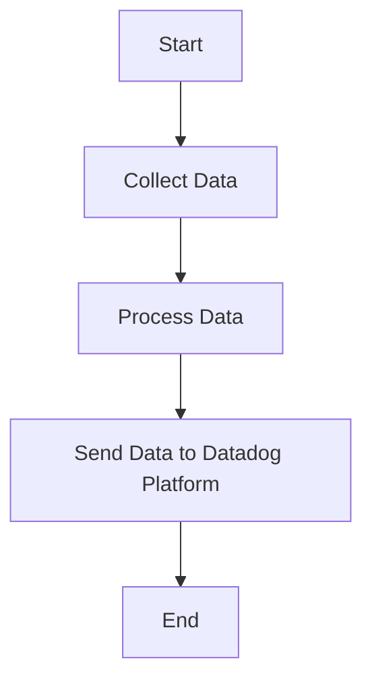

This document will cover the process of collecting and sending metrics, logs, and traces using the Datadog Agent. We'll cover:

1. Collecting Data
2. Processing Data
3. Sending Data to Datadog Platform

Technical document: <SwmLink doc-title="" repo-id="Z2l0aHViJTNBJTNBZGF0YWRvZy1hZ2VudCUzQSUzQVN3aW1tLURlbW8=" path="/.swm/.v3bfm6xg.sw.md"></SwmLink>

# [Collecting Data](https://app.swimm.io/repos/Z2l0aHViJTNBJTNBZGF0YWRvZy1hZ2VudCUzQSUzQVN3aW1tLURlbW8=/docs/v3bfm6xg#collecting-data)

The Datadog Agent collects metrics, logs, and traces from various sources. This includes system metrics, application logs, and distributed traces. The goal is to gather comprehensive data that provides insights into the performance and health of the system. For example, system metrics might include CPU usage, memory usage, and disk I/O, while application logs could capture error messages and user activity.

# [Processing Data](https://app.swimm.io/repos/Z2l0aHViJTNBJTNBZGF0YWRvZy1hZ2VudCUzQSUzQVN3aW1tLURlbW8=/docs/v3bfm6xg#processing-data)

Once the data is collected, it needs to be processed to ensure it is in a format suitable for analysis. This involves filtering out irrelevant data, aggregating metrics, and normalizing logs. For instance, filtering might remove debug logs that are not needed for monitoring, while aggregation could summarize metrics over a specific time period to reduce the volume of data.

# [Sending Data to Datadog Platform](https://app.swimm.io/repos/Z2l0aHViJTNBJTNBZGF0YWRvZy1hZ2VudCUzQSUzQVN3aW1tLURlbW8=/docs/v3bfm6xg#sending-data-to-datadog-platform)

After processing, the data is sent to the Datadog platform. This is where the data is stored, visualized, and analyzed. The platform provides dashboards, alerts, and analytics tools to help users monitor their systems and identify issues. For example, a dashboard might display real-time CPU usage across multiple servers, while alerts can notify users of high error rates in application logs.

&nbsp;

*This is an auto-generated document by Swimm AI 🌊 and has not yet been verified by a human*

<SwmMeta version="3.0.0" repo-id="Z2l0aHViJTNBJTNBZGF0YWRvZy1hZ2VudCUzQSUzQVN3aW1tLURlbW8=" repo-name="datadog-agent">Powered by [Swimm](/)</SwmMeta>
