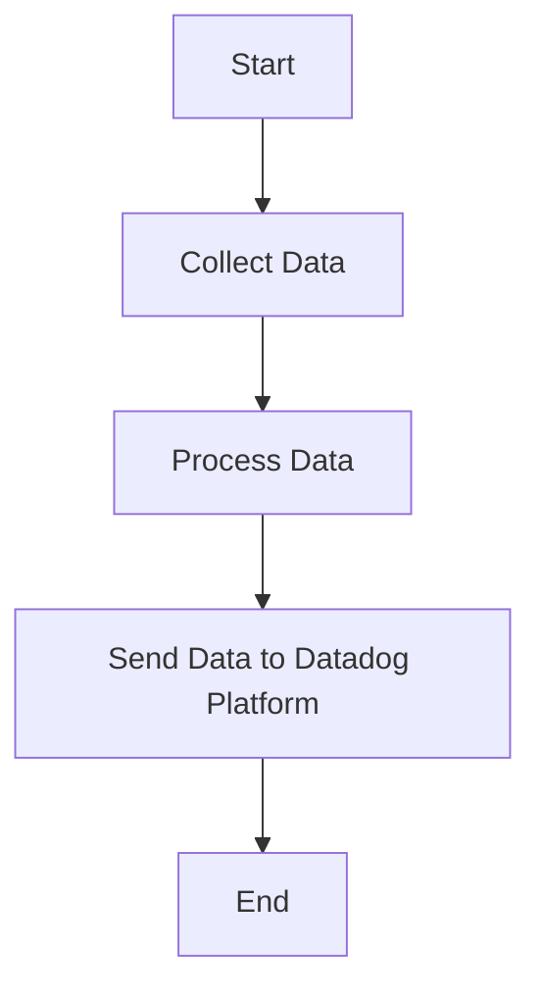

This document will cover the process of collecting and sending metrics, logs, and traces using the Datadog Agent. We'll cover:

1. Collecting Data
2. Processing Data
3. Sending Data to Datadog Platform

Technical document: <SwmLink doc-title="" repo-id="Z2l0aHViJTNBJTNBZGF0YWRvZy1hZ2VudCUzQSUzQVN3aW1tLURlbW8=" path="/.swm/.zvjcw6ds.sw.md"></SwmLink>

# [Collecting Data](https://app.swimm.io/repos/Z2l0aHViJTNBJTNBZGF0YWRvZy1hZ2VudCUzQSUzQVN3aW1tLURlbW8=/docs/zvjcw6ds#collecting-data)

The Datadog Agent collects metrics, logs, and traces from various sources. This includes system metrics, application logs, and distributed traces. The goal is to gather comprehensive data that provides insights into the performance and health of the system. For example, metrics can include CPU usage, memory consumption, and network activity, while logs can capture application errors and user activities.

# [Processing Data](https://app.swimm.io/repos/Z2l0aHViJTNBJTNBZGF0YWRvZy1hZ2VudCUzQSUzQVN3aW1tLURlbW8=/docs/zvjcw6ds#processing-data)

Once the data is collected, it needs to be processed to ensure it is in a format suitable for analysis. This involves filtering out irrelevant data, aggregating metrics, and normalizing logs and traces. The processing step is crucial for transforming raw data into meaningful information that can be used for monitoring and troubleshooting. For instance, aggregating metrics can help in identifying trends over time, while normalizing logs ensures consistency in the data format.

# [Sending Data to Datadog Platform](https://app.swimm.io/repos/Z2l0aHViJTNBJTNBZGF0YWRvZy1hZ2VudCUzQSUzQVN3aW1tLURlbW8=/docs/zvjcw6ds#sending-data-to-datadog-platform)

After processing, the data is sent to the Datadog platform for monitoring and analysis. This step involves securely transmitting the data over the network to Datadog's servers. The platform then provides various tools and dashboards for visualizing and analyzing the data. This allows users to monitor system performance, detect anomalies, and troubleshoot issues in real-time. For example, users can set up alerts to notify them of any critical issues, or use dashboards to get an overview of system health.

&nbsp;

*This is an auto-generated document by Swimm AI 🌊 and has not yet been verified by a human*

<SwmMeta version="3.0.0" repo-id="Z2l0aHViJTNBJTNBZGF0YWRvZy1hZ2VudCUzQSUzQVN3aW1tLURlbW8=" repo-name="datadog-agent">Powered by [Swimm](/)</SwmMeta>
