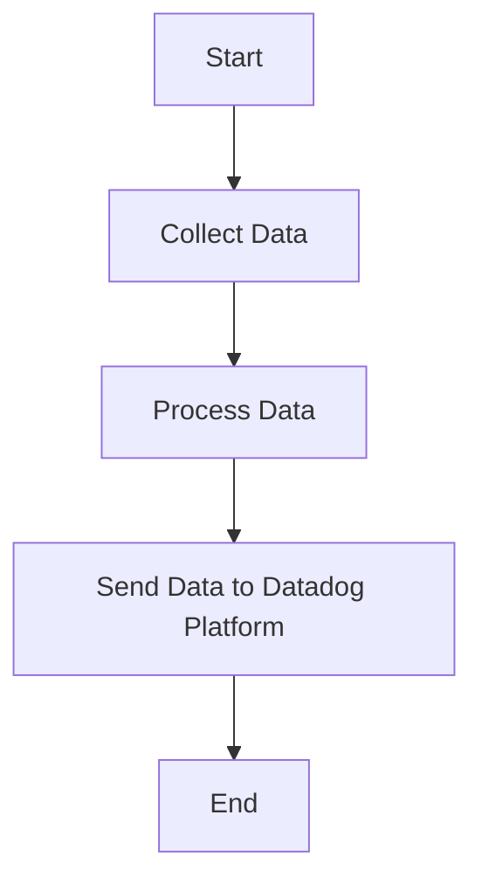

This document will cover the process of collecting and sending metrics, logs, and traces using the Datadog Agent. We'll cover:

1. Collecting Data
2. Processing Data
3. Sending Data to Datadog Platform

Technical document: <SwmLink doc-title="" repo-id="Z2l0aHViJTNBJTNBZGF0YWRvZy1hZ2VudCUzQSUzQVN3aW1tLURlbW8=" path="/.swm/.zxlve15r.sw.md"></SwmLink>

# [Collecting Data](https://app.swimm.io/repos/Z2l0aHViJTNBJTNBZGF0YWRvZy1hZ2VudCUzQSUzQVN3aW1tLURlbW8=/docs/zxlve15r#collecting-data)

The Datadog Agent collects metrics, logs, and traces from various sources. This involves gathering data from different systems, applications, and services that are being monitored. The goal is to ensure comprehensive coverage of all relevant data points for monitoring and analysis.

# [Processing Data](https://app.swimm.io/repos/Z2l0aHViJTNBJTNBZGF0YWRvZy1hZ2VudCUzQSUzQVN3aW1tLURlbW8=/docs/zxlve15r#processing-data)

Once the data is collected, it needs to be processed to ensure it is in a suitable format for analysis. This step involves filtering, aggregating, and enriching the data. For example, logs might be parsed to extract relevant information, and metrics might be aggregated to provide a summary view.

# [Sending Data to Datadog Platform](https://app.swimm.io/repos/Z2l0aHViJTNBJTNBZGF0YWRvZy1hZ2VudCUzQSUzQVN3aW1tLURlbW8=/docs/zxlve15r#sending-data-to-datadog-platform)

After processing, the data is sent to the Datadog platform. This step involves transmitting the data securely and efficiently to ensure it is available for real-time monitoring and analysis. The Datadog platform then provides various tools and dashboards to visualize and analyze the data.

&nbsp;

*This is an auto-generated document by Swimm AI 🌊 and has not yet been verified by a human*

<SwmMeta version="3.0.0" repo-id="Z2l0aHViJTNBJTNBZGF0YWRvZy1hZ2VudCUzQSUzQVN3aW1tLURlbW8=" repo-name="datadog-agent">Powered by [Swimm](/)</SwmMeta>
