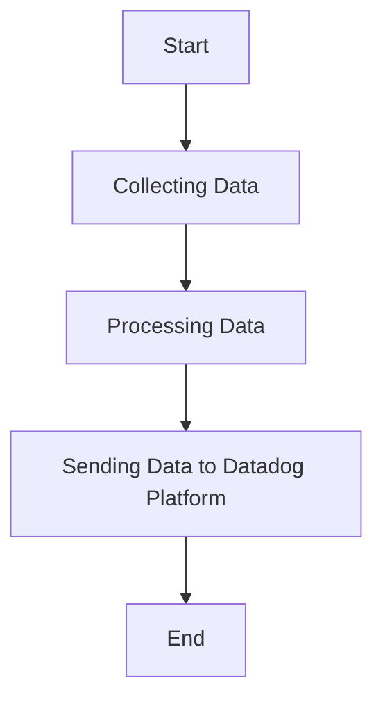

This document will cover the process of collecting and sending metrics, logs, and traces using the Datadog Agent. We'll cover:

1. Collecting Data
2. Processing Data
3. Sending Data to Datadog Platform

Technical document: <SwmLink doc-title="" repo-id="Z2l0aHViJTNBJTNBZGF0YWRvZy1hZ2VudCUzQSUzQVN3aW1tLURlbW8=" path="/.swm/.6veuuj6g.sw.md"></SwmLink>

# [Collecting Data](https://app.swimm.io/repos/Z2l0aHViJTNBJTNBZGF0YWRvZy1hZ2VudCUzQSUzQVN3aW1tLURlbW8=/docs/6veuuj6g#collecting-data)

The Datadog Agent collects metrics, logs, and traces from various sources. This includes system metrics, application logs, and distributed traces. The goal is to gather comprehensive data that provides insights into the performance and health of the infrastructure and applications. This data collection is continuous and happens in real-time, ensuring that the most up-to-date information is available for analysis.

# [Processing Data](https://app.swimm.io/repos/Z2l0aHViJTNBJTNBZGF0YWRvZy1hZ2VudCUzQSUzQVN3aW1tLURlbW8=/docs/6veuuj6g#processing-data)

Once the data is collected, it needs to be processed before it can be sent to the Datadog platform. Processing involves filtering, aggregating, and enriching the data to make it more useful and relevant. For example, logs might be parsed to extract key information, metrics might be aggregated to reduce volume, and traces might be enriched with additional context. This step ensures that only the most valuable data is sent to the Datadog platform, optimizing both performance and cost.

# [Sending Data to Datadog Platform](https://app.swimm.io/repos/Z2l0aHViJTNBJTNBZGF0YWRvZy1hZ2VudCUzQSUzQVN3aW1tLURlbW8=/docs/6veuuj6g#sending-data-to-datadog-platform)

After processing, the data is sent to the Datadog platform for storage, visualization, and analysis. This involves securely transmitting the data over the network, ensuring that it arrives intact and without delay. The Datadog platform then provides various tools and dashboards for users to monitor their systems, set up alerts, and gain insights from the collected data. This step is crucial for enabling real-time monitoring and proactive issue resolution.

&nbsp;

*This is an auto-generated document by Swimm AI 🌊 and has not yet been verified by a human*

<SwmMeta version="3.0.0" repo-id="Z2l0aHViJTNBJTNBZGF0YWRvZy1hZ2VudCUzQSUzQVN3aW1tLURlbW8=" repo-name="datadog-agent">Powered by [Swimm](/)</SwmMeta>
