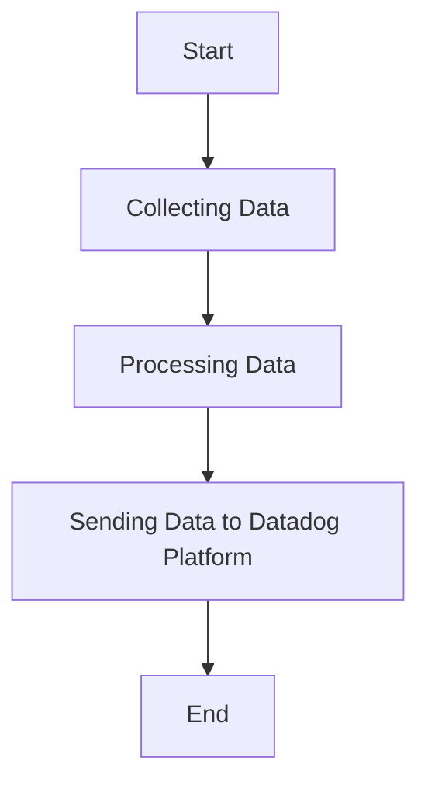

This document will cover the process of collecting and sending metrics, logs, and traces using the Datadog Agent. We'll cover:

1. Collecting Data
2. Processing Data
3. Sending Data to Datadog Platform

Technical document: <SwmLink doc-title="" repo-id="Z2l0aHViJTNBJTNBZGF0YWRvZy1hZ2VudCUzQSUzQVN3aW1tLURlbW8=" path="/.swm/.tewd9d0b.sw.md"></SwmLink>

# [Collecting Data](https://app.swimm.io/repos/Z2l0aHViJTNBJTNBZGF0YWRvZy1hZ2VudCUzQSUzQVN3aW1tLURlbW8=/docs/tewd9d0b#collecting-data)

The Datadog Agent collects metrics, logs, and traces from various sources. This involves gathering data from different systems, applications, and services that are being monitored. The goal is to ensure comprehensive coverage of all relevant data points to provide a holistic view of the system's performance and health.

# [Processing Data](https://app.swimm.io/repos/Z2l0aHViJTNBJTNBZGF0YWRvZy1hZ2VudCUzQSUzQVN3aW1tLURlbW8=/docs/tewd9d0b#processing-data)

Once the data is collected, it needs to be processed to ensure it is in a format suitable for analysis. This step involves filtering, aggregating, and transforming the raw data into meaningful metrics and logs. The processing ensures that only relevant and actionable data is sent to the Datadog platform, reducing noise and improving the quality of insights.

# [Sending Data to Datadog Platform](https://app.swimm.io/repos/Z2l0aHViJTNBJTNBZGF0YWRvZy1hZ2VudCUzQSUzQVN3aW1tLURlbW8=/docs/tewd9d0b#sending-data-to-datadog-platform)

After processing, the data is sent to the Datadog platform. This involves securely transmitting the metrics, logs, and traces to Datadog's servers where they can be stored, analyzed, and visualized. The goal is to provide real-time monitoring and alerting capabilities, enabling users to quickly identify and respond to issues.

&nbsp;

*This is an auto-generated document by Swimm AI 🌊 and has not yet been verified by a human*

<SwmMeta version="3.0.0" repo-id="Z2l0aHViJTNBJTNBZGF0YWRvZy1hZ2VudCUzQSUzQVN3aW1tLURlbW8=" repo-name="datadog-agent">Powered by [Swimm](/)</SwmMeta>
