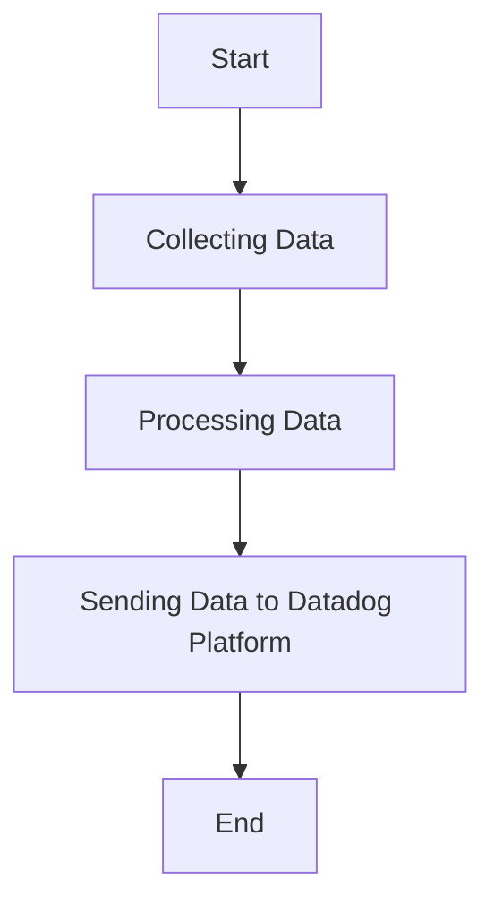

This document will cover the process of collecting and sending metrics, logs, and traces using the Datadog Agent. We'll cover:

1. Collecting Data
2. Processing Data
3. Sending Data to Datadog Platform

Technical document: <SwmLink doc-title="" repo-id="Z2l0aHViJTNBJTNBZGF0YWRvZy1hZ2VudCUzQSUzQVN3aW1tLURlbW8=" path="/.swm/.8mqtt331.sw.md"></SwmLink>

# [Collecting Data](https://app.swimm.io/repos/Z2l0aHViJTNBJTNBZGF0YWRvZy1hZ2VudCUzQSUzQVN3aW1tLURlbW8=/docs/8mqtt331#data-collection)

The Datadog Agent collects metrics, logs, and traces from various sources. This involves gathering data from different systems, applications, and services that are being monitored. The goal is to ensure comprehensive coverage of all relevant data points for monitoring and analysis. For example, the agent might collect CPU usage metrics from a server, error logs from an application, and trace data from a distributed system.

# [Processing Data](https://app.swimm.io/repos/Z2l0aHViJTNBJTNBZGF0YWRvZy1hZ2VudCUzQSUzQVN3aW1tLURlbW8=/docs/8mqtt331#data-processing)

Once the data is collected, it needs to be processed to ensure it is in a format suitable for analysis. This involves filtering out irrelevant data, aggregating data points, and transforming the data into a standardized format. For instance, logs might be parsed to extract key information, metrics might be averaged over a specific time period, and traces might be correlated to provide a complete picture of a transaction.

# [Sending Data to Datadog Platform](https://app.swimm.io/repos/Z2l0aHViJTNBJTNBZGF0YWRvZy1hZ2VudCUzQSUzQVN3aW1tLURlbW8=/docs/8mqtt331#data-transmission)

After processing, the data is sent to the Datadog platform for monitoring and analysis. This step involves securely transmitting the data over the network to Datadog's servers. The data is then stored and made available for visualization, alerting, and further analysis. For example, metrics can be displayed on dashboards, logs can be searched and filtered, and traces can be analyzed to identify performance bottlenecks.

&nbsp;

*This is an auto-generated document by Swimm AI 🌊 and has not yet been verified by a human*

<SwmMeta version="3.0.0" repo-id="Z2l0aHViJTNBJTNBZGF0YWRvZy1hZ2VudCUzQSUzQVN3aW1tLURlbW8=" repo-name="datadog-agent">Powered by [Swimm](/)</SwmMeta>
