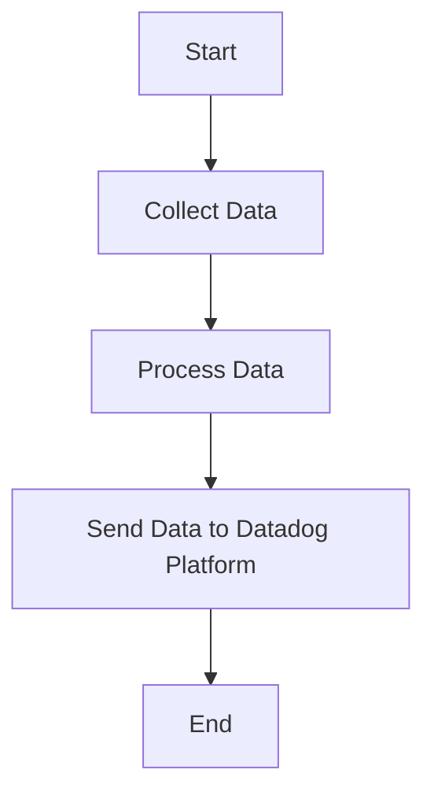

This document will cover the process of collecting and sending metrics, logs, and traces using the Datadog Agent. We'll cover:

1. Collecting Data
2. Processing Data
3. Sending Data to Datadog Platform

Technical document: <SwmLink doc-title="" repo-id="Z2l0aHViJTNBJTNBZGF0YWRvZy1hZ2VudCUzQSUzQVN3aW1tLURlbW8=" path="/.swm/.88ejkas6.sw.md"></SwmLink>

# [Collecting Data](https://app.swimm.io/repos/Z2l0aHViJTNBJTNBZGF0YWRvZy1hZ2VudCUzQSUzQVN3aW1tLURlbW8=/docs/88ejkas6#collecting-data)

The Datadog Agent collects metrics, logs, and traces from various sources. This involves gathering data from different systems, applications, and services that are being monitored. The goal is to ensure comprehensive coverage of all relevant data points for monitoring and analysis. For example, the agent might collect CPU usage metrics from a server, error logs from an application, or trace data from a microservice.

# [Processing Data](https://app.swimm.io/repos/Z2l0aHViJTNBJTNBZGF0YWRvZy1hZ2VudCUzQSUzQVN3aW1tLURlbW8=/docs/88ejkas6#processing-data)

Once the data is collected, it needs to be processed to ensure it is in a format suitable for analysis. This step involves filtering, aggregating, and enriching the data. For instance, logs might be parsed to extract key information, metrics might be aggregated over time intervals, and traces might be enriched with additional context. The purpose of processing is to transform raw data into meaningful insights that can be used for monitoring and troubleshooting.

# [Sending Data to Datadog Platform](https://app.swimm.io/repos/Z2l0aHViJTNBJTNBZGF0YWRvZy1hZ2VudCUzQSUzQVN3aW1tLURlbW8=/docs/88ejkas6#sending-data-to-datadog-platform)

After processing, the data is sent to the Datadog platform for storage, visualization, and analysis. This step involves securely transmitting the data over the network to Datadog's servers. The data is then stored in Datadog's backend systems, where it can be accessed through the Datadog web interface. Users can create dashboards, set up alerts, and perform detailed analysis on the collected data. The goal is to provide users with real-time visibility into their systems and applications.

&nbsp;

*This is an auto-generated document by Swimm AI 🌊 and has not yet been verified by a human*

<SwmMeta version="3.0.0" repo-id="Z2l0aHViJTNBJTNBZGF0YWRvZy1hZ2VudCUzQSUzQVN3aW1tLURlbW8=" repo-name="datadog-agent">Powered by [Swimm](/)</SwmMeta>
