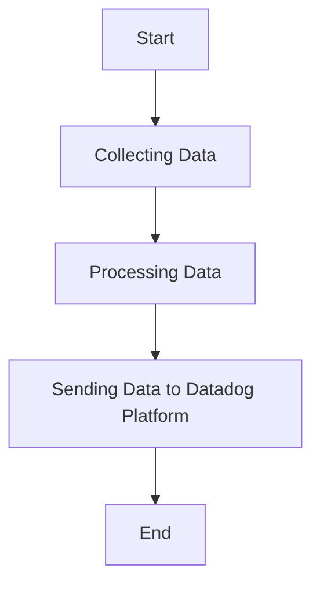

This document will cover the process of collecting and sending metrics, logs, and traces using the Datadog Agent. We'll cover:

1. Collecting Data
2. Processing Data
3. Sending Data to Datadog Platform

Technical document: <SwmLink doc-title="" repo-id="Z2l0aHViJTNBJTNBZGF0YWRvZy1hZ2VudCUzQSUzQVN3aW1tLURlbW8=" path="/.swm/.2792kwjf.sw.md"></SwmLink>

# [Collecting Data](https://app.swimm.io/repos/Z2l0aHViJTNBJTNBZGF0YWRvZy1hZ2VudCUzQSUzQVN3aW1tLURlbW8=/docs/2792kwjf#collecting-data)

The Datadog Agent collects metrics, logs, and traces from various sources. This includes system metrics, application logs, and distributed traces. The purpose of this step is to gather all relevant data that will be used for monitoring and analysis. The data is collected in real-time to ensure that the monitoring is up-to-date and accurate.

# [Processing Data](https://app.swimm.io/repos/Z2l0aHViJTNBJTNBZGF0YWRvZy1hZ2VudCUzQSUzQVN3aW1tLURlbW8=/docs/2792kwjf#processing-data)

Once the data is collected, it needs to be processed before it can be sent to the Datadog platform. Processing involves filtering, aggregating, and enriching the data. Filtering removes any irrelevant or redundant data. Aggregating combines data points to provide a summarized view. Enriching adds additional context to the data, such as metadata or tags, to make it more useful for analysis.

# [Sending Data to Datadog Platform](https://app.swimm.io/repos/Z2l0aHViJTNBJTNBZGF0YWRvZy1hZ2VudCUzQSUzQVN3aW1tLURlbW8=/docs/2792kwjf#sending-data-to-datadog-platform)

After processing, the data is sent to the Datadog platform. This step involves securely transmitting the data over the network. The Datadog platform then stores the data and makes it available for visualization, alerting, and further analysis. This allows users to monitor their systems in real-time, set up alerts for specific conditions, and analyze historical data to identify trends and issues.

&nbsp;

*This is an auto-generated document by Swimm AI 🌊 and has not yet been verified by a human*

<SwmMeta version="3.0.0" repo-id="Z2l0aHViJTNBJTNBZGF0YWRvZy1hZ2VudCUzQSUzQVN3aW1tLURlbW8=" repo-name="datadog-agent">Powered by [Swimm](/)</SwmMeta>
