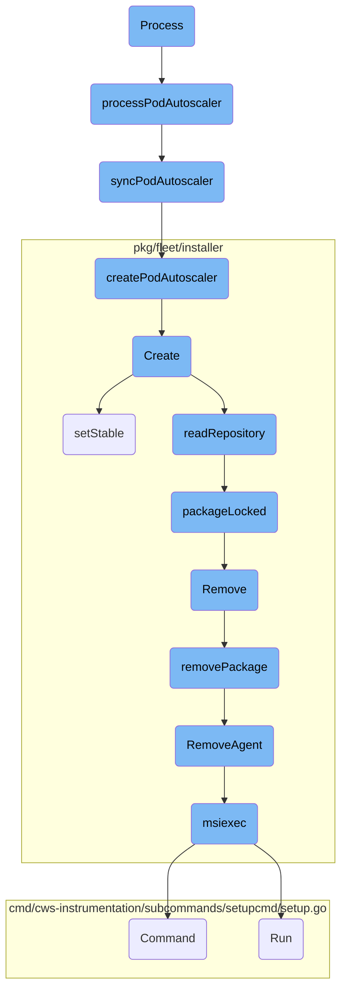
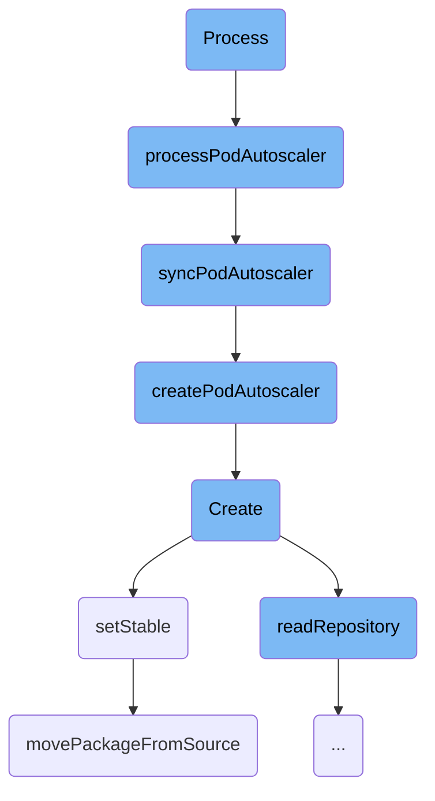

This document outlines the process flow for managing <SwmToken path="pkg/clusteragent/autoscaling/workload/controller.go" pos="98:12:12" line-data="		log.Errorf(&quot;Impossible to synchronize DatadogPodAutoscaler (attempt #%d): %s, err: %v&quot;, numRequeues, key, err)">`DatadogPodAutoscaler`</SwmToken> objects. It covers the main steps involved in synchronizing, creating, and removing these objects within the system.

The process starts with retrieving the <SwmToken path="pkg/clusteragent/autoscaling/workload/controller.go" pos="98:12:12" line-data="		log.Errorf(&quot;Impossible to synchronize DatadogPodAutoscaler (attempt #%d): %s, err: %v&quot;, numRequeues, key, err)">`DatadogPodAutoscaler`</SwmToken> object from the cache. If the object is found, it checks whether the controller is the leader. If it is, the system synchronizes the object with the internal store and Kubernetes. If the object is not found, it may be created later. The synchronization ensures that the state of the <SwmToken path="pkg/clusteragent/autoscaling/workload/controller.go" pos="98:12:12" line-data="		log.Errorf(&quot;Impossible to synchronize DatadogPodAutoscaler (attempt #%d): %s, err: %v&quot;, numRequeues, key, err)">`DatadogPodAutoscaler`</SwmToken> is consistent between the internal store and Kubernetes. If the object needs to be created, it is done based on the internal representation. The process also includes steps for removing the Datadog Agent, which involves stopping and uninstalling the agent using the <SwmToken path="pkg/fleet/installer/service/datadog_agent_windows.go" pos="22:2:2" line-data="func msiexec(target, operation string, args []string) (err error) {">`msiexec`</SwmToken> command.

Here is a high level diagram of the flow, showing only the most important functions:



# Flow drill down

First, we'll zoom into this section of the flow:



<SwmSnippet path="/pkg/clusteragent/autoscaling/workload/controller.go" line="93">

---

## Process

The <SwmToken path="pkg/clusteragent/autoscaling/workload/controller.go" pos="93:2:2" line-data="// Process implements the Processor interface (so required to be public)">`Process`</SwmToken> function is the entry point that implements the Processor interface. It calls <SwmToken path="pkg/clusteragent/autoscaling/workload/controller.go" pos="95:10:10" line-data="	res, err := c.processPodAutoscaler(ctx, key, ns, name)">`processPodAutoscaler`</SwmToken> to handle the synchronization of the <SwmToken path="pkg/clusteragent/autoscaling/workload/controller.go" pos="98:12:12" line-data="		log.Errorf(&quot;Impossible to synchronize DatadogPodAutoscaler (attempt #%d): %s, err: %v&quot;, numRequeues, key, err)">`DatadogPodAutoscaler`</SwmToken> and manages error handling and retries.

```go
// Process implements the Processor interface (so required to be public)
func (c *Controller) Process(ctx context.Context, key, ns, name string) autoscaling.ProcessResult {
	res, err := c.processPodAutoscaler(ctx, key, ns, name)
	if err != nil {
		numRequeues := c.Workqueue.NumRequeues(key)
		log.Errorf("Impossible to synchronize DatadogPodAutoscaler (attempt #%d): %s, err: %v", numRequeues, key, err)

		if numRequeues >= maxRetry {
			log.Infof("Max retries reached for DatadogPodAutoscaler: %s, removing from queue", key)
			res = autoscaling.NoRequeue
		}
	}

	log.Debugf("Processed DatadogPodAutoscaler: %s, result: %+v", key, res)
	return res
```

---

</SwmSnippet>

<SwmSnippet path="/pkg/clusteragent/autoscaling/workload/controller.go" line="110">

---

## <SwmToken path="pkg/clusteragent/autoscaling/workload/controller.go" pos="110:9:9" line-data="func (c *Controller) processPodAutoscaler(ctx context.Context, key, ns, name string) (autoscaling.ProcessResult, error) {">`processPodAutoscaler`</SwmToken>

The <SwmToken path="pkg/clusteragent/autoscaling/workload/controller.go" pos="110:9:9" line-data="func (c *Controller) processPodAutoscaler(ctx context.Context, key, ns, name string) (autoscaling.ProcessResult, error) {">`processPodAutoscaler`</SwmToken> function retrieves the <SwmToken path="pkg/clusteragent/autoscaling/workload/controller.go" pos="111:8:8" line-data="	podAutoscaler := &amp;datadoghq.DatadogPodAutoscaler{}">`DatadogPodAutoscaler`</SwmToken> object from the cache and decides whether to synchronize it or update the local store based on the leadership status of the controller.

```go
func (c *Controller) processPodAutoscaler(ctx context.Context, key, ns, name string) (autoscaling.ProcessResult, error) {
	podAutoscaler := &datadoghq.DatadogPodAutoscaler{}
	podAutoscalerCachedObj, err := c.Lister.ByNamespace(ns).Get(name)
	if err == nil {
		err = autoscaling.FromUnstructured(podAutoscalerCachedObj, podAutoscaler)
	}

	switch {
	case errors.IsNotFound(err):
		// We ignore not found here as we may need to create a DatadogPodAutoscaler later
		podAutoscaler = nil
	case err != nil:
		return autoscaling.Requeue, fmt.Errorf("Unable to retrieve DatadogPodAutoscaler: %w", err)
	case podAutoscalerCachedObj == nil:
		return autoscaling.Requeue, fmt.Errorf("Could not parse empty DatadogPodAutoscaler from local cache")
	}

	// No error path, check what to do with this event
	if c.IsLeader() {
		return c.syncPodAutoscaler(ctx, key, ns, name, podAutoscaler)
	}
```

---

</SwmSnippet>

<SwmSnippet path="/pkg/clusteragent/autoscaling/workload/controller.go" line="144">

---

## <SwmToken path="pkg/clusteragent/autoscaling/workload/controller.go" pos="147:9:9" line-data="func (c *Controller) syncPodAutoscaler(ctx context.Context, key, ns, name string, podAutoscaler *datadoghq.DatadogPodAutoscaler) (autoscaling.ProcessResult, error) {">`syncPodAutoscaler`</SwmToken>

The <SwmToken path="pkg/clusteragent/autoscaling/workload/controller.go" pos="147:9:9" line-data="func (c *Controller) syncPodAutoscaler(ctx context.Context, key, ns, name string, podAutoscaler *datadoghq.DatadogPodAutoscaler) (autoscaling.ProcessResult, error) {">`syncPodAutoscaler`</SwmToken> function ensures the state of the <SwmToken path="pkg/clusteragent/autoscaling/workload/controller.go" pos="144:4:4" line-data="// Synchronize DatadogPodAutoscaler state between internal store and Kubernetes objects">`DatadogPodAutoscaler`</SwmToken> is consistent between the internal store and Kubernetes. It handles creation, deletion, and updates based on ownership and synchronization logic.

```go
// Synchronize DatadogPodAutoscaler state between internal store and Kubernetes objects
// Make sure any `return` has the proper store Unlock
// podAutoscaler is read-only, any changes require a DeepCopy
func (c *Controller) syncPodAutoscaler(ctx context.Context, key, ns, name string, podAutoscaler *datadoghq.DatadogPodAutoscaler) (autoscaling.ProcessResult, error) {
	podAutoscalerInternal, podAutoscalerInternalFound := c.store.LockRead(key, true)

	// Object is missing from our store
	if !podAutoscalerInternalFound {
		if podAutoscaler != nil {
			// If we don't have an instance locally, we create it. Deletion is handled through setting the `Deleted` flag
			log.Debugf("Creating internal PodAutoscaler: %s from Kubernetes object", key)
			c.store.UnlockSet(key, model.NewPodAutoscalerInternal(podAutoscaler), c.ID)
		} else {
			// If podAutoscaler == nil, both objects are nil, nothing to do
			log.Debugf("Reconciling object: %s but object is not present in Kubernetes nor in internal store, nothing to do", key)
			c.store.Unlock(key)
		}

		return autoscaling.NoRequeue, nil
	}

```

---

</SwmSnippet>

<SwmSnippet path="/pkg/clusteragent/autoscaling/workload/controller.go" line="287">

---

## <SwmToken path="pkg/clusteragent/autoscaling/workload/controller.go" pos="287:9:9" line-data="func (c *Controller) createPodAutoscaler(ctx context.Context, podAutoscalerInternal model.PodAutoscalerInternal) error {">`createPodAutoscaler`</SwmToken>

The <SwmToken path="pkg/clusteragent/autoscaling/workload/controller.go" pos="287:9:9" line-data="func (c *Controller) createPodAutoscaler(ctx context.Context, podAutoscalerInternal model.PodAutoscalerInternal) error {">`createPodAutoscaler`</SwmToken> function creates a new <SwmToken path="pkg/clusteragent/autoscaling/workload/controller.go" pos="289:8:8" line-data="	autoscalerObj := &amp;datadoghq.DatadogPodAutoscaler{">`DatadogPodAutoscaler`</SwmToken> object in Kubernetes based on the internal representation.

```go
func (c *Controller) createPodAutoscaler(ctx context.Context, podAutoscalerInternal model.PodAutoscalerInternal) error {
	log.Infof("Creating PodAutoscaler Spec: %s/%s", podAutoscalerInternal.Namespace(), podAutoscalerInternal.Name())
	autoscalerObj := &datadoghq.DatadogPodAutoscaler{
		TypeMeta: podAutoscalerMeta,
		ObjectMeta: metav1.ObjectMeta{
			Namespace: podAutoscalerInternal.Namespace(),
			Name:      podAutoscalerInternal.Name(),
		},
		Spec:   *podAutoscalerInternal.Spec().DeepCopy(),
		Status: podAutoscalerInternal.BuildStatus(metav1.NewTime(c.clock.Now()), nil),
	}

	obj, err := autoscaling.ToUnstructured(autoscalerObj)
	if err != nil {
		return err
	}

	_, err = c.Client.Resource(podAutoscalerGVR).Namespace(podAutoscalerInternal.Namespace()).Create(ctx, obj, metav1.CreateOptions{})
	if err != nil {
		return fmt.Errorf("Unable to create PodAutoscaler: %s/%s, err: %v", podAutoscalerInternal.Namespace(), podAutoscalerInternal.Name(), err)
	}
```

---

</SwmSnippet>

<SwmSnippet path="/pkg/fleet/installer/repository/repository.go" line="106">

---

## Create

The <SwmToken path="pkg/fleet/installer/repository/repository.go" pos="106:2:2" line-data="// Create creates a fresh new repository at the given root path">`Create`</SwmToken> function initializes a new repository, removes any existing repository, and sets up the stable source path. It ensures the repository is clean and ready for use.

```go
// Create creates a fresh new repository at the given root path
// and moves the given stable source path to the repository as the first stable.
// If a repository already exists at the given path, it is fully removed.
//
// 1. Remove the previous repository if it exists.
// 2. Create the root directory.
// 3. Move the stable source to the repository.
// 4. Create the stable link.
func (r *Repository) Create(ctx context.Context, name string, stableSourcePath string) error {
	err := os.MkdirAll(r.rootPath, 0755)
	if err != nil {
		return fmt.Errorf("could not create packages root directory: %w", err)
	}

	repository, err := readRepository(r.rootPath, r.locksPath)
	if err != nil {
		return err
	}

	// Remove symlinks as we are bootstrapping
	if repository.experiment.Exists() {
```

---

</SwmSnippet>

<SwmSnippet path="/pkg/fleet/installer/repository/repository.go" line="335">

---

## <SwmToken path="pkg/fleet/installer/repository/repository.go" pos="335:9:9" line-data="func (r *repositoryFiles) setStable(ctx context.Context, name string, sourcePath string) error {">`setStable`</SwmToken>

The <SwmToken path="pkg/fleet/installer/repository/repository.go" pos="335:9:9" line-data="func (r *repositoryFiles) setStable(ctx context.Context, name string, sourcePath string) error {">`setStable`</SwmToken> function sets the stable version of the repository by moving the package from the source path to the repository.

```go
func (r *repositoryFiles) setStable(ctx context.Context, name string, sourcePath string) error {
	path, err := movePackageFromSource(ctx, name, r.rootPath, r.lockedPackages, sourcePath)
	if err != nil {
		return fmt.Errorf("could not move stable source: %w", err)
	}

	return r.stable.Set(path)
}
```

---

</SwmSnippet>

<SwmSnippet path="/pkg/fleet/installer/repository/repository.go" line="344">

---

## <SwmToken path="pkg/fleet/installer/repository/repository.go" pos="344:2:2" line-data="func movePackageFromSource(ctx context.Context, packageName string, rootPath string, lockedPackages map[string]bool, sourcePath string) (string, error) {">`movePackageFromSource`</SwmToken>

The <SwmToken path="pkg/fleet/installer/repository/repository.go" pos="344:2:2" line-data="func movePackageFromSource(ctx context.Context, packageName string, rootPath string, lockedPackages map[string]bool, sourcePath string) (string, error) {">`movePackageFromSource`</SwmToken> function handles moving a package from the source path to the target path within the repository. It ensures the package is correctly placed and permissions are set.

```go
func movePackageFromSource(ctx context.Context, packageName string, rootPath string, lockedPackages map[string]bool, sourcePath string) (string, error) {
	if packageName == "" || packageName == stableVersionLink || packageName == experimentVersionLink {
		return "", fmt.Errorf("invalid package name")
	}
	targetPath := filepath.Join(rootPath, packageName)
	_, err := os.Stat(targetPath)
	if err == nil {
		// Check if we have long running processes using the package
		// If yes, the GC left the package in place so we don't reinstall it, but
		// we don't throw an error either.
		// If not, the GC should have removed the packages so we error.
		if lockedPackages[packageName] {
			return targetPath, nil
		}
		return "", fmt.Errorf("target package already exists")
	}
	if !errors.Is(err, os.ErrNotExist) {
		return "", fmt.Errorf("could not stat target package: %w", err)
	}
	err = os.Rename(sourcePath, targetPath)
	if err != nil {
```

---

</SwmSnippet>

Now, lets zoom into this section of the flow:

```mermaid
graph TD;
      subgraph pkgfleetinstaller["pkg/fleet/installer"]
eb56d3090d5c57f23655cb597dd7b49ad34d4d95457bec8c9d13567198fdc83e(readRepository):::mainFlowStyle --> 7b4035da1195bacf6a000030152a442512f389697ba991b6fe6352bcfb68e5e5(packageLocked):::mainFlowStyle
end

subgraph pkgfleetinstaller["pkg/fleet/installer"]
7b4035da1195bacf6a000030152a442512f389697ba991b6fe6352bcfb68e5e5(packageLocked):::mainFlowStyle --> 7fbb58517ec097dc37470fb4845579cd7182bd487baf3e56c5ca190d90e2080e(Remove):::mainFlowStyle
end

subgraph pkgfleetinstaller["pkg/fleet/installer"]
7fbb58517ec097dc37470fb4845579cd7182bd487baf3e56c5ca190d90e2080e(Remove):::mainFlowStyle --> 8e5b96d5def6b4828b93afeeed0824d4f02b13bf2c025999fe6e1cc33a3866fe(removePackage):::mainFlowStyle
end

subgraph pkgfleetinstaller["pkg/fleet/installer"]
8e5b96d5def6b4828b93afeeed0824d4f02b13bf2c025999fe6e1cc33a3866fe(removePackage):::mainFlowStyle --> 1de0a20ea00165057c2db1a2c486e6dcb264138c2c0f3f09bcd76f6fd2944e57(RemoveAgent):::mainFlowStyle
end

subgraph pkgfleetinstaller["pkg/fleet/installer"]
1de0a20ea00165057c2db1a2c486e6dcb264138c2c0f3f09bcd76f6fd2944e57(RemoveAgent):::mainFlowStyle --> fd8cbc045e91480e68043703d6a74fab7970ba5ebdbef1878184acba0c1c9b9c(msiexec):::mainFlowStyle
end


      classDef mainFlowStyle color:#000000,fill:#7CB9F4
classDef rootsStyle color:#000000,fill:#00FFF4
classDef Style1 color:#000000,fill:#00FFAA
classDef Style2 color:#000000,fill:#FFFF00
classDef Style3 color:#000000,fill:#AA7CB9
```



<SwmSnippet path="/pkg/fleet/installer/repository/repository.go" line="288">

---

## Reading Repository

The <SwmToken path="pkg/fleet/installer/repository/repository.go" pos="288:2:2" line-data="func readRepository(rootPath string, locksPath string) (*repositoryFiles, error) {">`readRepository`</SwmToken> function is responsible for reading the repository's root directory and identifying the stable and experimental links. It also lists all the packages in the root directory and checks if they are locked by calling the <SwmToken path="pkg/fleet/installer/repository/repository.go" pos="413:2:2" line-data="// packageLocked checks if the given package version is in use">`packageLocked`</SwmToken> function. This function returns a <SwmToken path="pkg/fleet/installer/repository/repository.go" pos="288:16:16" line-data="func readRepository(rootPath string, locksPath string) (*repositoryFiles, error) {">`repositoryFiles`</SwmToken> struct containing the repository's paths and the locked status of each package.

```go
func readRepository(rootPath string, locksPath string) (*repositoryFiles, error) {
	stableLink, err := newLink(filepath.Join(rootPath, stableVersionLink))
	if err != nil {
		return nil, fmt.Errorf("could not load stable link: %w", err)
	}
	experimentLink, err := newLink(filepath.Join(rootPath, experimentVersionLink))
	if err != nil {
		return nil, fmt.Errorf("could not load experiment link: %w", err)
	}

	// List locked packages
	packages, err := os.ReadDir(rootPath)
	if errors.Is(err, os.ErrNotExist) {
		return nil, errRepositoryNotCreated
	}
	if err != nil {
		return nil, fmt.Errorf("could not read root directory: %w", err)
	}
	lockedPackages := map[string]bool{}
	for _, pkg := range packages {
		pkgLocksPath := filepath.Join(locksPath, pkg.Name())
```

---

</SwmSnippet>

<SwmSnippet path="/pkg/fleet/installer/repository/repository.go" line="413">

---

## Checking Package Locks

The <SwmToken path="pkg/fleet/installer/repository/repository.go" pos="413:2:2" line-data="// packageLocked checks if the given package version is in use">`packageLocked`</SwmToken> function checks if a given package version is currently in use by looking for process <SwmToken path="tasks/gitlab_helpers.py" pos="90:10:10" line-data="def print_gitlab_object(get_object, ctx, ids, repo=&#39;DataDog/datadog-agent&#39;, jq: str | None = None, jq_colors=True):">`ids`</SwmToken> (PIDs) in the package's locks directory. It iterates over the <SwmToken path="pkg/fleet/installer/repository/repository.go" pos="414:12:12" line-data="// by checking if there are PIDs corresponding to running processes">`PIDs`</SwmToken>, verifies if the processes are running, and removes the PID files for stopped processes. This function helps determine if a package can be safely removed or if it is still in use.

```go
// packageLocked checks if the given package version is in use
// by checking if there are PIDs corresponding to running processes
// in the locks directory.
func packageLocked(packagePIDsPath string) (bool, error) {
	pids, err := os.ReadDir(packagePIDsPath)
	if errors.Is(err, os.ErrNotExist) {
		log.Debugf("package locks directory does not exist, no running PIDs")
		return false, nil
	}
	if err != nil {
		return false, fmt.Errorf("could not read locks directory: %w", err)
	}

	// For each PID, check if it's running
	for _, rawPID := range pids {
		pid, err := strconv.ParseInt(rawPID.Name(), 10, 64)
		if err != nil {
			log.Errorf("could not parse PID: %v", err)
			continue
		}

```

---

</SwmSnippet>

<SwmSnippet path="/pkg/fleet/installer/installer.go" line="297">

---

## Removing a Package

The <SwmToken path="pkg/fleet/installer/installer.go" pos="297:2:2" line-data="// Remove uninstalls a package.">`Remove`</SwmToken> method in the <SwmToken path="pkg/fleet/installer/installer.go" pos="298:6:6" line-data="func (i *installerImpl) Remove(ctx context.Context, pkg string) error {">`installerImpl`</SwmToken> struct is responsible for uninstalling a package. It first locks the installer to prevent concurrent modifications, then calls the <SwmToken path="pkg/fleet/installer/installer.go" pos="301:7:7" line-data="	err := i.removePackage(ctx, pkg)">`removePackage`</SwmToken> method to handle the actual removal. After successfully removing the package, it deletes the package's repository and database entries.

```go
// Remove uninstalls a package.
func (i *installerImpl) Remove(ctx context.Context, pkg string) error {
	i.m.Lock()
	defer i.m.Unlock()
	err := i.removePackage(ctx, pkg)
	if err != nil {
		return fmt.Errorf("could not remove package: %w", err)
	}
	err = i.repositories.Delete(ctx, pkg)
	if err != nil {
		return fmt.Errorf("could not delete repository: %w", err)
	}
	err = i.db.DeletePackage(pkg)
	if err != nil {
		return fmt.Errorf("could not remove package installation in db: %w", err)
	}
	return nil
}
```

---

</SwmSnippet>

<SwmSnippet path="/pkg/fleet/installer/installer.go" line="410">

---

### Removing Package Implementation

The <SwmToken path="pkg/fleet/installer/installer.go" pos="410:9:9" line-data="func (i *installerImpl) removePackage(ctx context.Context, pkg string) error {">`removePackage`</SwmToken> method determines which specific removal function to call based on the package name. For example, if the package is <SwmToken path="pkg/fleet/installer/installer.go" pos="412:3:3" line-data="	case packageDatadogAgent:">`packageDatadogAgent`</SwmToken>, it calls the <SwmToken path="pkg/fleet/installer/installer.go" pos="413:5:5" line-data="		return service.RemoveAgent(ctx)">`RemoveAgent`</SwmToken> function to handle the removal.

```go
func (i *installerImpl) removePackage(ctx context.Context, pkg string) error {
	switch pkg {
	case packageDatadogAgent:
		return service.RemoveAgent(ctx)
	case packageAPMInjector:
		return service.RemoveAPMInjector(ctx)
	case packageDatadogInstaller:
		return service.RemoveInstaller(ctx)
	default:
		return nil
	}
}
```

---

</SwmSnippet>

<SwmSnippet path="/pkg/fleet/installer/service/datadog_agent_windows.go" line="92">

---

## Removing the Agent

The <SwmToken path="pkg/fleet/installer/service/datadog_agent_windows.go" pos="92:2:2" line-data="// RemoveAgent stops and removes the agent">`RemoveAgent`</SwmToken> function stops and removes the Datadog Agent. It starts a tracing span for monitoring and calls the <SwmToken path="pkg/fleet/installer/service/datadog_agent_windows.go" pos="101:3:3" line-data="	return msiexec(&quot;stable&quot;, &quot;/x&quot;, nil)">`msiexec`</SwmToken> function with the appropriate parameters to uninstall the agent.

```go
// RemoveAgent stops and removes the agent
func RemoveAgent(ctx context.Context) (err error) {
	span, _ := tracer.StartSpanFromContext(ctx, "remove_agent")
	defer func() {
		if err != nil {
			log.Errorf("Failed to remove agent: %s", err)
		}
		span.Finish(tracer.WithError(err))
	}()
	return msiexec("stable", "/x", nil)
}
```

---

</SwmSnippet>

<SwmSnippet path="/pkg/fleet/installer/service/datadog_agent_windows.go" line="22">

---

### Executing msiexec

The <SwmToken path="pkg/fleet/installer/service/datadog_agent_windows.go" pos="22:2:2" line-data="func msiexec(target, operation string, args []string) (err error) {">`msiexec`</SwmToken> function constructs and executes the <SwmToken path="pkg/fleet/installer/service/datadog_agent_windows.go" pos="22:2:2" line-data="func msiexec(target, operation string, args []string) (err error) {">`msiexec`</SwmToken> command to perform the installation or uninstallation of the Datadog Agent. It locates the MSI file, creates a temporary directory for logs, and runs the command with the specified operation and arguments.

```go
func msiexec(target, operation string, args []string) (err error) {
	updaterPath := filepath.Join(paths.PackagesPath, "datadog-agent", target)
	msis, err := filepath.Glob(filepath.Join(updaterPath, "datadog-agent-*-1-x86_64.msi"))
	if err != nil {
		return err
	}
	if len(msis) > 1 {
		return fmt.Errorf("too many MSIs in package")
	} else if len(msis) == 0 {
		return fmt.Errorf("no MSIs in package")
	}

	tmpDir, err := os.MkdirTemp(paths.TmpDirPath, fmt.Sprintf("install-%s-*", filepath.Base(msis[0])))
	if err != nil {
		return fmt.Errorf("could not create temporary directory: %w", err)
	}

	logPath := filepath.Join(tmpDir, "install.log")
	cmd := exec.Command("msiexec", append([]string{operation, msis[0], "/qn", "/l", logPath, "MSIFASTINSTALL=7"}, args...)...)
	return cmd.Run()
}
```

---

</SwmSnippet>

&nbsp;

*This is an auto-generated document by Swimm AI 🌊 and has not yet been verified by a human*

<SwmMeta version="3.0.0" repo-id="Z2l0aHViJTNBJTNBZGF0YWRvZy1hZ2VudCUzQSUzQVN3aW1tLURlbW8=" repo-name="datadog-agent"><sup>Powered by [Swimm](/)</sup></SwmMeta>
