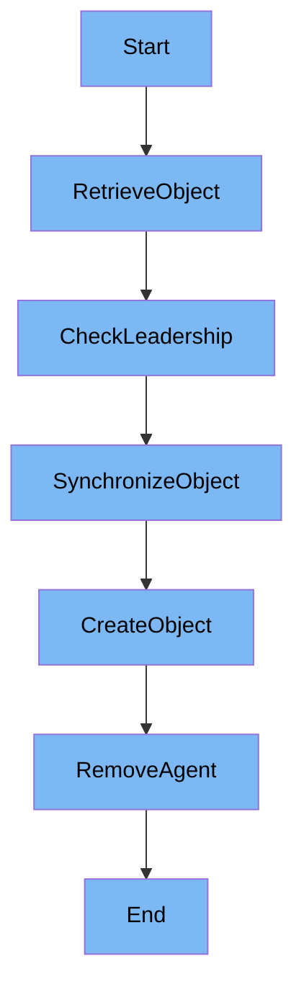

This document will cover the DatadogPodAutoscaler Management Process, which includes:

1. Retrieving the DatadogPodAutoscaler object
2. Synchronizing the object
3. Creating the object
4. Removing the Datadog Agent.

Technical document: <SwmLink doc-title="DatadogPodAutoscaler Management Process">[DatadogPodAutoscaler Management Process](/.swm/datadogpodautoscaler-management-process.faibpj3u.sw.md)</SwmLink>

# [Retrieving the DatadogPodAutoscaler object](https://app.swimm.io/repos/Z2l0aHViJTNBJTNBZGF0YWRvZy1hZ2VudCUzQSUzQVN3aW1tLURlbW8=/docs/faibpj3u#processpodautoscaler)

The process begins by retrieving the DatadogPodAutoscaler object from the cache. This step ensures that the system has the most recent state of the object. If the object is not found, it may be created later. This retrieval is essential for maintaining the consistency of the system's state.

# [Checking Leadership](https://app.swimm.io/repos/Z2l0aHViJTNBJTNBZGF0YWRvZy1hZ2VudCUzQSUzQVN3aW1tLURlbW8=/docs/faibpj3u#processpodautoscaler)

After retrieving the object, the system checks whether the controller is the leader. Only the leader is responsible for synchronizing the object with the internal store and Kubernetes. This check prevents multiple controllers from making conflicting updates.

# [Synchronizing the Object](https://app.swimm.io/repos/Z2l0aHViJTNBJTNBZGF0YWRvZy1hZ2VudCUzQSUzQVN3aW1tLURlbW8=/docs/faibpj3u#syncpodautoscaler)

If the controller is the leader, it synchronizes the DatadogPodAutoscaler object with the internal store and Kubernetes. This synchronization ensures that the state of the object is consistent across different components of the system. It involves updating the internal representation of the object and making necessary changes in Kubernetes.

# [Creating the Object](https://app.swimm.io/repos/Z2l0aHViJTNBJTNBZGF0YWRvZy1hZ2VudCUzQSUzQVN3aW1tLURlbW8=/docs/faibpj3u#createpodautoscaler)

If the DatadogPodAutoscaler object needs to be created, the system does so based on the internal representation. This step involves defining the specifications and status of the new object and then creating it in Kubernetes. This creation process ensures that new objects are correctly initialized and integrated into the system.

# [Removing the Datadog Agent](https://app.swimm.io/repos/Z2l0aHViJTNBJTNBZGF0YWRvZy1hZ2VudCUzQSUzQVN3aW1tLURlbW8=/docs/faibpj3u#removing-the-agent)

The process also includes steps for removing the Datadog Agent. This involves stopping and uninstalling the agent using the `msiexec` command. Removing the agent is necessary when it is no longer needed or when it needs to be replaced with a new version. This step ensures that the system remains clean and free of unnecessary components.

&nbsp;

*This is an auto-generated document by Swimm AI 🌊 and has not yet been verified by a human*

<SwmMeta version="3.0.0" repo-id="Z2l0aHViJTNBJTNBZGF0YWRvZy1hZ2VudCUzQSUzQVN3aW1tLURlbW8=" repo-name="datadog-agent">Powered by [Swimm](/)</SwmMeta>
