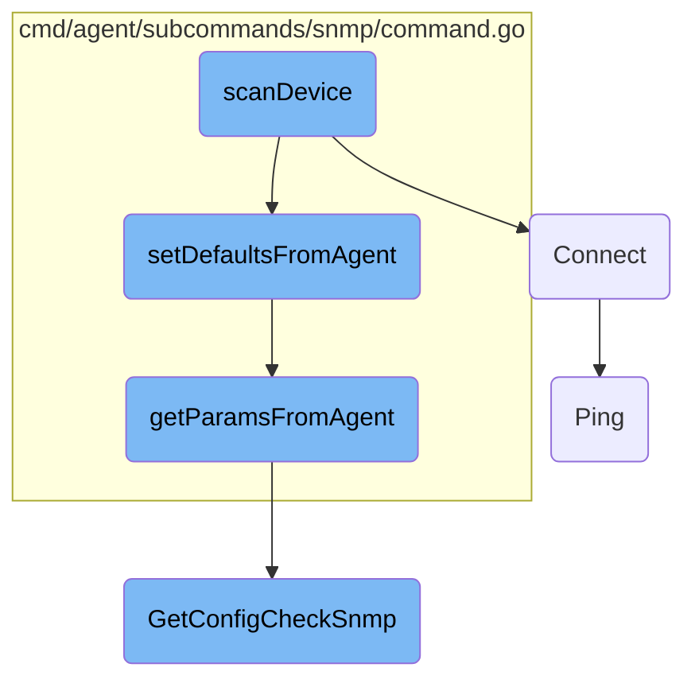

In this document, we will explain the process of scanning a device. The process involves parsing arguments, setting default parameters, establishing a connection, and processing device information.

The flow starts by parsing the arguments to ensure an IP address is provided. It then sets default connection parameters using the agent configuration. After that, it establishes a connection to the device. Once connected, it gathers and processes device information, which is then forwarded for further analysis.

# Flow drill down



<SwmSnippet path="/cmd/agent/subcommands/snmp/command.go" line="392">

---

## <SwmToken path="cmd/agent/subcommands/snmp/command.go" pos="392:2:2" line-data="func scanDevice(connParams *connectionParams, args argsType, conf config.Component, logger log.Component, demux demultiplexer.Component) error {">`scanDevice`</SwmToken> Function

The <SwmToken path="cmd/agent/subcommands/snmp/command.go" pos="392:2:2" line-data="func scanDevice(connParams *connectionParams, args argsType, conf config.Component, logger log.Component, demux demultiplexer.Component) error {">`scanDevice`</SwmToken> function is responsible for initiating the scanning of a device. It starts by parsing the arguments to ensure an IP address is provided. It then calls <SwmToken path="cmd/agent/subcommands/snmp/command.go" pos="403:5:5" line-data="	agentErr := setDefaultsFromAgent(connParams, conf)">`setDefaultsFromAgent`</SwmToken> to set default connection parameters. After establishing a connection using <SwmToken path="cmd/agent/subcommands/snmp/command.go" pos="410:8:8" line-data="	snmp, err := newSNMP(connParams, logger)">`newSNMP`</SwmToken>, it gathers <SwmToken path="cmd/agent/subcommands/snmp/command.go" pos="419:1:1" line-data="	pdus, err := gatherPDUs(snmp)">`pdus`</SwmToken> and processes them into device <SwmToken path="cmd/agent/subcommands/snmp/command.go" pos="180:24:24" line-data="		Long: `Walk the SNMP tree for a device, collecting available OIDs.">`OIDs`</SwmToken>, which are then forwarded to the event platform.

```go
func scanDevice(connParams *connectionParams, args argsType, conf config.Component, logger log.Component, demux demultiplexer.Component) error {
	// Parse args
	if len(args) == 0 {
		return confErrf("missing argument: IP address")
	}
	deviceAddr := args[0]
	if len(args) > 1 {
		return confErrf("unexpected extra arguments; only one argument expected.")
	}
	// Parse port from IP address
	connParams.IPAddress, connParams.Port, _ = maybeSplitIP(deviceAddr)
	agentErr := setDefaultsFromAgent(connParams, conf)
	if agentErr != nil {
		// Warn that we couldn't contact the agent, but keep going in case the
		// user provided enough arguments to do this anyway.
		fmt.Fprintf(os.Stderr, "Warning: %v\n", agentErr)
	}
	// Establish connection
	snmp, err := newSNMP(connParams, logger)
	if err != nil {
		// newSNMP only returns config errors, so any problem is a usage error
```

---

</SwmSnippet>

<SwmSnippet path="/cmd/agent/subcommands/snmp/command.go" line="269">

---

### <SwmToken path="cmd/agent/subcommands/snmp/command.go" pos="269:2:2" line-data="func setDefaultsFromAgent(connParams *connectionParams, conf config.Component) error {">`setDefaultsFromAgent`</SwmToken> Function

The <SwmToken path="cmd/agent/subcommands/snmp/command.go" pos="269:2:2" line-data="func setDefaultsFromAgent(connParams *connectionParams, conf config.Component) error {">`setDefaultsFromAgent`</SwmToken> function sets default SNMP parameters from the agent configuration. It calls <SwmToken path="cmd/agent/subcommands/snmp/command.go" pos="270:8:8" line-data="	agentParams, agentError := getParamsFromAgent(connParams.IPAddress, conf)">`getParamsFromAgent`</SwmToken> to retrieve these parameters and updates the connection parameters if they are not already set.

```go
func setDefaultsFromAgent(connParams *connectionParams, conf config.Component) error {
	agentParams, agentError := getParamsFromAgent(connParams.IPAddress, conf)
	if agentError != nil {
		return agentError
	}
	if connParams.Version == "" {
		connParams.Version = agentParams.Version
	}
	if connParams.Port == 0 {
		connParams.Port = agentParams.Port
	}
	if connParams.CommunityString == "" {
		connParams.CommunityString = agentParams.CommunityString
	}
	if connParams.Username == "" {
		connParams.Username = agentParams.Username
	}
	if connParams.AuthProtocol == "" {
		connParams.AuthProtocol = agentParams.AuthProtocol
	}
	if connParams.AuthKey == "" {
```

---

</SwmSnippet>

<SwmSnippet path="/cmd/agent/subcommands/snmp/command.go" line="256">

---

### <SwmToken path="cmd/agent/subcommands/snmp/command.go" pos="256:2:2" line-data="func getParamsFromAgent(deviceIP string, conf config.Component) (*parse.SNMPConfig, error) {">`getParamsFromAgent`</SwmToken> Function

The <SwmToken path="cmd/agent/subcommands/snmp/command.go" pos="256:2:2" line-data="func getParamsFromAgent(deviceIP string, conf config.Component) (*parse.SNMPConfig, error) {">`getParamsFromAgent`</SwmToken> function retrieves SNMP configuration parameters for a specific device IP from the agent. It uses <SwmToken path="cmd/agent/subcommands/snmp/command.go" pos="257:10:10" line-data="	snmpConfigList, err := parse.GetConfigCheckSnmp(conf)">`GetConfigCheckSnmp`</SwmToken> to get the list of SNMP configurations and matches the device IP to return the corresponding configuration.

```go
func getParamsFromAgent(deviceIP string, conf config.Component) (*parse.SNMPConfig, error) {
	snmpConfigList, err := parse.GetConfigCheckSnmp(conf)
	if err != nil {
		return nil, fmt.Errorf("unable to load SNMP config from agent: %w", err)
	}
	instance := parse.GetIPConfig(deviceIP, snmpConfigList)
	if instance.IPAddress != "" {
		instance.IPAddress = deviceIP
		return &instance, nil
	}
	return nil, fmt.Errorf("agent has no SNMP config for IP %s", deviceIP)
}
```

---

</SwmSnippet>

<SwmSnippet path="/pkg/collector/corechecks/oracle/connection_handling.go" line="29">

---

## Connect Function

The <SwmToken path="pkg/collector/corechecks/oracle/connection_handling.go" pos="29:2:2" line-data="// Connect establishes a connection to an Oracle instance and returns an open connection to the database.">`Connect`</SwmToken> function establishes a connection to an Oracle instance. It constructs the connection string based on the configuration and attempts to open and ping the database connection. If successful, it sets additional connection parameters and returns the open connection.

```go
// Connect establishes a connection to an Oracle instance and returns an open connection to the database.
func (c *Check) Connect() (*sqlx.DB, error) {
	var connStr string
	var oracleDriver string
	if c.config.TnsAlias != "" {
		connStr = fmt.Sprintf(`user="%s" password="%s" connectString="%s"`, c.config.Username, c.config.Password, c.config.TnsAlias)
		oracleDriver = "godror"
	} else {
		// godror ezconnect string
		if c.config.InstanceConfig.OracleClient {
			oracleDriver = "godror"
			protocolString := ""
			walletString := ""
			if c.config.Protocol == "TCPS" {
				protocolString = "tcps://"
				if c.config.Wallet != "" {
					walletString = fmt.Sprintf("?wallet_location=%s", c.config.Wallet)
				}
			}
			connStr = fmt.Sprintf(`user="%s" password="%s" connectString="%s%s:%d/%s%s"`, c.config.Username, c.config.Password, protocolString, c.config.Server, c.config.Port, c.config.ServiceName, walletString)
		} else {
```

---

</SwmSnippet>

<SwmSnippet path="/pkg/networkdevice/pinger/pinger_linux.go" line="36">

---

## Ping Function

The <SwmToken path="pkg/networkdevice/pinger/pinger_linux.go" pos="36:2:2" line-data="// Ping takes a host and depending on the config will either">`Ping`</SwmToken> function sends a ping request to a specified host. Depending on the configuration, it either uses a UDP socket or a raw socket to send the ping. It then processes the response and returns the result.

```go
// Ping takes a host and depending on the config will either
// directly ping the host sending packets over a UDP socket
// or a raw socket
func (p *LinuxPinger) Ping(host string) (*Result, error) {
	if !p.cfg.UseRawSocket {
		return RunPing(&p.cfg, host)
	}

	tu, err := net.GetRemoteSystemProbeUtil(
		dd_config.SystemProbe.GetString("system_probe_config.sysprobe_socket"))
	if err != nil {
		log.Warnf("could not initialize system-probe connection: %s", err.Error())
		return nil, err
	}
	resp, err := tu.GetPing(clientID, host, p.cfg.Count, p.cfg.Interval, p.cfg.Timeout)
	if err != nil {
		return nil, err
	}

	var result Result
	if err := json.Unmarshal(resp, &result); err != nil {
```

---

</SwmSnippet>

<SwmSnippet path="/pkg/snmp/snmpparse/config_snmp.go" line="142">

---

## <SwmToken path="pkg/snmp/snmpparse/config_snmp.go" pos="142:2:2" line-data="// GetConfigCheckSnmp returns each SNMPConfig for all running config checks, by querying the local agent.">`GetConfigCheckSnmp`</SwmToken> Function

The <SwmToken path="pkg/snmp/snmpparse/config_snmp.go" pos="142:2:2" line-data="// GetConfigCheckSnmp returns each SNMPConfig for all running config checks, by querying the local agent.">`GetConfigCheckSnmp`</SwmToken> function retrieves SNMP configuration for all running config checks by querying the local agent. It processes the response to extract and return the SNMP configurations.

```go
// GetConfigCheckSnmp returns each SNMPConfig for all running config checks, by querying the local agent.
// If the agent isn't running or is unreachable, this will fail.
func GetConfigCheckSnmp(conf config.Component) ([]SNMPConfig, error) {
	// TODO: change the URL if the snmp check is a cluster check
	// add /agent/config-check to cluster agent API
	// Copy the code from comp/core/autodiscovery/autodiscoveryimpl/autoconfig.go#writeConfigCheck
	endpoint, err := apiutil.NewIPCEndpoint(conf, "/agent/config-check")
	if err != nil {
		return nil, err
	}
	urlValues := url.Values{}
	urlValues.Set("raw", "true")

	res, err := endpoint.DoGet(apiutil.WithValues(urlValues))
	if err != nil {
		return nil, err
	}

	cr := integration.ConfigCheckResponse{}
	err = json.Unmarshal(res, &cr)
	if err != nil {
```

---

</SwmSnippet>

&nbsp;

*This is an auto-generated document by Swimm AI 🌊 and has not yet been verified by a human*

<SwmMeta version="3.0.0" repo-id="Z2l0aHViJTNBJTNBZGF0YWRvZy1hZ2VudCUzQSUzQVN3aW1tLURlbW8=" repo-name="datadog-agent"><sup>Powered by [Swimm](/)</sup></SwmMeta>
