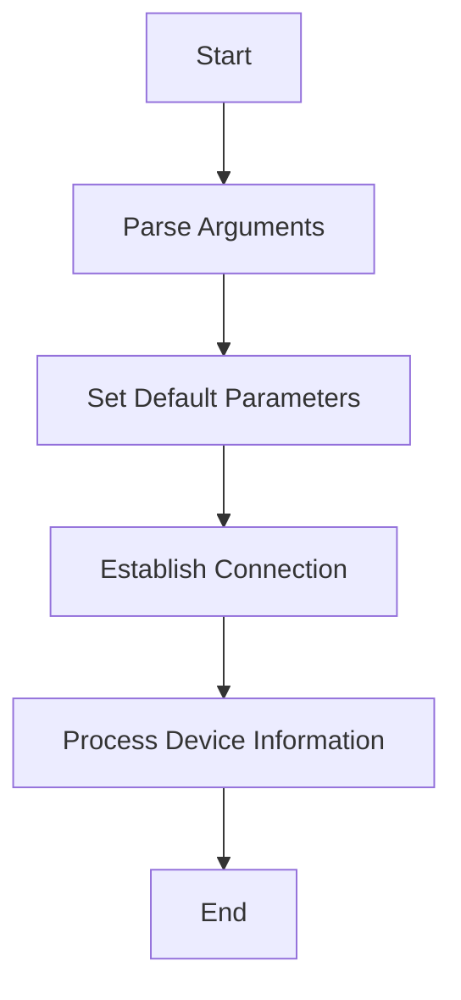

This document will cover the Device Scanning Flow, which includes:

1. Parsing Arguments
2. Setting Default Parameters
3. Establishing a Connection
4. Processing Device Information.

Technical document: <SwmLink doc-title="Device Scanning Flow">[Device Scanning Flow](/.swm/device-scanning-flow.c3n7627n.sw.md)</SwmLink>

# [Parsing Arguments](https://app.swimm.io/repos/Z2l0aHViJTNBJTNBZGF0YWRvZy1hZ2VudCUzQSUzQVN3aW1tLURlbW8=/docs/c3n7627n#scandevice-function)

The first step in the device scanning flow is to parse the arguments provided by the user. This ensures that an IP address is included. If no IP address is provided, the process cannot proceed. This step is crucial for identifying the device that needs to be scanned.

# [Setting Default Parameters](https://app.swimm.io/repos/Z2l0aHViJTNBJTNBZGF0YWRvZy1hZ2VudCUzQSUzQVN3aW1tLURlbW8=/docs/c3n7627n#setdefaultsfromagent-function)

Once the IP address is parsed, the next step is to set default connection parameters. These parameters are retrieved from the agent configuration. If any parameters are missing, they are filled in with default values. This ensures that the connection to the device is established with the correct settings.

# [Establishing a Connection](https://app.swimm.io/repos/Z2l0aHViJTNBJTNBZGF0YWRvZy1hZ2VudCUzQSUzQVN3aW1tLURlbW8=/docs/c3n7627n#connect-function)

After setting the default parameters, the next step is to establish a connection to the device. This involves constructing a connection string based on the configuration and attempting to open a connection. If the connection is successful, additional parameters are set, and the connection is maintained for further communication.

# [Processing Device Information](https://app.swimm.io/repos/Z2l0aHViJTNBJTNBZGF0YWRvZy1hZ2VudCUzQSUzQVN3aW1tLURlbW8=/docs/c3n7627n#ping-function)

Once the connection is established, the device information is gathered and processed. This involves sending a ping request to the device and processing the response. The gathered information is then forwarded for further analysis. This step ensures that the device is active and responsive, and the collected data is accurate.

&nbsp;

*This is an auto-generated document by Swimm AI 🌊 and has not yet been verified by a human*

<SwmMeta version="3.0.0" repo-id="Z2l0aHViJTNBJTNBZGF0YWRvZy1hZ2VudCUzQSUzQVN3aW1tLURlbW8=" repo-name="datadog-agent">Powered by [Swimm](/)</SwmMeta>
