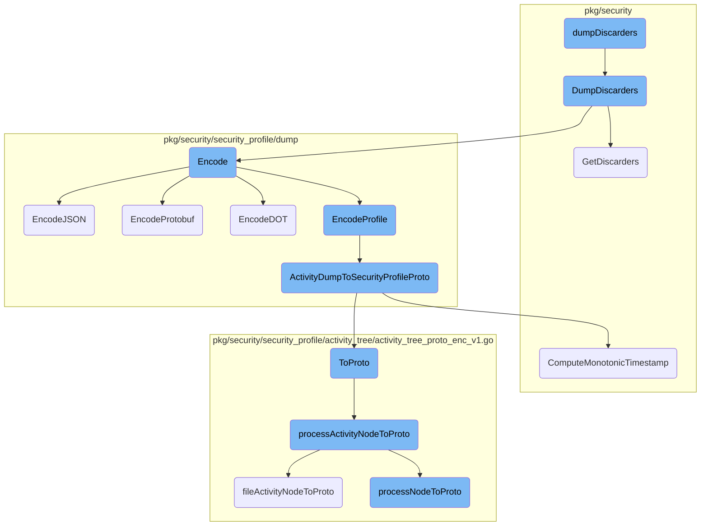
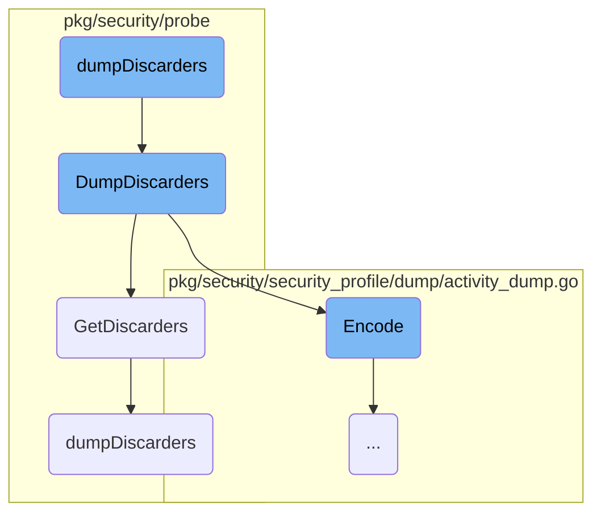
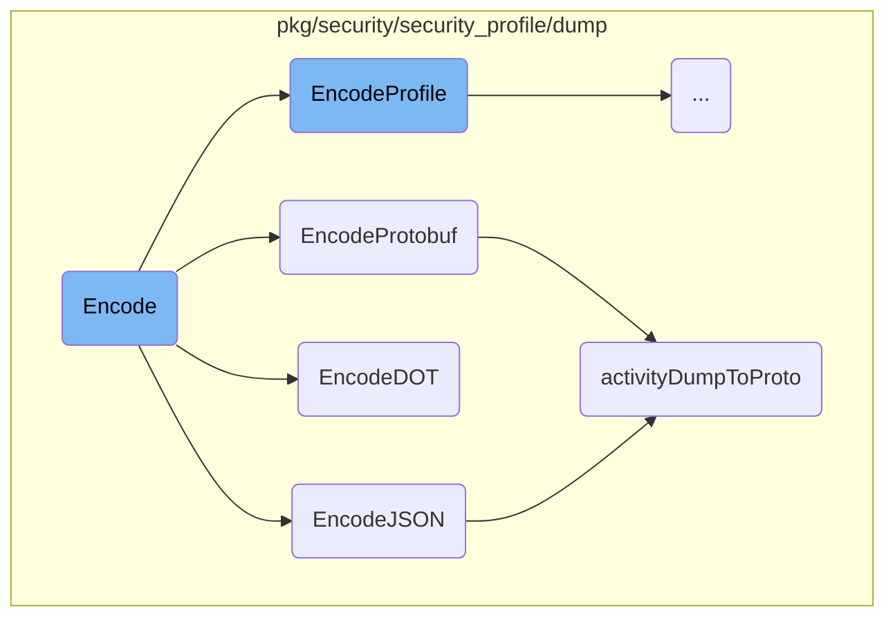
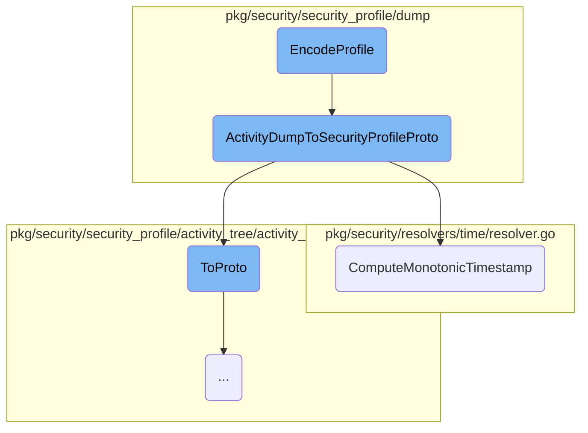
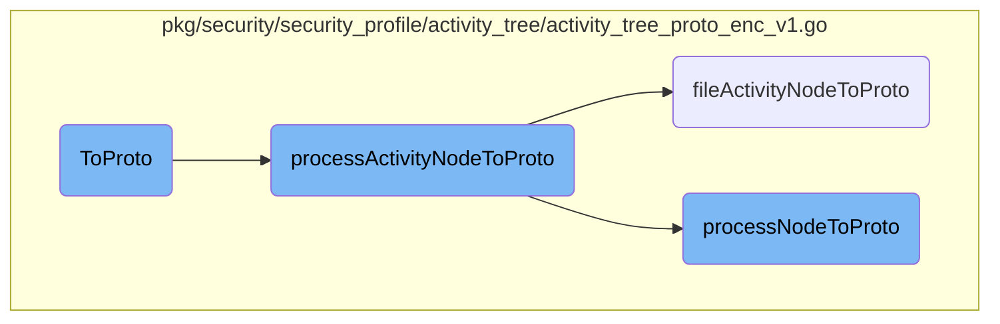

This document explains the process of dumping discarders. The process involves initializing a runtime security client, retrieving discarders from various <SwmToken path="pkg/security/probe/discarders_linux.go" pos="647:24:24" line-data="func dumpDiscarders(resolver *dentry.Resolver, pidMap, inodeMap, statsFB, statsBB *ebpf.Map) (DiscardersDump, error) {">`ebpf`</SwmToken> maps, processing these discarders, and finally encoding them into a specified format.

The flow starts by initializing a runtime security client. Once the client is ready, it retrieves discarders from different <SwmToken path="pkg/security/probe/discarders_linux.go" pos="647:24:24" line-data="func dumpDiscarders(resolver *dentry.Resolver, pidMap, inodeMap, statsFB, statsBB *ebpf.Map) (DiscardersDump, error) {">`ebpf`</SwmToken> maps. These discarders are then processed to gather information about PID discarders, inode discarders, and discarder stats. After processing, the discarders are encoded into a YAML file and saved. This entire process ensures that discarders are efficiently managed and stored for further analysis.

Here is a high level diagram of the flow, showing only the most important functions:



# Flow drill down

First, we'll zoom into this section of the flow:



<SwmSnippet path="/cmd/system-probe/subcommands/runtime/command.go" line="814">

---

## Dumping discarders

The <SwmToken path="cmd/system-probe/subcommands/runtime/command.go" pos="814:2:2" line-data="func dumpDiscarders(_ log.Component, _ config.Component, _ secrets.Component) error {">`dumpDiscarders`</SwmToken> function initializes a runtime security client and calls its <SwmToken path="cmd/system-probe/subcommands/runtime/command.go" pos="814:2:2" line-data="func dumpDiscarders(_ log.Component, _ config.Component, _ secrets.Component) error {">`dumpDiscarders`</SwmToken> method to dump the discarders. It handles errors and prints the filename of the dumped discarders.

```go
func dumpDiscarders(_ log.Component, _ config.Component, _ secrets.Component) error {
	runtimeSecurityClient, err := secagent.NewRuntimeSecurityClient()
	if err != nil {
		return fmt.Errorf("unable to create a runtime security client instance: %w", err)
	}
	defer runtimeSecurityClient.Close()

	dumpFilename, dumpErr := runtimeSecurityClient.DumpDiscarders()

	if dumpErr != nil {
		return fmt.Errorf("unable to dump discarders: %w", dumpErr)
	}

	fmt.Printf("Discarder dump file: %s\n", dumpFilename)

	return nil
}
```

---

</SwmSnippet>

<SwmSnippet path="/pkg/security/probe/probe_ebpf.go" line="1291">

---

## Retrieving discarders

The <SwmToken path="pkg/security/probe/probe_ebpf.go" pos="1291:9:9" line-data="func (p *EBPFProbe) GetDiscarders() (*DiscardersDump, error) {">`GetDiscarders`</SwmToken> method retrieves discarders from various <SwmToken path="pkg/security/probe/discarders_linux.go" pos="647:24:24" line-data="func dumpDiscarders(resolver *dentry.Resolver, pidMap, inodeMap, statsFB, statsBB *ebpf.Map) (DiscardersDump, error) {">`ebpf`</SwmToken> maps. It calls the <SwmToken path="cmd/system-probe/subcommands/runtime/command.go" pos="814:2:2" line-data="func dumpDiscarders(_ log.Component, _ config.Component, _ secrets.Component) error {">`dumpDiscarders`</SwmToken> function to process and return the discarders.

```go
func (p *EBPFProbe) GetDiscarders() (*DiscardersDump, error) {
	inodeMap, err := managerhelper.Map(p.Manager, "inode_discarders")
	if err != nil {
		return nil, err
	}

	pidMap, err := managerhelper.Map(p.Manager, "pid_discarders")
	if err != nil {
		return nil, err
	}

	statsFB, err := managerhelper.Map(p.Manager, "fb_discarder_stats")
	if err != nil {
		return nil, err
	}

	statsBB, err := managerhelper.Map(p.Manager, "bb_discarder_stats")
	if err != nil {
		return nil, err
	}

```

---

</SwmSnippet>

<SwmSnippet path="/pkg/security/probe/discarders_linux.go" line="647">

---

### Processing discarders

The <SwmToken path="pkg/security/probe/discarders_linux.go" pos="647:2:2" line-data="func dumpDiscarders(resolver *dentry.Resolver, pidMap, inodeMap, statsFB, statsBB *ebpf.Map) (DiscardersDump, error) {">`dumpDiscarders`</SwmToken> function processes discarders by dumping PID discarders, inode discarders, and discarder stats. It aggregates these into a <SwmToken path="pkg/security/probe/discarders_linux.go" pos="647:30:30" line-data="func dumpDiscarders(resolver *dentry.Resolver, pidMap, inodeMap, statsFB, statsBB *ebpf.Map) (DiscardersDump, error) {">`DiscardersDump`</SwmToken> structure.

```go
func dumpDiscarders(resolver *dentry.Resolver, pidMap, inodeMap, statsFB, statsBB *ebpf.Map) (DiscardersDump, error) {
	seclog.Debugf("Dumping discarders")

	dump := DiscardersDump{
		Date: time.Now(),
	}

	pids, err := dumpPidDiscarders(pidMap)
	if err != nil {
		return dump, err
	}
	dump.Pids = pids

	inodes, err := dumpInodeDiscarders(resolver, inodeMap)
	if err != nil {
		return dump, err
	}
	dump.Inodes = inodes

	stats, err := dumpDiscarderStats(statsFB, statsBB)
	if err != nil {
```

---

</SwmSnippet>

<SwmSnippet path="/pkg/security/probe/probe_ebpf.go" line="1320">

---

## Encoding discarders

The <SwmToken path="pkg/security/probe/probe_ebpf.go" pos="1320:9:9" line-data="func (p *EBPFProbe) DumpDiscarders() (string, error) {">`DumpDiscarders`</SwmToken> method encodes the retrieved discarders into a YAML file. It creates a temporary file, sets permissions, and writes the encoded discarders to the file.

```go
func (p *EBPFProbe) DumpDiscarders() (string, error) {
	dump, err := p.GetDiscarders()
	if err != nil {
		return "", err
	}

	fp, err := os.CreateTemp("/tmp", "discarder-dump-")
	if err != nil {
		return "", err
	}
	defer fp.Close()

	if err := os.Chmod(fp.Name(), 0400); err != nil {
		return "", err
	}

	encoder := yaml.NewEncoder(fp)
	defer encoder.Close()

	if err := encoder.Encode(dump); err != nil {
		return "", err
```

---

</SwmSnippet>

Now, lets zoom into this section of the flow:



<SwmSnippet path="/pkg/security/security_profile/dump/activity_dump.go" line="650">

---

## Encode

The <SwmToken path="pkg/security/security_profile/dump/activity_dump.go" pos="650:2:2" line-data="// Encode encodes an activity dump in the provided format">`Encode`</SwmToken> function is responsible for encoding an activity dump into a specified format. It uses a switch statement to determine the format and calls the appropriate encoding function such as <SwmToken path="pkg/security/security_profile/dump/activity_dump.go" pos="654:5:5" line-data="		return ad.EncodeJSON(&quot;&quot;)">`EncodeJSON`</SwmToken>, <SwmToken path="pkg/security/security_profile/dump/activity_dump.go" pos="656:5:5" line-data="		return ad.EncodeProtobuf()">`EncodeProtobuf`</SwmToken>, <SwmToken path="pkg/security/security_profile/dump/activity_dump.go" pos="658:5:5" line-data="		return ad.EncodeDOT()">`EncodeDOT`</SwmToken>, or <SwmToken path="pkg/security/security_profile/dump/activity_dump.go" pos="660:5:5" line-data="		return ad.EncodeProfile()">`EncodeProfile`</SwmToken>.

```go
// Encode encodes an activity dump in the provided format
func (ad *ActivityDump) Encode(format config.StorageFormat) (*bytes.Buffer, error) {
	switch format {
	case config.JSON:
		return ad.EncodeJSON("")
	case config.Protobuf:
		return ad.EncodeProtobuf()
	case config.Dot:
		return ad.EncodeDOT()
	case config.Profile:
		return ad.EncodeProfile()
	default:
		return nil, fmt.Errorf("couldn't encode activity dump [%s] as [%s]: unknown format", ad.GetSelectorStr(), format)
	}
}
```

---

</SwmSnippet>

<SwmSnippet path="/pkg/security/security_profile/dump/activity_dump.go" line="697">

---

### <SwmToken path="pkg/security/security_profile/dump/activity_dump.go" pos="697:2:2" line-data="// EncodeJSON encodes an activity dump in the ProtoJSON format">`EncodeJSON`</SwmToken>

The <SwmToken path="pkg/security/security_profile/dump/activity_dump.go" pos="697:2:2" line-data="// EncodeJSON encodes an activity dump in the ProtoJSON format">`EncodeJSON`</SwmToken> function encodes an activity dump into the <SwmToken path="pkg/security/security_profile/dump/activity_dump.go" pos="697:16:16" line-data="// EncodeJSON encodes an activity dump in the ProtoJSON format">`ProtoJSON`</SwmToken> format. It locks the activity dump, converts it to a protobuf representation using <SwmToken path="pkg/security/security_profile/dump/activity_dump.go" pos="702:5:5" line-data="	pad := activityDumpToProto(ad)">`activityDumpToProto`</SwmToken>, and then marshals it into JSON using <SwmToken path="pkg/security/security_profile/dump/activity_dump.go" pos="705:5:7" line-data="	opts := protojson.MarshalOptions{">`protojson.MarshalOptions`</SwmToken>.

```go
// EncodeJSON encodes an activity dump in the ProtoJSON format
func (ad *ActivityDump) EncodeJSON(indent string) (*bytes.Buffer, error) {
	ad.Lock()
	defer ad.Unlock()

	pad := activityDumpToProto(ad)
	defer pad.ReturnToVTPool()

	opts := protojson.MarshalOptions{
		EmitUnpopulated: true,
		UseProtoNames:   true,
		Indent:          indent,
	}

	raw, err := opts.Marshal(pad)
	if err != nil {
		return nil, fmt.Errorf("couldn't encode in %s: %v", config.JSON, err)
	}
	return bytes.NewBuffer(raw), nil
}
```

---

</SwmSnippet>

<SwmSnippet path="/pkg/security/security_profile/dump/activity_dump.go" line="666">

---

### <SwmToken path="pkg/security/security_profile/dump/activity_dump.go" pos="666:2:2" line-data="// EncodeProtobuf encodes an activity dump in the Protobuf format">`EncodeProtobuf`</SwmToken>

The <SwmToken path="pkg/security/security_profile/dump/activity_dump.go" pos="666:2:2" line-data="// EncodeProtobuf encodes an activity dump in the Protobuf format">`EncodeProtobuf`</SwmToken> function encodes an activity dump into the Protobuf format. Similar to <SwmToken path="pkg/security/security_profile/dump/activity_dump.go" pos="654:5:5" line-data="		return ad.EncodeJSON(&quot;&quot;)">`EncodeJSON`</SwmToken>, it locks the activity dump, converts it to a protobuf representation, and then marshals it into Protobuf using <SwmToken path="pkg/security/security_profile/dump/activity_dump.go" pos="674:8:10" line-data="	raw, err := pad.MarshalVT()">`pad.MarshalVT`</SwmToken>.

```go
// EncodeProtobuf encodes an activity dump in the Protobuf format
func (ad *ActivityDump) EncodeProtobuf() (*bytes.Buffer, error) {
	ad.Lock()
	defer ad.Unlock()

	pad := activityDumpToProto(ad)
	defer pad.ReturnToVTPool()

	raw, err := pad.MarshalVT()
	if err != nil {
		return nil, fmt.Errorf("couldn't encode in %s: %v", config.Protobuf, err)
	}
	return bytes.NewBuffer(raw), nil
}
```

---

</SwmSnippet>

<SwmSnippet path="/pkg/security/security_profile/dump/graph.go" line="56">

---

### <SwmToken path="pkg/security/security_profile/dump/graph.go" pos="56:2:2" line-data="// EncodeDOT encodes an activity dump in the DOT format">`EncodeDOT`</SwmToken>

The <SwmToken path="pkg/security/security_profile/dump/graph.go" pos="56:2:2" line-data="// EncodeDOT encodes an activity dump in the DOT format">`EncodeDOT`</SwmToken> function encodes an activity dump into the DOT format. It converts the activity dump to a graph representation using <SwmToken path="pkg/security/security_profile/dump/graph.go" pos="58:5:9" line-data="	graph := ad.ToGraph()">`ad.ToGraph()`</SwmToken> and then encodes it into DOT format using <SwmToken path="pkg/security/security_profile/dump/graph.go" pos="59:8:10" line-data="	raw, err := graph.EncodeDOT(ActivityDumpGraphTemplate)">`graph.EncodeDOT`</SwmToken>.

```go
// EncodeDOT encodes an activity dump in the DOT format
func (ad *ActivityDump) EncodeDOT() (*bytes.Buffer, error) {
	graph := ad.ToGraph()
	raw, err := graph.EncodeDOT(ActivityDumpGraphTemplate)
	if err != nil {
		return nil, fmt.Errorf("couldn't encode %s in %s: %w", ad.getSelectorStr(), config.Dot, err)
	}
	return raw, nil
}
```

---

</SwmSnippet>

<SwmSnippet path="/pkg/security/security_profile/dump/activity_dump_proto_enc_v1.go" line="18">

---

### <SwmToken path="pkg/security/security_profile/dump/activity_dump_proto_enc_v1.go" pos="18:2:2" line-data="func activityDumpToProto(ad *ActivityDump) *adproto.SecDump {">`activityDumpToProto`</SwmToken>

The <SwmToken path="pkg/security/security_profile/dump/activity_dump_proto_enc_v1.go" pos="18:2:2" line-data="func activityDumpToProto(ad *ActivityDump) *adproto.SecDump {">`activityDumpToProto`</SwmToken> function converts an <SwmToken path="pkg/security/security_profile/dump/activity_dump_proto_enc_v1.go" pos="18:7:7" line-data="func activityDumpToProto(ad *ActivityDump) *adproto.SecDump {">`ActivityDump`</SwmToken> object into a protobuf representation. It initializes a new <SwmToken path="pkg/security/security_profile/dump/activity_dump_proto_enc_v1.go" pos="18:13:13" line-data="func activityDumpToProto(ad *ActivityDump) *adproto.SecDump {">`SecDump`</SwmToken> object from a pool, copies the relevant fields from the <SwmToken path="pkg/security/security_profile/dump/activity_dump_proto_enc_v1.go" pos="18:7:7" line-data="func activityDumpToProto(ad *ActivityDump) *adproto.SecDump {">`ActivityDump`</SwmToken>, and returns the protobuf object.

```go
func activityDumpToProto(ad *ActivityDump) *adproto.SecDump {
	if ad == nil {
		return nil
	}

	pad := adproto.SecDumpFromVTPool()
	*pad = adproto.SecDump{
		Host:    ad.Host,
		Service: ad.Service,
		Source:  ad.Source,

		Metadata: mtdt.ToProto(&ad.Metadata),

		Tags: make([]string, len(ad.Tags)),
		Tree: activity_tree.ToProto(ad.ActivityTree),
	}

	copy(pad.Tags, ad.Tags)

	return pad
}
```

---

</SwmSnippet>

Now, lets zoom into this section of the flow:



<SwmSnippet path="/pkg/security/security_profile/dump/activity_dump.go" line="681">

---

## <SwmToken path="pkg/security/security_profile/dump/activity_dump.go" pos="681:2:2" line-data="// EncodeProfile encodes an activity dump in the Security Profile protobuf format">`EncodeProfile`</SwmToken>

The <SwmToken path="pkg/security/security_profile/dump/activity_dump.go" pos="681:2:2" line-data="// EncodeProfile encodes an activity dump in the Security Profile protobuf format">`EncodeProfile`</SwmToken> function is responsible for encoding an activity dump into the Security Profile protobuf format. It locks the activity dump to ensure thread safety, then calls <SwmToken path="pkg/security/security_profile/dump/activity_dump.go" pos="686:8:8" line-data="	profileProto, err := ActivityDumpToSecurityProfileProto(ad)">`ActivityDumpToSecurityProfileProto`</SwmToken> to convert the activity dump into a protobuf representation. If the conversion is successful, it marshals the protobuf into a byte buffer.

```go
// EncodeProfile encodes an activity dump in the Security Profile protobuf format
func (ad *ActivityDump) EncodeProfile() (*bytes.Buffer, error) {
	ad.Lock()
	defer ad.Unlock()

	profileProto, err := ActivityDumpToSecurityProfileProto(ad)
	if profileProto == nil {
		return nil, fmt.Errorf("Error while encoding security dump: %v", err)
	}
	raw, err := profileProto.MarshalVT()
	if err != nil {
		return nil, fmt.Errorf("couldn't encode dump to `%s` format: %v", config.Profile, err)
	}
	return bytes.NewBuffer(raw), nil
}
```

---

</SwmSnippet>

<SwmSnippet path="/pkg/security/security_profile/dump/activity_dump_profile_proto_enc_v1.go" line="23">

---

## <SwmToken path="pkg/security/security_profile/dump/activity_dump_profile_proto_enc_v1.go" pos="23:2:2" line-data="// ActivityDumpToSecurityProfileProto serializes an Activity Dump to a Security Profile protobuf representation">`ActivityDumpToSecurityProfileProto`</SwmToken>

The <SwmToken path="pkg/security/security_profile/dump/activity_dump_profile_proto_enc_v1.go" pos="23:2:2" line-data="// ActivityDumpToSecurityProfileProto serializes an Activity Dump to a Security Profile protobuf representation">`ActivityDumpToSecurityProfileProto`</SwmToken> function serializes an Activity Dump into a Security Profile protobuf representation. It first checks if the input is valid and retrieves the workload selector. It then creates a new <SwmToken path="pkg/security/security_profile/dump/activity_dump_profile_proto_enc_v1.go" pos="24:14:14" line-data="func ActivityDumpToSecurityProfileProto(input *ActivityDump) (*proto.SecurityProfile, error) {">`SecurityProfile`</SwmToken> protobuf object, initializes a time resolver, and computes the monotonic timestamp. The function also sets up the profile context with syscalls, tags, and timestamps before returning the serialized protobuf.

```go
// ActivityDumpToSecurityProfileProto serializes an Activity Dump to a Security Profile protobuf representation
func ActivityDumpToSecurityProfileProto(input *ActivityDump) (*proto.SecurityProfile, error) {
	if input == nil {
		return nil, errors.New("imput == nil")
	}

	wSelector := input.GetWorkloadSelector()
	if wSelector == nil {
		return nil, errors.New("can't get dump selector, tags shouldn't be resolved yet")
	}

	output := &proto.SecurityProfile{
		Metadata:        mtdt.ToProto(&input.Metadata),
		ProfileContexts: make(map[string]*proto.ProfileContext),
		Tree:            activity_tree.ToProto(input.ActivityTree),
		Selector:        cgroupModel.WorkloadSelectorToProto(wSelector),
	}
	timeResolver, err := timeResolver.NewResolver()
	if err != nil {
		return nil, errors.New("can't init time resolver")
	}
```

---

</SwmSnippet>

<SwmSnippet path="/pkg/security/resolvers/time/resolver.go" line="63">

---

### <SwmToken path="pkg/security/resolvers/time/resolver.go" pos="63:2:2" line-data="// ComputeMonotonicTimestamp converts an absolute time to a kernel monotonic timestamp">`ComputeMonotonicTimestamp`</SwmToken>

The <SwmToken path="pkg/security/resolvers/time/resolver.go" pos="63:2:2" line-data="// ComputeMonotonicTimestamp converts an absolute time to a kernel monotonic timestamp">`ComputeMonotonicTimestamp`</SwmToken> function converts an absolute time to a kernel monotonic timestamp. It calculates the difference between the given timestamp and the system boot time, returning the result in nanoseconds.

```go
// ComputeMonotonicTimestamp converts an absolute time to a kernel monotonic timestamp
func (tr *Resolver) ComputeMonotonicTimestamp(timestamp time.Time) int64 {
	if !timestamp.IsZero() {
		return timestamp.Sub(tr.GetBootTime()).Nanoseconds()
	}
	return 0
}
```

---

</SwmSnippet>

Now, lets zoom into this section of the flow:



<SwmSnippet path="/pkg/security/security_profile/activity_tree/activity_tree_proto_enc_v1.go" line="20">

---

## <SwmToken path="pkg/security/security_profile/activity_tree/activity_tree_proto_enc_v1.go" pos="20:2:2" line-data="// ToProto encodes an activity tree to its protobuf representation">`ToProto`</SwmToken>

The <SwmToken path="pkg/security/security_profile/activity_tree/activity_tree_proto_enc_v1.go" pos="20:2:2" line-data="// ToProto encodes an activity tree to its protobuf representation">`ToProto`</SwmToken> function encodes an activity tree to its protobuf representation. It iterates over the <SwmToken path="pkg/security/security_profile/activity_tree/activity_tree_proto_enc_v1.go" pos="22:22:22" line-data="	out := make([]*adproto.ProcessActivityNode, 0, len(at.ProcessNodes))">`ProcessNodes`</SwmToken> in the activity tree and converts each node using the <SwmToken path="pkg/security/security_profile/activity_tree/activity_tree_proto_enc_v1.go" pos="25:10:10" line-data="		out = append(out, processActivityNodeToProto(node))">`processActivityNodeToProto`</SwmToken> function.

```go
// ToProto encodes an activity tree to its protobuf representation
func ToProto(at *ActivityTree) []*adproto.ProcessActivityNode {
	out := make([]*adproto.ProcessActivityNode, 0, len(at.ProcessNodes))

	for _, node := range at.ProcessNodes {
		out = append(out, processActivityNodeToProto(node))
	}
	return out
}
```

---

</SwmSnippet>

<SwmSnippet path="/pkg/security/security_profile/activity_tree/activity_tree_proto_enc_v1.go" line="30">

---

## <SwmToken path="pkg/security/security_profile/activity_tree/activity_tree_proto_enc_v1.go" pos="30:2:2" line-data="func processActivityNodeToProto(pan *ProcessNode) *adproto.ProcessActivityNode {">`processActivityNodeToProto`</SwmToken>

The <SwmToken path="pkg/security/security_profile/activity_tree/activity_tree_proto_enc_v1.go" pos="30:2:2" line-data="func processActivityNodeToProto(pan *ProcessNode) *adproto.ProcessActivityNode {">`processActivityNodeToProto`</SwmToken> function converts a <SwmToken path="pkg/security/security_profile/activity_tree/activity_tree_proto_enc_v1.go" pos="30:7:7" line-data="func processActivityNodeToProto(pan *ProcessNode) *adproto.ProcessActivityNode {">`ProcessNode`</SwmToken> into its protobuf representation. It initializes a new <SwmToken path="pkg/security/security_profile/activity_tree/activity_tree_proto_enc_v1.go" pos="30:13:13" line-data="func processActivityNodeToProto(pan *ProcessNode) *adproto.ProcessActivityNode {">`ProcessActivityNode`</SwmToken> and populates its fields by converting various attributes of the <SwmToken path="pkg/security/security_profile/activity_tree/activity_tree_proto_enc_v1.go" pos="30:7:7" line-data="func processActivityNodeToProto(pan *ProcessNode) *adproto.ProcessActivityNode {">`ProcessNode`</SwmToken>, such as matched rules, children, files, DNS names, IMDS events, sockets, and syscalls. This function ensures that all nested structures are also converted to their protobuf equivalents.

```go
func processActivityNodeToProto(pan *ProcessNode) *adproto.ProcessActivityNode {
	if pan == nil {
		return nil
	}

	ppan := adproto.ProcessActivityNodeFromVTPool()
	*ppan = adproto.ProcessActivityNode{
		Process:        processNodeToProto(&pan.Process),
		GenerationType: adproto.GenerationType(pan.GenerationType),
		MatchedRules:   make([]*adproto.MatchedRule, 0, len(pan.MatchedRules)),
		Children:       make([]*adproto.ProcessActivityNode, 0, len(pan.Children)),
		Files:          make([]*adproto.FileActivityNode, 0, len(pan.Files)),
		DnsNames:       make([]*adproto.DNSNode, 0, len(pan.DNSNames)),
		ImdsEvents:     make([]*adproto.IMDSNode, 0, len(pan.IMDSEvents)),
		Sockets:        make([]*adproto.SocketNode, 0, len(pan.Sockets)),
		Syscalls:       make([]uint32, 0, len(pan.Syscalls)),
		ImageTags:      pan.ImageTags,
	}

	for _, rule := range pan.MatchedRules {
		ppan.MatchedRules = append(ppan.MatchedRules, matchedRuleToProto(rule))
```

---

</SwmSnippet>

<SwmSnippet path="/pkg/security/security_profile/activity_tree/activity_tree_proto_enc_v1.go" line="173">

---

### <SwmToken path="pkg/security/security_profile/activity_tree/activity_tree_proto_enc_v1.go" pos="173:2:2" line-data="func fileActivityNodeToProto(fan *FileNode) *adproto.FileActivityNode {">`fileActivityNodeToProto`</SwmToken>

The <SwmToken path="pkg/security/security_profile/activity_tree/activity_tree_proto_enc_v1.go" pos="173:2:2" line-data="func fileActivityNodeToProto(fan *FileNode) *adproto.FileActivityNode {">`fileActivityNodeToProto`</SwmToken> function converts a <SwmToken path="pkg/security/security_profile/activity_tree/activity_tree_proto_enc_v1.go" pos="173:7:7" line-data="func fileActivityNodeToProto(fan *FileNode) *adproto.FileActivityNode {">`FileNode`</SwmToken> into its protobuf representation. It initializes a new <SwmToken path="pkg/security/security_profile/activity_tree/activity_tree_proto_enc_v1.go" pos="173:13:13" line-data="func fileActivityNodeToProto(fan *FileNode) *adproto.FileActivityNode {">`FileActivityNode`</SwmToken> and populates its fields by converting various attributes of the <SwmToken path="pkg/security/security_profile/activity_tree/activity_tree_proto_enc_v1.go" pos="173:7:7" line-data="func fileActivityNodeToProto(fan *FileNode) *adproto.FileActivityNode {">`FileNode`</SwmToken>, such as matched rules, name, file event, generation type, first seen timestamp, open node, children, and image tags.

```go
func fileActivityNodeToProto(fan *FileNode) *adproto.FileActivityNode {
	if fan == nil {
		return nil
	}

	pfan := adproto.FileActivityNodeFromVTPool()
	*pfan = adproto.FileActivityNode{
		MatchedRules:   make([]*adproto.MatchedRule, 0, len(fan.MatchedRules)),
		Name:           escape(fan.Name),
		File:           fileEventToProto(fan.File),
		GenerationType: adproto.GenerationType(fan.GenerationType),
		FirstSeen:      TimestampToProto(&fan.FirstSeen),
		Open:           openNodeToProto(fan.Open),
		Children:       make([]*adproto.FileActivityNode, 0, len(fan.Children)),
		ImageTags:      fan.ImageTags,
	}

	for _, rule := range fan.MatchedRules {
		pfan.MatchedRules = append(pfan.MatchedRules, matchedRuleToProto(rule))
	}

```

---

</SwmSnippet>

<SwmSnippet path="/pkg/security/security_profile/activity_tree/activity_tree_proto_enc_v1.go" line="80">

---

### <SwmToken path="pkg/security/security_profile/activity_tree/activity_tree_proto_enc_v1.go" pos="80:2:2" line-data="func processNodeToProto(p *model.Process) *adproto.ProcessInfo {">`processNodeToProto`</SwmToken>

The <SwmToken path="pkg/security/security_profile/activity_tree/activity_tree_proto_enc_v1.go" pos="80:2:2" line-data="func processNodeToProto(p *model.Process) *adproto.ProcessInfo {">`processNodeToProto`</SwmToken> function converts a <SwmToken path="pkg/security/security_profile/activity_tree/activity_tree_proto_enc_v1.go" pos="80:9:9" line-data="func processNodeToProto(p *model.Process) *adproto.ProcessInfo {">`Process`</SwmToken> model into its protobuf representation. It initializes a new <SwmToken path="pkg/security/security_profile/activity_tree/activity_tree_proto_enc_v1.go" pos="80:15:15" line-data="func processNodeToProto(p *model.Process) *adproto.ProcessInfo {">`ProcessInfo`</SwmToken> and populates its fields by converting various attributes of the <SwmToken path="pkg/security/security_profile/activity_tree/activity_tree_proto_enc_v1.go" pos="80:9:9" line-data="func processNodeToProto(p *model.Process) *adproto.ProcessInfo {">`Process`</SwmToken>, such as PID, TID, PPID, cookie, thread status, exec child status, file event, container ID, span ID, trace ID, TTY name, command, fork time, exit time, exec time, credentials, arguments, and environment variables.

```go
func processNodeToProto(p *model.Process) *adproto.ProcessInfo {
	if p == nil {
		return nil
	}

	ppi := adproto.ProcessInfoFromVTPool()
	*ppi = adproto.ProcessInfo{
		Pid:         p.Pid,
		Tid:         p.Tid,
		Ppid:        p.PPid,
		Cookie64:    p.Cookie,
		IsThread:    p.IsThread,
		IsExecChild: p.IsExecExec,
		File:        fileEventToProto(&p.FileEvent),
		ContainerId: string(p.ContainerID),
		SpanId:      p.SpanID,
		TraceId:     p.TraceID,
		Tty:         escape(p.TTYName),
		Comm:        escape(p.Comm),

		ForkTime: TimestampToProto(&p.ForkTime),
```

---

</SwmSnippet>

&nbsp;

*This is an auto-generated document by Swimm AI 🌊 and has not yet been verified by a human*

<SwmMeta version="3.0.0" repo-id="Z2l0aHViJTNBJTNBZGF0YWRvZy1hZ2VudCUzQSUzQVN3aW1tLURlbW8=" repo-name="datadog-agent"><sup>Powered by [Swimm](/)</sup></SwmMeta>
