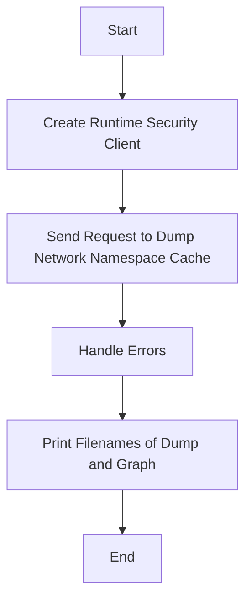

This document will cover the process of dumping network namespaces, which includes:

1. Creating a runtime security client
2. Sending a request to dump the network namespace cache
3. Handling errors
4. Printing the filenames of the dump and graph.

Technical document: <SwmLink doc-title="Dumping Network Namespaces">[Dumping Network Namespaces](/.swm/dumping-network-namespaces.u104ln55.sw.md)</SwmLink>

# [Creating a Runtime Security Client](https://app.swimm.io/repos/Z2l0aHViJTNBJTNBZGF0YWRvZy1hZ2VudCUzQSUzQVN3aW1tLURlbW8=/docs/u104ln55#creating-a-runtime-security-client)

The process begins by creating a runtime security client. This client is essential for interacting with the system's security features. It acts as a bridge between the user's request and the system's security mechanisms. Without this client, the system cannot process the request to dump the network namespaces.

# [Sending a Request to Dump the Network Namespace Cache](https://app.swimm.io/repos/Z2l0aHViJTNBJTNBZGF0YWRvZy1hZ2VudCUzQSUzQVN3aW1tLURlbW8=/docs/u104ln55#sending-a-request-to-dump-the-network-namespace-cache)

Once the runtime security client is created, a request is sent to dump the network namespace cache. This request instructs the system to gather all relevant data about the current network namespaces and prepare it for dumping. The network namespace cache contains information about the various network namespaces that are currently active on the system.

# [Handling Errors](https://app.swimm.io/repos/Z2l0aHViJTNBJTNBZGF0YWRvZy1hZ2VudCUzQSUzQVN3aW1tLURlbW8=/docs/u104ln55#handling-errors)

During the process of dumping the network namespace cache, errors may occur. These errors need to be handled appropriately to ensure that the system remains stable and that the user is informed of any issues. If an error occurs while creating the runtime security client or sending the request, the process is halted, and an error message is returned to the user. This ensures that the user is aware of any problems and can take corrective action.

# [Printing the Filenames of the Dump and Graph](https://app.swimm.io/repos/Z2l0aHViJTNBJTNBZGF0YWRvZy1hZ2VudCUzQSUzQVN3aW1tLURlbW8=/docs/u104ln55#printing-the-filenames-of-the-dump-and-graph)

After successfully dumping the network namespace cache, the system generates two files: a dump file and a graph file. The filenames of these files are printed to the user. The dump file contains the raw data of the network namespaces, while the graph file provides a visual representation of the network namespaces. These files are essential for users who need to analyze the network namespaces in detail.

&nbsp;

*This is an auto-generated document by Swimm AI 🌊 and has not yet been verified by a human*

<SwmMeta version="3.0.0" repo-id="Z2l0aHViJTNBJTNBZGF0YWRvZy1hZ2VudCUzQSUzQVN3aW1tLURlbW8=" repo-name="datadog-agent">Powered by [Swimm](/)</SwmMeta>
