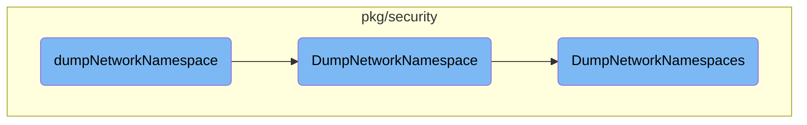

In this document, we will explain the process of dumping network namespaces. The process involves creating a runtime security client, sending a request to dump the network namespace cache, handling errors, and printing the filenames of the dump and graph.

The flow starts by creating a runtime security client. Once the client is created, a request is sent to dump the network namespace cache. If there are any errors during this process, they are handled appropriately. Finally, the filenames of the dump and graph are printed.

# Flow drill down



<SwmSnippet path="/cmd/security-agent/subcommands/runtime/command.go" line="342">

---

## Dumping Network Namespaces

The <SwmToken path="cmd/security-agent/subcommands/runtime/command.go" pos="342:2:2" line-data="func dumpNetworkNamespace(_ log.Component, _ config.Component, _ secrets.Component, dumpNetworkNamespaceArgs *dumpNetworkNamespaceCliParams) error {">`dumpNetworkNamespace`</SwmToken> function initiates the process by creating a runtime security client and sending a request to dump the network namespace cache. It handles errors and prints the filenames of the dump and graph.

```go
func dumpNetworkNamespace(_ log.Component, _ config.Component, _ secrets.Component, dumpNetworkNamespaceArgs *dumpNetworkNamespaceCliParams) error {
	client, err := secagent.NewRuntimeSecurityClient()
	if err != nil {
		return fmt.Errorf("unable to create a runtime security client instance: %w", err)
	}
	defer client.Close()

	resp, err := client.DumpNetworkNamespace(dumpNetworkNamespaceArgs.snapshotInterfaces)
	if err != nil {
		return fmt.Errorf("couldn't send network namespace cache dump request: %w", err)
	}

	if len(resp.GetError()) > 0 {
		return fmt.Errorf("couldn't dump network namespaces: %w", err)
	}

	fmt.Printf("Network namespace dump: %s\n", resp.GetDumpFilename())
	fmt.Printf("Network namespace dump graph: %s\n", resp.GetGraphFilename())
	return nil
}
```

---

</SwmSnippet>

<SwmSnippet path="/pkg/security/module/server_linux.go" line="187">

---

The <SwmToken path="pkg/security/module/server_linux.go" pos="187:9:9" line-data="func (a *APIServer) DumpNetworkNamespace(_ context.Context, params *api.DumpNetworkNamespaceParams) (*api.DumpNetworkNamespaceMessage, error) {">`DumpNetworkNamespace`</SwmToken> method in the <SwmToken path="pkg/security/module/server_linux.go" pos="187:6:6" line-data="func (a *APIServer) DumpNetworkNamespace(_ context.Context, params *api.DumpNetworkNamespaceParams) (*api.DumpNetworkNamespaceMessage, error) {">`APIServer`</SwmToken> handles the network namespace cache dump request. It delegates the task to the <SwmToken path="pkg/security/module/server_linux.go" pos="193:9:9" line-data="	return p.Resolvers.NamespaceResolver.DumpNetworkNamespaces(params), nil">`DumpNetworkNamespaces`</SwmToken> method of the <SwmToken path="pkg/security/module/server_linux.go" pos="193:7:7" line-data="	return p.Resolvers.NamespaceResolver.DumpNetworkNamespaces(params), nil">`NamespaceResolver`</SwmToken>.

```go
func (a *APIServer) DumpNetworkNamespace(_ context.Context, params *api.DumpNetworkNamespaceParams) (*api.DumpNetworkNamespaceMessage, error) {
	p, ok := a.probe.PlatformProbe.(*probe.EBPFProbe)
	if !ok {
		return nil, fmt.Errorf("not supported")
	}

	return p.Resolvers.NamespaceResolver.DumpNetworkNamespaces(params), nil
}
```

---

</SwmSnippet>

<SwmSnippet path="/pkg/security/resolvers/netns/resolver.go" line="652">

---

The <SwmToken path="pkg/security/resolvers/netns/resolver.go" pos="652:9:9" line-data="func (nr *Resolver) DumpNetworkNamespaces(params *api.DumpNetworkNamespaceParams) *api.DumpNetworkNamespaceMessage {">`DumpNetworkNamespaces`</SwmToken> method in the <SwmToken path="pkg/security/module/server_linux.go" pos="193:7:7" line-data="	return p.Resolvers.NamespaceResolver.DumpNetworkNamespaces(params), nil">`NamespaceResolver`</SwmToken> performs the actual dumping of network namespaces. It creates temporary files for the dump and graph, encodes the dump to JSON, and generates a dot graph.

```go
func (nr *Resolver) DumpNetworkNamespaces(params *api.DumpNetworkNamespaceParams) *api.DumpNetworkNamespaceMessage {
	resp := &api.DumpNetworkNamespaceMessage{}
	dump := nr.dump(params)

	// create the dump file
	dumpFile, err := newTmpFile("network-namespace-dump-*.json")
	if err != nil {
		resp.Error = fmt.Sprintf("couldn't create temporary file: %v", err)
		seclog.Warnf(resp.Error)
		return resp
	}
	defer dumpFile.Close()
	resp.DumpFilename = dumpFile.Name()

	// dump to JSON file
	encoder := json.NewEncoder(dumpFile)
	if err = encoder.Encode(dump); err != nil {
		resp.Error = fmt.Sprintf("couldn't encode list of network namespace: %v", err)
		seclog.Warnf(resp.Error)
		return resp
	}
```

---

</SwmSnippet>

&nbsp;

*This is an auto-generated document by Swimm AI 🌊 and has not yet been verified by a human*

<SwmMeta version="3.0.0" repo-id="Z2l0aHViJTNBJTNBZGF0YWRvZy1hZ2VudCUzQSUzQVN3aW1tLURlbW8=" repo-name="datadog-agent"><sup>Powered by [Swimm](/)</sup></SwmMeta>
