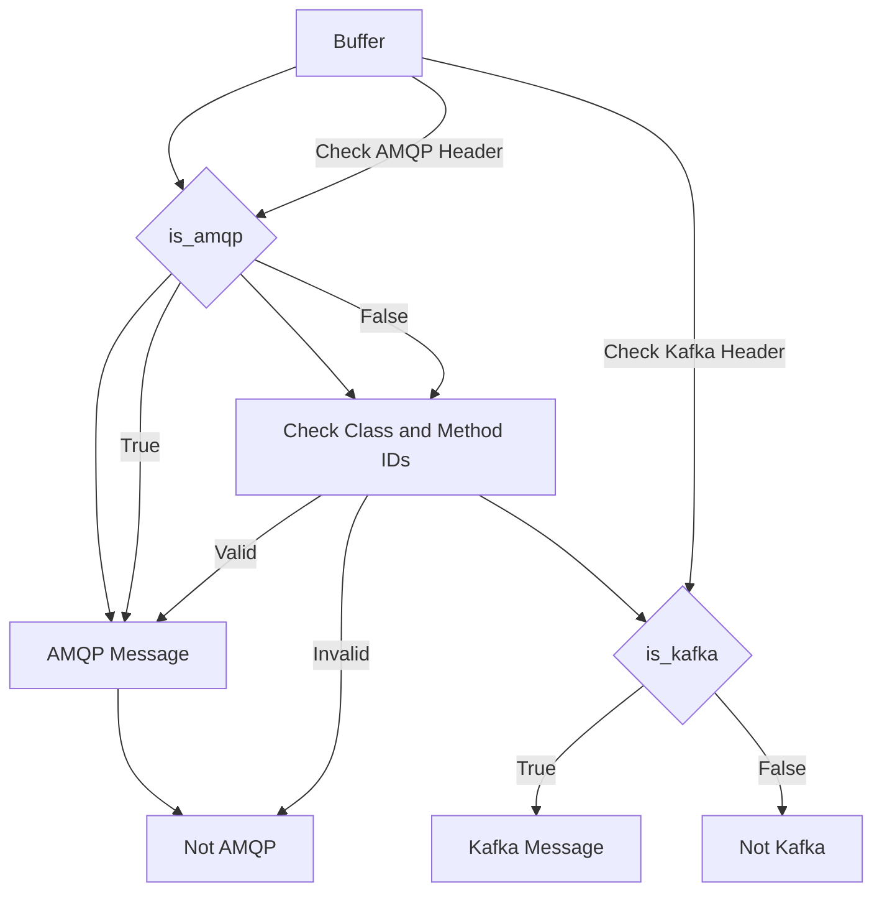

# Overview of <SwmToken path="pkg/network/ebpf/conntrack.go" pos="9:2:2" line-data="package ebpf">`ebpf`</SwmToken>

<SwmToken path="pkg/network/ebpf/conntrack.go" pos="9:2:2" line-data="package ebpf">`ebpf`</SwmToken> is used to run sandboxed programs in the kernel space, allowing for efficient and safe monitoring and tracing of network activities. In the network module, <SwmToken path="pkg/network/ebpf/conntrack.go" pos="9:2:2" line-data="package ebpf">`ebpf`</SwmToken> programs are utilized to collect and analyze network traffic data, providing insights into network performance and security.

# <SwmToken path="pkg/network/ebpf/conntrack.go" pos="9:2:2" line-data="package ebpf">`ebpf`</SwmToken> Programs in Network Monitoring

The <SwmPath>[pkg/network/ebpf/](pkg/network/ebpf/)</SwmPath> directory contains various subdirectories and files that define and implement <SwmToken path="pkg/network/ebpf/conntrack.go" pos="9:2:2" line-data="package ebpf">`ebpf`</SwmToken> programs for different network monitoring tasks. For example, the <SwmPath>[pkg/network/ebpf/conntrack.go](pkg/network/ebpf/conntrack.go)</SwmPath> file defines functions to handle connection tracking tuples, determining their family (IPv4 or <SwmToken path="pkg/network/ebpf/conntrack.go" pos="19:18:18" line-data="// Family returns whether a tuple is IPv4 or IPv6">`IPv6`</SwmToken>) and type (TCP or UDP), and retrieving source and destination addresses.

<SwmSnippet path="/pkg/network/ebpf/conntrack.go" line="8">

---

The <SwmPath>[pkg/network/ebpf/conntrack.go](pkg/network/ebpf/conntrack.go)</SwmPath> file defines functions to handle connection tracking tuples, determining their family (IPv4 or <SwmToken path="pkg/network/ebpf/conntrack.go" pos="19:18:18" line-data="// Family returns whether a tuple is IPv4 or IPv6">`IPv6`</SwmToken>) and type (TCP or UDP), and retrieving source and destination addresses.

```go
//nolint:revive // TODO(NET) Fix revive linter
package ebpf

import (
```

---

</SwmSnippet>

# <SwmToken path="pkg/network/ebpf/conntrack.go" pos="9:2:2" line-data="package ebpf">`ebpf`</SwmToken> Endpoints

Endpoints of <SwmToken path="pkg/network/ebpf/conntrack.go" pos="9:2:2" line-data="package ebpf">`ebpf`</SwmToken> include functions like <SwmToken path="pkg/network/ebpf/c/protocols/amqp/helpers.h" pos="21:6:6" line-data="static __always_inline bool is_amqp(const char* buf, __u32 buf_size) {">`is_amqp`</SwmToken> and <SwmToken path="pkg/network/ebpf/c/protocols/classification/protocol-classification.h" pos="125:6:6" line-data="static __always_inline protocol_t classify_queue_protocols(struct __sk_buff *skb, skb_info_t *skb_info, const char *buf, __u32 size) {">`classify_queue_protocols`</SwmToken> which are used to classify network protocols.

## <SwmToken path="pkg/network/ebpf/c/protocols/amqp/helpers.h" pos="21:6:6" line-data="static __always_inline bool is_amqp(const char* buf, __u32 buf_size) {">`is_amqp`</SwmToken>

The <SwmToken path="pkg/network/ebpf/c/protocols/amqp/helpers.h" pos="21:6:6" line-data="static __always_inline bool is_amqp(const char* buf, __u32 buf_size) {">`is_amqp`</SwmToken> function checks if a given buffer is an AMQP message. It first verifies if the buffer contains the AMQP protocol header. If not, it further validates the buffer by checking the class and method <SwmToken path="pkg/network/ebpf/c/protocols/amqp/helpers.h" pos="28:33:33" line-data="    // Validate that we will be able to get from the buffer the class and method ids.">`ids`</SwmToken> to determine if it is an AMQP message.

<SwmSnippet path="/pkg/network/ebpf/c/protocols/amqp/helpers.h" line="21">

---

The <SwmToken path="pkg/network/ebpf/c/protocols/amqp/helpers.h" pos="21:6:6" line-data="static __always_inline bool is_amqp(const char* buf, __u32 buf_size) {">`is_amqp`</SwmToken> function checks if a given buffer is an AMQP message. It first verifies if the buffer contains the AMQP protocol header. If not, it further validates the buffer by checking the class and method <SwmToken path="pkg/network/ebpf/c/protocols/amqp/helpers.h" pos="28:33:33" line-data="    // Validate that we will be able to get from the buffer the class and method ids.">`ids`</SwmToken> to determine if it is an AMQP message.

```c
static __always_inline bool is_amqp(const char* buf, __u32 buf_size) {
    // New connection should start with protocol header of AMQP.
    // Ref https://www.rabbitmq.com/resources/specs/amqp0-9-1.pdf.
    if (is_amqp_protocol_header(buf, buf_size)) {
        return true;
    }

    // Validate that we will be able to get from the buffer the class and method ids.
    if (buf_size < AMQP_MIN_PAYLOAD_LENGTH) {
       return false;
    }

    __u8 frame_type = buf[0];
    // Check only for method frame type.
    if (frame_type != AMQP_FRAME_METHOD_TYPE) {
        return false;
    }

    // We extract the class id and method id by big endian from the buffer.
    // Ref https://www.rabbitmq.com/resources/specs/amqp0-9-1.pdf.
    amqp_header *hdr = (amqp_header *)(buf+7);
```

---

</SwmSnippet>

## <SwmToken path="pkg/network/ebpf/c/protocols/classification/protocol-classification.h" pos="125:6:6" line-data="static __always_inline protocol_t classify_queue_protocols(struct __sk_buff *skb, skb_info_t *skb_info, const char *buf, __u32 size) {">`classify_queue_protocols`</SwmToken>

The <SwmToken path="pkg/network/ebpf/c/protocols/classification/protocol-classification.h" pos="125:6:6" line-data="static __always_inline protocol_t classify_queue_protocols(struct __sk_buff *skb, skb_info_t *skb_info, const char *buf, __u32 size) {">`classify_queue_protocols`</SwmToken> function checks if a given buffer is an AMQP or Kafka message. It uses helper functions like <SwmToken path="pkg/network/ebpf/c/protocols/amqp/helpers.h" pos="21:6:6" line-data="static __always_inline bool is_amqp(const char* buf, __u32 buf_size) {">`is_amqp`</SwmToken> and <SwmToken path="pkg/network/ebpf/c/protocols/classification/protocol-classification.h" pos="129:4:4" line-data="    if (is_kafka(skb, skb_info, buf, size)) {">`is_kafka`</SwmToken> to classify the protocol of the buffer.

<SwmSnippet path="/pkg/network/ebpf/c/protocols/classification/protocol-classification.h" line="124">

---

The <SwmToken path="pkg/network/ebpf/c/protocols/classification/protocol-classification.h" pos="125:6:6" line-data="static __always_inline protocol_t classify_queue_protocols(struct __sk_buff *skb, skb_info_t *skb_info, const char *buf, __u32 size) {">`classify_queue_protocols`</SwmToken> function checks if a given buffer is an AMQP or Kafka message. It uses helper functions like <SwmToken path="pkg/network/ebpf/c/protocols/classification/protocol-classification.h" pos="126:4:4" line-data="    if (is_amqp(buf, size)) {">`is_amqp`</SwmToken> and <SwmToken path="pkg/network/ebpf/c/protocols/classification/protocol-classification.h" pos="129:4:4" line-data="    if (is_kafka(skb, skb_info, buf, size)) {">`is_kafka`</SwmToken> to classify the protocol of the buffer.

```c
// Checks if a given buffer is amqp, and soon - kafka..
static __always_inline protocol_t classify_queue_protocols(struct __sk_buff *skb, skb_info_t *skb_info, const char *buf, __u32 size) {
    if (is_amqp(buf, size)) {
        return PROTOCOL_AMQP;
    }
    if (is_kafka(skb, skb_info, buf, size)) {
        return PROTOCOL_KAFKA;
    }

    return PROTOCOL_UNKNOWN;
}
```

---

</SwmSnippet>

&nbsp;

*This is an auto-generated document by Swimm AI 🌊 and has not yet been verified by a human*

<SwmMeta version="3.0.0" repo-id="Z2l0aHViJTNBJTNBZGF0YWRvZy1hZ2VudCUzQSUzQVN3aW1tLURlbW8=" repo-name="datadog-agent"><sup>Powered by [Swimm](/)</sup></SwmMeta>
