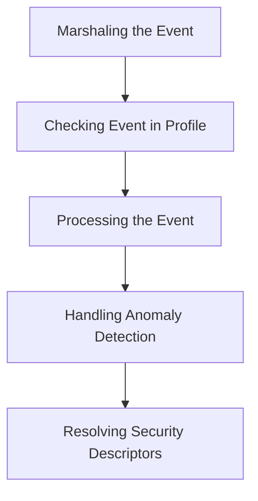

This document will cover the Event Dispatch Flow, which includes:

1. Marshaling the event
2. Checking if the event is already present in a profile
3. Processing the event
4. Handling anomaly detection
5. Resolving security descriptors.

Technical document: <SwmLink doc-title="Event Dispatch Flow">[Event Dispatch Flow](/.swm/event-dispatch-flow.zpczuq0o.sw.md)</SwmLink>

# [Marshaling the Event](https://app.swimm.io/repos/Z2l0aHViJTNBJTNBZGF0YWRvZy1hZ2VudCUzQSUzQVN3aW1tLURlbW8=/docs/zpczuq0o#marshalevent)

The first step in the event dispatch flow is to convert the event into a JSON format. This process is known as marshaling. By converting the event into a standardized format, it ensures that the event data can be easily transmitted and understood by other components in the system.

# [Checking if the Event is Already Present in a Profile](https://app.swimm.io/repos/Z2l0aHViJTNBJTNBZGF0YWRvZy1hZ2VudCUzQSUzQVN3aW1tLURlbW8=/docs/zpczuq0o#lookupeventinprofiles)

After marshaling, the system checks if the event is already present in any security profiles. This involves creating a profile selector based on the event's container tags and looking up the profile. If the profile is found and valid, it updates the profile context. This step helps in avoiding duplicate processing of events and ensures that the event context is up-to-date.

# [Processing the Event](https://app.swimm.io/repos/Z2l0aHViJTNBJTNBZGF0YWRvZy1hZ2VudCUzQSUzQVN3aW1tLURlbW8=/docs/zpczuq0o#processevent)

Once the event is confirmed to be unique or updated in the profile, it is processed. Processing involves various monitors and controllers that handle the event based on its type and context. This step ensures that the event is appropriately categorized and any necessary actions are taken.

# [Handling Anomaly Detection](https://app.swimm.io/repos/Z2l0aHViJTNBJTNBZGF0YWRvZy1hZ2VudCUzQSUzQVN3aW1tLURlbW8=/docs/zpczuq0o#sendanomalydetection)

If anomaly detection is enabled, the event is sent for anomaly detection. This involves gathering necessary tags and service information and dispatching a custom event for anomaly detection. This step is crucial for identifying and responding to unusual or suspicious activities in real-time.

# [Resolving Security Descriptors](https://app.swimm.io/repos/Z2l0aHViJTNBJTNBZGF0YWRvZy1hZ2VudCUzQSUzQVN3aW1tLURlbW8=/docs/zpczuq0o#resolveoldsecuritydescriptor)

Finally, the event's security descriptors are resolved to a human-readable format. This involves translating the security descriptors into a format that can be easily understood by administrators and security personnel. This step ensures that all security-related information is accessible and actionable.

&nbsp;

*This is an auto-generated document by Swimm AI 🌊 and has not yet been verified by a human*

<SwmMeta version="3.0.0" repo-id="Z2l0aHViJTNBJTNBZGF0YWRvZy1hZ2VudCUzQSUzQVN3aW1tLURlbW8=" repo-name="datadog-agent">Powered by [Swimm](/)</SwmMeta>
