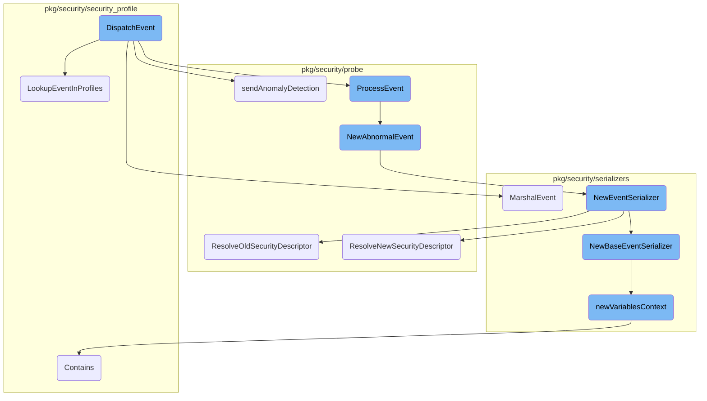
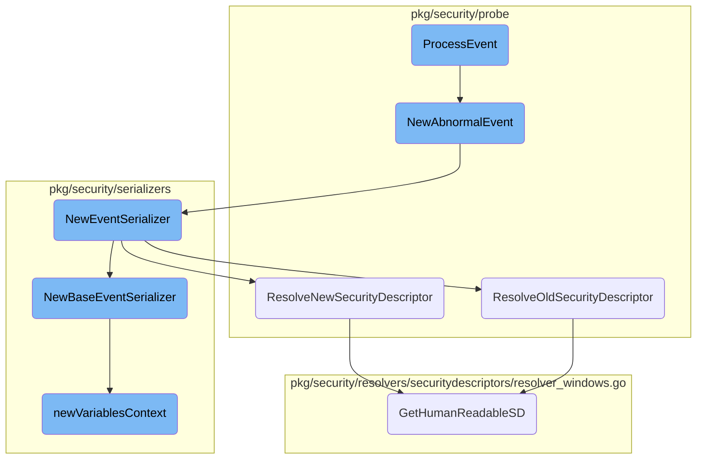
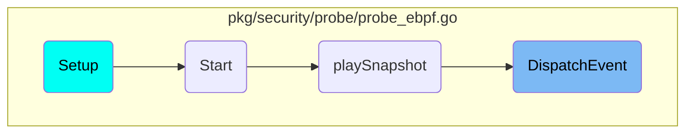

In this document, we will explain the process of dispatching an event. The process involves several steps, including marshaling the event, checking if it is already present in a profile, processing the event, and handling anomaly detection.

The flow starts with marshaling the event into a JSON format. Next, it checks if the event is already present in any security profiles. If the event is found in a profile, it updates the profile context. The event is then processed, and if anomaly detection is enabled, it is sent for anomaly detection. Finally, the event is serialized and any necessary security descriptors are resolved to a <SwmToken path="pkg/security/resolvers/securitydescriptors/resolver_windows.go" pos="35:16:18" line-data="// Map of access masks initials to their human-readable names">`human-readable`</SwmToken> format.

Here is a high level diagram of the flow, showing only the most important functions:



# Flow drill down

First, we'll zoom into this section of the flow:

```mermaid
graph TD;
      subgraph pkgsecuritysecurityprofileprofile["pkg/security/security_profile/profile"]
465412f3fc05fc947fdf0c0fb76045a573fae45c44321b8e078fa8fa967d5b96(DispatchEvent):::mainFlowStyle --> cb5575d564dc519ac38da9f8aa08e69c6b6fe6a1c976964336b064a5f7001181(LookupEventInProfiles)
end

subgraph pkgsecurityprobe["pkg/security/probe"]
465412f3fc05fc947fdf0c0fb76045a573fae45c44321b8e078fa8fa967d5b96(DispatchEvent):::mainFlowStyle --> f20881ce11da1ff60370cb8f1618aae95252dfe42eb0d7767d07b6d808b5ba7a(sendAnomalyDetection)
end

subgraph pkgsecurityserializersserializerswindowsgo["pkg/security/serializers/serializers_windows.go"]
465412f3fc05fc947fdf0c0fb76045a573fae45c44321b8e078fa8fa967d5b96(DispatchEvent):::mainFlowStyle --> 6558b8f20b4539d9dcb7fa8d8c000f706fa6e6f31910514a323e5c3ac413d48a(MarshalEvent)
end

subgraph pkgsecurityprobe["pkg/security/probe"]
465412f3fc05fc947fdf0c0fb76045a573fae45c44321b8e078fa8fa967d5b96(DispatchEvent):::mainFlowStyle --> 6a4d53520d009e41473d3bb96b346091f16855e7f5b9c5fb42da63cfdc2cfba3(ProcessEvent):::mainFlowStyle
end

subgraph pkgsecurityprobe["pkg/security/probe"]
6a4d53520d009e41473d3bb96b346091f16855e7f5b9c5fb42da63cfdc2cfba3(ProcessEvent):::mainFlowStyle --> y6g35(...)
end

subgraph pkgsecurityprobe["pkg/security/probe"]
f20881ce11da1ff60370cb8f1618aae95252dfe42eb0d7767d07b6d808b5ba7a(sendAnomalyDetection) --> 4931e3667a39161641d42de0407b34060ae5291088c7878ea071399a4c6dfd4a(EventMarshallerCtor)
end

subgraph pkgsecuritysecurityprofileprofile["pkg/security/security_profile/profile"]
cb5575d564dc519ac38da9f8aa08e69c6b6fe6a1c976964336b064a5f7001181(LookupEventInProfiles) --> 7901fb787cde965a6d411360ec4223b71d994c9906b04296bf19cea1d7c97de7(tryAutolearn)
end

subgraph pkgsecuritysecurityprofileprofile["pkg/security/security_profile/profile"]
cb5575d564dc519ac38da9f8aa08e69c6b6fe6a1c976964336b064a5f7001181(LookupEventInProfiles) --> 158c00026d1d7f92dcd8b6c84bb93660dccd4c8b6c6e1292262e524e5ceb83d0(getEventTypeState)
end

subgraph pkgsecuritysecurityprofileprofile["pkg/security/security_profile/profile"]
cb5575d564dc519ac38da9f8aa08e69c6b6fe6a1c976964336b064a5f7001181(LookupEventInProfiles) --> 739ee8df2efe1927700e81de795c27285fb7e4388eed28febf10ccbd2c1581e3(canGenerateAnomaliesFor)
end

subgraph pkgsecuritysecurityprofileprofile["pkg/security/security_profile/profile"]
cb5575d564dc519ac38da9f8aa08e69c6b6fe6a1c976964336b064a5f7001181(LookupEventInProfiles) --> b465fdc4a3a16e506ed9ecee30ceb962a8cd3f5ae861cf3215fe1d0ed8d28ba5(IsEventTypeValid)
end


      classDef mainFlowStyle color:#000000,fill:#7CB9F4
classDef rootsStyle color:#000000,fill:#00FFF4
classDef Style1 color:#000000,fill:#00FFAA
classDef Style2 color:#000000,fill:#FFFF00
classDef Style3 color:#000000,fill:#AA7CB9
```



<SwmSnippet path="/pkg/security/probe/probe_ebpf.go" line="422">

---

## <SwmToken path="pkg/security/probe/probe_ebpf.go" pos="422:2:2" line-data="// DispatchEvent sends an event to the probe event handler">`DispatchEvent`</SwmToken>

The <SwmToken path="pkg/security/probe/probe_ebpf.go" pos="422:2:2" line-data="// DispatchEvent sends an event to the probe event handler">`DispatchEvent`</SwmToken> function is responsible for sending an event to the probe event handler. It first marshals the event, checks if the event is already present in a profile, and then processes the event accordingly. If anomaly detection is enabled, it sends the event for anomaly detection.

```go
// DispatchEvent sends an event to the probe event handler
func (p *EBPFProbe) DispatchEvent(event *model.Event) {
	traceEvent("Dispatching event %s", func() ([]byte, model.EventType, error) {
		eventJSON, err := serializers.MarshalEvent(event, nil)
		return eventJSON, event.GetEventType(), err
	})

	// filter out event if already present on a profile
	if p.config.RuntimeSecurity.SecurityProfileEnabled {
		p.profileManagers.securityProfileManager.LookupEventInProfiles(event)
	}

	// mark the events that have an associated activity dump
	// this is needed for auto suppressions performed by the CWS rule engine
	if p.profileManagers.activityDumpManager != nil {
		if p.profileManagers.activityDumpManager.HasActiveActivityDump(event) {
			event.AddToFlags(model.EventFlagsHasActiveActivityDump)
		}
	}

	// send event to wildcard handlers, like the CWS rule engine, first
```

---

</SwmSnippet>

<SwmSnippet path="/pkg/security/security_profile/profile/manager.go" line="715">

---

## <SwmToken path="pkg/security/security_profile/profile/manager.go" pos="715:2:2" line-data="// LookupEventInProfiles lookups event in profiles">`LookupEventInProfiles`</SwmToken>

The <SwmToken path="pkg/security/security_profile/profile/manager.go" pos="715:2:2" line-data="// LookupEventInProfiles lookups event in profiles">`LookupEventInProfiles`</SwmToken> function checks if the event is already present in the security profiles. It creates a profile selector based on the event's container tags and looks up the profile. If the profile is found and valid, it updates the profile context and checks if the event should be injected into the profile automatically.

```go
// LookupEventInProfiles lookups event in profiles
func (m *SecurityProfileManager) LookupEventInProfiles(event *model.Event) {
	// ignore events with an error
	if event.Error != nil {
		return
	}

	// create profile selector
	event.FieldHandlers.ResolveContainerTags(event, event.ContainerContext)
	if len(event.ContainerContext.Tags) == 0 {
		return
	}
	selector, err := cgroupModel.NewWorkloadSelector(utils.GetTagValue("image_name", event.ContainerContext.Tags), "*")
	if err != nil {
		return
	}

	// lookup profile
	profile := m.GetProfile(selector)
	if profile == nil || profile.ActivityTree == nil {
		m.incrementEventFilteringStat(event.GetEventType(), model.NoProfile, NA)
```

---

</SwmSnippet>

<SwmSnippet path="/pkg/security/probe/probe_ebpf.go" line="405">

---

## <SwmToken path="pkg/security/probe/probe_ebpf.go" pos="405:9:9" line-data="func (p *EBPFProbe) sendAnomalyDetection(event *model.Event) {">`sendAnomalyDetection`</SwmToken>

The <SwmToken path="pkg/security/probe/probe_ebpf.go" pos="405:9:9" line-data="func (p *EBPFProbe) sendAnomalyDetection(event *model.Event) {">`sendAnomalyDetection`</SwmToken> function handles the dispatching of anomaly detection events. It gathers the necessary tags and service information, then dispatches a custom event for anomaly detection.

```go
func (p *EBPFProbe) sendAnomalyDetection(event *model.Event) {
	tags := p.probe.GetEventTags(string(event.ContainerContext.ContainerID))
	if service := p.probe.GetService(event); service != "" {
		tags = append(tags, "service:"+service)
	}

	p.probe.DispatchCustomEvent(
		events.NewCustomRule(events.AnomalyDetectionRuleID, events.AnomalyDetectionRuleDesc),
		events.NewCustomEventLazy(event.GetEventType(), p.EventMarshallerCtor(event), tags...),
	)
}
```

---

</SwmSnippet>

<SwmSnippet path="/pkg/security/serializers/serializers_windows.go" line="211">

---

## <SwmToken path="pkg/security/serializers/serializers_windows.go" pos="211:2:2" line-data="// MarshalEvent marshal the event">`MarshalEvent`</SwmToken>

The <SwmToken path="pkg/security/serializers/serializers_windows.go" pos="211:2:2" line-data="// MarshalEvent marshal the event">`MarshalEvent`</SwmToken> function is responsible for marshaling the event into a JSON format. It creates a new event serializer and then marshals it into a JSON byte array.

```go
// MarshalEvent marshal the event
func MarshalEvent(event *model.Event, opts *eval.Opts) ([]byte, error) {
	s := NewEventSerializer(event, opts)
	return json.Marshal(s)
}
```

---

</SwmSnippet>

<SwmSnippet path="/pkg/security/probe/probe_ebpf.go" line="480">

---

## <SwmToken path="pkg/security/probe/probe_ebpf.go" pos="480:2:2" line-data="// EventMarshallerCtor returns the event marshaller ctor">`EventMarshallerCtor`</SwmToken>

The <SwmToken path="pkg/security/probe/probe_ebpf.go" pos="480:2:2" line-data="// EventMarshallerCtor returns the event marshaller ctor">`EventMarshallerCtor`</SwmToken> function returns a constructor for the event marshaller. This constructor is used to create a new event serializer for the given event.

```go
// EventMarshallerCtor returns the event marshaller ctor
func (p *EBPFProbe) EventMarshallerCtor(event *model.Event) func() events.EventMarshaler {
	return func() events.EventMarshaler {
		return serializers.NewEventSerializer(event, nil)
	}
}
```

---

</SwmSnippet>

<SwmSnippet path="/pkg/security/security_profile/profile/manager.go" line="820">

---

## <SwmToken path="pkg/security/security_profile/profile/manager.go" pos="820:2:2" line-data="// tryAutolearn tries to autolearn the input event. It returns the profile state: stable, unstable, autolearning or workloadwarmup">`tryAutolearn`</SwmToken>

The <SwmToken path="pkg/security/security_profile/profile/manager.go" pos="820:2:2" line-data="// tryAutolearn tries to autolearn the input event. It returns the profile state: stable, unstable, autolearning or workloadwarmup">`tryAutolearn`</SwmToken> function attempts to autolearn the input event and returns the profile state. It checks if the event should be inserted into the profile and updates the profile state accordingly.

```go
// tryAutolearn tries to autolearn the input event. It returns the profile state: stable, unstable, autolearning or workloadwarmup
func (m *SecurityProfileManager) tryAutolearn(profile *SecurityProfile, ctx *VersionContext, event *model.Event, imageTag string) model.EventFilteringProfileState {
	profileState := m.getEventTypeState(profile, ctx, event, event.GetEventType(), imageTag)
	var nodeType activity_tree.NodeGenerationType
	if profileState == model.AutoLearning {
		nodeType = activity_tree.ProfileDrift
	} else if profileState == model.WorkloadWarmup {
		nodeType = activity_tree.WorkloadWarmup
	} else { // Stable or Unstable state
		return profileState
	}

	// here we are either in AutoLearning or WorkloadWarmup
	// try to insert the event in the profile

	// defines if we want or not to insert missing processes
	insertMissingProcesses := false
	if event.GetEventType() == model.ExecEventType {
		insertMissingProcesses = true
	} else if execState := m.getEventTypeState(profile, ctx, event, model.ExecEventType, imageTag); execState == model.AutoLearning || execState == model.WorkloadWarmup {
		insertMissingProcesses = true
```

---

</SwmSnippet>

<SwmSnippet path="/pkg/security/security_profile/profile/manager.go" line="957">

---

## <SwmToken path="pkg/security/security_profile/profile/manager.go" pos="957:9:9" line-data="func (m *SecurityProfileManager) getEventTypeState(profile *SecurityProfile, pctx *VersionContext, event *model.Event, eventType model.EventType, imageTag string) model.EventFilteringProfileState {">`getEventTypeState`</SwmToken>

The <SwmToken path="pkg/security/security_profile/profile/manager.go" pos="957:9:9" line-data="func (m *SecurityProfileManager) getEventTypeState(profile *SecurityProfile, pctx *VersionContext, event *model.Event, eventType model.EventType, imageTag string) model.EventFilteringProfileState {">`getEventTypeState`</SwmToken> function retrieves the state of the event type for the given profile. It checks if the event type is in an unstable or stable state and updates the profile state based on various conditions.

```go
func (m *SecurityProfileManager) getEventTypeState(profile *SecurityProfile, pctx *VersionContext, event *model.Event, eventType model.EventType, imageTag string) model.EventFilteringProfileState {
	eventState, ok := pctx.eventTypeState[event.GetEventType()]
	if !ok {
		eventState = &EventTypeState{
			lastAnomalyNano: pctx.firstSeenNano,
			state:           model.AutoLearning,
		}
		pctx.eventTypeState[eventType] = eventState
	} else if eventState.state == model.UnstableEventType {
		// If for the given event type we already are on UnstableEventType, just return
		// (once reached, this state is immutable)
		if eventType == event.GetEventType() { // increment stat only once for each event
			m.incrementEventFilteringStat(eventType, model.UnstableEventType, NA)
		}
		return model.UnstableEventType
	}

	var nodeType activity_tree.NodeGenerationType
	var profileState model.EventFilteringProfileState
	// check if we are at the beginning of a workload lifetime
	if event.ResolveEventTime().Sub(time.Unix(0, int64(event.ContainerContext.CreatedAt))) < m.config.RuntimeSecurity.AnomalyDetectionWorkloadWarmupPeriod {
```

---

</SwmSnippet>

<SwmSnippet path="/pkg/security/security_profile/profile/manager.go" line="672">

---

## <SwmToken path="pkg/security/security_profile/profile/manager.go" pos="672:9:9" line-data="func (m *SecurityProfileManager) canGenerateAnomaliesFor(e *model.Event) bool {">`canGenerateAnomaliesFor`</SwmToken>

The <SwmToken path="pkg/security/security_profile/profile/manager.go" pos="672:9:9" line-data="func (m *SecurityProfileManager) canGenerateAnomaliesFor(e *model.Event) bool {">`canGenerateAnomaliesFor`</SwmToken> function checks if anomaly detection is enabled and if the event type is configured for anomaly detection.

```go
func (m *SecurityProfileManager) canGenerateAnomaliesFor(e *model.Event) bool {
	return m.config.RuntimeSecurity.AnomalyDetectionEnabled && slices.Contains(m.config.RuntimeSecurity.AnomalyDetectionEventTypes, e.GetEventType())
}
```

---

</SwmSnippet>

<SwmSnippet path="/pkg/security/security_profile/profile/profile.go" line="179">

---

## <SwmToken path="pkg/security/security_profile/profile/profile.go" pos="179:2:2" line-data="// IsEventTypeValid is used to control which event types should trigger anomaly detection alerts">`IsEventTypeValid`</SwmToken>

The <SwmToken path="pkg/security/security_profile/profile/profile.go" pos="179:2:2" line-data="// IsEventTypeValid is used to control which event types should trigger anomaly detection alerts">`IsEventTypeValid`</SwmToken> function checks if the given event type should trigger anomaly detection alerts. It verifies if the event type is present in the profile's event types.

```go
// IsEventTypeValid is used to control which event types should trigger anomaly detection alerts
func (p *SecurityProfile) IsEventTypeValid(evtType model.EventType) bool {
	return slices.Contains(p.eventTypes, evtType)
}
```

---

</SwmSnippet>

Now, lets zoom into this section of the flow:



<SwmSnippet path="/pkg/security/probe/probe_monitor.go" line="149">

---

## Handling Event Errors

The <SwmToken path="pkg/security/probe/probe_monitor.go" pos="149:2:2" line-data="// ProcessEvent processes an event through the various monitors and controllers of the probe">`ProcessEvent`</SwmToken> function processes an event through various monitors and controllers. It first checks if internal monitoring is enabled and if the event has an error. Depending on the type of error, it dispatches a custom event using <SwmToken path="pkg/security/probe/probe_monitor.go" pos="168:1:1" line-data="			NewAbnormalEvent(events.AbnormalPathRuleID, events.AbnormalPathRuleDesc, event, pathErr.Err),">`NewAbnormalEvent`</SwmToken>.

```go
// ProcessEvent processes an event through the various monitors and controllers of the probe
func (m *EBPFMonitors) ProcessEvent(event *model.Event) {
	if !m.ebpfProbe.config.RuntimeSecurity.InternalMonitoringEnabled {
		return
	}

	// handle event errors
	if event.Error == nil {
		return
	}

	var notCritical *path.ErrPathResolutionNotCritical
	if errors.As(event.Error, &notCritical) {
		return
	}

	var pathErr *path.ErrPathResolution
	if errors.As(event.Error, &pathErr) {
		m.ebpfProbe.probe.DispatchCustomEvent(
			NewAbnormalEvent(events.AbnormalPathRuleID, events.AbnormalPathRuleDesc, event, pathErr.Err),
		)
```

---

</SwmSnippet>

<SwmSnippet path="/pkg/security/probe/custom_events.go" line="94">

---

## Creating Custom Events

The <SwmToken path="pkg/security/probe/custom_events.go" pos="94:2:2" line-data="// NewAbnormalEvent returns the rule and a populated custom event for a abnormal event">`NewAbnormalEvent`</SwmToken> function creates a new custom event for abnormal events. It initializes an <SwmToken path="pkg/security/probe/custom_events.go" pos="97:5:5" line-data="		evt := AbnormalEvent{">`AbnormalEvent`</SwmToken> with a serialized event and error message, fills common fields, and sets the timestamp. It then returns a custom rule and event.

```go
// NewAbnormalEvent returns the rule and a populated custom event for a abnormal event
func NewAbnormalEvent(id string, description string, event *model.Event, err error) (*rules.Rule, *events.CustomEvent) {
	marshalerCtor := func() events.EventMarshaler {
		evt := AbnormalEvent{
			Event: serializers.NewEventSerializer(event, nil),
			Error: err.Error(),
		}
		evt.FillCustomEventCommonFields()
		// Overwrite common timestamp with event timestamp
		evt.Timestamp = event.ResolveEventTime()

		return evt
	}

	return events.NewCustomRule(id, description), events.NewCustomEventLazy(errorToEventType(err), marshalerCtor)
}
```

---

</SwmSnippet>

<SwmSnippet path="/pkg/security/serializers/serializers_windows.go" line="222">

---

### Serializing Events

The <SwmToken path="pkg/security/serializers/serializers_windows.go" pos="222:2:2" line-data="// NewEventSerializer creates a new event serializer based on the event type">`NewEventSerializer`</SwmToken> function creates a new event serializer based on the event type. It initializes an <SwmToken path="pkg/security/serializers/serializers_windows.go" pos="223:21:21" line-data="func NewEventSerializer(event *model.Event, opts *eval.Opts) *EventSerializer {">`EventSerializer`</SwmToken> with a base serializer and user context. Depending on the event type, it adds specific serializers for file, registry, or permission change events.

```go
// NewEventSerializer creates a new event serializer based on the event type
func NewEventSerializer(event *model.Event, opts *eval.Opts) *EventSerializer {
	s := &EventSerializer{
		BaseEventSerializer:   NewBaseEventSerializer(event, opts),
		UserContextSerializer: newUserContextSerializer(event),
	}
	eventType := model.EventType(event.Type)

	switch eventType {
	case model.CreateNewFileEventType:
		s.FileEventSerializer = &FileEventSerializer{
			FileSerializer: *newFimFileSerializer(&event.CreateNewFile.File, event),
		}
	case model.FileRenameEventType:
		s.FileEventSerializer = &FileEventSerializer{
			FileSerializer: *newFimFileSerializer(&event.RenameFile.Old, event),
			Destination:    newFimFileSerializer(&event.RenameFile.New, event),
		}
	case model.DeleteFileEventType:
		s.FileEventSerializer = &FileEventSerializer{
			FileSerializer: *newFimFileSerializer(&event.DeleteFile.File, event),
```

---

</SwmSnippet>

<SwmSnippet path="/pkg/security/probe/field_handlers_windows.go" line="149">

---

### Resolving Security Descriptors

The <SwmToken path="pkg/security/probe/field_handlers_windows.go" pos="149:2:2" line-data="// ResolveOldSecurityDescriptor resolves the old security descriptor">`ResolveOldSecurityDescriptor`</SwmToken> function resolves the old security descriptor to a <SwmToken path="pkg/security/resolvers/securitydescriptors/resolver_windows.go" pos="35:16:18" line-data="// Map of access masks initials to their human-readable names">`human-readable`</SwmToken> format using the <SwmToken path="pkg/security/probe/field_handlers_windows.go" pos="151:14:14" line-data="	hrsd, err := fh.resolvers.SecurityDescriptorResolver.GetHumanReadableSD(cp.OldSd)">`GetHumanReadableSD`</SwmToken> method.

```go
// ResolveOldSecurityDescriptor resolves the old security descriptor
func (fh *FieldHandlers) ResolveOldSecurityDescriptor(_ *model.Event, cp *model.ChangePermissionEvent) string {
	hrsd, err := fh.resolvers.SecurityDescriptorResolver.GetHumanReadableSD(cp.OldSd)
	if err != nil {
		return cp.OldSd
	}
	return hrsd
}
```

---

</SwmSnippet>

<SwmSnippet path="/pkg/security/probe/field_handlers_windows.go" line="158">

---

The <SwmToken path="pkg/security/probe/field_handlers_windows.go" pos="158:2:2" line-data="// ResolveNewSecurityDescriptor resolves the old security descriptor">`ResolveNewSecurityDescriptor`</SwmToken> function resolves the new security descriptor to a <SwmToken path="pkg/security/resolvers/securitydescriptors/resolver_windows.go" pos="35:16:18" line-data="// Map of access masks initials to their human-readable names">`human-readable`</SwmToken> format using the <SwmToken path="pkg/security/probe/field_handlers_windows.go" pos="160:14:14" line-data="	hrsd, err := fh.resolvers.SecurityDescriptorResolver.GetHumanReadableSD(cp.NewSd)">`GetHumanReadableSD`</SwmToken> method.

```go
// ResolveNewSecurityDescriptor resolves the old security descriptor
func (fh *FieldHandlers) ResolveNewSecurityDescriptor(_ *model.Event, cp *model.ChangePermissionEvent) string {
	hrsd, err := fh.resolvers.SecurityDescriptorResolver.GetHumanReadableSD(cp.NewSd)
	if err != nil {
		return cp.NewSd
	}
	return hrsd
}
```

---

</SwmSnippet>

<SwmSnippet path="/pkg/security/serializers/serializers_base.go" line="314">

---

### Base Event Serializer

The <SwmToken path="pkg/security/serializers/serializers_base.go" pos="314:2:2" line-data="// NewBaseEventSerializer creates a new event serializer based on the event type">`NewBaseEventSerializer`</SwmToken> function creates a base event serializer. It initializes the serializer with event context, process context, and event time. It also handles anomaly detection events and categorizes the event type.

```go
// NewBaseEventSerializer creates a new event serializer based on the event type
func NewBaseEventSerializer(event *model.Event, opts *eval.Opts) *BaseEventSerializer {
	pc := event.ProcessContext

	eventType := model.EventType(event.Type)

	s := &BaseEventSerializer{
		EventContextSerializer: EventContextSerializer{
			Name:      eventType.String(),
			Variables: newVariablesContext(event, opts, ""),
		},
		ProcessContextSerializer: newProcessContextSerializer(pc, event),
		Date:                     utils.NewEasyjsonTime(event.ResolveEventTime()),
	}
	if s.ProcessContextSerializer != nil {
		s.ProcessContextSerializer.Variables = newVariablesContext(event, opts, "process.")
	}

	if event.IsAnomalyDetectionEvent() && len(event.Rules) > 0 {
		s.EventContextSerializer.MatchedRules = make([]MatchedRuleSerializer, 0, len(event.Rules))
		for _, r := range event.Rules {
```

---

</SwmSnippet>

<SwmSnippet path="/pkg/security/serializers/serializers_base.go" line="353">

---

### Variables Context

The <SwmToken path="pkg/security/serializers/serializers_base.go" pos="353:2:2" line-data="func newVariablesContext(e *model.Event, opts *eval.Opts, prefix string) (variables Variables) {">`newVariablesContext`</SwmToken> function creates a context for variables associated with an event. It iterates through the variable store, evaluates each variable, and scrubs sensitive information before adding it to the context.

```go
func newVariablesContext(e *model.Event, opts *eval.Opts, prefix string) (variables Variables) {
	if opts != nil && opts.VariableStore != nil {
		store := opts.VariableStore
		for name, variable := range store.Variables {
			if _, found := model.SECLVariables[name]; found {
				continue
			}

			if slices.Contains(bundled.InternalVariables[:], name) {
				continue
			}

			if (prefix != "" && !strings.HasPrefix(name, prefix)) ||
				(prefix == "" && strings.Contains(name, ".")) {
				continue
			}

			evaluator := variable.GetEvaluator()
			if evaluator, ok := evaluator.(eval.Evaluator); ok {
				value := evaluator.Eval(eval.NewContext(e))
				if variables == nil {
```

---

</SwmSnippet>

<SwmSnippet path="/pkg/security/resolvers/securitydescriptors/resolver_windows.go" line="98">

---

### <SwmToken path="pkg/security/resolvers/securitydescriptors/resolver_windows.go" pos="35:16:18" line-data="// Map of access masks initials to their human-readable names">`human-readable`</SwmToken> Security Descriptor

The <SwmToken path="pkg/security/resolvers/securitydescriptors/resolver_windows.go" pos="98:2:2" line-data="// GetHumanReadableSD parse SDDL string to extract and translate the owner, group, and DACL">`GetHumanReadableSD`</SwmToken> function parses an SDDL string to extract and translate the owner, group, and DACL. It uses regex to find <SwmToken path="pkg/security/resolvers/securitydescriptors/resolver_windows.go" pos="119:13:13" line-data="	// Use regex to find all ACEs">`ACEs`</SwmToken> and translates them into a <SwmToken path="pkg/security/resolvers/securitydescriptors/resolver_windows.go" pos="35:16:18" line-data="// Map of access masks initials to their human-readable names">`human-readable`</SwmToken> format, including permissions and trustee information.

```go
// GetHumanReadableSD parse SDDL string to extract and translate the owner, group, and DACL
func (resolver *Resolver) GetHumanReadableSD(sddl string) (string, error) {
	var builder strings.Builder

	// Extract the owner and group SIDs
	owner, group := extractOwnerGroup(sddl)
	if owner != "" {
		ownerName := resolver.userGroupResolver.GetUser(owner)
		if ownerName == "" {
			ownerName = owner // Fallback to SID string if account lookup fails
		}
		builder.WriteString(fmt.Sprintf("Owner: %s\n", ownerName))
	}
	if group != "" {
		groupName := resolver.userGroupResolver.GetUser(group)
		if groupName == "" {
			groupName = group // Fallback to SID string if account lookup fails
		}
		builder.WriteString(fmt.Sprintf("Group: %s\n", groupName))
	}

```

---

</SwmSnippet>

# Where is this flow used?

This flow is used once, in a flow starting from <SwmToken path="Dockerfiles/agent/secrets-helper/test_readsecret.py" pos="31:3:3" line-data="    def setUp(self):">`setUp`</SwmToken> as represented in the following diagram:



&nbsp;

*This is an auto-generated document by Swimm AI 🌊 and has not yet been verified by a human*

<SwmMeta version="3.0.0" repo-id="Z2l0aHViJTNBJTNBZGF0YWRvZy1hZ2VudCUzQSUzQVN3aW1tLURlbW8=" repo-name="datadog-agent"><sup>Powered by [Swimm](/)</sup></SwmMeta>
