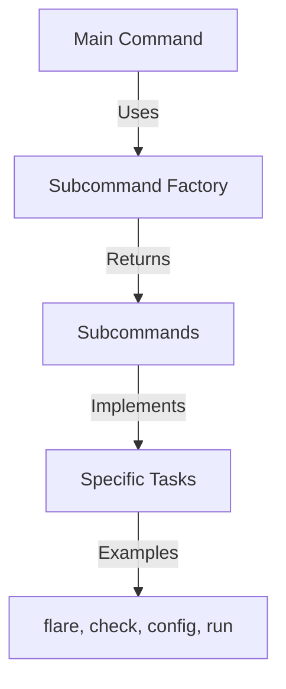

# Overview

Subcommands are specific commands that extend the functionality of the main command in the Datadog Agent. They are implemented in subpackages within the <SwmPath>[cmd/agent/subcommands/](cmd/agent/subcommands/)</SwmPath> directory.

# Subcommand Structure

Each subcommand is defined by a <SwmToken path="cmd/agent/subcommands/flare/command.go" pos="81:2:2" line-data="// Commands returns a slice of subcommands for the &#39;agent&#39; command.">`Commands`</SwmToken> function that returns a slice of <SwmToken path="cmd/agent/subcommands/flare/command.go" pos="82:14:17" line-data="func Commands(globalParams *command.GlobalParams) []*cobra.Command {">`*cobra.Command`</SwmToken> objects. These objects represent the individual subcommands and their associated behaviors.

<SwmSnippet path="/cmd/agent/subcommands/flare/command.go" line="81">

---

The <SwmToken path="cmd/agent/subcommands/flare/command.go" pos="88:5:5" line-data="		Use:   &quot;flare [caseID]&quot;,">`flare`</SwmToken> subcommand is used to collect diagnostic information and send it to Datadog. The <SwmToken path="cmd/agent/subcommands/flare/command.go" pos="87:1:1" line-data="	flareCmd := &amp;cobra.Command{">`flareCmd`</SwmToken> object is configured with various flags such as <SwmToken path="tasks/libs/pipeline/notifications.py" pos="149:10:10" line-data="def email_to_slackid(ctx: Context, email: str) -&gt; str:">`email`</SwmToken>, <SwmToken path="cmd/agent/subcommands/flare/command.go" pos="89:13:13" line-data="		Short: &quot;Collect a flare and send it to Datadog&quot;,">`send`</SwmToken>, <SwmToken path="tasks/libs/types/arch.py" pos="116:3:3" line-data="    def local() -&gt; Arch:">`local`</SwmToken>, <SwmToken path="cmd/agent/command/command.go" pos="70:52:52" line-data="		// Not even &#39;[command]&#39; is respected - try using their example &quot;add [-F file | -D dir]... [-f format] profile&quot;">`profile`</SwmToken>, and others to customize the flare generation process.

```go
// Commands returns a slice of subcommands for the 'agent' command.
func Commands(globalParams *command.GlobalParams) []*cobra.Command {
	cliParams := &cliParams{
		GlobalParams: globalParams,
	}

	flareCmd := &cobra.Command{
		Use:   "flare [caseID]",
		Short: "Collect a flare and send it to Datadog",
		Long:  ``,
		RunE: func(cmd *cobra.Command, args []string) error {
			cliParams.args = args
			config := config.NewAgentParams(globalParams.ConfFilePath,
				config.WithSecurityAgentConfigFilePaths([]string{
					path.Join(commonpath.DefaultConfPath, "security-agent.yaml"),
				}),
				config.WithConfigLoadSecurityAgent(true),
				config.WithIgnoreErrors(true),
				config.WithExtraConfFiles(globalParams.ExtraConfFilePath))

			return fxutil.OneShot(makeFlare,
```

---

</SwmSnippet>

# Global Parameters

The <SwmToken path="cmd/agent/subcommands/flare/command.go" pos="82:4:4" line-data="func Commands(globalParams *command.GlobalParams) []*cobra.Command {">`globalParams`</SwmToken> struct holds global configuration parameters that are passed to the subcommands. These parameters are populated when the subcommand's <SwmToken path="rtloader/test/python/datadog_checks/base/checks/__init__.py" pos="9:3:3" line-data="    def run(self):">`run`</SwmToken> or <SwmToken path="cmd/agent/subcommands/flare/command.go" pos="91:1:1" line-data="		RunE: func(cmd *cobra.Command, args []string) error {">`RunE`</SwmToken> function is called.

<SwmSnippet path="/cmd/agent/command/command.go" line="62">

---

The <SwmToken path="cmd/agent/command/command.go" pos="62:2:2" line-data="// MakeCommand makes the top-level Cobra command for this app.">`MakeCommand`</SwmToken> function creates the <SwmToken path="cmd/agent/command/command.go" pos="62:8:10" line-data="// MakeCommand makes the top-level Cobra command for this app.">`top-level`</SwmToken> Cobra command for the Datadog Agent. It initializes the <SwmToken path="cmd/agent/command/command.go" pos="64:1:1" line-data="	globalParams := GlobalParams{}">`globalParams`</SwmToken> and sets up the root command with its usage, description, and flags.

```go
// MakeCommand makes the top-level Cobra command for this app.
func MakeCommand(subcommandFactories []SubcommandFactory) *cobra.Command {
	globalParams := GlobalParams{}

	// AgentCmd is the root command
	agentCmd := &cobra.Command{
		// cobra will tokenize the "Use" string by space, and take the first one so there's no need to pass anything
		// besides the filename of the executable.
		// Not even '[command]' is respected - try using their example "add [-F file | -D dir]... [-f format] profile"
		// and it will still come out as "add [command]" in the help output.
		// If the file name contains a space, this will break - but this is not the case for the Agent executable.
		Use:   filepath.Base(os.Args[0]),
		Short: "Datadog Agent at your service.",
		Long: `
The Datadog Agent faithfully collects events and metrics and brings them
to Datadog on your behalf so that you can do something useful with your
monitoring and performance data.`,
		SilenceUsage: true,
	}

	agentCmd.PersistentFlags().StringVarP(&globalParams.ConfFilePath, "cfgpath", "c", "", "path to directory containing datadog.yaml")
```

---

</SwmSnippet>

# Subcommand Factory

The <SwmToken path="cmd/agent/command/command.go" pos="63:8:8" line-data="func MakeCommand(subcommandFactories []SubcommandFactory) *cobra.Command {">`SubcommandFactory`</SwmToken> type is a function that takes a pointer to <SwmToken path="cmd/agent/subcommands/flare/command.go" pos="82:4:4" line-data="func Commands(globalParams *command.GlobalParams) []*cobra.Command {">`globalParams`</SwmToken> and returns a slice of subcommands. This allows for dynamic creation of subcommands based on the provided global parameters.

<SwmSnippet path="/cmd/agent/subcommands/subcommands.go" line="42">

---

The <SwmToken path="cmd/agent/subcommands/subcommands.go" pos="42:2:2" line-data="// AgentSubcommands returns SubcommandFactories for the subcommands supported">`AgentSubcommands`</SwmToken> function returns a list of <SwmToken path="cmd/agent/subcommands/subcommands.go" pos="44:10:10" line-data="func AgentSubcommands() []command.SubcommandFactory {">`SubcommandFactory`</SwmToken> functions for the subcommands supported with the current build flags. This includes commands like <SwmToken path="cmd/agent/subcommands/flare/command.go" pos="88:5:5" line-data="		Use:   &quot;flare [caseID]&quot;,">`flare`</SwmToken>, <SwmToken path="pkg/collector/runner/runner_test.py" pos="10:3:3" line-data="    def check(self, instance):">`check`</SwmToken>, <SwmToken path="cmd/agent/subcommands/flare/command.go" pos="93:1:1" line-data="			config := config.NewAgentParams(globalParams.ConfFilePath,">`config`</SwmToken>, and <SwmToken path="rtloader/test/python/datadog_checks/base/checks/__init__.py" pos="9:3:3" line-data="    def run(self):">`run`</SwmToken>.

```go
// AgentSubcommands returns SubcommandFactories for the subcommands supported
// with the current build flags.
func AgentSubcommands() []command.SubcommandFactory {
	return []command.SubcommandFactory{
		cmdcheck.Commands,
		cmdconfigcheck.Commands,
		cmdconfig.Commands,
		cmddiagnose.Commands,
		cmddogstatsd.Commands,
		cmddogstatsdcapture.Commands,
		cmddogstatsdreplay.Commands,
		cmddogstatsdstats.Commands,
		cmdflare.Commands,
		cmdhealth.Commands,
		cmdhostname.Commands,
		cmdimport.Commands,
		cmdlaunchgui.Commands,
		cmdremoteconfig.Commands,
		cmdrun.Commands,
		cmdsecret.Commands,
		cmdsnmp.Commands,
```

---

</SwmSnippet>

# Registering Subcommands

Subcommands are registered with the main command using the <SwmToken path="cmd/agent/command/command.go" pos="62:2:2" line-data="// MakeCommand makes the top-level Cobra command for this app.">`MakeCommand`</SwmToken> function, which takes a list of <SwmToken path="cmd/agent/command/command.go" pos="63:8:8" line-data="func MakeCommand(subcommandFactories []SubcommandFactory) *cobra.Command {">`SubcommandFactory`</SwmToken> functions and integrates them into the main command.

<SwmSnippet path="/cmd/agent/main.go" line="31">

---

The <SwmToken path="cmd/agent/main.go" pos="31:2:2" line-data="func coreAgentMain() *cobra.Command {">`coreAgentMain`</SwmToken> function registers the subcommands with the main command by calling <SwmToken path="cmd/agent/main.go" pos="32:3:5" line-data="	return command.MakeCommand(subcommands.AgentSubcommands())">`command.MakeCommand`</SwmToken> with the list of subcommands returned by <SwmToken path="cmd/agent/main.go" pos="32:7:11" line-data="	return command.MakeCommand(subcommands.AgentSubcommands())">`subcommands.AgentSubcommands()`</SwmToken>.

```go
func coreAgentMain() *cobra.Command {
	return command.MakeCommand(subcommands.AgentSubcommands())
}
```

---

</SwmSnippet>

# Subcommand Endpoints

Subcommand endpoints define the specific tasks that each subcommand performs. Examples include the <SwmToken path="cmd/agent/subcommands/flare/command.go" pos="88:5:5" line-data="		Use:   &quot;flare [caseID]&quot;,">`flare`</SwmToken> and <SwmToken path="cmd/agent/subcommands/streamlogs/command.go" pos="60:7:7" line-data="			return fxutil.OneShot(streamLogs,">`streamLogs`</SwmToken> subcommands.

## Flare Endpoint

The <SwmToken path="cmd/agent/subcommands/flare/command.go" pos="88:5:5" line-data="		Use:   &quot;flare [caseID]&quot;,">`flare`</SwmToken> subcommand collects diagnostic information and sends it to Datadog. It is defined in the <SwmToken path="cmd/agent/subcommands/flare/command.go" pos="81:2:2" line-data="// Commands returns a slice of subcommands for the &#39;agent&#39; command.">`Commands`</SwmToken> function, which returns a slice of <SwmToken path="cmd/agent/subcommands/flare/command.go" pos="82:14:17" line-data="func Commands(globalParams *command.GlobalParams) []*cobra.Command {">`*cobra.Command`</SwmToken> objects.

## Streamlogs Endpoint

The <SwmToken path="cmd/agent/subcommands/streamlogs/command.go" pos="60:7:7" line-data="			return fxutil.OneShot(streamLogs,">`streamLogs`</SwmToken> subcommand streams logs from a running agent. It is defined in the <SwmToken path="cmd/agent/subcommands/flare/command.go" pos="81:2:2" line-data="// Commands returns a slice of subcommands for the &#39;agent&#39; command.">`Commands`</SwmToken> function, which returns a slice of <SwmToken path="cmd/agent/subcommands/flare/command.go" pos="82:14:17" line-data="func Commands(globalParams *command.GlobalParams) []*cobra.Command {">`*cobra.Command`</SwmToken> objects.

<SwmSnippet path="/cmd/agent/subcommands/streamlogs/command.go" line="49">

---

The <SwmToken path="cmd/agent/subcommands/streamlogs/command.go" pos="60:7:7" line-data="			return fxutil.OneShot(streamLogs,">`streamLogs`</SwmToken> subcommand is configured with flags like <SwmToken path="cmd/agent/subcommands/streamlogs/command.go" pos="67:14:14" line-data="	cmd.Flags().StringVar(&amp;cliParams.filters.Name, &quot;name&quot;, &quot;&quot;, &quot;Filter by name&quot;)">`Name`</SwmToken>, <SwmToken path="cmd/agent/subcommands/streamlogs/command.go" pos="68:14:14" line-data="	cmd.Flags().StringVar(&amp;cliParams.filters.Type, &quot;type&quot;, &quot;&quot;, &quot;Filter by type&quot;)">`Type`</SwmToken>, <SwmToken path="cmd/agent/subcommands/streamlogs/command.go" pos="69:14:14" line-data="	cmd.Flags().StringVar(&amp;cliParams.filters.Source, &quot;source&quot;, &quot;&quot;, &quot;Filter by source&quot;)">`Source`</SwmToken>, <SwmToken path="cmd/agent/command/command.go" pos="74:13:13" line-data="		Short: &quot;Datadog Agent at your service.&quot;,">`service`</SwmToken>, <SwmToken path="cmd/agent/command/command.go" pos="71:31:31" line-data="		// and it will still come out as &quot;add [command]&quot; in the help output.">`output`</SwmToken>, <SwmToken path="tasks/custom_task/custom_task.py" pos="58:25:25" line-data="    log_path: str, name: str, module: str, task_datetime: str, duration: float, task_result: str">`duration`</SwmToken>, and <SwmToken path="tasks/libs/common/utils.py" pos="462:10:10" line-data="def timed(name=&quot;&quot;, quiet=False):">`quiet`</SwmToken> to filter and manage the log streaming process.

```go
// Commands returns a slice of subcommands for the 'agent' command.
func Commands(globalParams *command.GlobalParams) []*cobra.Command {
	cliParams := &CliParams{
		GlobalParams: globalParams,
	}

	cmd := &cobra.Command{
		Use:   "stream-logs",
		Short: "Stream the logs being processed by a running agent",
		Long:  ``,
		RunE: func(cmd *cobra.Command, args []string) error {
			return fxutil.OneShot(streamLogs,
				fx.Supply(cliParams),
				fx.Supply(command.GetDefaultCoreBundleParams(cliParams.GlobalParams)),
				core.Bundle(),
			)
		},
	}
	cmd.Flags().StringVar(&cliParams.filters.Name, "name", "", "Filter by name")
	cmd.Flags().StringVar(&cliParams.filters.Type, "type", "", "Filter by type")
	cmd.Flags().StringVar(&cliParams.filters.Source, "source", "", "Filter by source")
```

---

</SwmSnippet>

&nbsp;

*This is an auto-generated document by Swimm AI 🌊 and has not yet been verified by a human*

<SwmMeta version="3.0.0" repo-id="Z2l0aHViJTNBJTNBZGF0YWRvZy1hZ2VudCUzQSUzQVN3aW1tLURlbW8=" repo-name="datadog-agent"><sup>Powered by [Swimm](/)</sup></SwmMeta>
