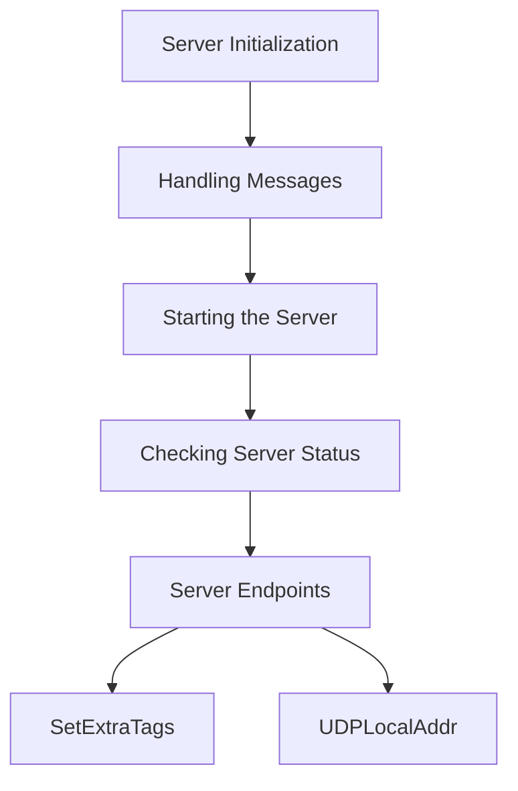

<SwmSnippet path="/comp/dogstatsd/server/server.go" line="99">

---

## Server Initialization

The <SwmToken path="comp/dogstatsd/server/server.go" pos="99:2:2" line-data="// Server represent a Dogstatsd server">`Server`</SwmToken> struct is defined with various components such as listeners, workers, and telemetry to handle incoming data and process it. This struct is crucial for the real-time collection and forwarding of monitoring data.

```go
// Server represent a Dogstatsd server
type server struct {
	log    log.Component
	config config.Reader
	// listeners are the instantiated socket listener (UDS or UDP or both)
	listeners []listeners.StatsdListener

	// demultiplexer will receive the metrics processed by the DogStatsD server,
	// will take care of processing them concurrently if possible, and will
	// also take care of forwarding the metrics to the intake.
	demultiplexer aggregator.Demultiplexer

	// running in their own routine, workers are responsible of parsing the packets
	// and pushing them to the aggregator
	workers []*worker

	packetsIn               chan packets.Packets
	captureChan             chan packets.Packets
	serverlessFlushChan     chan bool
	sharedPacketPool        *packets.Pool
	sharedPacketPoolManager *packets.PoolManager[packets.Packet]
```

---

</SwmSnippet>

<SwmSnippet path="/comp/dogstatsd/server/server.go" line="504">

---

## Handling Messages

The <SwmToken path="comp/dogstatsd/server/server.go" pos="504:9:9" line-data="func (s *server) handleMessages() {">`handleMessages`</SwmToken> method is responsible for starting the listeners and workers to process incoming data packets. It initializes listeners and spawns worker routines to handle message parsing and forwarding to the aggregator.

```go
func (s *server) handleMessages() {
	if s.Statistics != nil {
		go s.Statistics.Process()
		go s.Statistics.Update(&dogstatsdPacketsLastSec)
	}

	for _, l := range s.listeners {
		l.Listen()
	}

	workersCount, _ := aggregator.GetDogStatsDWorkerAndPipelineCount()

	// undocumented configuration field to force the amount of dogstatsd workers
	// mainly used for benchmarks or some very specific use-case.
	if configWC := s.config.GetInt("dogstatsd_workers_count"); configWC != 0 {
		s.log.Debug("Forcing the amount of DogStatsD workers to:", configWC)
		workersCount = configWC
	}

	s.log.Debug("DogStatsD will run", workersCount, "workers")
```

---

</SwmSnippet>

<SwmSnippet path="/comp/dogstatsd/server/server.go" line="470">

---

## Starting the Server

The <SwmToken path="tasks/kernel_matrix_testing/compiler.py" pos="104:3:3" line-data="    def start(self) -&gt; None:">`start`</SwmToken> method calls <SwmToken path="comp/dogstatsd/server/server.go" pos="470:3:3" line-data="	s.handleMessages()">`handleMessages`</SwmToken> to begin processing incoming data and sets the Server's <SwmToken path="comp/dogstatsd/server/server.go" pos="471:3:3" line-data="	s.Started = true">`Started`</SwmToken> status to true.

```go
	s.handleMessages()
	s.Started = true
```

---

</SwmSnippet>

<SwmSnippet path="/comp/dogstatsd/server/server.go" line="495">

---

## Checking Server Status

The <SwmToken path="comp/dogstatsd/server/server.go" pos="495:9:9" line-data="func (s *server) IsRunning() bool {">`IsRunning`</SwmToken> method returns the running status of the Server, indicating whether it has been started.

```go
func (s *server) IsRunning() bool {
	return s.Started
}
```

---

</SwmSnippet>

<SwmSnippet path="/comp/dogstatsd/server/server.go" line="183">

---

### <SwmToken path="comp/dogstatsd/server/server.go" pos="184:2:2" line-data="func newServer(deps dependencies) provides {">`newServer`</SwmToken>

The <SwmToken path="comp/dogstatsd/server/server.go" pos="184:2:2" line-data="func newServer(deps dependencies) provides {">`newServer`</SwmToken> function initializes a new Dogstatsd server instance. It sets up the necessary dependencies and configuration, and registers lifecycle hooks to start and stop the server.

```go
// TODO: (components) - merge with newServerCompat once NewServerlessServer is removed
func newServer(deps dependencies) provides {
	s := newServerCompat(deps.Config, deps.Log, deps.Replay, deps.Debug, deps.Params.Serverless, deps.Demultiplexer, deps.WMeta, deps.PidMap, deps.Telemetry)

	if deps.Config.GetBool("use_dogstatsd") {
		deps.Lc.Append(fx.Hook{
			OnStart: s.startHook,
			OnStop:  s.stop,
		})
	}

	return provides{
		Comp:          s,
		StatsEndpoint: api.NewAgentEndpointProvider(s.writeStats, "/dogstatsd-stats", "GET"),
	}
}
```

---

</SwmSnippet>

<SwmSnippet path="/comp/dogstatsd/server/server.go" line="495">

---

### <SwmToken path="comp/dogstatsd/server/server.go" pos="495:9:9" line-data="func (s *server) IsRunning() bool {">`IsRunning`</SwmToken>

The <SwmToken path="comp/dogstatsd/server/server.go" pos="495:9:9" line-data="func (s *server) IsRunning() bool {">`IsRunning`</SwmToken> method checks if the Dogstatsd server is currently running. It returns a boolean indicating the server's running state.

```go
func (s *server) IsRunning() bool {
	return s.Started
}
```

---

</SwmSnippet>

<SwmSnippet path="/comp/dogstatsd/server/server.go" line="532">

---

### <SwmToken path="comp/dogstatsd/server/server.go" pos="532:9:9" line-data="func (s *server) UDPLocalAddr() string {">`UDPLocalAddr`</SwmToken>

The <SwmToken path="comp/dogstatsd/server/server.go" pos="532:9:9" line-data="func (s *server) UDPLocalAddr() string {">`UDPLocalAddr`</SwmToken> function returns the local address of the UDP listener. This is useful for debugging and monitoring purposes, as it allows you to know the exact address the server is listening on.

```go
func (s *server) UDPLocalAddr() string {
	return s.udpLocalAddr
}
```

---

</SwmSnippet>

&nbsp;

*This is an auto-generated document by Swimm AI 🌊 and has not yet been verified by a human*

<SwmMeta version="3.0.0" repo-id="Z2l0aHViJTNBJTNBZGF0YWRvZy1hZ2VudCUzQSUzQVN3aW1tLURlbW8=" repo-name="datadog-agent"><sup>Powered by [Swimm](/)</sup></SwmMeta>
