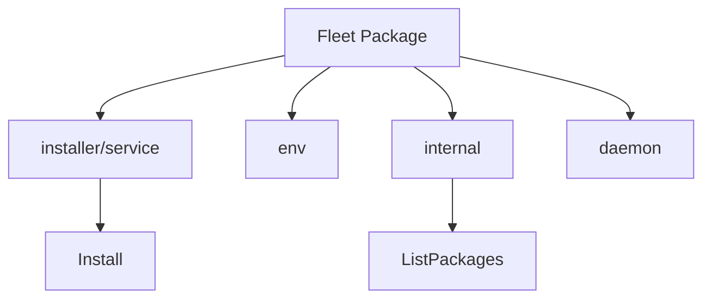

# Overview

Fleet is a package that provides functionalities for managing and interacting with various services and environments. It includes several components such as service installers, environment setup scripts, internal support packages, and a daemon for managing remote configurations and local APIs.

<SwmSnippet path="/pkg/fleet/installer/installer.go" line="1">

---

# Service Installation

The <SwmToken path="tasks/rtloader.py" pos="124:2:2" line-data="def install(ctx):">`install`</SwmToken> method in <SwmPath>[pkg/fleet/installer/installer.go](pkg/fleet/installer/installer.go)</SwmPath> handles the installation or updating of services. It ensures that all dependencies are met and that the service is correctly set up, which is essential for maintaining the integrity and functionality of the Fleet-managed services.

```go
// Unless explicitly stated otherwise all files in this repository are licensed
// under the Apache License Version 2.0.
// This product includes software developed at Datadog (https://www.datadoghq.com/).
// Copyright 2016-present Datadog, Inc.

// Package installer provides a package manager that installs and uninstalls packages.
package installer

import (
	"context"
	"errors"
	"fmt"
	"net/http"
	"os"
	"path/filepath"
	"strings"
	"sync"
	"time"

	"github.com/DataDog/datadog-agent/pkg/fleet/internal/paths"
```

---

</SwmSnippet>

<SwmSnippet path="/pkg/fleet/env/env.go" line="1">

---

# Environment Setup

The environment setup scripts in <SwmPath>[pkg/fleet/env/](pkg/fleet/env/)</SwmPath> are used to configure the environment in which Fleet services operate. This includes setting up necessary configurations and running tests to ensure the environment is correctly prepared.

```go
// Unless explicitly stated otherwise all files in this repository are licensed
// under the Apache License Version 2.0.
// This product includes software developed at Datadog (https://www.datadoghq.com/).
// Copyright 2016-present Datadog, Inc.

// Package env provides the environment variables for the installer.
package env

import (
	"fmt"
	"os"
	"slices"
	"strings"

	"github.com/DataDog/datadog-agent/pkg/config"
	"github.com/DataDog/datadog-agent/pkg/config/utils"
)

const (
	envAPIKey                = "DD_API_KEY"
```

---

</SwmSnippet>

<SwmSnippet path="/pkg/fleet/daemon/daemon.go" line="1">

---

# Daemon Management

The Fleet daemon, implemented in <SwmPath>[pkg/fleet/daemon/](pkg/fleet/daemon/)</SwmPath>, is responsible for managing remote configurations and local APIs. This allows Fleet to dynamically adjust its behavior based on remote settings and provide local API endpoints for interaction.

```go
// Unless explicitly stated otherwise all files in this repository are licensed
// under the Apache License Version 2.0.
// This product includes software developed at Datadog (https://www.datadoghq.com/).
// Copyright 2016-present Datadog, Inc.

// Package daemon implements the fleet long running daemon.
package daemon

import (
	"bytes"
	"context"
	"encoding/json"
	"errors"
	"fmt"
	"os"
	osexec "os/exec"
	"path/filepath"
	"runtime"
	"sync"
	"time"
```

---

</SwmSnippet>

# Fleet Endpoints

Fleet provides several endpoints for interacting with its services. The <SwmPath>[cmd/agent/subcommands/status/](cmd/agent/subcommands/status/)</SwmPath> endpoint retrieves the current status of the Fleet daemon, including the version, package states, and APM injection status. The <SwmToken path="pkg/fleet/daemon/local_api.go" pos="107:6:7" line-data="	r.HandleFunc(&quot;/catalog&quot;, l.setCatalog).Methods(http.MethodPost)">`/catalog`</SwmToken> endpoint is used to set the catalog for the Fleet daemon, accepting a POST request with the catalog data in JSON format.

<SwmSnippet path="/pkg/fleet/daemon/local_api.go" line="106">

---

The <SwmPath>[cmd/agent/subcommands/status/](cmd/agent/subcommands/status/)</SwmPath> endpoint is defined in <SwmPath>[pkg/fleet/daemon/local_api.go](pkg/fleet/daemon/local_api.go)</SwmPath> and is used to retrieve the current status of the Fleet daemon.

```go
	r.HandleFunc("/status", l.status).Methods(http.MethodGet)
	r.HandleFunc("/catalog", l.setCatalog).Methods(http.MethodPost)
	r.HandleFunc("/{package}/experiment/start", l.startExperiment).Methods(http.MethodPost)
```

---

</SwmSnippet>

&nbsp;

*This is an auto-generated document by Swimm AI 🌊 and has not yet been verified by a human*

<SwmMeta version="3.0.0" repo-id="Z2l0aHViJTNBJTNBZGF0YWRvZy1hZ2VudCUzQSUzQVN3aW1tLURlbW8=" repo-name="datadog-agent"><sup>Powered by [Swimm](/)</sup></SwmMeta>
