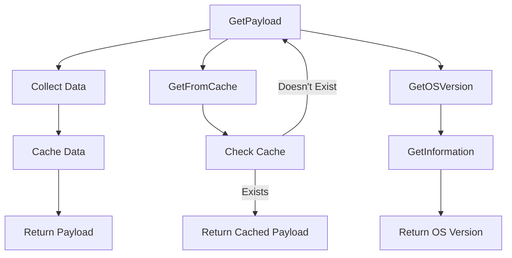

# Overview

Host metadata refers to the information about the machine where the Datadog Agent is running. This includes various details such as system statistics, network information, and installation methods.

# Payload Struct

The <SwmToken path="comp/metadata/host/hostimpl/utils/host.go" pos="86:2:2" line-data="// Payload handles the JSON unmarshalling of the metadata payload">`Payload`</SwmToken> struct in the <SwmToken path="comp/metadata/host/hostimpl/utils/host.go" pos="10:4:4" line-data="// Package utils generate host metadata payloads ready to be sent.">`utils`</SwmToken> package is responsible for handling the JSON unmarshalling of the host metadata payload. It includes fields for OS, agent flavor, Python version, system statistics, and other metadata.

<SwmSnippet path="/comp/metadata/host/hostimpl/utils/host.go" line="86">

---

The <SwmToken path="comp/metadata/host/hostimpl/utils/host.go" pos="86:2:2" line-data="// Payload handles the JSON unmarshalling of the metadata payload">`Payload`</SwmToken> struct defines the structure of the metadata payload, including fields for OS, agent flavor, Python version, system statistics, and other metadata.

```go
// Payload handles the JSON unmarshalling of the metadata payload
type Payload struct {
	Os            string            `json:"os"`
	AgentFlavor   string            `json:"agent-flavor"`
	PythonVersion string            `json:"python"`
	SystemStats   *systemStats      `json:"systemStats"`
	Meta          *Meta             `json:"meta"`
	HostTags      *hosttags.Tags    `json:"host-tags"`
	ContainerMeta map[string]string `json:"container-meta,omitempty"`
	NetworkMeta   *NetworkMeta      `json:"network"`
	LogsMeta      *LogsMeta         `json:"logs"`
	InstallMethod *InstallMethod    `json:"install-method"`
	ProxyMeta     *ProxyMeta        `json:"proxy-info"`
	OtlpMeta      *OtlpMeta         `json:"otlp"`
}
```

---

</SwmSnippet>

# <SwmToken path="comp/metadata/host/hostimpl/utils/host.go" pos="169:2:2" line-data="// GetPayload builds a metadata payload every time is called.">`GetPayload`</SwmToken> Function

The <SwmToken path="comp/metadata/host/hostimpl/utils/host.go" pos="169:2:2" line-data="// GetPayload builds a metadata payload every time is called.">`GetPayload`</SwmToken> function builds a metadata payload every time it is called. It collects some data only once, caches some, and collects some at every call. This function ensures that the metadata is up-to-date and ready to be sent.

<SwmSnippet path="/comp/metadata/host/hostimpl/utils/host.go" line="169">

---

The <SwmToken path="comp/metadata/host/hostimpl/utils/host.go" pos="169:2:2" line-data="// GetPayload builds a metadata payload every time is called.">`GetPayload`</SwmToken> function collects various pieces of metadata, including OS, agent flavor, Python version, system statistics, and more, to build the payload.

```go
// GetPayload builds a metadata payload every time is called.
// Some data is collected only once, some is cached, some is collected at every call.
func GetPayload(ctx context.Context, conf config.Reader) *Payload {
	hostnameData, err := hostname.GetWithProvider(ctx)
	if err != nil {
		log.Errorf("Error grabbing hostname for status: %v", err)
		hostnameData = hostname.Data{Hostname: "unknown", Provider: "unknown"}
	}

	meta := GetMeta(ctx, conf)
	meta.Hostname = hostnameData.Hostname

	p := &Payload{
		Os:            osName,
		AgentFlavor:   flavor.GetFlavor(),
		PythonVersion: python.GetPythonInfo(),
		SystemStats:   getSystemStats(),
		Meta:          meta,
		HostTags:      hosttags.Get(ctx, false, conf),
		ContainerMeta: containerMetadata.Get(1 * time.Second),
		NetworkMeta:   getNetworkMeta(ctx),
```

---

</SwmSnippet>

# <SwmToken path="comp/metadata/host/hostimpl/utils/host.go" pos="201:2:2" line-data="// GetFromCache returns the payload from the cache if it exists, otherwise it creates it.">`GetFromCache`</SwmToken> Function

The <SwmToken path="comp/metadata/host/hostimpl/utils/host.go" pos="201:2:2" line-data="// GetFromCache returns the payload from the cache if it exists, otherwise it creates it.">`GetFromCache`</SwmToken> function returns the payload from the cache if it exists; otherwise, it creates it. This ensures that the metadata reporting always grabs fresh data, while other uses, such as status checks, can use the cached data.

<SwmSnippet path="/comp/metadata/host/hostimpl/utils/host.go" line="201">

---

The <SwmToken path="comp/metadata/host/hostimpl/utils/host.go" pos="201:2:2" line-data="// GetFromCache returns the payload from the cache if it exists, otherwise it creates it.">`GetFromCache`</SwmToken> function checks if the payload is in the cache and returns it if found; otherwise, it calls <SwmToken path="comp/metadata/host/hostimpl/utils/host.go" pos="206:3:3" line-data="		return GetPayload(ctx, conf)">`GetPayload`</SwmToken> to create a new one.

```go
// GetFromCache returns the payload from the cache if it exists, otherwise it creates it.
// The metadata reporting should always grab it fresh. Any other uses, e.g. status, should use this
func GetFromCache(ctx context.Context, conf config.Reader) *Payload {
	data, found := cache.Cache.Get(hostCacheKey)
	if !found {
		return GetPayload(ctx, conf)
	}
	return data.(*Payload)
}
```

---

</SwmSnippet>

# <SwmToken path="comp/metadata/host/hostimpl/utils/host.go" pos="163:2:2" line-data="// GetOSVersion returns the current OS version">`GetOSVersion`</SwmToken> Function

The <SwmToken path="comp/metadata/host/hostimpl/utils/host.go" pos="163:2:2" line-data="// GetOSVersion returns the current OS version">`GetOSVersion`</SwmToken> function returns the current OS version by calling the <SwmToken path="comp/metadata/host/hostimpl/utils/host.go" pos="165:5:5" line-data="	hostInfo := GetInformation()">`GetInformation`</SwmToken> function, which retrieves various operating system metadata.

<SwmSnippet path="/comp/metadata/host/hostimpl/utils/host.go" line="163">

---

The <SwmToken path="comp/metadata/host/hostimpl/utils/host.go" pos="163:2:2" line-data="// GetOSVersion returns the current OS version">`GetOSVersion`</SwmToken> function retrieves the OS version by calling <SwmToken path="comp/metadata/host/hostimpl/utils/host.go" pos="165:5:5" line-data="	hostInfo := GetInformation()">`GetInformation`</SwmToken> and formatting the result.

```go
// GetOSVersion returns the current OS version
func GetOSVersion() string {
	hostInfo := GetInformation()
	return strings.Trim(hostInfo.Platform+" "+hostInfo.PlatformVersion, " ")
}
```

---

</SwmSnippet>

# <SwmToken path="comp/metadata/host/hostimpl/utils/host.go" pos="211:2:2" line-data="// GetPlatformName returns the name of the current platform">`GetPlatformName`</SwmToken> Function

The <SwmToken path="comp/metadata/host/hostimpl/utils/host.go" pos="211:2:2" line-data="// GetPlatformName returns the name of the current platform">`GetPlatformName`</SwmToken> function returns the name of the current platform by calling the <SwmToken path="comp/metadata/host/hostimpl/utils/host.go" pos="165:5:5" line-data="	hostInfo := GetInformation()">`GetInformation`</SwmToken> function.

<SwmSnippet path="/comp/metadata/host/hostimpl/utils/host.go" line="211">

---

The <SwmToken path="comp/metadata/host/hostimpl/utils/host.go" pos="211:2:2" line-data="// GetPlatformName returns the name of the current platform">`GetPlatformName`</SwmToken> function retrieves the platform name by calling <SwmToken path="comp/metadata/host/hostimpl/utils/host.go" pos="213:3:3" line-data="	return GetInformation().Platform">`GetInformation`</SwmToken>.

```go
// GetPlatformName returns the name of the current platform
func GetPlatformName() string {
	return GetInformation().Platform
}
```

---

</SwmSnippet>

&nbsp;

*This is an auto-generated document by Swimm AI 🌊 and has not yet been verified by a human*

<SwmMeta version="3.0.0" repo-id="Z2l0aHViJTNBJTNBZGF0YWRvZy1hZ2VudCUzQSUzQVN3aW1tLURlbW8=" repo-name="datadog-agent"><sup>Powered by [Swimm](/)</sup></SwmMeta>
