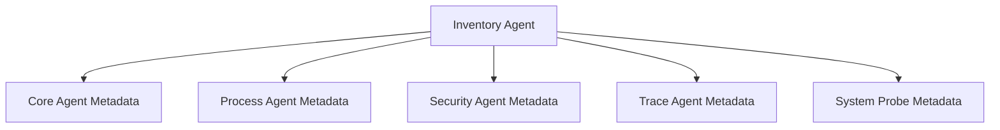

# Overview

The Inventory Agent is responsible for populating various agent-related fields in the <SwmToken path="comp/metadata/inventoryagent/inventoryagentimpl/inventoryagent.go" pos="86:17:17" line-data="	return nil, fmt.Errorf(&quot;could not split inventories agent payload any more, payload is too big for intake&quot;)">`inventories`</SwmToken> product in <SwmToken path="comp/metadata/inventoryagent/inventoryagentimpl/inventoryagent.go" pos="3:14:14" line-data="// This product includes software developed at Datadog (https://www.datadoghq.com/).">`Datadog`</SwmToken>, specifically in the <SwmToken path="comp/metadata/inventoryagent/inventoryagentimpl/inventoryagent.go" pos="23:10:12" line-data="	api &quot;github.com/DataDog/datadog-agent/comp/api/api/def&quot;">`datadog-agent`</SwmToken> table. This functionality is enabled by default but can be turned off using the `inventories_enabled` configuration.

# Metadata Collection

The Inventory Agent collects metadata from different components like the core agent, process agent, security agent, trace agent, and system probe, ensuring accurate and comprehensive data collection.

# Agent Configuration

The Inventory Agent is enabled by default but can be turned off using the `inventories_enabled` configuration. The payload is sent every 10 minutes or whenever it's updated, with at most one update every minute.

# Example Payload

The payload includes metadata such as the version of the OTel Agent, the command used to launch it, and various configurations provided by the customer or defined in the environment.

# Main Functions

There are several main functions in this folder. Some of them are <SwmToken path="comp/metadata/inventoryagent/inventoryagentimpl/inventoryagent.go" pos="155:9:9" line-data="func (ia *inventoryagent) initData() {">`initData`</SwmToken>, <SwmToken path="comp/metadata/inventoryagent/inventoryagentimpl/inventoryagent.go" pos="357:3:3" line-data="	ia.fetchCoreAgentMetadata()">`fetchCoreAgentMetadata`</SwmToken>, <SwmToken path="comp/metadata/inventoryagent/inventoryagentimpl/inventoryagent.go" pos="359:3:3" line-data="	ia.fetchSecurityAgentMetadata()">`fetchSecurityAgentMetadata`</SwmToken>, <SwmToken path="comp/metadata/inventoryagent/inventoryagentimpl/inventoryagent.go" pos="363:3:3" line-data="	ia.fetchTraceAgentMetadata()">`fetchTraceAgentMetadata`</SwmToken>, <SwmToken path="comp/metadata/inventoryagent/inventoryagentimpl/inventoryagent.go" pos="361:3:3" line-data="	ia.fetchProcessAgentMetadata()">`fetchProcessAgentMetadata`</SwmToken>, <SwmToken path="comp/metadata/inventoryagent/inventoryagentimpl/inventoryagent.go" pos="365:3:3" line-data="	ia.fetchSystemProbeMetadata()">`fetchSystemProbeMetadata`</SwmToken>, and <SwmToken path="comp/metadata/inventoryagent/inventoryagentimpl/inventoryagent.go" pos="355:9:9" line-data="func (ia *inventoryagent) refreshMetadata() {">`refreshMetadata`</SwmToken>. We will dive a little into <SwmToken path="comp/metadata/inventoryagent/inventoryagentimpl/inventoryagent.go" pos="155:9:9" line-data="func (ia *inventoryagent) initData() {">`initData`</SwmToken> and <SwmToken path="comp/metadata/inventoryagent/inventoryagentimpl/inventoryagent.go" pos="355:9:9" line-data="func (ia *inventoryagent) refreshMetadata() {">`refreshMetadata`</SwmToken>.

<SwmSnippet path="/comp/metadata/inventoryagent/inventoryagentimpl/inventoryagent.go" line="155">

---

## <SwmToken path="comp/metadata/inventoryagent/inventoryagentimpl/inventoryagent.go" pos="155:9:9" line-data="func (ia *inventoryagent) initData() {">`initData`</SwmToken>

The <SwmToken path="comp/metadata/inventoryagent/inventoryagentimpl/inventoryagent.go" pos="155:9:9" line-data="func (ia *inventoryagent) initData() {">`initData`</SwmToken> function initializes the metadata for the Inventory Agent. It gathers information about the installation method, hostname source, agent version, startup time, and flavor. This function ensures that the initial set of metadata is populated correctly.

```go
func (ia *inventoryagent) initData() {
	tool := "undefined"
	toolVersion := ""
	installerVersion := ""

	install, err := installinfoGet(ia.conf)
	if err == nil {
		tool = install.Tool
		toolVersion = install.ToolVersion
		installerVersion = install.InstallerVersion
	}
	ia.data["install_method_tool"] = tool
	ia.data["install_method_tool_version"] = toolVersion
	ia.data["install_method_installer_version"] = installerVersion

	data, err := hostname.GetWithProvider(context.Background())
	if err == nil {
		if data.Provider != "" && !data.FromFargate() {
			ia.data["hostname_source"] = data.Provider
		}
	} else {
```

---

</SwmSnippet>

<SwmSnippet path="/comp/metadata/inventoryagent/inventoryagentimpl/inventoryagent.go" line="355">

---

## <SwmToken path="comp/metadata/inventoryagent/inventoryagentimpl/inventoryagent.go" pos="355:9:9" line-data="func (ia *inventoryagent) refreshMetadata() {">`refreshMetadata`</SwmToken>

The <SwmToken path="comp/metadata/inventoryagent/inventoryagentimpl/inventoryagent.go" pos="355:9:9" line-data="func (ia *inventoryagent) refreshMetadata() {">`refreshMetadata`</SwmToken> function updates the metadata by calling various fetch functions. It collects metadata from different components like the core agent, security agent, process agent, trace agent, and system probe. This function ensures that the metadata is up-to-date and comprehensive.

```go
func (ia *inventoryagent) refreshMetadata() {
	// Core Agent / agent
	ia.fetchCoreAgentMetadata()
	// Compliance / security-agent
	ia.fetchSecurityAgentMetadata()
	// Process / process-agent
	ia.fetchProcessAgentMetadata()
	// APM / trace-agent
	ia.fetchTraceAgentMetadata()
	// system-probe ecosystem
	ia.fetchSystemProbeMetadata()
}
```

---

</SwmSnippet>

<SwmSnippet path="/comp/metadata/inventoryagent/inventoryagentimpl/inventoryagent.go" line="368">

---

## <SwmToken path="comp/metadata/inventoryagent/inventoryagentimpl/inventoryagent.go" pos="368:9:9" line-data="func (ia *inventoryagent) writePayloadAsJSON(w http.ResponseWriter, _ *http.Request) {">`writePayloadAsJSON`</SwmToken>

The <SwmToken path="comp/metadata/inventoryagent/inventoryagentimpl/inventoryagent.go" pos="368:9:9" line-data="func (ia *inventoryagent) writePayloadAsJSON(w http.ResponseWriter, _ *http.Request) {">`writePayloadAsJSON`</SwmToken> function is an endpoint that writes the inventory agent's payload as JSON to the HTTP response. This endpoint is useful for retrieving the current state of the inventory data in a JSON format.

```go
func (ia *inventoryagent) writePayloadAsJSON(w http.ResponseWriter, _ *http.Request) {
	// GetAsJSON already return scrubbed data
	scrubbed, err := ia.GetAsJSON()
	if err != nil {
		httputils.SetJSONError(w, err, 500)
		return
	}
	w.Write(scrubbed)
}
```

---

</SwmSnippet>

<SwmSnippet path="/comp/metadata/inventoryagent/inventoryagentimpl/inventoryagent.go" line="378">

---

## Set

The <SwmToken path="comp/metadata/inventoryagent/inventoryagentimpl/inventoryagent.go" pos="378:2:2" line-data="// Set updates a metadata value in the payload. The given value will be stored in the cache without being copied. It is">`Set`</SwmToken> function is an endpoint that updates a metadata value in the payload. The given value is stored in the cache without being copied, and it is up to the caller to ensure that the value is not modified later. This endpoint is useful for dynamically updating the inventory metadata.

```go
// Set updates a metadata value in the payload. The given value will be stored in the cache without being copied. It is
// up to the caller to make sure the given value will not be modified later.
func (ia *inventoryagent) Set(name string, value interface{}) {
	if !ia.Enabled {
		return
	}

	ia.log.Debugf("setting inventory agent metadata '%s': '%v'", name, value)

	ia.m.Lock()
	defer ia.m.Unlock()

	if !reflect.DeepEqual(ia.data[name], value) {
		ia.data[name] = value
		ia.Refresh()
	}
}
```

---

</SwmSnippet>

&nbsp;

*This is an auto-generated document by Swimm AI 🌊 and has not yet been verified by a human*

<SwmMeta version="3.0.0" repo-id="Z2l0aHViJTNBJTNBZGF0YWRvZy1hZ2VudCUzQSUzQVN3aW1tLURlbW8=" repo-name="datadog-agent"><sup>Powered by [Swimm](/)</sup></SwmMeta>
