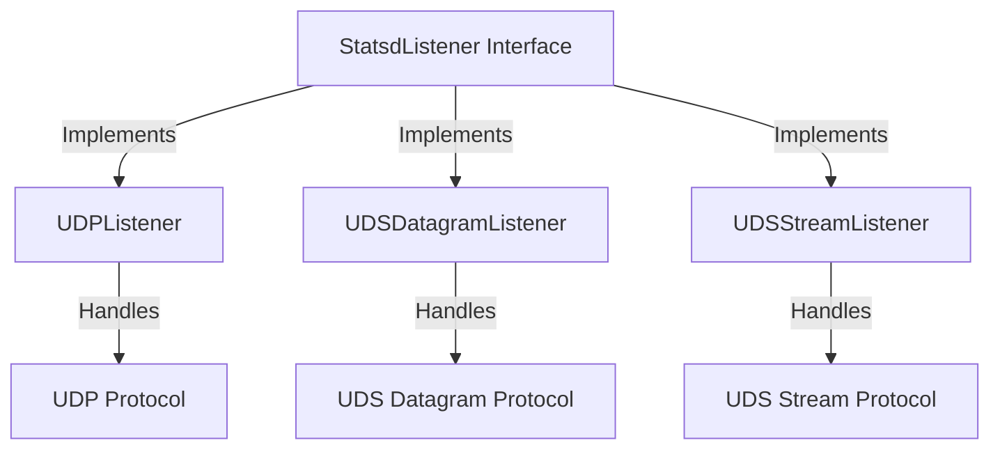

# Overview

Listeners handle the network transmission for statsd protocols and return packets to be processed by the <SwmToken path="comp/dogstatsd/listeners/named_pipe_windows.go" pos="170:6:6" line-data="	log.Debugf(&quot;dogstatsd-named-pipes: start listening a new named pipe client on %s&quot;, conn.LocalAddr())">`dogstatsd`</SwmToken> package. The <SwmToken path="comp/dogstatsd/listeners/types.go" pos="8:2:2" line-data="// StatsdListener opens a communication channel to get statsd packets in.">`StatsdListener`</SwmToken> interface is implemented by various listener types such as `UDPListener`, `UDSDatagramListener`, and `UDSStreamListener`.

# Listener Types

Each listener type is responsible for handling a specific protocol. For example, `UDPListener` handles the historical UDP protocol, while `UDSDatagramListener` and `UDSStreamListener` handle the host-local UDS protocol with optional origin detection.

# Importance of Listeners

Listeners are essential for receiving and processing metrics data, ensuring that the data is correctly transmitted and formatted for further analysis by the <SwmToken path="comp/dogstatsd/listeners/named_pipe_windows.go" pos="170:6:6" line-data="	log.Debugf(&quot;dogstatsd-named-pipes: start listening a new named pipe client on %s&quot;, conn.LocalAddr())">`dogstatsd`</SwmToken> package.

# Package <SwmToken path="comp/dogstatsd/listeners/types.go" pos="6:2:2" line-data="package listeners">`listeners`</SwmToken>

This package handles the network transmission for statsd protocols and returns packets to be processed by the <SwmToken path="comp/dogstatsd/listeners/named_pipe_windows.go" pos="170:6:6" line-data="	log.Debugf(&quot;dogstatsd-named-pipes: start listening a new named pipe client on %s&quot;, conn.LocalAddr())">`dogstatsd`</SwmToken> package.

## `CloudFoundryListener`

The `CloudFoundryListener` relies on the Cloud Foundry BBS API to detect container changes and creates corresponding Autodiscovery `Services`.

## `ServiceListener`

`ServiceListener` monitors events related to `Service` lifecycles. It then formats and transmits this data to `autoconfig`.

# <SwmToken path="comp/dogstatsd/listeners/types.go" pos="8:2:2" line-data="// StatsdListener opens a communication channel to get statsd packets in.">`StatsdListener`</SwmToken> Interface

The <SwmToken path="comp/dogstatsd/listeners/types.go" pos="8:2:2" line-data="// StatsdListener opens a communication channel to get statsd packets in.">`StatsdListener`</SwmToken> interface defines the methods <SwmToken path="comp/dogstatsd/listeners/types.go" pos="10:1:1" line-data="	Listen()">`Listen`</SwmToken> and <SwmToken path="comp/dogstatsd/listeners/types.go" pos="11:1:1" line-data="	Stop()">`Stop`</SwmToken>, which are essential for opening and closing communication channels to get statsd packets.

<SwmSnippet path="/comp/dogstatsd/listeners/types.go" line="8">

---

The <SwmToken path="comp/dogstatsd/listeners/types.go" pos="8:2:2" line-data="// StatsdListener opens a communication channel to get statsd packets in.">`StatsdListener`</SwmToken> interface defines the methods <SwmToken path="comp/dogstatsd/listeners/types.go" pos="10:1:1" line-data="	Listen()">`Listen`</SwmToken> and <SwmToken path="comp/dogstatsd/listeners/types.go" pos="11:1:1" line-data="	Stop()">`Stop`</SwmToken>, which are essential for opening and closing communication channels to get statsd packets.

```go
// StatsdListener opens a communication channel to get statsd packets in.
type StatsdListener interface {
	Listen()
	Stop()
}
```

---

</SwmSnippet>

# Example: <SwmToken path="comp/dogstatsd/listeners/named_pipe_windows.go" pos="169:9:9" line-data="func (l *NamedPipeListener) listenConnection(conn net.Conn, buffer []byte) {">`listenConnection`</SwmToken> Function

The <SwmToken path="comp/dogstatsd/listeners/named_pipe_windows.go" pos="169:9:9" line-data="func (l *NamedPipeListener) listenConnection(conn net.Conn, buffer []byte) {">`listenConnection`</SwmToken> function in <SwmToken path="comp/dogstatsd/listeners/named_pipe_windows.go" pos="169:6:6" line-data="func (l *NamedPipeListener) listenConnection(conn net.Conn, buffer []byte) {">`NamedPipeListener`</SwmToken> demonstrates how a listener reads data from a connection, processes it, and handles errors.

<SwmSnippet path="/comp/dogstatsd/listeners/named_pipe_windows.go" line="169">

---

The <SwmToken path="comp/dogstatsd/listeners/named_pipe_windows.go" pos="169:9:9" line-data="func (l *NamedPipeListener) listenConnection(conn net.Conn, buffer []byte) {">`listenConnection`</SwmToken> function in <SwmToken path="comp/dogstatsd/listeners/named_pipe_windows.go" pos="169:6:6" line-data="func (l *NamedPipeListener) listenConnection(conn net.Conn, buffer []byte) {">`NamedPipeListener`</SwmToken> demonstrates how a listener reads data from a connection, processes it, and handles errors.

```go
func (l *NamedPipeListener) listenConnection(conn net.Conn, buffer []byte) {
	log.Debugf("dogstatsd-named-pipes: start listening a new named pipe client on %s", conn.LocalAddr())
	startWriteIndex := 0
	var t1, t2 time.Time
	for {
		bytesRead, err := conn.Read(buffer[startWriteIndex:])

		t1 = time.Now()

		if err != nil {
			if err == io.EOF {
				log.Debugf("dogstatsd-named-pipes: client disconnected from %s", conn.LocalAddr())
				break
			}

			// NamedPipeListener.Stop uses a timeout to stop listening.
			if err == winio.ErrTimeout {
				log.Debugf("dogstatsd-named-pipes: stop listening a named pipe client on %s", conn.LocalAddr())
				break
			}
			log.Errorf("dogstatsd-named-pipes: error reading packet: %v", err.Error())
```

---

</SwmSnippet>

# Main Functions

The main functions of listeners include handling network transmission for statsd protocols and ensuring that metrics data is correctly received and processed by the <SwmToken path="comp/dogstatsd/listeners/named_pipe_windows.go" pos="170:6:6" line-data="	log.Debugf(&quot;dogstatsd-named-pipes: start listening a new named pipe client on %s&quot;, conn.LocalAddr())">`dogstatsd`</SwmToken> package.

## `ServiceListener`

The `ServiceListener` listens for events related to services the agent should monitor. It is responsible for detecting changes in services and creating corresponding Autodiscovery `Services`. This functionality is crucial for the agent to dynamically adapt to changes in the environment and ensure that all relevant services are monitored.

## <SwmToken path="comp/dogstatsd/listeners/types.go" pos="8:2:2" line-data="// StatsdListener opens a communication channel to get statsd packets in.">`StatsdListener`</SwmToken>

The <SwmToken path="comp/dogstatsd/listeners/types.go" pos="8:2:2" line-data="// StatsdListener opens a communication channel to get statsd packets in.">`StatsdListener`</SwmToken> is the common interface for handling network transmission for statsd protocols. It is implemented by various listener types such as `UDPListener`, `UDSDatagramListener`, and `UDSStreamListener`. Each listener type handles a specific protocol, ensuring that metrics data is correctly received and processed by the <SwmToken path="comp/dogstatsd/listeners/named_pipe_windows.go" pos="170:6:6" line-data="	log.Debugf(&quot;dogstatsd-named-pipes: start listening a new named pipe client on %s&quot;, conn.LocalAddr())">`dogstatsd`</SwmToken> package.

&nbsp;

*This is an auto-generated document by Swimm AI 🌊 and has not yet been verified by a human*

<SwmMeta version="3.0.0" repo-id="Z2l0aHViJTNBJTNBZGF0YWRvZy1hZ2VudCUzQSUzQVN3aW1tLURlbW8=" repo-name="datadog-agent"><sup>Powered by [Swimm](/)</sup></SwmMeta>
