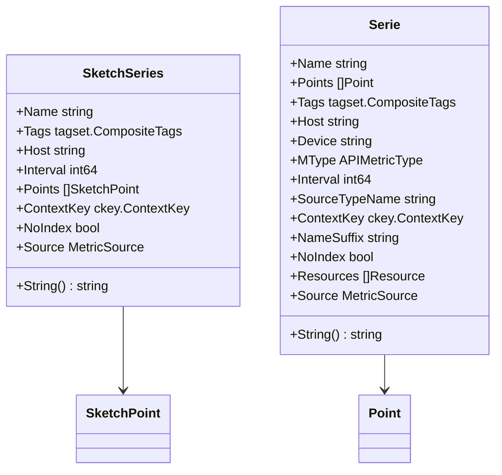

# Exploring Metrics in Packages

Metrics refer to the various types of data points that the Datadog Agent collects and processes. These metrics are essential for monitoring and analyzing the performance and health of systems.

## Types of Metrics

The different types of metrics include gauge, counter, count, histogram, historate, monotonic_count, percentile, rate, and set. Each type serves a specific purpose in tracking and analyzing different aspects of system performance.

## Main Functions

There are several main functions in this folder. Some of them are `addSample`, <SwmToken path="tasks/gotest.py" pos="63:3:3" line-data="    def flush(self):">`flush`</SwmToken>, `gauge`, `counter`, <SwmToken path="pkg/network/tracer/testdata/reuseport.py" pos="14:0:0" line-data="count = range(2)">`count`</SwmToken>, `histogram`, `historate`, `monotonic_count`, `percentile`, `rate`, `set`, `service_check`, and <SwmToken path="test/integration/serverless/src/logPython.py" pos="8:4:4" line-data="def log(event, context):">`event`</SwmToken>. We will dive a little into `addSample` and <SwmToken path="tasks/gotest.py" pos="63:3:3" line-data="    def flush(self):">`flush`</SwmToken>.

### addSample

The `addSample` function is used to add a new sample to the metrics.

### flush

The <SwmToken path="tasks/gotest.py" pos="63:3:3" line-data="    def flush(self):">`flush`</SwmToken> function aggregates all samples received since the last flush and returns a <SwmToken path="test/e2e/containers/fake_datadog/app/api.py" pos="202:2:2" line-data="def series():">`series`</SwmToken> to be forwarded to the Datadog backend.

## Metrics Endpoints

Metrics endpoints are crucial for collecting and serializing metric data points. Two primary structs are used for this purpose: <SwmToken path="pkg/metrics/sketch_series.go" pos="19:2:2" line-data="type SketchSeries struct {">`SketchSeries`</SwmToken> and <SwmToken path="pkg/metrics/series.go" pos="48:2:2" line-data="// Serie holds a timeseries (w/ json serialization to DD API format)">`Serie`</SwmToken>.

<SwmSnippet path="/pkg/metrics/sketch_series.go" line="19">

---

### <SwmToken path="pkg/metrics/sketch_series.go" pos="19:2:2" line-data="type SketchSeries struct {">`SketchSeries`</SwmToken>

The <SwmToken path="pkg/metrics/sketch_series.go" pos="19:2:2" line-data="type SketchSeries struct {">`SketchSeries`</SwmToken> struct represents a timeseries of quantile sketches. It includes fields such as <SwmToken path="pkg/metrics/sketch_series.go" pos="20:1:1" line-data="	Name       string               `json:&quot;metric&quot;`">`Name`</SwmToken>, <SwmToken path="pkg/metrics/sketch_series.go" pos="21:1:1" line-data="	Tags       tagset.CompositeTags `json:&quot;tags&quot;`">`Tags`</SwmToken>, <SwmToken path="pkg/metrics/sketch_series.go" pos="22:1:1" line-data="	Host       string               `json:&quot;host&quot;`">`Host`</SwmToken>, <SwmToken path="pkg/metrics/sketch_series.go" pos="23:1:1" line-data="	Interval   int64                `json:&quot;interval&quot;`">`Interval`</SwmToken>, <SwmToken path="pkg/metrics/sketch_series.go" pos="24:1:1" line-data="	Points     []SketchPoint        `json:&quot;points&quot;`">`Points`</SwmToken>, <SwmToken path="pkg/metrics/sketch_series.go" pos="25:1:1" line-data="	ContextKey ckey.ContextKey      `json:&quot;-&quot;`">`ContextKey`</SwmToken>, <SwmToken path="pkg/metrics/sketch_series.go" pos="26:1:1" line-data="	NoIndex    bool                 `json:&quot;-&quot;` // This is only used by api V2">`NoIndex`</SwmToken>, and <SwmToken path="pkg/metrics/sketch_series.go" pos="27:1:1" line-data="	Source     MetricSource         `json:&quot;-&quot;` // This is only used by api V2">`Source`</SwmToken>. This struct is used to collect and serialize quantile sketches for metrics.

```go
type SketchSeries struct {
	Name       string               `json:"metric"`
	Tags       tagset.CompositeTags `json:"tags"`
	Host       string               `json:"host"`
	Interval   int64                `json:"interval"`
	Points     []SketchPoint        `json:"points"`
	ContextKey ckey.ContextKey      `json:"-"`
	NoIndex    bool                 `json:"-"` // This is only used by api V2
	Source     MetricSource         `json:"-"` // This is only used by api V2
}
```

---

</SwmSnippet>

<SwmSnippet path="/pkg/metrics/series.go" line="48">

---

### Serie

The <SwmToken path="pkg/metrics/series.go" pos="48:2:2" line-data="// Serie holds a timeseries (w/ json serialization to DD API format)">`Serie`</SwmToken> struct holds a timeseries and includes fields such as <SwmToken path="pkg/metrics/series.go" pos="50:1:1" line-data="	Name           string               `json:&quot;metric&quot;`">`Name`</SwmToken>, <SwmToken path="pkg/metrics/series.go" pos="51:1:1" line-data="	Points         []Point              `json:&quot;points&quot;`">`Points`</SwmToken>, <SwmToken path="pkg/metrics/series.go" pos="52:1:1" line-data="	Tags           tagset.CompositeTags `json:&quot;tags&quot;`">`Tags`</SwmToken>, <SwmToken path="pkg/metrics/series.go" pos="53:1:1" line-data="	Host           string               `json:&quot;host&quot;`">`Host`</SwmToken>, <SwmToken path="pkg/metrics/series.go" pos="54:1:1" line-data="	Device         string               `json:&quot;device,omitempty&quot;`">`Device`</SwmToken>, <SwmToken path="pkg/metrics/series.go" pos="55:1:1" line-data="	MType          APIMetricType        `json:&quot;type&quot;`">`MType`</SwmToken>, <SwmToken path="pkg/metrics/series.go" pos="56:1:1" line-data="	Interval       int64                `json:&quot;interval&quot;`">`Interval`</SwmToken>, <SwmToken path="pkg/metrics/series.go" pos="57:1:1" line-data="	SourceTypeName string               `json:&quot;source_type_name,omitempty&quot;`">`SourceTypeName`</SwmToken>, <SwmToken path="pkg/metrics/series.go" pos="58:1:1" line-data="	ContextKey     ckey.ContextKey      `json:&quot;-&quot;`">`ContextKey`</SwmToken>, <SwmToken path="pkg/metrics/series.go" pos="59:1:1" line-data="	NameSuffix     string               `json:&quot;-&quot;`">`NameSuffix`</SwmToken>, <SwmToken path="pkg/metrics/series.go" pos="60:1:1" line-data="	NoIndex        bool                 `json:&quot;-&quot;` // This is only used by api V2">`NoIndex`</SwmToken>, <SwmToken path="pkg/metrics/series.go" pos="61:1:1" line-data="	Resources      []Resource           `json:&quot;-&quot;` // This is only used by api V2">`Resources`</SwmToken>, and <SwmToken path="pkg/metrics/series.go" pos="62:1:1" line-data="	Source         MetricSource         `json:&quot;-&quot;` // This is only used by api V2">`Source`</SwmToken>. This struct is used to collect and serialize metric data points.

```go
// Serie holds a timeseries (w/ json serialization to DD API format)
type Serie struct {
	Name           string               `json:"metric"`
	Points         []Point              `json:"points"`
	Tags           tagset.CompositeTags `json:"tags"`
	Host           string               `json:"host"`
	Device         string               `json:"device,omitempty"`
	MType          APIMetricType        `json:"type"`
	Interval       int64                `json:"interval"`
	SourceTypeName string               `json:"source_type_name,omitempty"`
	ContextKey     ckey.ContextKey      `json:"-"`
	NameSuffix     string               `json:"-"`
	NoIndex        bool                 `json:"-"` // This is only used by api V2
	Resources      []Resource           `json:"-"` // This is only used by api V2
	Source         MetricSource         `json:"-"` // This is only used by api V2
}
```

---

</SwmSnippet>

&nbsp;

*This is an auto-generated document by Swimm AI 🌊 and has not yet been verified by a human*

<SwmMeta version="3.0.0" repo-id="Z2l0aHViJTNBJTNBZGF0YWRvZy1hZ2VudCUzQSUzQVN3aW1tLURlbW8=" repo-name="datadog-agent"><sup>Powered by [Swimm](/)</sup></SwmMeta>
