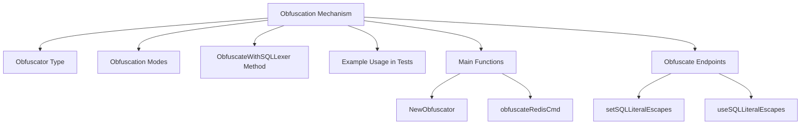

<SwmSnippet path="/pkg/obfuscate/obfuscate.go" line="23">

---

# Obfuscator Type

The <SwmToken path="pkg/obfuscate/obfuscate.go" pos="23:2:2" line-data="// Obfuscator quantizes and obfuscates spans. The obfuscator is not safe for">`Obfuscator`</SwmToken> type is responsible for quantizing and obfuscating spans. It uses the settings defined in the <SwmToken path="pkg/obfuscate/obfuscate.go" pos="26:4:4" line-data="	opts                 *Config">`Config`</SwmToken> struct to determine how to obfuscate data. This type is not safe for concurrent use and includes various components such as JSON obfuscators for different data types and a query cache.

```go
// Obfuscator quantizes and obfuscates spans. The obfuscator is not safe for
// concurrent use.
type Obfuscator struct {
	opts                 *Config
	es                   *jsonObfuscator // nil if disabled
	openSearch           *jsonObfuscator // nil if disabled
	mongo                *jsonObfuscator // nil if disabled
	sqlExecPlan          *jsonObfuscator // nil if disabled
	sqlExecPlanNormalize *jsonObfuscator // nil if disabled
	ccObfuscator         *creditCard     // nil if disabled
	// sqlLiteralEscapes reports whether we should treat escape characters literally or as escape characters.
	// Different SQL engines behave in different ways and the tokenizer needs to be generic.
	sqlLiteralEscapes *atomic.Bool
	// queryCache keeps a cache of already obfuscated queries.
	queryCache *measuredCache
	log        Logger
}
```

---

</SwmSnippet>

<SwmSnippet path="/pkg/obfuscate/obfuscate.go" line="118">

---

# Obfuscation Modes

The constants <SwmToken path="pkg/obfuscate/obfuscate.go" pos="119:1:1" line-data="	NormalizeOnly         = ObfuscationMode(&quot;normalize_only&quot;)">`NormalizeOnly`</SwmToken>, <SwmToken path="pkg/obfuscate/obfuscate.go" pos="120:1:1" line-data="	ObfuscateOnly         = ObfuscationMode(&quot;obfuscate_only&quot;)">`ObfuscateOnly`</SwmToken>, and <SwmToken path="pkg/obfuscate/obfuscate.go" pos="121:1:1" line-data="	ObfuscateAndNormalize = ObfuscationMode(&quot;obfuscate_and_normalize&quot;)">`ObfuscateAndNormalize`</SwmToken> define different modes of obfuscation that can be applied to the data. These modes allow for flexibility in how data is processed and obfuscated.

```go
const (
	NormalizeOnly         = ObfuscationMode("normalize_only")
	ObfuscateOnly         = ObfuscationMode("obfuscate_only")
	ObfuscateAndNormalize = ObfuscationMode("obfuscate_and_normalize")
)
```

---

</SwmSnippet>

<SwmSnippet path="/pkg/obfuscate/sql.go" line="426">

---

# <SwmToken path="pkg/obfuscate/sql.go" pos="426:2:2" line-data="// ObfuscateWithSQLLexer obfuscates the given SQL query using the go-sqllexer package.">`ObfuscateWithSQLLexer`</SwmToken> Method

The <SwmToken path="pkg/obfuscate/sql.go" pos="426:2:2" line-data="// ObfuscateWithSQLLexer obfuscates the given SQL query using the go-sqllexer package.">`ObfuscateWithSQLLexer`</SwmToken> method obfuscates SQL queries using the <SwmToken path="pkg/obfuscate/sql.go" pos="426:18:20" line-data="// ObfuscateWithSQLLexer obfuscates the given SQL query using the go-sqllexer package.">`go-sqllexer`</SwmToken> package. It supports different obfuscation modes and can cache the results for efficiency. This method ensures that SQL queries are obfuscated according to the specified mode, whether it is <SwmToken path="pkg/obfuscate/sql.go" pos="427:12:12" line-data="// If ObfuscationMode is set to ObfuscateOnly, the query will be obfuscated without normalizing it.">`ObfuscateOnly`</SwmToken>, <SwmToken path="pkg/obfuscate/sql.go" pos="429:9:9" line-data="	if opts.ObfuscationMode != NormalizeOnly &amp;&amp; opts.ObfuscationMode != ObfuscateOnly &amp;&amp; opts.ObfuscationMode != ObfuscateAndNormalize {">`NormalizeOnly`</SwmToken>, or <SwmToken path="pkg/obfuscate/sql.go" pos="429:29:29" line-data="	if opts.ObfuscationMode != NormalizeOnly &amp;&amp; opts.ObfuscationMode != ObfuscateOnly &amp;&amp; opts.ObfuscationMode != ObfuscateAndNormalize {">`ObfuscateAndNormalize`</SwmToken>.

```go
// ObfuscateWithSQLLexer obfuscates the given SQL query using the go-sqllexer package.
// If ObfuscationMode is set to ObfuscateOnly, the query will be obfuscated without normalizing it.
func (o *Obfuscator) ObfuscateWithSQLLexer(in string, opts *SQLConfig) (*ObfuscatedQuery, error) {
	if opts.ObfuscationMode != NormalizeOnly && opts.ObfuscationMode != ObfuscateOnly && opts.ObfuscationMode != ObfuscateAndNormalize {
		return nil, fmt.Errorf("invalid obfuscation mode: %s", opts.ObfuscationMode)
	}

	var obfuscator *sqllexer.Obfuscator

	if opts.ObfuscationMode == ObfuscateOnly || opts.ObfuscationMode == ObfuscateAndNormalize {
		obfuscator = sqllexer.NewObfuscator(
			sqllexer.WithReplaceDigits(opts.ReplaceDigits),
			sqllexer.WithDollarQuotedFunc(opts.DollarQuotedFunc),
			sqllexer.WithReplacePositionalParameter(!opts.KeepPositionalParameter),
			sqllexer.WithReplaceBoolean(!opts.KeepBoolean),
			sqllexer.WithReplaceNull(!opts.KeepNull),
		)
	}

	if opts.ObfuscationMode == ObfuscateOnly {
		// Obfuscate the query without normalizing it.
```

---

</SwmSnippet>

<SwmSnippet path="/pkg/obfuscate/obfuscate_test.go" line="38">

---

# Example Usage in Tests

The <SwmToken path="pkg/obfuscate/obfuscate_test.go" pos="38:2:2" line-data="func TestNewObfuscator(t *testing.T) {">`TestNewObfuscator`</SwmToken> function demonstrates how to create a new <SwmToken path="pkg/obfuscate/obfuscate.go" pos="23:2:2" line-data="// Obfuscator quantizes and obfuscates spans. The obfuscator is not safe for">`Obfuscator`</SwmToken> and verify its configuration. This is useful for understanding how to set up and use the obfuscator in practice. The test checks the initialization of various components based on the provided configuration.

```go
func TestNewObfuscator(t *testing.T) {
	assert := assert.New(t)
	o := NewObfuscator(Config{})
	assert.Nil(o.es)
	assert.Nil(o.mongo)

	o = NewObfuscator(Config{})
	assert.Nil(o.es)
	assert.Nil(o.mongo)

	o = NewObfuscator(Config{
		ES:    JSONConfig{Enabled: true},
		Mongo: JSONConfig{Enabled: true},
	})
	defer o.Stop()
	assert.NotNil(o.es)
	assert.NotNil(o.mongo)
}
```

---

</SwmSnippet>

# Main Functions

There are several main functions in this folder. Some of them are <SwmToken path="pkg/obfuscate/obfuscate.go" pos="264:2:2" line-data="// NewObfuscator creates a new obfuscator">`NewObfuscator`</SwmToken>, <SwmToken path="pkg/obfuscate/obfuscate.go" pos="51:2:2" line-data="// setSQLLiteralEscapes sets whether or not escape characters should be treated literally by the SQL obfuscator.">`setSQLLiteralEscapes`</SwmToken>, <SwmToken path="pkg/obfuscate/obfuscate.go" pos="60:2:2" line-data="// useSQLLiteralEscapes reports whether escape characters will be treated literally by the SQL obfuscator.">`useSQLLiteralEscapes`</SwmToken>, <SwmToken path="pkg/obfuscate/redis.go" pos="118:2:2" line-data="func obfuscateRedisCmd(out *strings.Builder, cmd string, args ...string) {">`obfuscateRedisCmd`</SwmToken>, and <SwmToken path="pkg/obfuscate/obfuscate_test.go" pos="52:5:5" line-data="	defer o.Stop()">`Stop`</SwmToken>. We will dive a little into <SwmToken path="pkg/obfuscate/obfuscate.go" pos="264:2:2" line-data="// NewObfuscator creates a new obfuscator">`NewObfuscator`</SwmToken> and <SwmToken path="pkg/obfuscate/redis.go" pos="118:2:2" line-data="func obfuscateRedisCmd(out *strings.Builder, cmd string, args ...string) {">`obfuscateRedisCmd`</SwmToken>.

<SwmSnippet path="/pkg/obfuscate/obfuscate.go" line="264">

---

## <SwmToken path="pkg/obfuscate/obfuscate.go" pos="264:2:2" line-data="// NewObfuscator creates a new obfuscator">`NewObfuscator`</SwmToken>

The <SwmToken path="pkg/obfuscate/obfuscate.go" pos="264:2:2" line-data="// NewObfuscator creates a new obfuscator">`NewObfuscator`</SwmToken> function creates a new instance of the <SwmToken path="pkg/obfuscate/obfuscate.go" pos="264:10:10" line-data="// NewObfuscator creates a new obfuscator">`obfuscator`</SwmToken> type. It initializes various components based on the provided configuration, such as JSON obfuscators for different data types and a query cache. This function is essential for setting up the obfuscation process.

```go
// NewObfuscator creates a new obfuscator
func NewObfuscator(cfg Config) *Obfuscator {
	if cfg.Logger == nil {
		cfg.Logger = noopLogger{}
	}
	o := Obfuscator{
		opts:              &cfg,
		queryCache:        newMeasuredCache(cacheOptions{On: cfg.SQL.Cache, Statsd: cfg.Statsd}),
		sqlLiteralEscapes: atomic.NewBool(false),
		log:               cfg.Logger,
	}
	if cfg.ES.Enabled {
		o.es = newJSONObfuscator(&cfg.ES, &o)
	}
	if cfg.OpenSearch.Enabled {
		o.openSearch = newJSONObfuscator(&cfg.OpenSearch, &o)
	}
	if cfg.Mongo.Enabled {
		o.mongo = newJSONObfuscator(&cfg.Mongo, &o)
	}
	if cfg.SQLExecPlan.Enabled {
```

---

</SwmSnippet>

<SwmSnippet path="/pkg/obfuscate/redis.go" line="118">

---

## <SwmToken path="pkg/obfuscate/redis.go" pos="118:2:2" line-data="func obfuscateRedisCmd(out *strings.Builder, cmd string, args ...string) {">`obfuscateRedisCmd`</SwmToken>

The <SwmToken path="pkg/obfuscate/redis.go" pos="118:2:2" line-data="func obfuscateRedisCmd(out *strings.Builder, cmd string, args ...string) {">`obfuscateRedisCmd`</SwmToken> function is used to obfuscate specific arguments in Redis commands based on the command type. It ensures that sensitive data within Redis commands is masked appropriately by replacing certain arguments with a placeholder.

```go
func obfuscateRedisCmd(out *strings.Builder, cmd string, args ...string) {
	out.WriteString(cmd)
	if len(args) == 0 {
		return
	}
	out.WriteByte(' ')

	switch strings.ToUpper(cmd) {
	case "AUTH":
		// Obfuscate everything after command
		// • AUTH password
		if len(args) > 0 {
			args[0] = "?"
			args = args[:1]
		}

	case "APPEND", "GETSET", "LPUSHX", "GEORADIUSBYMEMBER", "RPUSHX",
		"SET", "SETNX", "SISMEMBER", "ZRANK", "ZREVRANK", "ZSCORE":
		// Obfuscate 2nd argument:
		// • APPEND key value
		// • GETSET key value
```

---

</SwmSnippet>

# Obfuscate Endpoints

Obfuscate Endpoints include methods like <SwmToken path="pkg/obfuscate/obfuscate.go" pos="51:2:2" line-data="// setSQLLiteralEscapes sets whether or not escape characters should be treated literally by the SQL obfuscator.">`setSQLLiteralEscapes`</SwmToken> and <SwmToken path="pkg/obfuscate/obfuscate.go" pos="60:2:2" line-data="// useSQLLiteralEscapes reports whether escape characters will be treated literally by the SQL obfuscator.">`useSQLLiteralEscapes`</SwmToken>.

<SwmSnippet path="/pkg/obfuscate/obfuscate.go" line="51">

---

## <SwmToken path="pkg/obfuscate/obfuscate.go" pos="51:2:2" line-data="// setSQLLiteralEscapes sets whether or not escape characters should be treated literally by the SQL obfuscator.">`setSQLLiteralEscapes`</SwmToken>

The <SwmToken path="pkg/obfuscate/obfuscate.go" pos="51:2:2" line-data="// setSQLLiteralEscapes sets whether or not escape characters should be treated literally by the SQL obfuscator.">`setSQLLiteralEscapes`</SwmToken> method in the <SwmToken path="pkg/obfuscate/obfuscate.go" pos="51:30:30" line-data="// setSQLLiteralEscapes sets whether or not escape characters should be treated literally by the SQL obfuscator.">`obfuscator`</SwmToken> type sets whether escape characters should be treated literally by the SQL obfuscator. This is important for handling different SQL engines that may treat escape characters differently.

```go
// setSQLLiteralEscapes sets whether or not escape characters should be treated literally by the SQL obfuscator.
func (o *Obfuscator) setSQLLiteralEscapes(ok bool) {
	if ok {
		o.sqlLiteralEscapes.Store(true)
	} else {
		o.sqlLiteralEscapes.Store(false)
	}
}
```

---

</SwmSnippet>

<SwmSnippet path="/pkg/obfuscate/obfuscate.go" line="60">

---

## <SwmToken path="pkg/obfuscate/obfuscate.go" pos="60:2:2" line-data="// useSQLLiteralEscapes reports whether escape characters will be treated literally by the SQL obfuscator.">`useSQLLiteralEscapes`</SwmToken>

The <SwmToken path="pkg/obfuscate/obfuscate.go" pos="60:2:2" line-data="// useSQLLiteralEscapes reports whether escape characters will be treated literally by the SQL obfuscator.">`useSQLLiteralEscapes`</SwmToken> method in the <SwmToken path="pkg/obfuscate/obfuscate.go" pos="60:26:26" line-data="// useSQLLiteralEscapes reports whether escape characters will be treated literally by the SQL obfuscator.">`obfuscator`</SwmToken> type reports whether escape characters will be treated literally by the SQL obfuscator. This setting is automatically detected and set as SQL queries are being obfuscated.

```go
// useSQLLiteralEscapes reports whether escape characters will be treated literally by the SQL obfuscator.
// Some SQL engines require it and others don't. It will be detected as SQL queries are being obfuscated
// through calls to ObfuscateSQLString and automatically set for future.
func (o *Obfuscator) useSQLLiteralEscapes() bool {
	return o.sqlLiteralEscapes.Load()
}
```

---

</SwmSnippet>

&nbsp;

*This is an auto-generated document by Swimm AI 🌊 and has not yet been verified by a human*

<SwmMeta version="3.0.0" repo-id="Z2l0aHViJTNBJTNBZGF0YWRvZy1hZ2VudCUzQSUzQVN3aW1tLURlbW8=" repo-name="datadog-agent"><sup>Powered by [Swimm](/)</sup></SwmMeta>
