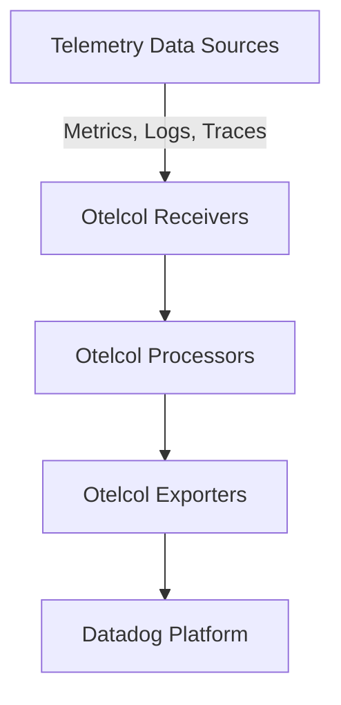

# Overview

Otelcol refers to the <SwmToken path="comp/otelcol/collector-contrib/impl/components.go" pos="11:12:12" line-data="	spanmetricsconnector &quot;github.com/open-telemetry/opentelemetry-collector-contrib/connector/spanmetricsconnector&quot;">`opentelemetry`</SwmToken> Collector component within the Datadog Agent. It is responsible for collecting, processing, and exporting telemetry data such as metrics, logs, and traces. The Otelcol component is essential for integrating <SwmToken path="comp/otelcol/collector-contrib/impl/components.go" pos="11:12:12" line-data="	spanmetricsconnector &quot;github.com/open-telemetry/opentelemetry-collector-contrib/connector/spanmetricsconnector&quot;">`opentelemetry`</SwmToken> capabilities into the Datadog Agent, enabling it to handle a wide range of telemetry data sources and formats.

# Otelcol Sub-Components

The Otelcol component is structured into various sub-components, including extensions, receivers, exporters, processors, and connectors. These sub-components are defined in different packages and directories, such as <SwmPath>[comp/otelcol/extension/](comp/otelcol/extension/)</SwmPath>, <SwmPath>[comp/otelcol/otlp/components/](comp/otelcol/otlp/components/)</SwmPath>, and <SwmPath>[comp/otelcol/collector-contrib/impl/](comp/otelcol/collector-contrib/impl/)</SwmPath>.

<SwmSnippet path="/comp/otelcol/collector-contrib/impl/components.go" line="10">

---

# Initializing Sub-Components

The <SwmToken path="tasks/components.py" pos="226:1:1" line-data="    components = []">`components`</SwmToken> function initializes these sub-components by creating factory maps for each type of component. This includes importing various extensions, exporters, and processors from the <SwmToken path="comp/otelcol/collector-contrib/impl/components.go" pos="11:12:12" line-data="	spanmetricsconnector &quot;github.com/open-telemetry/opentelemetry-collector-contrib/connector/spanmetricsconnector&quot;">`opentelemetry`</SwmToken> Collector Contrib repository.

```go
import (
	spanmetricsconnector "github.com/open-telemetry/opentelemetry-collector-contrib/connector/spanmetricsconnector"
	sapmexporter "github.com/open-telemetry/opentelemetry-collector-contrib/exporter/sapmexporter"
	healthcheckextension "github.com/open-telemetry/opentelemetry-collector-contrib/extension/healthcheckextension"
	dockerobserver "github.com/open-telemetry/opentelemetry-collector-contrib/extension/observer/dockerobserver"
	ecsobserver "github.com/open-telemetry/opentelemetry-collector-contrib/extension/observer/ecsobserver"
	ecstaskobserver "github.com/open-telemetry/opentelemetry-collector-contrib/extension/observer/ecstaskobserver"
	hostobserver "github.com/open-telemetry/opentelemetry-collector-contrib/extension/observer/hostobserver"
	k8sobserver "github.com/open-telemetry/opentelemetry-collector-contrib/extension/observer/k8sobserver"
	pprofextension "github.com/open-telemetry/opentelemetry-collector-contrib/extension/pprofextension"
	attributesprocessor "github.com/open-telemetry/opentelemetry-collector-contrib/processor/attributesprocessor"
```

---

</SwmSnippet>

# Otelcol Endpoints

Otelcol endpoints are crucial for receiving and exporting telemetry data. The primary endpoints include <SwmToken path="comp/otelcol/collector-contrib/impl/manifest.yaml" pos="44:16:16" line-data="  - gomod: go.opentelemetry.io/collector/receiver/otlpreceiver v0.104.0">`otlpreceiver`</SwmToken> and <SwmToken path="comp/otelcol/collector-contrib/impl/manifest.yaml" pos="23:16:16" line-data="  - gomod: go.opentelemetry.io/collector/exporter/otlpexporter v0.104.0">`otlpexporter`</SwmToken>.

<SwmSnippet path="/comp/otelcol/collector-contrib/impl/manifest.yaml" line="43">

---

## otlpreceiver

The <SwmToken path="comp/otelcol/collector-contrib/impl/manifest.yaml" pos="44:16:16" line-data="  - gomod: go.opentelemetry.io/collector/receiver/otlpreceiver v0.104.0">`otlpreceiver`</SwmToken> endpoint is defined in the manifest file. It is used to receive telemetry data in the <SwmToken path="comp/otelcol/collector-contrib/impl/manifest.yaml" pos="43:8:8" line-data="  - gomod: go.opentelemetry.io/collector/receiver/nopreceiver v0.104.0">`opentelemetry`</SwmToken> Protocol (OTLP) format. This receiver is essential for collecting data from various sources and forwarding it to the processing pipeline.

```yaml
  - gomod: go.opentelemetry.io/collector/receiver/nopreceiver v0.104.0
  - gomod: go.opentelemetry.io/collector/receiver/otlpreceiver v0.104.0
```

---

</SwmSnippet>

<SwmSnippet path="/comp/otelcol/collector-contrib/impl/manifest.yaml" line="23">

---

## otlpexporter

The <SwmToken path="comp/otelcol/collector-contrib/impl/manifest.yaml" pos="23:16:16" line-data="  - gomod: go.opentelemetry.io/collector/exporter/otlpexporter v0.104.0">`otlpexporter`</SwmToken> endpoint is defined in the manifest file. It is used to export telemetry data in the <SwmToken path="comp/otelcol/collector-contrib/impl/manifest.yaml" pos="23:8:8" line-data="  - gomod: go.opentelemetry.io/collector/exporter/otlpexporter v0.104.0">`opentelemetry`</SwmToken> Protocol (OTLP) format. This exporter is crucial for sending processed telemetry data to a specified backend or storage system.

```yaml
  - gomod: go.opentelemetry.io/collector/exporter/otlpexporter v0.104.0
  - gomod: go.opentelemetry.io/collector/exporter/otlphttpexporter v0.104.0
```

---

</SwmSnippet>

&nbsp;

*This is an auto-generated document by Swimm AI 🌊 and has not yet been verified by a human*

<SwmMeta version="3.0.0" repo-id="Z2l0aHViJTNBJTNBZGF0YWRvZy1hZ2VudCUzQSUzQVN3aW1tLURlbW8=" repo-name="datadog-agent"><sup>Powered by [Swimm](/)</sup></SwmMeta>
