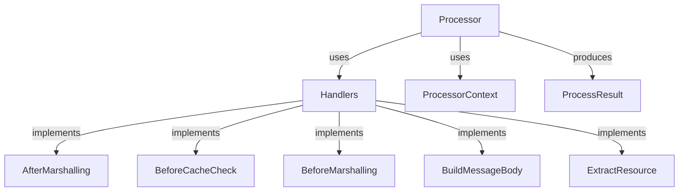

# Overview

Processors are generic resource processing components that rely on a set of handlers to enrich their processing logic and make them suitable for processing resources of specific types. This document explores the various components and functionalities of resource processors, including the <SwmToken path="pkg/collector/corechecks/cluster/orchestrator/processors/processor.go" pos="27:2:2" line-data="// ProcessorContext implements context for processor">`ProcessorContext`</SwmToken> interface, handlers, and the <SwmToken path="pkg/collector/corechecks/cluster/orchestrator/processors/processor.go" pos="144:2:2" line-data="// ProcessResult contains the processing result of metadata and manifest">`ProcessResult`</SwmToken> type.

<SwmSnippet path="/pkg/collector/corechecks/cluster/orchestrator/processors/processor.go" line="137">

---

# Processor Definition

The <SwmToken path="pkg/collector/corechecks/cluster/orchestrator/processors/processor.go" pos="137:2:2" line-data="// Processor is a generic resource processing component. It relies on a set of">`Processor`</SwmToken> type is defined as a generic resource processing component that relies on handlers to process resources of specific types.

```go
// Processor is a generic resource processing component. It relies on a set of
// handlers to enrich its processing logic and make it a processor for resources
// of a specific type.
type Processor struct {
	h Handlers
}
```

---

</SwmSnippet>

<SwmSnippet path="/pkg/collector/corechecks/cluster/orchestrator/processors/processor.go" line="27">

---

# <SwmToken path="pkg/collector/corechecks/cluster/orchestrator/processors/processor.go" pos="27:2:2" line-data="// ProcessorContext implements context for processor">`ProcessorContext`</SwmToken> Interface

The <SwmToken path="pkg/collector/corechecks/cluster/orchestrator/processors/processor.go" pos="27:2:2" line-data="// ProcessorContext implements context for processor">`ProcessorContext`</SwmToken> interface defines the context for processors, providing methods to retrieve the orchestrator configuration, node type, message group ID, and other relevant information.

```go
// ProcessorContext implements context for processor
type ProcessorContext interface {
	GetOrchestratorConfig() *config.OrchestratorConfig
	GetNodeType() pkgorchestratormodel.NodeType
	GetMsgGroupID() int32
	IsManifestProducer() bool
}
```

---

</SwmSnippet>

<SwmSnippet path="/pkg/collector/corechecks/cluster/orchestrator/processors/processor.go" line="86">

---

# Handlers Interface

Handlers are interfaces implemented for each resource type, allowing code to be plugged in at different levels of the processor logic. They include methods for actions such as marshalling resources, checking caches, building message bodies, extracting resources, and scrubbing sensitive information.

```go
// Handlers is the interface that is to be implemented for every resource type
// and provides a way to plug in code at different levels of the Processor
// logic.
type Handlers interface {
	// AfterMarshalling runs before the Processor marshals the resource to
	// generate a manifest. If skip is true then the resource processing loop
	// moves on to the next resource.
	AfterMarshalling(ctx ProcessorContext, resource, resourceModel interface{}, yaml []byte) (skip bool)

	// BeforeCacheCheck runs before the Processor does a cache lookup for the
	// resource. If skip is true then the resource processing loop moves on to
	// the next resource.
	BeforeCacheCheck(ctx ProcessorContext, resource, resourceModel interface{}) (skip bool)

	// BeforeMarshalling runs before the Processor marshals the resource to
	// generate a manifest. If skip is true then the resource processing loop
	// moves on to the next resource.
	BeforeMarshalling(ctx ProcessorContext, resource, resourceModel interface{}) (skip bool)

	// BuildMessageBody is used to build a message containing a chunk of
	// resource models of a certain size. If skip is true then the resource
```

---

</SwmSnippet>

<SwmSnippet path="/pkg/collector/corechecks/cluster/orchestrator/processors/processor.go" line="144">

---

# <SwmToken path="pkg/collector/corechecks/cluster/orchestrator/processors/processor.go" pos="144:2:2" line-data="// ProcessResult contains the processing result of metadata and manifest">`ProcessResult`</SwmToken> Type

The <SwmToken path="pkg/collector/corechecks/cluster/orchestrator/processors/processor.go" pos="144:2:2" line-data="// ProcessResult contains the processing result of metadata and manifest">`ProcessResult`</SwmToken> type contains the processing results, including lists of metadata messages and manifest messages, which are payloads containing lists of Kubernetes resources metadata and manifests.

```go
// ProcessResult contains the processing result of metadata and manifest
// MetadataMessages is a list of payload, each payload contains a list of k8s resources metadata and manifest
// ManifestMessages is a list of payload, each payload contains a list of k8s resources manifest.
// ManifestMessages is a copy of part of MetadataMessages
type ProcessResult struct {
	MetadataMessages []model.MessageBody
	ManifestMessages []model.MessageBody
}
```

---

</SwmSnippet>

<SwmSnippet path="/pkg/collector/corechecks/cluster/orchestrator/collectors/k8s/deployment.go" line="50">

---

# Example Usage of <SwmToken path="pkg/collector/corechecks/cluster/orchestrator/collectors/k8s/deployment.go" pos="51:6:6" line-data="		processor: processors.NewProcessor(new(k8sProcessors.DeploymentHandlers)),">`NewProcessor`</SwmToken>

An example of using <SwmToken path="pkg/collector/corechecks/cluster/orchestrator/collectors/k8s/deployment.go" pos="51:6:6" line-data="		processor: processors.NewProcessor(new(k8sProcessors.DeploymentHandlers)),">`NewProcessor`</SwmToken> within the <SwmToken path="pkg/collector/corechecks/cluster/orchestrator/collectors/k8s/deployment.go" pos="25:1:1" line-data="		NewDeploymentCollector(),">`NewDeploymentCollector`</SwmToken> function, where it is initialized with <SwmToken path="pkg/collector/corechecks/cluster/orchestrator/collectors/k8s/deployment.go" pos="51:12:12" line-data="		processor: processors.NewProcessor(new(k8sProcessors.DeploymentHandlers)),">`DeploymentHandlers`</SwmToken>.

```go
		},
		processor: processors.NewProcessor(new(k8sProcessors.DeploymentHandlers)),
	}
```

---

</SwmSnippet>

# Main Functions

There are several main functions in this folder. Some of them are <SwmToken path="pkg/collector/corechecks/cluster/orchestrator/processors/processor.go" pos="153:2:2" line-data="// NewProcessor creates a new processor for a resource type.">`NewProcessor`</SwmToken>, <SwmToken path="pkg/collector/corechecks/cluster/orchestrator/processors/processor.go" pos="165:2:2" line-data="// Process is used to process a list of resources of a certain type.">`Process`</SwmToken>, and <SwmToken path="pkg/collector/corechecks/cluster/orchestrator/processors/processor.go" pos="86:2:2" line-data="// Handlers is the interface that is to be implemented for every resource type">`Handlers`</SwmToken>. We will dive a little into <SwmToken path="pkg/collector/corechecks/cluster/orchestrator/processors/processor.go" pos="153:2:2" line-data="// NewProcessor creates a new processor for a resource type.">`NewProcessor`</SwmToken> and <SwmToken path="pkg/collector/corechecks/cluster/orchestrator/processors/processor.go" pos="165:2:2" line-data="// Process is used to process a list of resources of a certain type.">`Process`</SwmToken>.

<SwmSnippet path="/pkg/collector/corechecks/cluster/orchestrator/processors/processor.go" line="153">

---

## <SwmToken path="pkg/collector/corechecks/cluster/orchestrator/processors/processor.go" pos="153:2:2" line-data="// NewProcessor creates a new processor for a resource type.">`NewProcessor`</SwmToken>

The <SwmToken path="pkg/collector/corechecks/cluster/orchestrator/processors/processor.go" pos="153:2:2" line-data="// NewProcessor creates a new processor for a resource type.">`NewProcessor`</SwmToken> function creates a new processor for a resource type. It initializes the processor with a set of handlers that define the processing logic for specific resource types.

```go
// NewProcessor creates a new processor for a resource type.
func NewProcessor(h Handlers) *Processor {
	return &Processor{
		h: h,
	}
}
```

---

</SwmSnippet>

<SwmSnippet path="/pkg/collector/corechecks/cluster/orchestrator/processors/processor.go" line="165">

---

## Process

The <SwmToken path="pkg/collector/corechecks/cluster/orchestrator/processors/processor.go" pos="165:2:2" line-data="// Process is used to process a list of resources of a certain type.">`Process`</SwmToken> function processes a list of resources of a certain type. It handles various steps such as resource extraction, cache checking, marshalling, and scrubbing sensitive information. It uses the handlers to perform these actions and generates a processing result containing metadata and manifest messages.

```go
// Process is used to process a list of resources of a certain type.
func (p *Processor) Process(ctx ProcessorContext, list interface{}) (processResult ProcessResult, processed int) {
	// This default allows detection of panic recoveries.
	processed = -1

	// Make sure to recover if a panic occurs.
	defer RecoverOnPanic()

	resourceList := p.h.ResourceList(ctx, list)
	resourceMetadataModels := make([]interface{}, 0, len(resourceList))
	resourceManifestModels := make([]interface{}, 0, len(resourceList))

	for _, resource := range resourceList {
		// Scrub before extraction.
		p.h.ScrubBeforeExtraction(ctx, resource)

		// Extract the message model from the resource.
		resourceMetadataModel := p.h.ExtractResource(ctx, resource)

		// Execute code before cache check.
		if skip := p.h.BeforeCacheCheck(ctx, resource, resourceMetadataModel); skip {
```

---

</SwmSnippet>

# Processor Endpoints

Processor endpoints include various handler functions that are used to build message bodies and extract resources.

<SwmSnippet path="/pkg/collector/corechecks/cluster/orchestrator/processors/ecs/task.go" line="25">

---

## <SwmToken path="pkg/collector/corechecks/cluster/orchestrator/processors/ecs/task.go" pos="25:2:2" line-data="// BuildMessageBody is a handler called to build a message body out of a list of extracted resources.">`BuildMessageBody`</SwmToken>

The <SwmToken path="pkg/collector/corechecks/cluster/orchestrator/processors/ecs/task.go" pos="25:2:2" line-data="// BuildMessageBody is a handler called to build a message body out of a list of extracted resources.">`BuildMessageBody`</SwmToken> function is a handler used to build a message body from a list of extracted resources. It takes a context, a list of resource models, and a group size as parameters. The function processes the resource models and returns a <SwmToken path="pkg/collector/corechecks/cluster/orchestrator/processors/ecs/task.go" pos="34:4:6" line-data="	return &amp;model.CollectorECSTask{">`model.CollectorECSTask`</SwmToken> object containing the relevant information.

```go
// BuildMessageBody is a handler called to build a message body out of a list of extracted resources.
func (t *TaskHandlers) BuildMessageBody(ctx processors.ProcessorContext, resourceModels []interface{}, groupSize int) model.MessageBody {
	pctx := ctx.(*processors.ECSProcessorContext)
	models := make([]*model.ECSTask, 0, len(resourceModels))

	for _, m := range resourceModels {
		models = append(models, m.(*model.ECSTask))
	}

	return &model.CollectorECSTask{
		AwsAccountID: int64(pctx.AWSAccountID),
		ClusterName:  pctx.ClusterName,
		ClusterId:    pctx.ClusterID,
		Region:       pctx.Region,
		GroupId:      pctx.MsgGroupID,
		GroupSize:    int32(groupSize),
		Tasks:        models,
	}
}
```

---

</SwmSnippet>

<SwmSnippet path="/pkg/collector/corechecks/cluster/orchestrator/processors/ecs/task.go" line="45">

---

## <SwmToken path="pkg/collector/corechecks/cluster/orchestrator/processors/ecs/task.go" pos="45:2:2" line-data="// ExtractResource is a handler called to extract the resource model out of a raw resource.">`ExtractResource`</SwmToken>

The <SwmToken path="pkg/collector/corechecks/cluster/orchestrator/processors/ecs/task.go" pos="45:2:2" line-data="// ExtractResource is a handler called to extract the resource model out of a raw resource.">`ExtractResource`</SwmToken> function is a handler used to extract a resource model from a raw resource. It takes a context and a raw resource as parameters and returns the extracted resource model. This function is essential for transforming raw data into a structured format that can be further processed.

```go
// ExtractResource is a handler called to extract the resource model out of a raw resource.
//
//nolint:revive // TODO(CAPP) Fix revive linter
func (t *TaskHandlers) ExtractResource(ctx processors.ProcessorContext, resource interface{}) (resourceModel interface{}) {
	r := resource.(transformers.TaskWithContainers)
	return transformers.ExtractECSTask(r)
```

---

</SwmSnippet>

&nbsp;

*This is an auto-generated document by Swimm AI 🌊 and has not yet been verified by a human*

<SwmMeta version="3.0.0" repo-id="Z2l0aHViJTNBJTNBZGF0YWRvZy1hZ2VudCUzQSUzQVN3aW1tLURlbW8=" repo-name="datadog-agent"><sup>Powered by [Swimm](/)</sup></SwmMeta>
