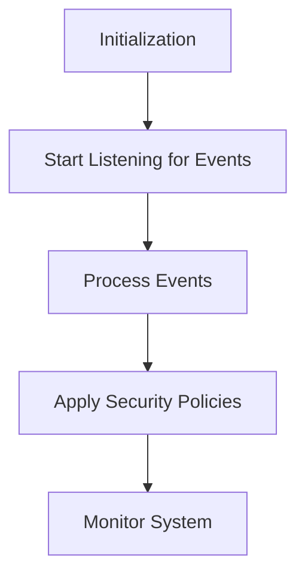

# Overview

The Runtime Security Probe is an eBPF-based component responsible for setting up the required <SwmToken path="pkg/security/probe/probe.go" pos="107:10:10" line-data="// setting up the required kProbes and decoding events sent from the kernel">`kProbes`</SwmToken> and decoding events sent from the kernel. It is used to monitor and secure the system by collecting and analyzing various security-related events. The probe includes configurations, event handlers, and internal mechanisms to manage its operations and ensure accurate event processing.

# Probe Initialization

The <SwmToken path="pkg/security/probe/probe_windows.go" pos="1381:2:2" line-data="// NewProbe instantiates a new runtime security agent probe">`NewProbe`</SwmToken> function instantiates a new runtime security agent probe, setting up necessary configurations and options.

<SwmSnippet path="/pkg/security/probe/probe_windows.go" line="1381">

---

The <SwmToken path="pkg/security/probe/probe_windows.go" pos="1381:2:2" line-data="// NewProbe instantiates a new runtime security agent probe">`NewProbe`</SwmToken> function initializes the probe with the provided configuration and options, and sets up the platform-specific probe.

```go
// NewProbe instantiates a new runtime security agent probe
func NewProbe(config *config.Config, opts Opts, _ optional.Option[workloadmeta.Component], telemetry telemetry.Component) (*Probe, error) {
	opts.normalize()

	p := newProbe(config, opts)

	pp, err := NewWindowsProbe(p, config, opts, telemetry)
	if err != nil {
		return nil, err
	}
	p.PlatformProbe = pp

	return p, nil
}
```

---

</SwmSnippet>

# Probe Setup

The <SwmToken path="pkg/security/probe/probe_ebpf.go" pos="342:2:2" line-data="// Setup the probe">`Setup`</SwmToken> method starts the probe manager, applies default filter policies, and initializes the event stream.

<SwmSnippet path="/pkg/security/probe/probe_ebpf.go" line="342">

---

The <SwmToken path="pkg/security/probe/probe_ebpf.go" pos="342:2:2" line-data="// Setup the probe">`Setup`</SwmToken> method ensures that the probe manager is started, default filter policies are applied, and the event stream is initialized.

```go
// Setup the probe
func (p *EBPFProbe) Setup() error {
	if err := p.Manager.Start(); err != nil {
		return err
	}
	ddebpf.AddNameMappings(p.Manager, "cws")

	p.applyDefaultFilterPolicies()

	needRawSyscalls := p.isNeededForActivityDump(model.SyscallsEventType.String())

	if err := p.updateProbes(defaultEventTypes, needRawSyscalls); err != nil {
		return err
	}

	p.profileManagers.Start(p.ctx, &p.wg)

	return nil
}
```

---

</SwmSnippet>

# Probe Start

The <SwmToken path="pkg/security/probe/probe_ebpf.go" pos="344:11:11" line-data="	if err := p.Manager.Start(); err != nil {">`Start`</SwmToken> method begins the event stream and sets up the necessary classifiers for monitoring.

<SwmSnippet path="/pkg/security/probe/probe_ebpf.go" line="362">

---

The <SwmToken path="pkg/security/probe/probe_ebpf.go" pos="362:2:2" line-data="// Start the probe">`Start`</SwmToken> method applies rules to the snapshotted data before starting the event stream to avoid concurrency issues and starts the new tc classifier loop.

```go
// Start the probe
func (p *EBPFProbe) Start() error {
	// Apply rules to the snapshotted data before starting the event stream to avoid concurrency issues
	p.playSnapshot()

	// start new tc classifier loop
	go p.startSetupNewTCClassifierLoop()

	return p.eventStream.Start(&p.wg)
}
```

---

</SwmSnippet>

# Main Functions

Several main functions are crucial for the probe's operation, including <SwmToken path="pkg/security/probe/probe_ebpf.go" pos="342:2:2" line-data="// Setup the probe">`Setup`</SwmToken>, <SwmToken path="pkg/security/probe/probe.go" pos="139:2:2" line-data="// Init initializes the probe">`Init`</SwmToken>, <SwmToken path="pkg/security/probe/probe_ebpf.go" pos="344:11:11" line-data="	if err := p.Manager.Start(); err != nil {">`Start`</SwmToken>, <SwmToken path="tasks/kernel_matrix_testing/compiler.py" pos="100:3:3" line-data="    def stop(self) -&gt; Result:">`stop`</SwmToken>, and <SwmToken path="tasks/libs/build/ninja.py" pos="189:3:3" line-data="    def close(self):">`close`</SwmToken>. Here, we will dive into <SwmToken path="pkg/security/probe/probe.go" pos="139:2:2" line-data="// Init initializes the probe">`Init`</SwmToken> and <SwmToken path="pkg/security/probe/probe_ebpf.go" pos="344:11:11" line-data="	if err := p.Manager.Start(); err != nil {">`Start`</SwmToken>.

## Init

The <SwmToken path="pkg/security/probe/probe.go" pos="139:2:2" line-data="// Init initializes the probe">`Init`</SwmToken> function initializes the probe by setting the start time and calling the <SwmToken path="pkg/security/probe/probe.go" pos="139:2:2" line-data="// Init initializes the probe">`Init`</SwmToken> method of the <SwmToken path="pkg/security/probe/probe_windows.go" pos="1391:3:3" line-data="	p.PlatformProbe = pp">`PlatformProbe`</SwmToken>.

<SwmSnippet path="/pkg/security/probe/probe.go" line="139">

---

The <SwmToken path="pkg/security/probe/probe.go" pos="139:2:2" line-data="// Init initializes the probe">`Init`</SwmToken> function sets the start time and initializes the platform-specific probe.

```go
// Init initializes the probe
func (p *Probe) Init() error {
	p.startTime = time.Now()
	return p.PlatformProbe.Init()
}
```

---

</SwmSnippet>

## Start

The <SwmToken path="pkg/security/probe/probe_ebpf.go" pos="344:11:11" line-data="	if err := p.Manager.Start(); err != nil {">`Start`</SwmToken> function begins the probe's operations by applying rules to snapshotted data and starting the event stream.

<SwmSnippet path="/pkg/security/probe/probe_ebpf.go" line="362">

---

The <SwmToken path="pkg/security/probe/probe_ebpf.go" pos="362:2:2" line-data="// Start the probe">`Start`</SwmToken> function ensures that rules are applied to snapshotted data before starting the event stream and initiates the tc classifier loop.

```go
// Start the probe
func (p *EBPFProbe) Start() error {
	// Apply rules to the snapshotted data before starting the event stream to avoid concurrency issues
	p.playSnapshot()

	// start new tc classifier loop
	go p.startSetupNewTCClassifierLoop()

	return p.eventStream.Start(&p.wg)
}
```

---

</SwmSnippet>

# Security Profile Endpoints

The probe includes endpoints for managing security profiles, such as listing and saving security profiles.

## <SwmToken path="pkg/security/probe/security_profile.go" pos="147:2:2" line-data="// ListSecurityProfiles list the profiles">`ListSecurityProfiles`</SwmToken>

The <SwmToken path="pkg/security/probe/security_profile.go" pos="147:2:2" line-data="// ListSecurityProfiles list the profiles">`ListSecurityProfiles`</SwmToken> function lists all the security profiles by checking if the <SwmToken path="pkg/security/probe/security_profile.go" pos="149:5:5" line-data="	if spm.securityProfileManager == nil {">`securityProfileManager`</SwmToken> is enabled and then calling its <SwmToken path="pkg/security/probe/security_profile.go" pos="147:2:2" line-data="// ListSecurityProfiles list the profiles">`ListSecurityProfiles`</SwmToken> method.

<SwmSnippet path="/pkg/security/probe/security_profile.go" line="147">

---

The <SwmToken path="pkg/security/probe/security_profile.go" pos="147:2:2" line-data="// ListSecurityProfiles list the profiles">`ListSecurityProfiles`</SwmToken> function retrieves the list of security profiles if the <SwmToken path="pkg/security/probe/security_profile.go" pos="149:5:5" line-data="	if spm.securityProfileManager == nil {">`securityProfileManager`</SwmToken> is enabled.

```go
// ListSecurityProfiles list the profiles
func (spm *SecurityProfileManagers) ListSecurityProfiles(params *api.SecurityProfileListParams) (*api.SecurityProfileListMessage, error) {
	if spm.securityProfileManager == nil {
		return nil, ErrSecurityProfileManagerDisabled
	}
	return spm.securityProfileManager.ListSecurityProfiles(params)
}
```

---

</SwmSnippet>

## <SwmToken path="pkg/security/probe/security_profile.go" pos="155:2:2" line-data="// SaveSecurityProfile save a security profile">`SaveSecurityProfile`</SwmToken>

The <SwmToken path="pkg/security/probe/security_profile.go" pos="155:2:2" line-data="// SaveSecurityProfile save a security profile">`SaveSecurityProfile`</SwmToken> function saves a security profile by verifying if the <SwmToken path="pkg/security/probe/security_profile.go" pos="149:5:5" line-data="	if spm.securityProfileManager == nil {">`securityProfileManager`</SwmToken> is enabled and then calling its <SwmToken path="pkg/security/probe/security_profile.go" pos="155:2:2" line-data="// SaveSecurityProfile save a security profile">`SaveSecurityProfile`</SwmToken> method.

<SwmSnippet path="/pkg/security/probe/security_profile.go" line="155">

---

The <SwmToken path="pkg/security/probe/security_profile.go" pos="155:2:2" line-data="// SaveSecurityProfile save a security profile">`SaveSecurityProfile`</SwmToken> function saves the security profile if the <SwmToken path="pkg/security/probe/security_profile.go" pos="157:5:5" line-data="	if spm.securityProfileManager == nil {">`securityProfileManager`</SwmToken> is enabled.

```go
// SaveSecurityProfile save a security profile
func (spm *SecurityProfileManagers) SaveSecurityProfile(params *api.SecurityProfileSaveParams) (*api.SecurityProfileSaveMessage, error) {
	if spm.securityProfileManager == nil {
		return nil, ErrSecurityProfileManagerDisabled
	}
	return spm.securityProfileManager.SaveSecurityProfile(params)
}
```

---

</SwmSnippet>

&nbsp;

*This is an auto-generated document by Swimm AI 🌊 and has not yet been verified by a human*

<SwmMeta version="3.0.0" repo-id="Z2l0aHViJTNBJTNBZGF0YWRvZy1hZ2VudCUzQSUzQVN3aW1tLURlbW8=" repo-name="datadog-agent"><sup>Powered by [Swimm](/)</sup></SwmMeta>
