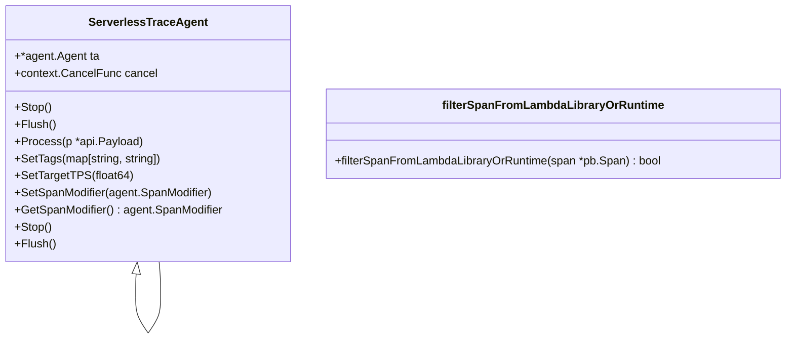

# Overview

Trace refers to the collection of APM (Application Performance Monitoring) traces in a serverless context. It is responsible for capturing and processing trace data generated by serverless applications.

# <SwmToken path="pkg/serverless/trace/trace.go" pos="30:2:2" line-data="// ServerlessTraceAgent represents a trace agent in a serverless context">`ServerlessTraceAgent`</SwmToken> Interface

The <SwmToken path="pkg/serverless/trace/trace.go" pos="30:2:2" line-data="// ServerlessTraceAgent represents a trace agent in a serverless context">`ServerlessTraceAgent`</SwmToken> interface defines the methods required for a trace agent in a serverless environment. These methods include <SwmToken path="pkg/serverless/trace/trace.go" pos="32:1:1" line-data="	Stop()">`Stop`</SwmToken>, <SwmToken path="pkg/serverless/trace/trace.go" pos="33:1:1" line-data="	Flush()">`Flush`</SwmToken>, <SwmToken path="pkg/serverless/trace/trace.go" pos="34:1:1" line-data="	Process(p *api.Payload)">`Process`</SwmToken>, <SwmToken path="pkg/serverless/trace/trace.go" pos="35:1:1" line-data="	SetTags(map[string]string)">`SetTags`</SwmToken>, <SwmToken path="pkg/serverless/trace/trace.go" pos="36:1:1" line-data="	SetTargetTPS(float64)">`SetTargetTPS`</SwmToken>, <SwmToken path="pkg/serverless/trace/trace.go" pos="37:1:1" line-data="	SetSpanModifier(agent.SpanModifier)">`SetSpanModifier`</SwmToken>, and <SwmToken path="pkg/serverless/trace/trace.go" pos="38:1:1" line-data="	GetSpanModifier() agent.SpanModifier">`GetSpanModifier`</SwmToken>.

<SwmSnippet path="/pkg/serverless/trace/trace.go" line="30">

---

The <SwmToken path="pkg/serverless/trace/trace.go" pos="30:2:2" line-data="// ServerlessTraceAgent represents a trace agent in a serverless context">`ServerlessTraceAgent`</SwmToken> interface is defined here, outlining the necessary methods for a serverless trace agent.

```go
// ServerlessTraceAgent represents a trace agent in a serverless context
type ServerlessTraceAgent interface {
	Stop()
	Flush()
	Process(p *api.Payload)
	SetTags(map[string]string)
	SetTargetTPS(float64)
	SetSpanModifier(agent.SpanModifier)
	GetSpanModifier() agent.SpanModifier
}
```

---

</SwmSnippet>

# <SwmToken path="pkg/serverless/trace/trace.go" pos="30:2:2" line-data="// ServerlessTraceAgent represents a trace agent in a serverless context">`ServerlessTraceAgent`</SwmToken> Struct

The <SwmToken path="pkg/serverless/trace/trace.go" pos="30:2:2" line-data="// ServerlessTraceAgent represents a trace agent in a serverless context">`ServerlessTraceAgent`</SwmToken> struct implements the <SwmToken path="pkg/serverless/trace/trace.go" pos="30:2:2" line-data="// ServerlessTraceAgent represents a trace agent in a serverless context">`ServerlessTraceAgent`</SwmToken> interface and manages the lifecycle and operations of the trace agent. This includes stopping the agent and flushing trace data synchronously.

<SwmSnippet path="/pkg/serverless/trace/trace.go" line="135">

---

The <SwmToken path="pkg/serverless/trace/trace.go" pos="135:2:2" line-data="type serverlessTraceAgent struct {">`serverlessTraceAgent`</SwmToken> struct is defined here, implementing the <SwmToken path="pkg/serverless/trace/trace.go" pos="135:2:2" line-data="type serverlessTraceAgent struct {">`serverlessTraceAgent`</SwmToken> interface.

```go
type serverlessTraceAgent struct {
	ta     *agent.Agent
	cancel context.CancelFunc
}
```

---

</SwmSnippet>

# Main Functions

The main functions of the <SwmToken path="pkg/serverless/trace/trace.go" pos="30:2:2" line-data="// ServerlessTraceAgent represents a trace agent in a serverless context">`ServerlessTraceAgent`</SwmToken> include <SwmToken path="pkg/serverless/trace/trace.go" pos="32:1:1" line-data="	Stop()">`Stop`</SwmToken>, <SwmToken path="pkg/serverless/trace/trace.go" pos="33:1:1" line-data="	Flush()">`Flush`</SwmToken>, and <SwmToken path="pkg/serverless/trace/trace.go" pos="34:1:1" line-data="	Process(p *api.Payload)">`Process`</SwmToken>.

## Stop

The <SwmToken path="pkg/serverless/trace/trace.go" pos="32:1:1" line-data="	Stop()">`Stop`</SwmToken> function is used to stop the trace agent in a serverless context. It ensures that all ongoing processes are halted gracefully.

<SwmSnippet path="/pkg/serverless/trace/trace.go" line="30">

---

The <SwmToken path="pkg/serverless/trace/trace.go" pos="32:1:1" line-data="	Stop()">`Stop`</SwmToken> function is defined here, ensuring the trace agent stops gracefully.

```go
// ServerlessTraceAgent represents a trace agent in a serverless context
type ServerlessTraceAgent interface {
	Stop()
	Flush()
```

---

</SwmSnippet>

## Flush

The <SwmToken path="pkg/serverless/trace/trace.go" pos="33:1:1" line-data="	Flush()">`Flush`</SwmToken> function performs a synchronous flushing of trace data in the trace agent. It ensures that all collected trace data is sent to Datadog.

<SwmSnippet path="/pkg/serverless/trace/trace.go" line="140">

---

The <SwmToken path="pkg/serverless/trace/trace.go" pos="140:2:2" line-data="// Flush performs a synchronous flushing in the trace agent">`Flush`</SwmToken> function is defined here, performing a synchronous flush of trace data.

```go
// Flush performs a synchronous flushing in the trace agent
func (t *serverlessTraceAgent) Flush() {
	t.ta.FlushSync()
}
```

---

</SwmSnippet>

## Process

The <SwmToken path="pkg/serverless/trace/trace.go" pos="34:1:1" line-data="	Process(p *api.Payload)">`Process`</SwmToken> function processes a payload in the trace agent. It handles the incoming trace data and prepares it for further processing or sending to Datadog.

<SwmSnippet path="/pkg/serverless/trace/trace.go" line="145">

---

The <SwmToken path="pkg/serverless/trace/trace.go" pos="145:2:2" line-data="// Process processes a payload in the trace agent.">`Process`</SwmToken> function is defined here, handling incoming trace data.

```go
// Process processes a payload in the trace agent.
func (t *serverlessTraceAgent) Process(p *api.Payload) {
	t.ta.Process(p)
}
```

---

</SwmSnippet>

# Filtering Spans

The <SwmToken path="pkg/serverless/trace/trace_test.go" pos="115:8:8" line-data="	assert.True(t, filterSpanFromLambdaLibraryOrRuntime(&amp;httpSpanFromLambdaLibrary))">`filterSpanFromLambdaLibraryOrRuntime`</SwmToken> function filters out spans generated by internal HTTP calls within the Datadog Lambda Library or the Lambda runtime. This ensures that only relevant trace data is processed.

<SwmSnippet path="/pkg/serverless/trace/trace_test.go" line="97">

---

The <SwmToken path="pkg/serverless/trace/trace_test.go" pos="115:8:8" line-data="	assert.True(t, filterSpanFromLambdaLibraryOrRuntime(&amp;httpSpanFromLambdaLibrary))">`filterSpanFromLambdaLibraryOrRuntime`</SwmToken> function is tested here, ensuring it filters out irrelevant spans.

```go
func TestFilterSpanFromLambdaLibraryOrRuntimeHttpSpan(t *testing.T) {
	httpSpanFromLambdaLibrary := pb.Span{
		Meta: map[string]string{
			"http.url": "http://127.0.0.1:8124/lambda/flush",
		},
	}

	httpSpanFromLambdaRuntime := pb.Span{
		Meta: map[string]string{
			"http.url": "http://127.0.0.1:9001/2018-06-01/runtime/invocation/fee394a9-b9a4-4602-853e-a48bb663caa3/response",
		},
	}

	httpSpanFromStatsD := pb.Span{
		Meta: map[string]string{
			"http.url": "http://127.0.0.1:8125/",
		},
	}
	assert.True(t, filterSpanFromLambdaLibraryOrRuntime(&httpSpanFromLambdaLibrary))
	assert.True(t, filterSpanFromLambdaLibraryOrRuntime(&httpSpanFromLambdaRuntime))
	assert.True(t, filterSpanFromLambdaLibraryOrRuntime(&httpSpanFromStatsD))
```

---

</SwmSnippet>

# Trace Endpoints

Trace endpoints include functions like <SwmToken path="pkg/serverless/trace/inferredspan/span_enrichment.go" pos="69:2:2" line-data="// EnrichInferredSpanWithAPIGatewayRESTEvent uses the parsed event">`EnrichInferredSpanWithAPIGatewayRESTEvent`</SwmToken> and <SwmToken path="pkg/serverless/trace/inferredspan/span_enrichment.go" pos="101:2:2" line-data="// EnrichInferredSpanWithAPIGatewayHTTPEvent uses the parsed event">`EnrichInferredSpanWithAPIGatewayHTTPEvent`</SwmToken>.

## <SwmToken path="pkg/serverless/trace/inferredspan/span_enrichment.go" pos="69:2:2" line-data="// EnrichInferredSpanWithAPIGatewayRESTEvent uses the parsed event">`EnrichInferredSpanWithAPIGatewayRESTEvent`</SwmToken>

The <SwmToken path="pkg/serverless/trace/inferredspan/span_enrichment.go" pos="69:2:2" line-data="// EnrichInferredSpanWithAPIGatewayRESTEvent uses the parsed event">`EnrichInferredSpanWithAPIGatewayRESTEvent`</SwmToken> function enriches an inferred span with data from an API Gateway REST event. It extracts information such as the API ID, domain name, and HTTP method from the event payload and uses it to populate the span's metadata.

<SwmSnippet path="/pkg/serverless/trace/inferredspan/span_enrichment.go" line="69">

---

The <SwmToken path="pkg/serverless/trace/inferredspan/span_enrichment.go" pos="69:2:2" line-data="// EnrichInferredSpanWithAPIGatewayRESTEvent uses the parsed event">`EnrichInferredSpanWithAPIGatewayRESTEvent`</SwmToken> function is defined here, enriching spans with REST event data.

```go
// EnrichInferredSpanWithAPIGatewayRESTEvent uses the parsed event
// payload to enrich the current inferred span. It applies a
// specific set of data to the span expected from a REST event.
func (inferredSpan *InferredSpan) EnrichInferredSpanWithAPIGatewayRESTEvent(eventPayload events.APIGatewayProxyRequest) {
	log.Debug("Enriching an inferred span for a REST API Gateway")
	requestContext := eventPayload.RequestContext
	resource := fmt.Sprintf("%s %s", eventPayload.HTTPMethod, eventPayload.Path)
	domain := requestContext.DomainName
	httpurl := fmt.Sprintf("%s%s", domain, eventPayload.Path)
	startTime := calculateStartTime(requestContext.RequestTimeEpoch)
	//nolint:revive // TODO(SERV) Fix revive linter
	apiId := requestContext.APIID
	serviceName := DetermineServiceName(serviceMapping, apiId, "lambda_api_gateway", domain)
	inferredSpan.Span.Name = "aws.apigateway"
	inferredSpan.Span.Service = serviceName
	inferredSpan.Span.Resource = resource
	inferredSpan.Span.Start = startTime
	inferredSpan.Span.Type = "http"
	inferredSpan.Span.Meta = map[string]string{
		apiID:         requestContext.APIID,
		apiName:       requestContext.APIID,
```

---

</SwmSnippet>

## <SwmToken path="pkg/serverless/trace/inferredspan/span_enrichment.go" pos="101:2:2" line-data="// EnrichInferredSpanWithAPIGatewayHTTPEvent uses the parsed event">`EnrichInferredSpanWithAPIGatewayHTTPEvent`</SwmToken>

The <SwmToken path="pkg/serverless/trace/inferredspan/span_enrichment.go" pos="101:2:2" line-data="// EnrichInferredSpanWithAPIGatewayHTTPEvent uses the parsed event">`EnrichInferredSpanWithAPIGatewayHTTPEvent`</SwmToken> function enriches an inferred span with data from an API Gateway HTTP event. It extracts information such as the API ID, domain name, and HTTP method from the event payload and uses it to populate the span's metadata.

<SwmSnippet path="/pkg/serverless/trace/inferredspan/span_enrichment.go" line="101">

---

The <SwmToken path="pkg/serverless/trace/inferredspan/span_enrichment.go" pos="101:2:2" line-data="// EnrichInferredSpanWithAPIGatewayHTTPEvent uses the parsed event">`EnrichInferredSpanWithAPIGatewayHTTPEvent`</SwmToken> function is defined here, enriching spans with HTTP event data.

```go
// EnrichInferredSpanWithAPIGatewayHTTPEvent uses the parsed event
// payload to enrich the current inferred span. It applies a
// specific set of data to the span expected from a HTTP event.
func (inferredSpan *InferredSpan) EnrichInferredSpanWithAPIGatewayHTTPEvent(eventPayload events.APIGatewayV2HTTPRequest) {
	log.Debug("Enriching an inferred span for a HTTP API Gateway")
	requestContext := eventPayload.RequestContext
	http := requestContext.HTTP
	path := eventPayload.RequestContext.HTTP.Path
	resource := fmt.Sprintf("%s %s", http.Method, path)
	domainName := requestContext.DomainName
	httpurl := fmt.Sprintf("%s%s", domainName, path)
	startTime := calculateStartTime(requestContext.TimeEpoch)
	//nolint:revive // TODO(SERV) Fix revive linter
	apiId := requestContext.APIID
	serviceName := DetermineServiceName(serviceMapping, apiId, "lambda_api_gateway", domainName)
	inferredSpan.Span.Name = "aws.httpapi"
	inferredSpan.Span.Service = serviceName
	inferredSpan.Span.Resource = resource
	inferredSpan.Span.Type = "http"
	inferredSpan.Span.Start = startTime
	inferredSpan.Span.Meta = map[string]string{
```

---

</SwmSnippet>

&nbsp;

*This is an auto-generated document by Swimm AI 🌊 and has not yet been verified by a human*

<SwmMeta version="3.0.0" repo-id="Z2l0aHViJTNBJTNBZGF0YWRvZy1hZ2VudCUzQSUzQVN3aW1tLURlbW8=" repo-name="datadog-agent"><sup>Powered by [Swimm](/)</sup></SwmMeta>
