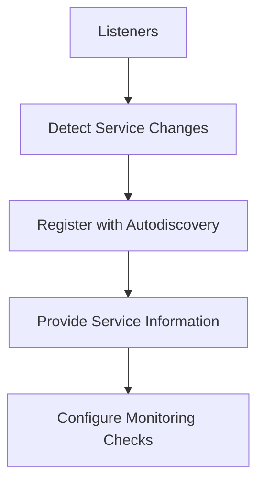

# Overview

Listeners are components that monitor specific events or changes in the environment and trigger actions based on those events. In Autodiscovery, listeners detect changes in services that the Datadog Agent should monitor, such as the creation or deletion of containers, Kubernetes pods, or other entities.

# Listener Responsibilities

Each listener is responsible for a specific type of service or environment, such as containers, Kubernetes, Cloud Foundry, or SNMP devices. Listeners register themselves with the Autodiscovery component and provide information about the services they detect, including identifiers, hosts, ports, and tags. The information collected by listeners is used to automatically configure monitoring checks for the detected services, ensuring that the Datadog Agent can start collecting metrics, logs, and traces without manual intervention.

# <SwmToken path="comp/core/autodiscovery/listeners/listeners.go" pos="31:22:22" line-data="	Register(containerListenerName, func(config Config, telemetryStore *telemetry.Store) (ServiceListener, error) {">`ServiceListener`</SwmToken>

The <SwmToken path="comp/core/autodiscovery/listeners/listeners.go" pos="31:22:22" line-data="	Register(containerListenerName, func(config Config, telemetryStore *telemetry.Store) (ServiceListener, error) {">`ServiceListener`</SwmToken> monitors events related to <SwmToken path="comp/core/autodiscovery/listeners/container.go" pos="113:6:6" line-data="	svc := &amp;service{">`service`</SwmToken> lifecycles and formats and transmits this data to `autoconfig`.

<SwmSnippet path="/comp/core/autodiscovery/listeners/listeners.go" line="27">

---

# <SwmToken path="comp/core/autodiscovery/listeners/listeners.go" pos="27:2:2" line-data="// RegisterListeners registers the available autodiscovery listerners.">`RegisterListeners`</SwmToken>

The <SwmToken path="comp/core/autodiscovery/listeners/listeners.go" pos="27:2:2" line-data="// RegisterListeners registers the available autodiscovery listerners.">`RegisterListeners`</SwmToken> function registers the available autodiscovery listeners, ensuring that each listener is properly initialized and ready to detect changes in the environment.

```go
// RegisterListeners registers the available autodiscovery listerners.
func RegisterListeners(serviceListenerFactories map[string]ServiceListenerFactory, wmeta optional.Option[workloadmeta.Component]) {
	// register the available listeners
	Register(cloudFoundryBBSListenerName, NewCloudFoundryListener, serviceListenerFactories)
	Register(containerListenerName, func(config Config, telemetryStore *telemetry.Store) (ServiceListener, error) {
		return NewContainerListener(config, wmeta, telemetryStore)
	}, serviceListenerFactories)
	Register(environmentListenerName, NewEnvironmentListener, serviceListenerFactories)
	Register(kubeEndpointsListenerName, NewKubeEndpointsListener, serviceListenerFactories)
	Register(kubeServicesListenerName, NewKubeServiceListener, serviceListenerFactories)
	Register(kubeletListenerName, func(config Config, telemetryStore *telemetry.Store) (ServiceListener, error) {
		return NewKubeletListener(config, wmeta, telemetryStore)
	}, serviceListenerFactories)
	Register(snmpListenerName, NewSNMPListener, serviceListenerFactories)
	Register(staticConfigListenerName, NewStaticConfigListener, serviceListenerFactories)
	Register(dbmAuroraListenerName, NewDBMAuroraListener, serviceListenerFactories)
}
```

---

</SwmSnippet>

<SwmSnippet path="/comp/core/autodiscovery/listeners/container.go" line="38">

---

# <SwmToken path="comp/core/autodiscovery/listeners/container.go" pos="38:2:2" line-data="// NewContainerListener returns a new ContainerListener.">`NewContainerListener`</SwmToken>

The <SwmToken path="comp/core/autodiscovery/listeners/container.go" pos="38:2:2" line-data="// NewContainerListener returns a new ContainerListener.">`NewContainerListener`</SwmToken> function returns a new <SwmToken path="comp/core/autodiscovery/listeners/container.go" pos="38:10:10" line-data="// NewContainerListener returns a new ContainerListener.">`ContainerListener`</SwmToken>, which is responsible for detecting changes in container services.

```go
// NewContainerListener returns a new ContainerListener.
func NewContainerListener(_ Config, wmeta optional.Option[workloadmeta.Component], telemetryStore *telemetry.Store) (ServiceListener, error) {
	const name = "ad-containerlistener"
	l := &ContainerListener{}
	filter := workloadmeta.NewFilterBuilder().
		SetSource(workloadmeta.SourceAll).
		AddKind(workloadmeta.KindContainer).Build()

	wmetaInstance, ok := wmeta.Get()
	if !ok {
		return nil, errors.New("workloadmeta store is not initialized")
	}
	var err error
	l.workloadmetaListener, err = newWorkloadmetaListener(name, filter, l.createContainerService, wmetaInstance, telemetryStore)
	if err != nil {
		return nil, err
	}

	return l, nil
}
```

---

</SwmSnippet>

<SwmSnippet path="/comp/core/autodiscovery/listeners/kubelet.go" line="32">

---

# <SwmToken path="comp/core/autodiscovery/listeners/kubelet.go" pos="32:2:2" line-data="// NewKubeletListener returns a new KubeletListener.">`NewKubeletListener`</SwmToken>

The <SwmToken path="comp/core/autodiscovery/listeners/kubelet.go" pos="32:2:2" line-data="// NewKubeletListener returns a new KubeletListener.">`NewKubeletListener`</SwmToken> function returns a new <SwmToken path="comp/core/autodiscovery/listeners/kubelet.go" pos="32:10:10" line-data="// NewKubeletListener returns a new KubeletListener.">`KubeletListener`</SwmToken>, which is responsible for detecting changes in Kubernetes pods.

```go
// NewKubeletListener returns a new KubeletListener.
func NewKubeletListener(_ Config, wmeta optional.Option[workloadmeta.Component], telemetryStore *telemetry.Store) (ServiceListener, error) {
	const name = "ad-kubeletlistener"

	l := &KubeletListener{}
	filter := workloadmeta.NewFilterBuilder().
		SetSource(workloadmeta.SourceAll).
		AddKind(workloadmeta.KindKubernetesPod).
		Build()

	wmetaInstance, ok := wmeta.Get()
	if !ok {
		return nil, errors.New("workloadmeta store is not initialized")
	}
	var err error
	l.workloadmetaListener, err = newWorkloadmetaListener(name, filter, l.processPod, wmetaInstance, telemetryStore)
	if err != nil {
		return nil, err
	}

	return l, nil
```

---

</SwmSnippet>

# Main Functions

The main functions of various listeners are described below.

## <SwmToken path="comp/core/autodiscovery/listeners/container.go" pos="38:10:10" line-data="// NewContainerListener returns a new ContainerListener.">`ContainerListener`</SwmToken>

The <SwmToken path="comp/core/autodiscovery/listeners/container.go" pos="38:10:10" line-data="// NewContainerListener returns a new ContainerListener.">`ContainerListener`</SwmToken> first gets current running containers and sends these to the `autoconfig`. Then it starts watching workloadmeta container events and passes by <SwmToken path="comp/core/autodiscovery/listeners/kube_endpoints.go" pos="81:17:17" line-data="	serviceInformer := ac.InformerFactory.Core().V1().Services()">`Services`</SwmToken> mentioned in <SwmPath>[cmd/agent/subcommands/stop/](cmd/agent/subcommands/stop/)</SwmPath> events to the `autoconfig` through the corresponding channel.

## ECSListener

The `ECSListener` relies on the ECS metadata APIs available within the agent container. It listens for changes on the container list exposed through the API to discover new <SwmToken path="comp/core/autodiscovery/listeners/kube_endpoints.go" pos="81:17:17" line-data="	serviceInformer := ac.InformerFactory.Core().V1().Services()">`Services`</SwmToken>. This listener is enabled on ECS Fargate only; on ECS EC2, the docker listener is used.

## <SwmToken path="comp/core/autodiscovery/listeners/kubelet.go" pos="32:10:10" line-data="// NewKubeletListener returns a new KubeletListener.">`KubeletListener`</SwmToken>

The <SwmToken path="comp/core/autodiscovery/listeners/kubelet.go" pos="32:10:10" line-data="// NewKubeletListener returns a new KubeletListener.">`KubeletListener`</SwmToken> relies on the Kubelet API. It listens for changes on the container list exposed through the API (`/pods`) to discover new <SwmToken path="comp/core/autodiscovery/listeners/kube_endpoints.go" pos="81:17:17" line-data="	serviceInformer := ac.InformerFactory.Core().V1().Services()">`Services`</SwmToken>. <SwmToken path="comp/core/autodiscovery/listeners/kubelet.go" pos="32:10:10" line-data="// NewKubeletListener returns a new KubeletListener.">`KubeletListener`</SwmToken> creates <SwmToken path="comp/core/autodiscovery/listeners/kube_endpoints.go" pos="81:17:17" line-data="	serviceInformer := ac.InformerFactory.Core().V1().Services()">`Services`</SwmToken> for containers and pods.

## CloudFoundryListener

The `CloudFoundryListener` relies on the Cloud Foundry BBS API to detect container changes and creates corresponding Autodiscovery <SwmToken path="comp/core/autodiscovery/listeners/kube_endpoints.go" pos="81:17:17" line-data="	serviceInformer := ac.InformerFactory.Core().V1().Services()">`Services`</SwmToken>.

## SNMPListener

The `SNMPListener` is responsible for monitoring SNMP devices and creating corresponding Autodiscovery <SwmToken path="comp/core/autodiscovery/listeners/kube_endpoints.go" pos="81:17:17" line-data="	serviceInformer := ac.InformerFactory.Core().V1().Services()">`Services`</SwmToken>. This section is marked as TODO in the documentation.

# Listener Endpoints

Endpoints of Listeners handle specific events related to Kubernetes endpoints.

<SwmSnippet path="/comp/core/autodiscovery/listeners/kube_endpoints.go" line="139">

---

## <SwmToken path="comp/core/autodiscovery/listeners/kube_endpoints.go" pos="139:9:9" line-data="func (l *KubeEndpointsListener) endpointsAdded(obj interface{}) {">`endpointsAdded`</SwmToken>

The <SwmToken path="comp/core/autodiscovery/listeners/kube_endpoints.go" pos="139:9:9" line-data="func (l *KubeEndpointsListener) endpointsAdded(obj interface{}) {">`endpointsAdded`</SwmToken> function handles the event when new Kubernetes endpoints are added. It casts the incoming object to a Kubernetes Endpoints object and processes it accordingly.

```go
func (l *KubeEndpointsListener) endpointsAdded(obj interface{}) {
	castedObj, ok := obj.(*v1.Endpoints)
	if !ok {
		log.Errorf("Expected an *v1.Endpoints type, got: %T", obj)
		return
	}
	if isLockForLE(castedObj) {
		// Ignore Endpoints objects used for leader election
		return
	}
	l.createService(castedObj, true)
}
```

---

</SwmSnippet>

<SwmSnippet path="/comp/core/autodiscovery/listeners/kube_endpoints.go" line="152">

---

## <SwmToken path="comp/core/autodiscovery/listeners/kube_endpoints.go" pos="152:9:9" line-data="func (l *KubeEndpointsListener) endpointsDeleted(obj interface{}) {">`endpointsDeleted`</SwmToken>

The <SwmToken path="comp/core/autodiscovery/listeners/kube_endpoints.go" pos="152:9:9" line-data="func (l *KubeEndpointsListener) endpointsDeleted(obj interface{}) {">`endpointsDeleted`</SwmToken> function handles the event when Kubernetes endpoints are deleted. It casts the incoming object to a Kubernetes Endpoints object and processes the deletion.

```go
func (l *KubeEndpointsListener) endpointsDeleted(obj interface{}) {
	castedObj, ok := obj.(*v1.Endpoints)
	if !ok {
		// It's possible that we got a DeletedFinalStateUnknown here
		deletedState, ok := obj.(cache.DeletedFinalStateUnknown)
		if !ok {
			log.Errorf("Received unexpected object: %T", obj)
			return
		}

		castedObj, ok = deletedState.Obj.(*v1.Endpoints)
		if !ok {
			log.Errorf("Expected DeletedFinalStateUnknown to contain *v1.Endpoints, got: %T", deletedState.Obj)
			return
		}
	}
	if isLockForLE(castedObj) {
		// Ignore Endpoints objects used for leader election
		return
	}
	l.removeService(castedObj)
```

---

</SwmSnippet>

&nbsp;

*This is an auto-generated document by Swimm AI 🌊 and has not yet been verified by a human*

<SwmMeta version="3.0.0" repo-id="Z2l0aHViJTNBJTNBZGF0YWRvZy1hZ2VudCUzQSUzQVN3aW1tLURlbW8=" repo-name="datadog-agent"><sup>Powered by [Swimm](/)</sup></SwmMeta>
