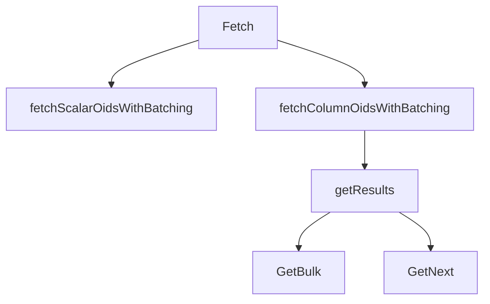

## Overview

SNMP Fetch refers to the process of retrieving data from SNMP-enabled devices. It involves fetching scalar and column values using different strategies.

## Fetch Function

The <SwmToken path="pkg/collector/corechecks/snmp/internal/fetch/fetch.go" pos="38:2:2" line-data="// Fetch oid values from device">`Fetch`</SwmToken> function is responsible for fetching OID values from a device. It first fetches scalar values using the <SwmToken path="pkg/collector/corechecks/snmp/internal/fetch/fetch.go" pos="42:8:8" line-data="	scalarResults, err := fetchScalarOidsWithBatching(sess, config.OidConfig.ScalarOids, config.OidBatchSize)">`fetchScalarOidsWithBatching`</SwmToken> function.

## Fetching Column Values

After fetching scalar values, the <SwmToken path="pkg/collector/corechecks/snmp/internal/fetch/fetch.go" pos="38:2:2" line-data="// Fetch oid values from device">`Fetch`</SwmToken> function proceeds to fetch column values. It uses the <SwmToken path="pkg/collector/corechecks/snmp/internal/fetch/fetch.go" pos="53:8:8" line-data="	columnResults, err := fetchColumnOidsWithBatching(sess, oids, config.OidBatchSize, config.BulkMaxRepetitions, useGetBulk)">`fetchColumnOidsWithBatching`</SwmToken> function, which attempts to fetch data using the <SwmToken path="pkg/collector/corechecks/snmp/internal/fetch/fetch.go" pos="55:16:16" line-data="		log.Debugf(&quot;failed to fetch oids with GetBulk batching: %v&quot;, err)">`GetBulk`</SwmToken> strategy first.

<SwmSnippet path="/pkg/collector/corechecks/snmp/internal/fetch/fetch.go" line="48">

---

The <SwmToken path="pkg/collector/corechecks/snmp/internal/fetch/fetch.go" pos="55:10:10" line-data="		log.Debugf(&quot;failed to fetch oids with GetBulk batching: %v&quot;, err)">`fetch`</SwmToken> function then fetches column values using the <SwmToken path="pkg/collector/corechecks/snmp/internal/fetch/fetch.go" pos="53:8:8" line-data="	columnResults, err := fetchColumnOidsWithBatching(sess, oids, config.OidBatchSize, config.BulkMaxRepetitions, useGetBulk)">`fetchColumnOidsWithBatching`</SwmToken> function, attempting the <SwmToken path="pkg/collector/corechecks/snmp/internal/fetch/fetch.go" pos="55:16:16" line-data="		log.Debugf(&quot;failed to fetch oids with GetBulk batching: %v&quot;, err)">`GetBulk`</SwmToken> strategy first.

```go
	oids := make(map[string]string, len(config.OidConfig.ColumnOids))
	for _, value := range config.OidConfig.ColumnOids {
		oids[value] = value
	}

	columnResults, err := fetchColumnOidsWithBatching(sess, oids, config.OidBatchSize, config.BulkMaxRepetitions, useGetBulk)
	if err != nil {
		log.Debugf("failed to fetch oids with GetBulk batching: %v", err)

		columnResults, err = fetchColumnOidsWithBatching(sess, oids, config.OidBatchSize, config.BulkMaxRepetitions, useGetNext)
		if err != nil {
			return nil, fmt.Errorf("failed to fetch oids with GetNext batching: %v", err)
		}
	}
```

---

</SwmSnippet>

<SwmSnippet path="/pkg/collector/corechecks/snmp/internal/fetch/fetch.go" line="53">

---

The <SwmToken path="pkg/collector/corechecks/snmp/internal/fetch/fetch.go" pos="53:8:8" line-data="	columnResults, err := fetchColumnOidsWithBatching(sess, oids, config.OidBatchSize, config.BulkMaxRepetitions, useGetBulk)">`fetchColumnOidsWithBatching`</SwmToken> function falls back to the <SwmToken path="pkg/collector/corechecks/snmp/internal/fetch/fetch.go" pos="59:21:21" line-data="			return nil, fmt.Errorf(&quot;failed to fetch oids with GetNext batching: %v&quot;, err)">`GetNext`</SwmToken> strategy if the <SwmToken path="pkg/collector/corechecks/snmp/internal/fetch/fetch.go" pos="55:16:16" line-data="		log.Debugf(&quot;failed to fetch oids with GetBulk batching: %v&quot;, err)">`GetBulk`</SwmToken> strategy fails.

```go
	columnResults, err := fetchColumnOidsWithBatching(sess, oids, config.OidBatchSize, config.BulkMaxRepetitions, useGetBulk)
	if err != nil {
		log.Debugf("failed to fetch oids with GetBulk batching: %v", err)

		columnResults, err = fetchColumnOidsWithBatching(sess, oids, config.OidBatchSize, config.BulkMaxRepetitions, useGetNext)
		if err != nil {
			return nil, fmt.Errorf("failed to fetch oids with GetNext batching: %v", err)
		}
```

---

</SwmSnippet>

## Helper Function

The <SwmToken path="pkg/collector/corechecks/snmp/internal/fetch/fetch_column.go" pos="87:8:8" line-data="		results, err := getResults(sess, requestOids, bulkMaxRepetitions, fetchStrategy)">`getResults`</SwmToken> function is a helper function used within <SwmToken path="pkg/collector/corechecks/snmp/internal/fetch/fetch.go" pos="53:8:8" line-data="	columnResults, err := fetchColumnOidsWithBatching(sess, oids, config.OidBatchSize, config.BulkMaxRepetitions, useGetBulk)">`fetchColumnOidsWithBatching`</SwmToken> to determine whether to use <SwmToken path="pkg/collector/corechecks/snmp/internal/fetch/fetch.go" pos="55:16:16" line-data="		log.Debugf(&quot;failed to fetch oids with GetBulk batching: %v&quot;, err)">`GetBulk`</SwmToken> or <SwmToken path="pkg/collector/corechecks/snmp/internal/fetch/fetch.go" pos="59:21:21" line-data="			return nil, fmt.Errorf(&quot;failed to fetch oids with GetNext batching: %v&quot;, err)">`GetNext`</SwmToken> based on the SNMP version and fetch strategy.

## Main Functions

There are several main functions in this folder. Some of them are <SwmToken path="pkg/collector/corechecks/snmp/internal/fetch/fetch.go" pos="38:2:2" line-data="// Fetch oid values from device">`Fetch`</SwmToken>, <SwmToken path="pkg/collector/corechecks/snmp/internal/fetch/fetch.go" pos="42:8:8" line-data="	scalarResults, err := fetchScalarOidsWithBatching(sess, config.OidConfig.ScalarOids, config.OidBatchSize)">`fetchScalarOidsWithBatching`</SwmToken>, and <SwmToken path="pkg/collector/corechecks/snmp/internal/fetch/fetch.go" pos="53:8:8" line-data="	columnResults, err := fetchColumnOidsWithBatching(sess, oids, config.OidBatchSize, config.BulkMaxRepetitions, useGetBulk)">`fetchColumnOidsWithBatching`</SwmToken>. We will dive a little into <SwmToken path="pkg/collector/corechecks/snmp/internal/fetch/fetch.go" pos="38:2:2" line-data="// Fetch oid values from device">`Fetch`</SwmToken> and <SwmToken path="pkg/collector/corechecks/snmp/internal/fetch/fetch.go" pos="53:8:8" line-data="	columnResults, err := fetchColumnOidsWithBatching(sess, oids, config.OidBatchSize, config.BulkMaxRepetitions, useGetBulk)">`fetchColumnOidsWithBatching`</SwmToken>.

<SwmSnippet path="/pkg/collector/corechecks/snmp/internal/fetch/fetch.go" line="38">

---

The <SwmToken path="pkg/collector/corechecks/snmp/internal/fetch/fetch.go" pos="38:2:2" line-data="// Fetch oid values from device">`Fetch`</SwmToken> function fetches scalar and column values using the <SwmToken path="pkg/collector/corechecks/snmp/internal/fetch/fetch.go" pos="42:8:8" line-data="	scalarResults, err := fetchScalarOidsWithBatching(sess, config.OidConfig.ScalarOids, config.OidBatchSize)">`fetchScalarOidsWithBatching`</SwmToken> and <SwmToken path="pkg/collector/corechecks/snmp/internal/fetch/fetch.go" pos="53:8:8" line-data="	columnResults, err := fetchColumnOidsWithBatching(sess, oids, config.OidBatchSize, config.BulkMaxRepetitions, useGetBulk)">`fetchColumnOidsWithBatching`</SwmToken> functions respectively.

```go
// Fetch oid values from device
// TODO: pass only specific configs instead of the whole CheckConfig
func Fetch(sess session.Session, config *checkconfig.CheckConfig) (*valuestore.ResultValueStore, error) {
	// fetch scalar values
	scalarResults, err := fetchScalarOidsWithBatching(sess, config.OidConfig.ScalarOids, config.OidBatchSize)
	if err != nil {
		return nil, fmt.Errorf("failed to fetch scalar oids with batching: %v", err)
	}

	// fetch column values
	oids := make(map[string]string, len(config.OidConfig.ColumnOids))
	for _, value := range config.OidConfig.ColumnOids {
		oids[value] = value
	}

	columnResults, err := fetchColumnOidsWithBatching(sess, oids, config.OidBatchSize, config.BulkMaxRepetitions, useGetBulk)
	if err != nil {
		log.Debugf("failed to fetch oids with GetBulk batching: %v", err)

		columnResults, err = fetchColumnOidsWithBatching(sess, oids, config.OidBatchSize, config.BulkMaxRepetitions, useGetNext)
		if err != nil {
```

---

</SwmSnippet>

<SwmSnippet path="/pkg/collector/corechecks/snmp/internal/fetch/fetch_scalar.go" line="25">

---

The <SwmToken path="pkg/collector/corechecks/snmp/internal/fetch/fetch_scalar.go" pos="25:2:2" line-data="func fetchScalarOidsWithBatching(sess session.Session, oids []string, oidBatchSize int) (valuestore.ScalarResultValuesType, error) {">`fetchScalarOidsWithBatching`</SwmToken> function fetches scalar <SwmToken path="pkg/collector/corechecks/snmp/internal/fetch/fetch_scalar.go" pos="25:11:11" line-data="func fetchScalarOidsWithBatching(sess session.Session, oids []string, oidBatchSize int) (valuestore.ScalarResultValuesType, error) {">`oids`</SwmToken> in batches and aggregates the results.

```go
func fetchScalarOidsWithBatching(sess session.Session, oids []string, oidBatchSize int) (valuestore.ScalarResultValuesType, error) {
	retValues := make(valuestore.ScalarResultValuesType, len(oids))

	batches, err := common.CreateStringBatches(oids, oidBatchSize)
	if err != nil {
		return nil, fmt.Errorf("failed to create oid batches: %s", err)
	}

	for _, batchOids := range batches {
		results, err := fetchScalarOids(sess, batchOids)
		if err != nil {
			return nil, fmt.Errorf("failed to fetch scalar oids: %s", err.Error())
		}
		for k, v := range results {
			retValues[k] = v
		}
	}
	return retValues, nil
}
```

---

</SwmSnippet>

<SwmSnippet path="/pkg/collector/corechecks/snmp/internal/fetch/fetch_column.go" line="24">

---

The <SwmToken path="pkg/collector/corechecks/snmp/internal/fetch/fetch_column.go" pos="24:2:2" line-data="func fetchColumnOidsWithBatching(sess session.Session, oids map[string]string, oidBatchSize int, bulkMaxRepetitions uint32, fetchStrategy columnFetchStrategy) (valuestore.ColumnResultValuesType, error) {">`fetchColumnOidsWithBatching`</SwmToken> function fetches column <SwmToken path="pkg/collector/corechecks/snmp/internal/fetch/fetch_column.go" pos="24:11:11" line-data="func fetchColumnOidsWithBatching(sess session.Session, oids map[string]string, oidBatchSize int, bulkMaxRepetitions uint32, fetchStrategy columnFetchStrategy) (valuestore.ColumnResultValuesType, error) {">`oids`</SwmToken> in batches and aggregates the results.

```go
func fetchColumnOidsWithBatching(sess session.Session, oids map[string]string, oidBatchSize int, bulkMaxRepetitions uint32, fetchStrategy columnFetchStrategy) (valuestore.ColumnResultValuesType, error) {
	retValues := make(valuestore.ColumnResultValuesType, len(oids))

	columnOids := getOidsMapKeys(oids)
	sort.Strings(columnOids) // sorting ColumnOids to make them deterministic for testing purpose
	batches, err := common.CreateStringBatches(columnOids, oidBatchSize)
	if err != nil {
		return nil, fmt.Errorf("failed to create column oid batches: %s", err)
	}

	for _, batchColumnOids := range batches {
		oidsToFetch := make(map[string]string, len(batchColumnOids))
		for _, oid := range batchColumnOids {
			oidsToFetch[oid] = oids[oid]
		}

		results, err := fetchColumnOids(sess, oidsToFetch, bulkMaxRepetitions, fetchStrategy)
		if err != nil {
			return nil, fmt.Errorf("failed to fetch column oids: %s", err)
		}
```

---

</SwmSnippet>

&nbsp;

*This is an auto-generated document by Swimm AI 🌊 and has not yet been verified by a human*

<SwmMeta version="3.0.0" repo-id="Z2l0aHViJTNBJTNBZGF0YWRvZy1hZ2VudCUzQSUzQVN3aW1tLURlbW8=" repo-name="datadog-agent"><sup>Powered by [Swimm](/)</sup></SwmMeta>
