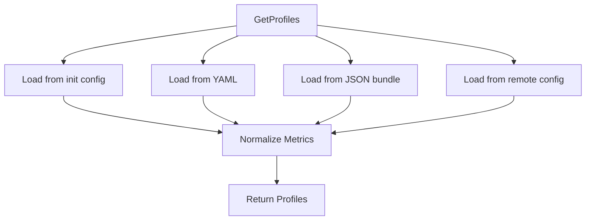

# Overview

SNMP Profile is a configuration entity used to define how to collect metrics from network devices using SNMP (Simple Network Management Protocol). It includes details such as the metrics to be collected, the OIDs (Object Identifiers) to query, and any specific configurations required for different types of network devices. The profiles can be sourced from various locations, including initialization configurations, YAML files, JSON bundles, and remote configurations.

<SwmSnippet path="/pkg/collector/corechecks/snmp/internal/profile/profile.go" line="18">

---

The function `GetProfiles` loads profiles from various sources and normalizes the metrics definitions.

```go
// GetProfiles returns profiles depending on various sources:
//   - init config profiles
//   - yaml profiles
//   - downloaded json gzip profiles
//   - remote config profiles
func GetProfiles(initConfigProfiles ProfileConfigMap) (ProfileConfigMap, error) {
	var profiles ProfileConfigMap
	if len(initConfigProfiles) > 0 {
		// TODO: [PERFORMANCE] Load init config custom profiles once for all integrations
		//   There are possibly multiple init configs
		customProfiles, err := loadInitConfigProfiles(initConfigProfiles)
		if err != nil {
			return nil, fmt.Errorf("failed to load profiles from initConfig: %w", err)
		}
		profiles = customProfiles
	} else if bundlePath := findProfileBundleFilePath(); bundlePath != "" {
		defaultProfiles, err := loadBundleJSONProfiles(bundlePath)
		if err != nil {
			return nil, fmt.Errorf("failed to load profiles from json bundle %q: %w", bundlePath, err)
		}
```

---

</SwmSnippet>

# Matching Profiles to Devices

Profiles are matched to devices using their sysObjectID. The function `GetProfileForSysObjectID` is responsible for this matching process. This function iterates through the profiles and checks if the sysObjectID matches any of the OID patterns defined in the profiles.

<SwmSnippet path="/pkg/collector/corechecks/snmp/internal/profile/profile.go" line="52">

---

The function `GetProfileForSysObjectID` matches profiles to devices using their sysObjectID.

```go
// GetProfileForSysObjectID return a profile for a sys object id
func GetProfileForSysObjectID(profiles ProfileConfigMap, sysObjectID string) (string, error) {
	tmpSysOidToProfile := map[string]string{}
	var matchedOids []string

	for profile, profConfig := range profiles {
		for _, oidPattern := range profConfig.Definition.SysObjectIds {
			found, err := filepath.Match(oidPattern, sysObjectID)
			if err != nil {
				log.Debugf("pattern error in profile %q: %v", profile, err)
				continue
			}
			if !found {
				continue
			}
			if prevMatchedProfile, ok := tmpSysOidToProfile[oidPattern]; ok {
				if profiles[prevMatchedProfile].IsUserProfile && !profConfig.IsUserProfile {
					continue
				}
				if profiles[prevMatchedProfile].IsUserProfile == profConfig.IsUserProfile {
					return "", fmt.Errorf("profile %q has the same sysObjectID (%s) as %q", profile, oidPattern, prevMatchedProfile)
```

---

</SwmSnippet>

# Loading Profiles from Initialization Configurations

The function `loadInitConfigProfiles` loads profiles from initialization configurations. It reads the profile definitions from the specified files and merges them with user profiles.

<SwmSnippet path="/pkg/collector/corechecks/snmp/internal/profile/profile_initconfig.go" line="10">

---

The function `loadInitConfigProfiles` loads profiles from initialization configurations.

```go
func loadInitConfigProfiles(rawInitConfigProfiles ProfileConfigMap) (ProfileConfigMap, error) {
	initConfigProfiles := make(ProfileConfigMap, len(rawInitConfigProfiles))

	for name, profConfig := range rawInitConfigProfiles {
		if profConfig.DefinitionFile != "" {
			profDefinition, err := readProfileDefinition(profConfig.DefinitionFile)
			if err != nil {
				log.Warnf("unable to load profile %q: %s", name, err)
				continue
			}
			profConfig.Definition = *profDefinition
		}
		initConfigProfiles[name] = profConfig
	}

	userProfiles := mergeProfiles(getYamlUserProfiles(), initConfigProfiles)
	resolvedProfiles, err := resolveProfiles(userProfiles, getYamlDefaultProfiles())
	if err != nil {
		return nil, err
	}
```

---

</SwmSnippet>

# Loading Profiles from YAML Files

The function `loadYamlProfiles` loads profiles from YAML files. It builds the profiles by resolving user profiles and default profiles.

<SwmSnippet path="/pkg/collector/corechecks/snmp/internal/profile/profile_yaml.go" line="34">

---

The function `loadYamlProfiles` loads profiles from YAML files.

```go
func loadYamlProfiles() (ProfileConfigMap, error) {
	defaultProfilesMu.Lock()
	defer defaultProfilesMu.Unlock()

	profileConfigMap := GetGlobalProfileConfigMap()
	if profileConfigMap != nil {
		log.Debugf("load yaml profiles from cache")
		return profileConfigMap, nil
	}
	log.Debugf("build yaml profiles")

	profiles, err := resolveProfiles(getYamlUserProfiles(), getYamlDefaultProfiles())
	if err != nil {
		return nil, err
	}

	SetGlobalProfileConfigMap(profiles)
	return profiles, nil
}
```

---

</SwmSnippet>

# Loading Profiles from JSON Bundles

The function `loadBundleJSONProfiles` loads profiles from JSON bundles. It reads the gzipped profile bundle and resolves the profiles by merging user profiles with default profiles.

<SwmSnippet path="/pkg/collector/corechecks/snmp/internal/profile/profile_json_bundle.go" line="20">

---

The function `loadBundleJSONProfiles` loads profiles from JSON bundles.

```go
// loadBundleJSONProfiles finds the gzipped profile bundle and loads profiles from it.
func loadBundleJSONProfiles(gzipFilePath string) (ProfileConfigMap, error) {
	jsonStr, err := loadGzipFile(gzipFilePath)
	if err != nil {
		return nil, err
	}

	userProfiles, err := unmarshallProfilesBundleJSON(jsonStr, gzipFilePath)
	if err != nil {
		return nil, err
	}
	// TODO (separate PR): Use default profiles from json Bundle in priority once it's implemented.
	//       We fallback on Yaml Default Profiles if default profiles are not present in json Bundle.
	defaultProfiles := getYamlDefaultProfiles()

	resolvedProfiles, err := resolveProfiles(userProfiles, defaultProfiles)
	if err != nil {
		return nil, err
	}

	return resolvedProfiles, nil
```

---

</SwmSnippet>

&nbsp;

*This is an auto-generated document by Swimm AI 🌊 and has not yet been verified by a human*

<SwmMeta version="3.0.0" repo-id="Z2l0aHViJTNBJTNBZGF0YWRvZy1hZ2VudCUzQSUzQVN3aW1tLURlbW8=" repo-name="datadog-agent"><sup>Powered by [Swimm](https://app.swimm.io/)</sup></SwmMeta>
