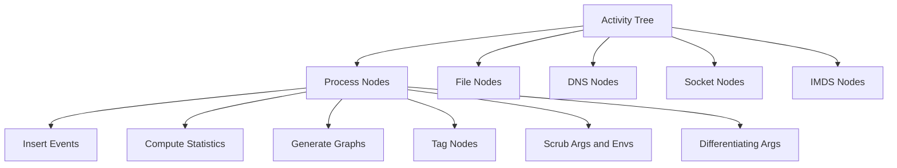

# Overview

The Activity Tree is a data structure that represents a process tree and its associated activities. It is used to monitor and analyze the behavior of processes within a system. The Activity Tree contains various nodes representing different types of activities, such as process nodes, file nodes, DNS nodes, socket nodes, and IMDS nodes. Each node type captures specific details about the activity it represents.

The Activity Tree is designed to be lock-free, meaning it does not use locks to manage concurrent access. This design choice helps to improve performance and reduce contention in multi-threaded environments.

The Activity Tree includes methods for inserting events, computing statistics, and generating graphical representations of the tree. These methods help to maintain and visualize the structure and content of the tree.

The Activity Tree also supports tagging nodes with image tags, scrubbing process arguments and environment variables, and differentiating arguments. These features enhance the tree's ability to provide detailed and accurate information about process activities.

<SwmSnippet path="/pkg/security/security_profile/activity_tree/activity_tree.go" line="201">

---

# Inserting Events

The <SwmToken path="pkg/security/security_profile/activity_tree/activity_tree.go" pos="201:2:2" line-data="// AppendChild appends a new root node in the ActivityTree">`AppendChild`</SwmToken> method is used to append a new root node in the Activity Tree. This method helps in adding new process nodes to the tree.

```go
// AppendChild appends a new root node in the ActivityTree
func (at *ActivityTree) AppendChild(node *ProcessNode) {
	at.ProcessNodes = append(at.ProcessNodes, node)
	node.Parent = at
}
```

---

</SwmSnippet>

<SwmSnippet path="/pkg/security/security_profile/activity_tree/activity_tree.go" line="228">

---

# Computing Statistics

The <SwmToken path="pkg/security/security_profile/activity_tree/activity_tree.go" pos="228:2:2" line-data="// ComputeActivityTreeStats computes the initial counts of the activity tree stats">`ComputeActivityTreeStats`</SwmToken> method computes the initial counts of the activity tree stats. This method is essential for analyzing the activities recorded in the tree.

```go
// ComputeActivityTreeStats computes the initial counts of the activity tree stats
func (at *ActivityTree) ComputeActivityTreeStats() {
	pnodes := at.ProcessNodes
	var fnodes []*FileNode

	for len(pnodes) > 0 {
		node := pnodes[0]

		at.Stats.ProcessNodes++
		pnodes = append(pnodes, node.Children...)

		at.Stats.DNSNodes += int64(len(node.DNSNames))
		at.Stats.SocketNodes += int64(len(node.Sockets))

		for _, f := range node.Files {
			fnodes = append(fnodes, f)
		}

		pnodes = pnodes[1:]
	}
```

---

</SwmSnippet>

<SwmSnippet path="/pkg/security/security_profile/activity_tree/activity_tree_graph.go" line="8">

---

# Generating Graphical Representations

The <SwmToken path="pkg/security/security_profile/activity_tree/activity_tree_graph.go" pos="8:4:4" line-data="// Package activitytree holds activitytree related files">`activitytree`</SwmToken> package holds files related to generating graphical representations of the Activity Tree. This helps in visualizing the structure and content of the tree.

```go
// Package activitytree holds activitytree related files
package activitytree

import (
```

---

</SwmSnippet>

<SwmSnippet path="/pkg/security/security_profile/activity_tree/activity_tree.go" line="289">

---

# Differentiating Arguments

The <SwmToken path="pkg/security/security_profile/activity_tree/activity_tree.go" pos="289:2:2" line-data="// DifferentiateArgs enables the args differentiation feature">`DifferentiateArgs`</SwmToken> method enables the args differentiation feature. This feature enhances the tree's ability to provide detailed and accurate information about process activities.

```go
// DifferentiateArgs enables the args differentiation feature
func (at *ActivityTree) DifferentiateArgs() {
	at.differentiateArgs = true
}
```

---

</SwmSnippet>

# Main Functions

There are several main functions in the Activity Tree. Some of them are <SwmToken path="pkg/security/security_profile/activity_tree/activity_tree.go" pos="176:2:2" line-data="// NewActivityTree returns a new ActivityTree instance">`NewActivityTree`</SwmToken>, <SwmToken path="pkg/security/security_profile/activity_tree/activity_tree.go" pos="201:2:2" line-data="// AppendChild appends a new root node in the ActivityTree">`AppendChild`</SwmToken>, <SwmToken path="pkg/security/security_profile/activity_tree/activity_tree.go" pos="228:2:2" line-data="// ComputeActivityTreeStats computes the initial counts of the activity tree stats">`ComputeActivityTreeStats`</SwmToken>, and <SwmToken path="pkg/security/security_profile/activity_tree/activity_tree.go" pos="154:4:4" line-data="// ActivityTree contains a process tree and its activities. This structure has no locks.">`contains`</SwmToken>. We will dive a little into these functions.

<SwmSnippet path="/pkg/security/security_profile/activity_tree/activity_tree.go" line="176">

---

## <SwmToken path="pkg/security/security_profile/activity_tree/activity_tree.go" pos="176:2:2" line-data="// NewActivityTree returns a new ActivityTree instance">`NewActivityTree`</SwmToken>

The <SwmToken path="pkg/security/security_profile/activity_tree/activity_tree.go" pos="176:2:2" line-data="// NewActivityTree returns a new ActivityTree instance">`NewActivityTree`</SwmToken> function initializes a new instance of the Activity Tree. It sets up various properties such as the tree type, validator, paths reducer, and stats. This function is crucial for creating a new Activity Tree with the necessary configurations.

```go
// NewActivityTree returns a new ActivityTree instance
func NewActivityTree(validator Owner, pathsReducer *PathsReducer, treeType string) *ActivityTree {
	cache, _ := simplelru.NewLRU[cookieSelector, *ProcessNode](CookieToProcessNodeCacheSize, nil)

	return &ActivityTree{
		treeType:            treeType,
		validator:           validator,
		pathsReducer:        pathsReducer,
		Stats:               NewActivityTreeNodeStats(),
		CookieToProcessNode: cache,
		SyscallsMask:        make(map[int]int),
		DNSNames:            utils.NewStringKeys(nil),
	}
}
```

---

</SwmSnippet>

<SwmSnippet path="/pkg/security/security_profile/activity_tree/activity_tree.go" line="228">

---

## <SwmToken path="pkg/security/security_profile/activity_tree/activity_tree.go" pos="228:2:2" line-data="// ComputeActivityTreeStats computes the initial counts of the activity tree stats">`ComputeActivityTreeStats`</SwmToken>

The <SwmToken path="pkg/security/security_profile/activity_tree/activity_tree.go" pos="228:2:2" line-data="// ComputeActivityTreeStats computes the initial counts of the activity tree stats">`ComputeActivityTreeStats`</SwmToken> method calculates the initial counts of various nodes in the Activity Tree, such as process nodes, file nodes, DNS nodes, and socket nodes. This function helps in generating statistics that provide insights into the activities represented by the tree.

```go
// ComputeActivityTreeStats computes the initial counts of the activity tree stats
func (at *ActivityTree) ComputeActivityTreeStats() {
	pnodes := at.ProcessNodes
	var fnodes []*FileNode

	for len(pnodes) > 0 {
		node := pnodes[0]

		at.Stats.ProcessNodes++
		pnodes = append(pnodes, node.Children...)

		at.Stats.DNSNodes += int64(len(node.DNSNames))
		at.Stats.SocketNodes += int64(len(node.Sockets))

		for _, f := range node.Files {
			fnodes = append(fnodes, f)
		}

		pnodes = pnodes[1:]
	}
```

---

</SwmSnippet>

&nbsp;

*This is an auto-generated document by Swimm AI 🌊 and has not yet been verified by a human*

<SwmMeta version="3.0.0" repo-id="Z2l0aHViJTNBJTNBZGF0YWRvZy1hZ2VudCUzQSUzQVN3aW1tLURlbW8=" repo-name="datadog-agent"><sup>Powered by [Swimm](/)</sup></SwmMeta>
