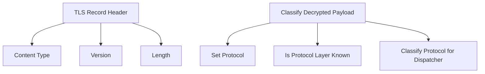

# Overview of TLS Protocols

Transport Layer Security (TLS) is a protocol that ensures secure communications over a computer network by encrypting the data transmitted between parties. This document explores the implementation and handling of TLS protocols within the codebase.

# TLS Versions

The file <SwmPath>[pkg/network/ebpf/c/protocols/tls/tls.h](pkg/network/ebpf/c/protocols/tls/tls.h)</SwmPath> defines various TLS versions such as <SwmToken path="pkg/network/ebpf/c/protocols/tls/tls.h" pos="9:3:3" line-data="#define TLS_VERSION10 0x0301">`TLS_VERSION10`</SwmToken>, <SwmToken path="pkg/network/ebpf/c/protocols/tls/tls.h" pos="10:3:3" line-data="#define TLS_VERSION11 0x0302">`TLS_VERSION11`</SwmToken>, <SwmToken path="pkg/network/ebpf/c/protocols/tls/tls.h" pos="11:3:3" line-data="#define TLS_VERSION12 0x0303">`TLS_VERSION12`</SwmToken>, and <SwmToken path="pkg/network/ebpf/c/protocols/tls/tls.h" pos="12:3:3" line-data="#define TLS_VERSION13 0x0304">`TLS_VERSION13`</SwmToken>, which correspond to different iterations of the TLS protocol.

<SwmSnippet path="/pkg/network/ebpf/c/protocols/tls/tls.h" line="9">

---

These definitions in <SwmPath>[pkg/network/ebpf/c/protocols/tls/tls.h](pkg/network/ebpf/c/protocols/tls/tls.h)</SwmPath> specify the hexadecimal values for different TLS versions.

```c
#define TLS_VERSION10 0x0301
#define TLS_VERSION11 0x0302
#define TLS_VERSION12 0x0303
#define TLS_VERSION13 0x0304
```

---

</SwmSnippet>

# TLS Record Header

The <SwmToken path="pkg/network/ebpf/c/protocols/tls/tls.h" pos="26:9:9" line-data="} __attribute__((packed)) tls_record_header_t;">`tls_record_header_t`</SwmToken> structure represents the header of a TLS record, containing fields like <SwmToken path="pkg/network/ebpf/c/protocols/tls/tls.h" pos="23:3:3" line-data="    __u8 content_type;">`content_type`</SwmToken>, <SwmToken path="pkg/network/ebpf/c/protocols/tls/tls.h" pos="24:3:3" line-data="    __u16 version;">`version`</SwmToken>, and <SwmToken path="pkg/network/ebpf/c/protocols/tls/tls.h" pos="25:3:3" line-data="    __u16 length;">`length`</SwmToken>.

<SwmSnippet path="/pkg/network/ebpf/c/protocols/tls/tls.h" line="22">

---

This structure in <SwmPath>[pkg/network/ebpf/c/protocols/tls/tls.h](pkg/network/ebpf/c/protocols/tls/tls.h)</SwmPath> defines the TLS record header.

```c
typedef struct {
    __u8 content_type;
    __u16 version;
    __u16 length;
} __attribute__((packed)) tls_record_header_t;
```

---

</SwmSnippet>

# Classifying Decrypted Payloads

The function <SwmToken path="pkg/network/ebpf/c/protocols/tls/https.h" pos="40:6:6" line-data="static __always_inline void classify_decrypted_payload(protocol_stack_t *stack, conn_tuple_t *t, void *buffer, size_t len) {">`classify_decrypted_payload`</SwmToken> is used to classify the decrypted payload of TLS traffic, determining the specific protocol being used within the TLS-encrypted data.

<SwmSnippet path="/pkg/network/ebpf/c/protocols/tls/https.h" line="38">

---

This function in <SwmPath>[pkg/network/ebpf/c/protocols/tls/https.h](pkg/network/ebpf/c/protocols/tls/https.h)</SwmPath> sets the protocol to TLS and determines the specific application protocol within the TLS-encrypted data.

```c
/* this function is called by all TLS hookpoints (OpenSSL, GnuTLS and GoTLS, JavaTLS) and */
/* it's used for classify the subset of protocols that is supported by `classify_protocol_for_dispatcher` */
static __always_inline void classify_decrypted_payload(protocol_stack_t *stack, conn_tuple_t *t, void *buffer, size_t len) {
    // we're in the context of TLS hookpoints, thus the protocol is TLS.
    set_protocol(stack, PROTOCOL_TLS);

    if (is_protocol_layer_known(stack, LAYER_APPLICATION)) {
        // No classification is needed.
        return;
    }

    protocol_t proto = PROTOCOL_UNKNOWN;
    classify_protocol_for_dispatcher(&proto, t, buffer, len);
    if (proto != PROTOCOL_UNKNOWN) {
        goto update_stack;
    }

    // Protocol is not HTTP/HTTP2/gRPC
    if (is_amqp(buffer, len)) {
        proto = PROTOCOL_AMQP;
    } else if (is_redis(buffer, len)) {
```

---

</SwmSnippet>

# Main Functions

There are several main functions related to TLS. Some of them are <SwmToken path="pkg/network/ebpf/c/protocols/tls/native-tls.h" pos="103:6:6" line-data="static __always_inline int SSL_read_ret(struct pt_regs *ctx, __u64 tags) {">`SSL_read_ret`</SwmToken>, <SwmToken path="pkg/network/ebpf/c/protocols/tls/native-tls.h" pos="166:6:6" line-data="static __always_inline int SSL_write_ret(struct pt_regs* ctx, __u64 flags) {">`SSL_write_ret`</SwmToken>, and <SwmToken path="pkg/network/ebpf/c/protocols/tls/https.h" pos="40:6:6" line-data="static __always_inline void classify_decrypted_payload(protocol_stack_t *stack, conn_tuple_t *t, void *buffer, size_t len) {">`classify_decrypted_payload`</SwmToken>. We will dive a little into <SwmToken path="pkg/network/ebpf/c/protocols/tls/native-tls.h" pos="103:6:6" line-data="static __always_inline int SSL_read_ret(struct pt_regs *ctx, __u64 tags) {">`SSL_read_ret`</SwmToken> and <SwmToken path="pkg/network/ebpf/c/protocols/tls/https.h" pos="40:6:6" line-data="static __always_inline void classify_decrypted_payload(protocol_stack_t *stack, conn_tuple_t *t, void *buffer, size_t len) {">`classify_decrypted_payload`</SwmToken>.

## <SwmToken path="pkg/network/ebpf/c/protocols/tls/native-tls.h" pos="103:6:6" line-data="static __always_inline int SSL_read_ret(struct pt_regs *ctx, __u64 tags) {">`SSL_read_ret`</SwmToken>

The <SwmToken path="pkg/network/ebpf/c/protocols/tls/native-tls.h" pos="103:6:6" line-data="static __always_inline int SSL_read_ret(struct pt_regs *ctx, __u64 tags) {">`SSL_read_ret`</SwmToken> function handles the return value of the <SwmToken path="pkg/network/ebpf/c/protocols/tls/native-tls.h" pos="107:6:6" line-data="        log_debug(&quot;uretprobe/SSL_read: pid_tgid=%llx ret=%d&quot;, pid_tgid, len);">`SSL_read`</SwmToken> function. It retrieves the connection tuple, normalizes it, and processes the TLS data.

<SwmSnippet path="/pkg/network/ebpf/c/protocols/tls/native-tls.h" line="103">

---

This function in <SwmPath>[pkg/network/ebpf/c/protocols/tls/native-tls.h](pkg/network/ebpf/c/protocols/tls/native-tls.h)</SwmPath> processes the return value of <SwmToken path="pkg/network/ebpf/c/protocols/tls/native-tls.h" pos="107:6:6" line-data="        log_debug(&quot;uretprobe/SSL_read: pid_tgid=%llx ret=%d&quot;, pid_tgid, len);">`SSL_read`</SwmToken> and handles the TLS data.

```c
static __always_inline int SSL_read_ret(struct pt_regs *ctx, __u64 tags) {
    u64 pid_tgid = bpf_get_current_pid_tgid();
    int len = (int)PT_REGS_RC(ctx);
    if (len <= 0) {
        log_debug("uretprobe/SSL_read: pid_tgid=%llx ret=%d", pid_tgid, len);
        goto cleanup;
    }

    log_debug("uretprobe/SSL_read: pid_tgid=%llx", pid_tgid);
    ssl_read_args_t *args = bpf_map_lookup_elem(&ssl_read_args, &pid_tgid);
    if (args == NULL) {
        return 0;
    }

    void *ssl_ctx = args->ctx;
    conn_tuple_t *t = tup_from_ssl_ctx(ssl_ctx, pid_tgid);
    if (t == NULL) {
        log_debug("uretprobe/SSL_read: pid_tgid=%llx ctx=%p: no conn tuple", pid_tgid, ssl_ctx);
        goto cleanup;
    }
```

---

</SwmSnippet>

## <SwmToken path="pkg/network/ebpf/c/protocols/tls/https.h" pos="40:6:6" line-data="static __always_inline void classify_decrypted_payload(protocol_stack_t *stack, conn_tuple_t *t, void *buffer, size_t len) {">`classify_decrypted_payload`</SwmToken>

The <SwmToken path="pkg/network/ebpf/c/protocols/tls/https.h" pos="40:6:6" line-data="static __always_inline void classify_decrypted_payload(protocol_stack_t *stack, conn_tuple_t *t, void *buffer, size_t len) {">`classify_decrypted_payload`</SwmToken> function is used to classify the decrypted payload of TLS traffic. It sets the protocol to TLS and determines the specific application protocol within the TLS-encrypted data.

&nbsp;

*This is an auto-generated document by Swimm AI 🌊 and has not yet been verified by a human*

<SwmMeta version="3.0.0" repo-id="Z2l0aHViJTNBJTNBZGF0YWRvZy1hZ2VudCUzQSUzQVN3aW1tLURlbW8=" repo-name="datadog-agent"><sup>Powered by [Swimm](/)</sup></SwmMeta>
