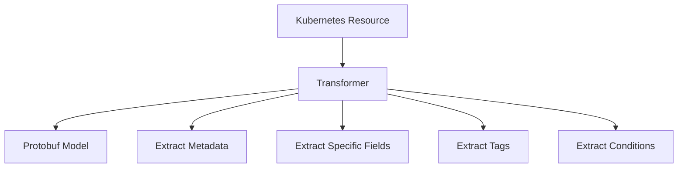

# Overview

Transformers are components responsible for converting Kubernetes resources into protobuf models. They extract metadata and specific fields from Kubernetes objects and transform them into a standardized format.

# Extracting Kubernetes Role

The `ExtractRole` function converts a Kubernetes Role resource into a protobuf model by extracting metadata and policy rules. It also appends tags using the <SwmToken path="pkg/collector/corechecks/cluster/orchestrator/transformers/ust.go" pos="32:2:2" line-data="// RetrieveUnifiedServiceTags for cluster level resources">`RetrieveUnifiedServiceTags`</SwmToken> function.

# Extracting Kubernetes Pod

The `ExtractPod` function transforms a Kubernetes Pod resource into a protobuf model by extracting details like node name, status, and resource requirements.

# Tag Keys

Constants like <SwmToken path="pkg/collector/corechecks/cluster/orchestrator/transformers/ust.go" pos="21:1:1" line-data="	tagKeyService = &quot;service&quot;">`tagKeyService`</SwmToken> are used within transformers to standardize the tagging of extracted data.

<SwmSnippet path="/pkg/collector/corechecks/cluster/orchestrator/transformers/ust.go" line="19">

---

Constants such as <SwmToken path="pkg/collector/corechecks/cluster/orchestrator/transformers/ust.go" pos="21:1:1" line-data="	tagKeyService = &quot;service&quot;">`tagKeyService`</SwmToken> are defined to standardize the tagging process within transformers.

```go
	tagKeyEnv     = "env"
	tagKeyVersion = "version"
	tagKeyService = "service"
)
```

---

</SwmSnippet>

&nbsp;

*This is an auto-generated document by Swimm AI 🌊 and has not yet been verified by a human*

<SwmMeta version="3.0.0" repo-id="Z2l0aHViJTNBJTNBZGF0YWRvZy1hZ2VudCUzQSUzQVN3aW1tLURlbW8=" repo-name="datadog-agent"><sup>Powered by [Swimm](/)</sup></SwmMeta>
