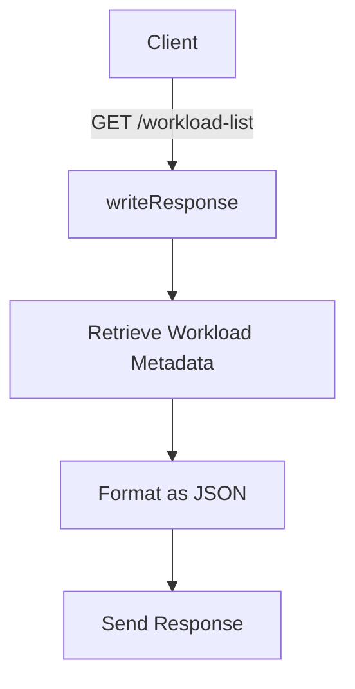

# Overview

Workloadmeta is responsible for gathering information about workloads and disseminating that information to other components. The Workloadmeta Store monitors information from various sources, such as container runtimes and orchestrators.

# Entities in Workloadmeta

An Entity in Workloadmeta represents a single unit of work being done by a piece of software, like a process, a container, a Kubernetes pod, or a task in any cloud provider. Each Entity has a unique EntityID, composed of a Kind and an ID. Examples of kinds include container, pod, and task. Multiple sources may generate events about the same entity, and when this occurs, information from those sources is merged into one entity.

# Workloadmeta Store

The Workloadmeta Store is responsible for gathering and disseminating information about workloads to other components. The <SwmToken path="comp/core/workloadmeta/impl/workloadmeta.go" pos="33:2:2" line-data="type workloadmeta struct {">`workloadmeta`</SwmToken> struct defines the central storage for metadata about workloads, including mechanisms for managing subscribers and collectors.

<SwmSnippet path="/comp/core/workloadmeta/impl/workloadmeta.go" line="30">

---

The <SwmToken path="comp/core/workloadmeta/impl/workloadmeta.go" pos="33:2:2" line-data="type workloadmeta struct {">`workloadmeta`</SwmToken> struct is the central storage of metadata about workloads. It includes fields for managing subscribers, collectors, and events.

```go
// store is a central storage of metadata about workloads. A workload is any
// unit of work being done by a piece of software, like a process, a container,
// a kubernetes pod, or a task in any cloud provider.
type workloadmeta struct {
	log    log.Component
	config config.Component

	// Store related
	storeMut sync.RWMutex
	store    map[wmdef.Kind]map[string]*cachedEntity // store[entity.Kind][entity.ID] = &cachedEntity{}

	subscribersMut sync.RWMutex
	subscribers    []subscriber

	collectorMut sync.RWMutex
	candidates   map[string]wmdef.Collector
	collectors   map[string]wmdef.Collector

	eventCh chan []wmdef.CollectorEvent

	ongoingPullsMut sync.Mutex
```

---

</SwmSnippet>

# Workloadmeta Endpoints

Workloadmeta provides endpoints to interact with the stored metadata. One such endpoint is <SwmToken path="comp/core/workloadmeta/impl/workloadmeta.go" pos="130:14:17" line-data="		Endpoint:      api.NewAgentEndpointProvider(wm.writeResponse, &quot;/workload-list&quot;, &quot;GET&quot;),">`/workload-list`</SwmToken>.

## <SwmToken path="comp/core/workloadmeta/impl/workloadmeta.go" pos="130:10:10" line-data="		Endpoint:      api.NewAgentEndpointProvider(wm.writeResponse, &quot;/workload-list&quot;, &quot;GET&quot;),">`writeResponse`</SwmToken> Function

The <SwmToken path="comp/core/workloadmeta/impl/workloadmeta.go" pos="130:10:10" line-data="		Endpoint:      api.NewAgentEndpointProvider(wm.writeResponse, &quot;/workload-list&quot;, &quot;GET&quot;),">`writeResponse`</SwmToken> function handles HTTP requests to the <SwmToken path="comp/core/workloadmeta/impl/workloadmeta.go" pos="130:14:17" line-data="		Endpoint:      api.NewAgentEndpointProvider(wm.writeResponse, &quot;/workload-list&quot;, &quot;GET&quot;),">`/workload-list`</SwmToken> endpoint. It retrieves the workload metadata, formats it as JSON, and sends it back to the client. This endpoint is used to get a list of workloads being tracked by Workloadmeta.

&nbsp;

*This is an auto-generated document by Swimm AI 🌊 and has not yet been verified by a human*

<SwmMeta version="3.0.0" repo-id="Z2l0aHViJTNBJTNBZGF0YWRvZy1hZ2VudCUzQSUzQVN3aW1tLURlbW8=" repo-name="datadog-agent"><sup>Powered by [Swimm](/)</sup></SwmMeta>
