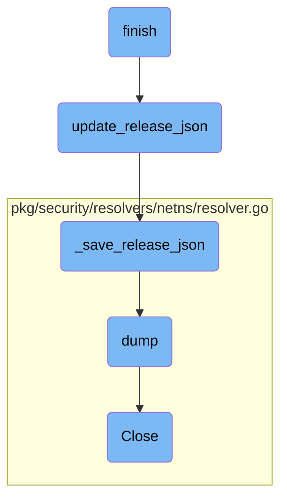

In this document, we will explain the process of finishing a release. The process involves several steps to ensure that the release is properly finalized and all necessary updates are made.

The flow starts with the <SwmToken path="tasks/release.py" pos="210:2:2" line-data="def finish(ctx, major_versions=&quot;6,7&quot;, upstream=&quot;origin&quot;):">`finish`</SwmToken> function, which orchestrates the final steps of the release process. It updates the release entry in <SwmPath>[release.json](release.json)</SwmPath>, updates internal module dependencies, branches out, commits changes, and pushes the branch to the upstream repository. The <SwmToken path="tasks/libs/releasing/json.py" pos="291:2:2" line-data="def update_release_json(new_version: Version, max_version: Version):">`update_release_json`</SwmToken> function then updates the release entries in <SwmPath>[release.json](release.json)</SwmPath> to prepare for the next RC or final build. This is followed by the <SwmToken path="tasks/libs/releasing/json.py" pos="51:2:2" line-data="def _save_release_json(release_json):">`_save_release_json`</SwmToken> function, which saves the updated <SwmPath>[release.json](release.json)</SwmPath> to disk. Finally, the <SwmToken path="tasks/libs/releasing/json.py" pos="54:3:3" line-data="        json.dump(release_json, release_json_stream, indent=4, sort_keys=False, separators=(&#39;,&#39;, &#39;: &#39;))">`dump`</SwmToken> method in the <SwmToken path="pkg/security/resolvers/netns/resolver.go" pos="554:8:8" line-data="// Close closes this resolver and frees all the resources">`resolver`</SwmToken> class collects information about network namespaces, and the <SwmToken path="pkg/security/resolvers/netns/resolver.go" pos="554:2:2" line-data="// Close closes this resolver and frees all the resources">`Close`</SwmToken> method in the <SwmToken path="pkg/security/resolvers/netns/resolver.go" pos="554:8:8" line-data="// Close closes this resolver and frees all the resources">`resolver`</SwmToken> class closes the resolver and frees all associated resources.

# Flow drill down



<SwmSnippet path="/tasks/release.py" line="210">

---

## Finishing the Release

The <SwmToken path="tasks/release.py" pos="210:2:2" line-data="def finish(ctx, major_versions=&quot;6,7&quot;, upstream=&quot;origin&quot;):">`finish`</SwmToken> function orchestrates the final steps of the release process. It updates the release entry in <SwmPath>[release.json](release.json)</SwmPath>, updates internal module dependencies, branches out, commits changes, and pushes the branch to the upstream repository. This function ensures that all necessary updates are made and prepares the repository for the new release.

```python
def finish(ctx, major_versions="6,7", upstream="origin"):
    """
    Updates the release entry in the release.json file for the new version.

    Updates internal module dependencies with the new version.
    """

    # Step 1: Preparation

    list_major_versions = parse_major_versions(major_versions)
    print(f"Finishing release for major version(s) {list_major_versions}")

    for major_version in list_major_versions:
        # NOTE: the release process assumes that at least one RC
        # was built before release.finish is used. It doesn't support
        # doing final version -> final version updates (eg. 7.32.0 -> 7.32.1
        # without doing at least 7.32.1-rc.1), as next_final_version won't
        # find the correct new version.
        # To support this, we'd have to support a --patch-version param in
        # release.finish
        new_version = next_final_version(ctx, major_version, False)
```

---

</SwmSnippet>

<SwmSnippet path="/tasks/libs/releasing/json.py" line="291">

---

### Updating <SwmPath>[release.json](release.json)</SwmPath>

The <SwmToken path="tasks/libs/releasing/json.py" pos="291:2:2" line-data="def update_release_json(new_version: Version, max_version: Version):">`update_release_json`</SwmToken> function updates the release entries in <SwmPath>[release.json](release.json)</SwmPath> to prepare for the next RC or final build. It loads the current <SwmPath>[release.json](release.json)</SwmPath>, updates it with the new version information, and then saves the updated file.

```python
def update_release_json(new_version: Version, max_version: Version):
    """
    Updates the release entries in release.json to prepare the next RC or final build.
    """
    release_json = _load_release_json()

    release_entry = release_entry_for(new_version.major)
    print(f"Updating {release_entry} for {new_version}")

    # Update release.json object with the entry for the new version
    release_json = _update_release_json(release_json, release_entry, new_version, max_version)

    _save_release_json(release_json)
```

---

</SwmSnippet>

<SwmSnippet path="/tasks/libs/releasing/json.py" line="51">

---

### Saving <SwmPath>[release.json](release.json)</SwmPath>

The <SwmToken path="tasks/libs/releasing/json.py" pos="51:2:2" line-data="def _save_release_json(release_json):">`_save_release_json`</SwmToken> function saves the updated <SwmPath>[release.json](release.json)</SwmPath> to disk. It writes the JSON data to the <SwmPath>[release.json](release.json)</SwmPath> file with proper formatting.

```python
def _save_release_json(release_json):
    with open("release.json", "w") as release_json_stream:
        # Note, no space after the comma
        json.dump(release_json, release_json_stream, indent=4, sort_keys=False, separators=(',', ': '))
        release_json_stream.write('\n')
```

---

</SwmSnippet>

<SwmSnippet path="/pkg/security/resolvers/netns/resolver.go" line="592">

---

## Dumping Network Namespaces

The <SwmToken path="pkg/security/resolvers/netns/resolver.go" pos="592:9:9" line-data="func (nr *Resolver) dump(params *api.DumpNetworkNamespaceParams) []NetworkNamespaceDump {">`dump`</SwmToken> method in the <SwmToken path="pkg/security/resolvers/netns/resolver.go" pos="592:6:6" line-data="func (nr *Resolver) dump(params *api.DumpNetworkNamespaceParams) []NetworkNamespaceDump {">`Resolver`</SwmToken> class iterates over the list of network namespaces and collects information about each namespace. It locks the namespace, gathers details such as namespace ID, handle, and network devices, and optionally takes a snapshot of the interfaces. This method is crucial for debugging and monitoring network namespaces.

```go
func (nr *Resolver) dump(params *api.DumpNetworkNamespaceParams) []NetworkNamespaceDump {
	nr.Lock()
	defer nr.Unlock()

	var handle *os.File
	var ntl *manager.NetlinkSocket
	var links []netlink.Link
	var dump []NetworkNamespaceDump
	var err error

	// iterate over the list of network namespaces
	for _, nsID := range nr.networkNamespaces.Keys() {
		netns, _ := nr.networkNamespaces.Peek(nsID)
		netns.Lock()

		netnsDump := NetworkNamespaceDump{
			NsID:          netns.nsID,
			HandleFD:      int(netns.handle.Fd()),
			HandlePath:    netns.handle.Name(),
			LonelyTimeout: netns.lonelyTimeout,
		}
```

---

</SwmSnippet>

<SwmSnippet path="/pkg/security/resolvers/netns/resolver.go" line="554">

---

### Closing the Resolver

The <SwmToken path="pkg/security/resolvers/netns/resolver.go" pos="554:2:2" line-data="// Close closes this resolver and frees all the resources">`Close`</SwmToken> method in the <SwmToken path="pkg/security/resolvers/netns/resolver.go" pos="554:8:8" line-data="// Close closes this resolver and frees all the resources">`resolver`</SwmToken> class closes the resolver and frees all associated resources. It purges the network namespaces and performs a manual flush of namespaces to ensure that no resources are left hanging.

```go
// Close closes this resolver and frees all the resources
func (nr *Resolver) Close() {
	if nr.networkNamespaces != nil {
		nr.Lock()
		nr.networkNamespaces.Purge()
		nr.Unlock()
	}
	nr.manualFlushNamespaces()
}
```

---

</SwmSnippet>

&nbsp;

*This is an auto-generated document by Swimm AI 🌊 and has not yet been verified by a human*

<SwmMeta version="3.0.0" repo-id="Z2l0aHViJTNBJTNBZGF0YWRvZy1hZ2VudCUzQSUzQVN3aW1tLURlbW8=" repo-name="datadog-agent"><sup>Powered by [Swimm](/)</sup></SwmMeta>
